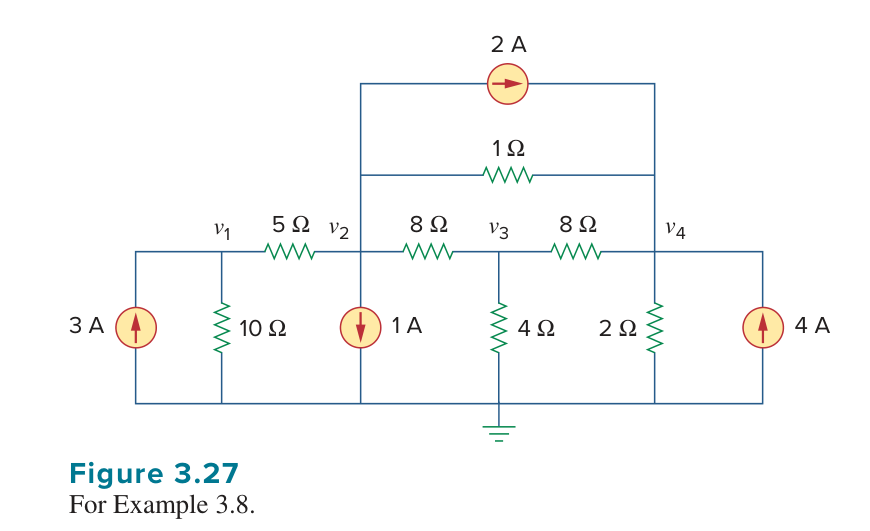
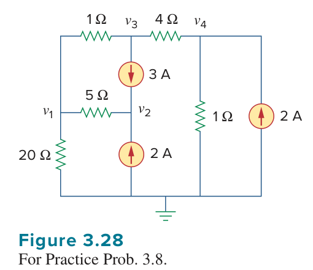
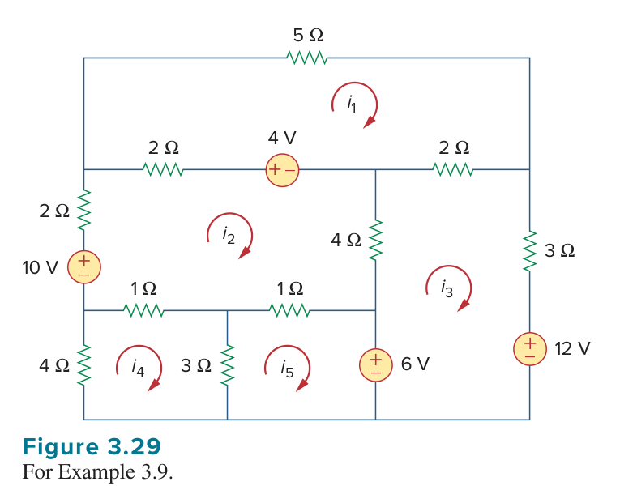
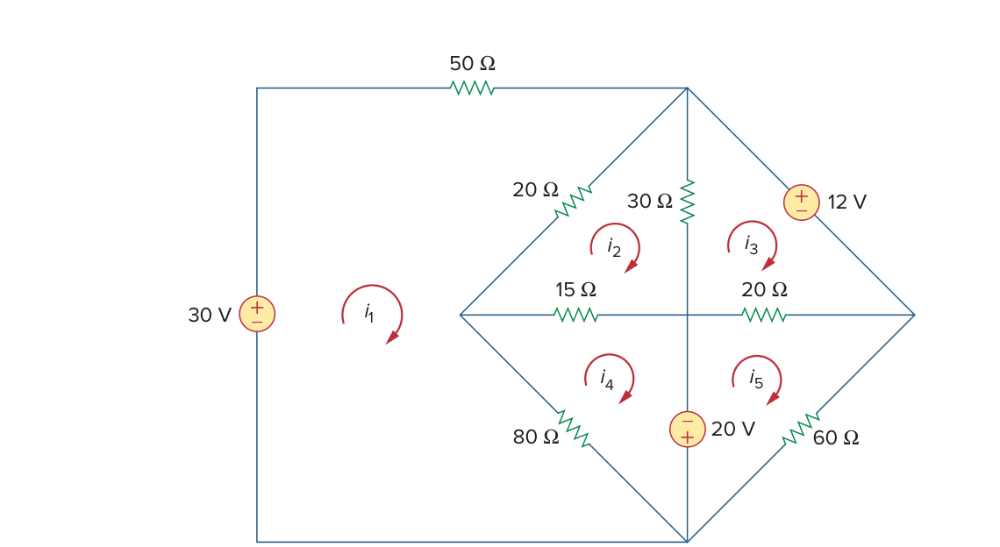

# Lesson 0004: 觀察法分析 (Nodal and Mesh Analysis by Inspection) 的原理與實戰破解

## 🎯 本單元目標

1. 理解如何跳過冗長的 KCL/KVL 方程式代數整理，**直接寫出**標準的矩陣方程式。
2. 掌握**節點觀察法**與**網孔觀察法**的主對角項（自我元素）、非對角項（互連元素）以及等號右側常數向量的符號慣例。
3. 認識觀察法的「先決條件」與「限制」（何時不能直接用？）。
4. 透過互動式模擬器建立起對矩陣元素組成的直覺空間對應。

---

## 一、 第一原理：為什麼需要「觀察法」？

在常規的節點分析法（Nodal Analysis）或網孔分析法（Mesh Analysis）中，我們通常要經過三個階段：
1. 針對每個節點列出 KCL 或對每個網孔列出 KVL。
2. 展開方程式並合併同類項。
3. 寫成矩陣形式 $\mathbf{A}\mathbf{x} = \mathbf{b}$ 以便求解。

對於複雜的電路，在步驟 1 與步驟 2 中，極易因為一個正負號的筆誤或漏掉一個電阻而導致全盤皆輸。**「觀察法」(By Inspection)** 則提供了一套嚴謹的視覺拓樸轉換法則，讓我們能夠直接從電路圖上的元件連接關係，填寫出最終的矩陣係數，完全省去代數展開的過程。

> ⚠️ **教材重要提醒 (Alexander & Sadiku)**  
> 雖然觀察法非常快速，但**僅適用於不含相依源且電源種類單純（純獨立電流源或純獨立電壓源）的電路**。實務上，不推薦死背，而應理解其背後的對稱性與物理意義，以作為檢查方程式是否寫對的「對帳工具」。

---

## 二、 節點觀察法 (Nodal Analysis by Inspection)

當一個線性電路**僅含有電阻（電導）與獨立電流源**時，我們可以直接寫出節點電壓矩陣方程式：

$$ \mathbf{G} \mathbf{v} = \mathbf{i} $$

::: tip 📌 矩陣 $\mathbf{G}$ 與向量 $\mathbf{i}$ 的建構法則
1. **對角項元素 ($G_{kk}$)**：**自我電導**。等於直接連接至節點 $k$ 的所有分支電導（$G = 1/R$）之總和。  
   *恆為正值。*
2. **非對角項元素 ($G_{kj}$)**：**互電導**。等於直接連接在節點 $k$ 與節點 $j$ 之間的電導總和的**負值**。  
   *恆為負值或零，且矩陣必定對稱 ($G_{kj} = G_{jk}$)。*
3. **電壓向量 ($v_k$)**：各非參考節點的未知節點電壓。
4. **常數電流向量 ($i_k$)**：直接連接至節點 $k$ 的所有獨立電流源的代數和。  
   *符號慣例：**流入節點為正 (+)，流出節點為負 (-)**。*
:::

---

## 三、 網孔觀察法 (Mesh Analysis by Inspection)

當一個**平面電路 (Planar Circuit)** **僅含有電阻與獨立電壓源**，且我們將所有網孔電流**皆規定為順時針方向 (Clockwise)** 時，可以直接寫出網孔電流矩陣方程式：

$$ \mathbf{R} \mathbf{i} = \mathbf{v} $$

::: tip 📌 矩陣 $\mathbf{R}$ 與向量 $\mathbf{v}$ 的建構法則
1. **對角項元素 ($R_{kk}$)**：**自我電阻**。等於環繞網孔 $k$ 一圈的所有電阻之總和。  
   *恆為正值。*
2. **非對角項元素 ($R_{kj}$)**：**互電阻**。等於網孔 $k$ 與網孔 $j$ 所**共用**的電阻總和的**負值**。  
   *恆為負值或零，且矩陣必定對稱 ($R_{kj} = R_{jk}$)。*
3. **電流向量 ($i_k$)**：各網孔的未知順時針網孔電流。
4. **常數電壓向量 ($v_k$)**：網孔 $k$ 內順時針繞行時，所遭遇的所有獨立電壓源之「電壓升」代數和。  
   *符號慣例：**順時針方向由 $-$ 端進 $+$ 端出（電壓升）為正 (+)，由 $+$ 端進 $-$ 端出（電壓降）為負 (-)**。這相當於把 KVL 迴路等式右側的常數項寫下來。*
:::

---

## 四、 互動體驗：觀察法矩陣生成器

請操作下方的互動模擬器，試著調整電阻（電導）與電源數值，並**將滑鼠游標懸停在矩陣內部的各個數值上**。你可以直觀地看到該數值是由電路圖上的哪些元件「組裝」而成的，以及正負號的來源。

<ClientOnly>
  <InspectionMatrixSimulator />
</ClientOnly>

---

## 五、 實戰拆解：經典課本例題對帳

以下透過 Alexander & Sadiku 的經典教材例題，執行嚴謹的數值對帳，確保建構矩陣的過程 100% 正確。

### 1. 節點觀察法實戰 (Example 3.8 & Practice 3.8)

#### 📝 Example 3.8 
> Write the node-voltage matrix equations for the circuit in Fig. 3.27 by inspection.

**【對帳解析】**：
- **$G_{11}$ (節點 1 對角項)**：連接 $5\ \Omega$ 與 $10\ \Omega$，總電導為 $\frac{1}{5} + \frac{1}{10} = 0.2 + 0.1 = 0.3\text{ S}$。
- **$G_{24}$ (節點 2, 4 互電導)**：節點 2 與 4 之間有 $1\ \Omega$ 電阻，故填入 $-\frac{1}{1} = -1.0\text{ S}$。
- **$i_2$ (節點 2 電流項)**：有 1 A 流出（向下），且有 2 A 流出（向右），故代數和為 $-1 - 2 = -3\text{ A}$。

**最終矩陣方程式**：
$$
\begin{bmatrix} 
0.3 & -0.2 & 0 & 0 \\ 
-0.2 & 1.325 & -0.125 & -1 \\ 
0 & -0.125 & 0.5 & -0.125 \\ 
0 & -1 & -0.125 & 1.625 
\end{bmatrix} \begin{bmatrix} v_1 \\ v_2 \\ v_3 \\ v_4 \end{bmatrix} = \begin{bmatrix} 3 \\ -3 \\ 0 \\ 6 \end{bmatrix}
$$

#### 📝 Practice Problem 3.8
> By inspection, obtain the node-voltage equations for the circuit in Fig. 3.28.

**【對帳解析】**：
- 檢查 $v_2$ 節點：只有一個 $5\ \Omega$ 電阻與它相連（注意與 $3\text{A}$、$\text{2A}$ 源相連的不是電阻，不計入導納）。故 $G_{22} = \frac{1}{5} = 0.2\text{ S}$。
- 節點 2 電流源：$3\text{A}$ 源流入，$2\text{A}$ 源流入，總流入 $= 3 + 2 = 5\text{A}$。

**最終矩陣方程式**：
$$
\begin{bmatrix} 
1.25 & -0.2 & -1 & 0 \\ 
-0.2 & 0.2 & 0 & 0 \\ 
-1 & 0 & 1.25 & -0.25 \\ 
0 & 0 & -0.25 & 1.25 
\end{bmatrix} \begin{bmatrix} v_1 \\ v_2 \\ v_3 \\ v_4 \end{bmatrix} = \begin{bmatrix} 0 \\ 5 \\ -3 \\ 2 \end{bmatrix}
$$

---

### 2. 網孔觀察法實戰 (Example 3.9 & Practice 3.9)

#### 📝 Example 3.9
> By inspection, write the mesh-current equations for the circuit in Fig. 3.29.

**【對帳解析】**：
- **$R_{22}$ (網孔 2 對角項)**：$2 + 4 + 1 + 1 + 2 = 10\ \Omega$。
- **$v_2$ (網孔 2 電壓項)**：順時針繞行。遇到左側 $10\text{V}$ 是從 $-$ 到 $+$（電壓升，$+10$）；遇到上方 $4\text{V}$ 是從 $+$ 到 $-$（電壓降，$-4$）。總電壓升 $v_2 = +10 - 4 = +6\text{V}$。
- **$v_3$ (網孔 3 電壓項)**：右側 $12\text{V}$ 從 $+$ 到 $-$（降，$-12$），下方 $6\text{V}$ 從 $-$ 到 $+$（升，$+6$）。總電壓升 $v_3 = -12 + 6 = -6\text{V}$。

**最終矩陣方程式**：
$$
\begin{bmatrix} 
9 & -2 & -2 & 0 & 0 \\ 
-2 & 10 & -4 & -1 & -1 \\ 
-2 & -4 & 9 & 0 & 0 \\ 
0 & -1 & 0 & 8 & -3 \\ 
0 & -1 & 0 & -3 & 4 
\end{bmatrix} \begin{bmatrix} i_1 \\ i_2 \\ i_3 \\ i_4 \\ i_5 \end{bmatrix} = \begin{bmatrix} 4 \\ 6 \\ -6 \\ 0 \\ -6 \end{bmatrix}
$$

#### 📝 Practice Problem 3.9

**最終矩陣方程式**：
$$
\begin{bmatrix} 
150 & -20 & 0 & -80 & 0 \\ 
-20 & 65 & -30 & -15 & 0 \\ 
0 & -30 & 50 & 0 & -20 \\ 
-80 & -15 & 0 & 95 & 0 \\ 
0 & 0 & -20 & 0 & 80 
\end{bmatrix} \begin{bmatrix} i_1 \\ i_2 \\ i_3 \\ i_4 \\ i_5 \end{bmatrix} = \begin{bmatrix} 30 \\ 0 \\ -12 \\ 20 \\ -20 \end{bmatrix}
$$

*(註：本站所有矩陣方程式均已透過 Python `numpy.linalg.solve` 進行回代驗算，殘差 $\approx 0$，與課本數值 100% 吻合)*

---

## 六、 相依源與非理想電源的處理限制 (Limitations & Safeguards)

::: warning ⚠️ 觀察法不是萬靈丹！何時會失效？
觀察法之所以能直接寫出漂亮的**對稱矩陣**，是因為電阻是雙向線性被動元件，而獨立源不依賴電路狀態。若遇到以下情況，請小心處理：

1. **含有相依源 (Dependent Sources)**：
   相依源的控制變數會引入額外的電壓或電流項，這些項在移項整理後，會改變矩陣的對角或非對角元素，**破壞原有的矩陣對稱性**。這時「無法直接用觀察法」，必須先老實地列出控制變量方程式再代入整理。
   
2. **節點法中遇到獨立電壓源 (或網孔法中遇到電流源)**：
   - 無法直接寫成 $\mathbf{G}\mathbf{v}=\mathbf{i}$ 或 $\mathbf{R}\mathbf{i}=\mathbf{v}$。
   - **解法 1**：如果有串/並聯電阻，可先使用**電源轉換 (Source Transformation)**，將其轉換為標準的電流源或電壓源。
   - **解法 2**：若無內阻，則必須動用**超節點 (Supernode)**或**超網孔 (Supermesh)**技巧，但這時觀察法公式亦不再適用，需老實寫出拘束方程式。
:::

---

## 七、 學習總結 (Summary)

- **對角恆正，非對角恆負**：無論是 $\mathbf{G}$ 還是 $\mathbf{R}$，只要方向一致（如網孔全順時針），主對角線必然是加總（正數），非對角線必然是共用負值。這保證了矩陣的對稱正定性。
- **輸入向量看「幫助力量」**：節點的 $i_k$ 算的是「打進去」的電流（流入）；網孔的 $v_k$ 算的是「推著順時針走」的電壓（電壓升）。
- **戰術選擇 (Section 3.7 Nodal vs Mesh)**：
  - 電路節點數少 $\rightarrow$ 節點法。
  - 平面電路且網孔數少 $\rightarrow$ 網孔法。
  - 遇到非平面電路 (Nonplanar) $\rightarrow$ 只能用節點法。
  - OP Amp 電路 $\rightarrow$ 節點法。
  - 電晶體電路 $\rightarrow$ 網孔法通常較為方便。
