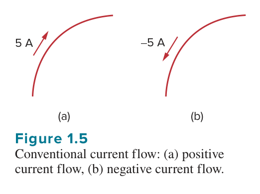
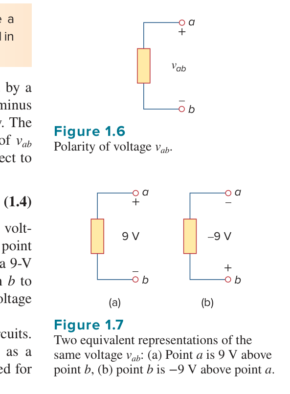
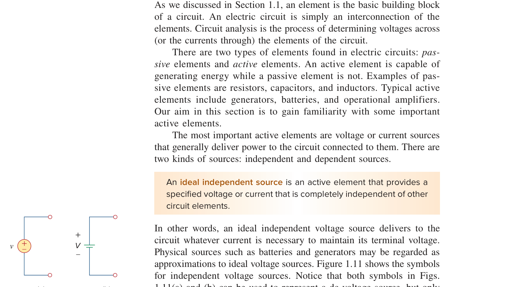
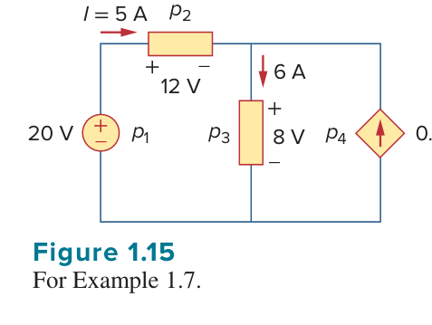
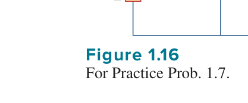
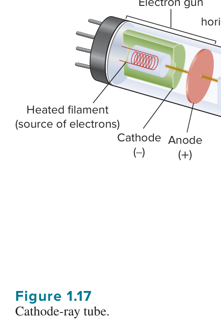
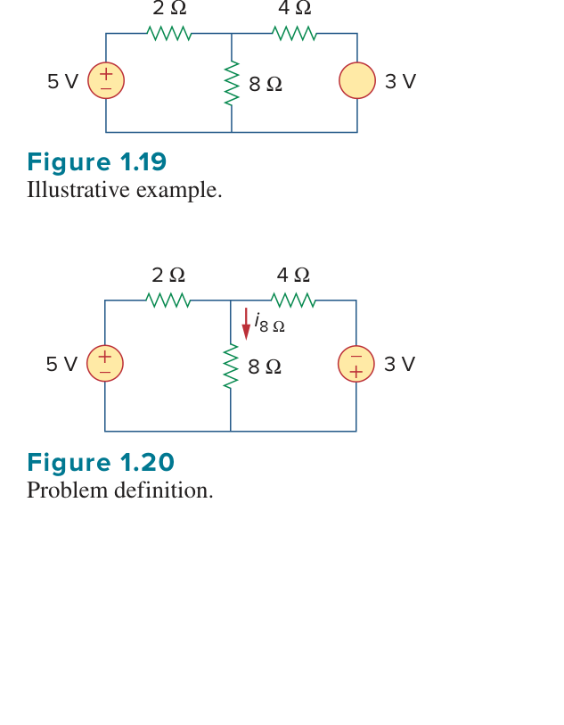
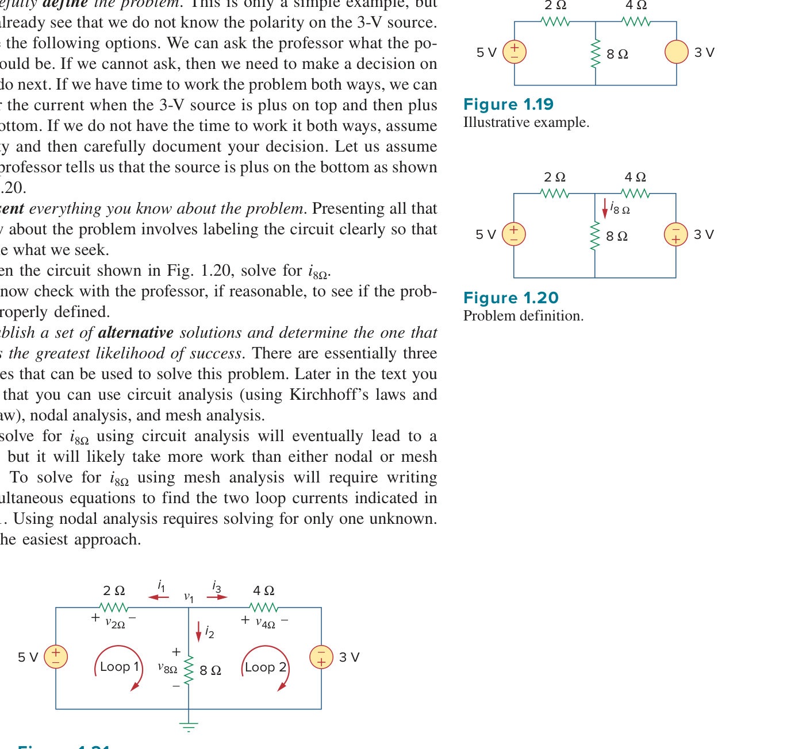

# Chapter 1 基本概念：例題與練習題

本頁面彙整 Alexander & Sadiku《Fundamentals of Electric Circuits》第 1 章之核心 Example 與 Practice Problem。點擊「查看詳解」可展開分步推導與計算結果；完成題目後可勾選標記學習進度。

<PracticeProgress :total="19" prefix="ch1-" />

<PracticeCard id="ch1-ex1" title="Example 1.1：電子所代表的電荷" source="課本 p.14" topic="電荷">

一個電子的電荷為 $-1.602\times10^{-19}\,\mathrm{C}$。求 $4{,}600$ 個電子所代表的總電荷。

<template #solution>

電子數與每個電子的電荷相乘：

$$
q=(-1.602\times10^{-19}\,\mathrm{C/electron})(4{,}600\,\mathrm{electrons})
=-7.369\times10^{-16}\,\mathrm{C}.
$$

因此，總電荷為 $-7.369\times10^{-16}\,\mathrm{C}$。

</template>

</PracticeCard>

<PracticeCard id="ch1-pr1" title="Practice Problem 1.1：由電荷求電流" source="課本 p.14" topic="電流與電荷">

在 Example 1.2 的情境中，若進入端點的總電荷為

$$
q=(20-15t-10e^{-3t})\,\mathrm{mC},
$$

求 $t=1.0\,\mathrm{s}$ 時的電流。

<template #solution>

由 $i=dq/dt$：

$$
i(t)=\left(-15+30e^{-3t}\right)\,\mathrm{mA}.
$$

代入 $t=1.0\,\mathrm{s}$：

$$
i(1)=-15+30e^{-3}=-13.506\,\mathrm{mA}.
$$

負號表示實際電流方向與「進入端點」的參考方向相反。課本答案：$-13.506\,\mathrm{mA}$。

</template>

</PracticeCard>

<PracticeCard id="ch1-ex2" title="Example 1.2：由電荷函數求瞬時電流" source="課本 p.14" topic="電流與電荷">

進入一端點的總電荷為

$$
q=5t\sin(4\pi t)\,\mathrm{mC}.
$$

求 $t=0.5\,\mathrm{s}$ 時的電流。

<template #solution>

以 $i=dq/dt$ 微分：

$$
i(t)=\frac{d}{dt}\left[5t\sin(4\pi t)\right]
=5\sin(4\pi t)+20\pi t\cos(4\pi t)\quad\mathrm{mA}.
$$

在 $t=0.5\,\mathrm{s}$，$4\pi t=2\pi$，所以

$$
i(0.5)=5\sin(2\pi)+10\pi\cos(2\pi)=31.42\,\mathrm{mA}.
$$

因此電流為 $31.42\,\mathrm{mA}$。

</template>

</PracticeCard>

<PracticeCard id="ch1-pr2" title="Practice Problem 1.2：質子所代表的電荷" source="課本 p.14" topic="電荷">

求 $100$ 億個質子所代表的電荷量。

<template #solution>

每個質子的電荷為 $+1.6021\times10^{-19}\,\mathrm{C}$，而 $100$ 億為 $10^{10}$；因此

$$
q=(10^{10})(1.6021\times10^{-19})
=1.6021\times10^{-9}\,\mathrm{C}.
$$

課本答案：$1.6021\times10^{-9}\,\mathrm{C}$。

</template>

</PracticeCard>

<PracticeCard id="ch1-ex3" title="Example 1.3：由電流求區間電荷" source="課本 p.14" topic="電流與電荷">

若通過端點的電流為 $i=(3t^2-t)\,\mathrm{A}$，求從 $t=1\,\mathrm{s}$ 至 $t=2\,\mathrm{s}$ 進入端點的總電荷。

<template #solution>

總電荷為電流在指定時間區間的積分：

$$
Q=\int_1^2(3t^2-t)\,dt
=\left(t^3-\frac{t^2}{2}\right)\bigg|_1^2.
$$

$$
Q=(8-2)-\left(1-\frac12\right)=5.5\,\mathrm{C}.
$$

因此進入端點的總電荷為 $5.5\,\mathrm{C}$。

</template>

</PracticeCard>

<PracticeCard id="ch1-pr3" title="Practice Problem 1.3：分段電流的電荷" source="課本 p.15" topic="電流與電荷">

流入元件的電流為

$$
i(t)=
\begin{cases}
8\,\mathrm{A}, & 0<t<1,\\
8t^2\,\mathrm{A}, & t>1.
\end{cases}
$$

求從 $t=0$ 至 $t=2\,\mathrm{s}$ 進入元件的電荷。

<template #solution>

依分段定義積分：

$$
Q=\int_0^1 8\,dt+\int_1^2 8t^2\,dt
=8+\frac{8}{3}\left(2^3-1^3\right).
$$

$$
Q=8+\frac{56}{3}=\frac{80}{3}\,\mathrm{C}=26.67\,\mathrm{C}.
$$

課本答案：$26.67\,\mathrm{C}$。

</template>

</PracticeCard>

<PracticeCard id="ch1-ex4" title="Example 1.4：燈泡兩端的電壓降" source="課本 p.18" topic="電壓與能量">

一能量源使 $2\,\mathrm{A}$ 的定電流流過燈泡 $10\,\mathrm{s}$。若以光與熱形式釋放 $2.4\,\mathrm{kJ}$ 能量，求燈泡兩端的電壓降。

<template #solution>

先求通過的電荷：

$$
\Delta q=i\Delta t=(2\,\mathrm{A})(10\,\mathrm{s})=20\,\mathrm{C}.
$$

電壓降為每單位電荷的能量：

$$
v=\frac{\Delta w}{\Delta q}
=\frac{2.4\times10^3\,\mathrm{J}}{20\,\mathrm{C}}
=120\,\mathrm{V}.
$$

因此燈泡的電壓降為 $120\,\mathrm{V}$。

</template>

</PracticeCard>

<PracticeCard id="ch1-pr4" title="Practice Problem 1.4：電荷符號與電壓" source="課本 p.18" topic="電壓與能量">

將電荷 $q$ 由點 $b$ 移至點 $a$ 需 $100\,\mathrm{J}$。求電壓降 $v_{ab}$（$a$ 點相對於 $b$ 點為正），其中：(a) $q=5\,\mathrm{C}$；(b) $q=-10\,\mathrm{C}$。

<template #solution>

由電壓定義 $v_{ab}=\Delta w/\Delta q$。

對 (a)：

$$
v_{ab}=\frac{100\,\mathrm{J}}{5\,\mathrm{C}}=20\,\mathrm{V}.
$$

對 (b)：

$$
v_{ab}=\frac{100\,\mathrm{J}}{-10\,\mathrm{C}}=-10\,\mathrm{V}.
$$

課本答案：(a) $20\,\mathrm{V}$；(b) $-10\,\mathrm{V}$。

</template>

</PracticeCard>

<PracticeCard id="ch1-ex5" title="Example 1.5：元件吸收的功率" source="課本 p.18" topic="功率">

在 $t=3\,\mathrm{ms}$，電流進入元件的正端，且

$$
i=5\cos(60\pi t)\,\mathrm{A}.
$$

求元件所吸收的功率：(a) $v=3i$；(b) $v=3\,di/dt$。

<template #solution>

因電流進入正端，依被動符號約定 $p=vi$。

對 (a)，

$$
p=3i^2=75\cos^2(60\pi t)\,\mathrm{W},
$$

$$
p(3\,\mathrm{ms})=75\cos^2(0.18\pi)=53.47\,\mathrm{W}.
$$

對 (b)，

$$
v=3\frac{di}{dt}=-900\pi\sin(60\pi t)\,\mathrm{V},
$$

$$
p=vi=-4500\pi\sin(60\pi t)\cos(60\pi t)\,\mathrm{W},
$$

$$
p(3\,\mathrm{ms})=-6.396\,\mathrm{kW}.
$$

因此答案為：(a) $53.47\,\mathrm{W}$；(b) $-6.396\,\mathrm{kW}$。負號表示元件在此時刻供應功率。

</template>

</PracticeCard>

<PracticeCard id="ch1-pr5" title="Practice Problem 1.5：含積分項的瞬時功率" source="課本 p.19" topic="功率">

沿用 Example 1.5 的電流

$$
i=5\cos(60\pi t)\,\mathrm{A}.
$$

在 $t=5\,\mathrm{ms}$ 求元件吸收的功率；電壓分別為：(a) $v=6i\,\mathrm{V}$；(b) $v=\left(6+10\int_0^t i\,dt\right)\,\mathrm{V}$。

<template #solution>

先在 $t=5\,\mathrm{ms}$ 求電流：

$$
i=5\cos(60\pi\times0.005)=5\cos(0.3\pi)\,\mathrm{A}.
$$

對 (a)，以 $p=vi=6i^2$ 得課本答案：$51.82\,\mathrm{W}$。

對 (b)，積分項為

$$
\int_0^t i\,dt=\frac{5}{60\pi}\sin(60\pi t),
$$

代入 $t=5\,\mathrm{ms}$ 後再以 $p=vi$ 計算。課本答案：$18.264\,\mathrm{W}$。

</template>

</PracticeCard>

<PracticeCard id="ch1-ex6" title="Example 1.6：電燈的能量消耗" source="課本 p.20" topic="功率與能量">

一個 $100\ \mathrm{W}$ 電燈泡連續使用 $2\ \mathrm{h}$，求它消耗的能量。

<template #solution>

由能量與功率的關係 $w=pt$：

$$
w=(100\ \mathrm{W})(2\ \mathrm{h})(60\ \mathrm{min/h})(60\ \mathrm{s/min})
=720{,}000\ \mathrm{J}=720\ \mathrm{kJ}.
$$

以瓦時表示時，$w=(100\ \mathrm{W})(2\ \mathrm{h})=200\ \mathrm{Wh}$。兩種結果一致，因為 $200\ \mathrm{Wh}=720\ \mathrm{kJ}$。

</template>

</PracticeCard>

<PracticeCard id="ch1-pr6" title="Practice Problem 1.6：電暖器的能量消耗" source="課本 p.20" topic="功率與能量">

家用電暖器接在 $120\ \mathrm{V}$ 插座時汲取 $12\ \mathrm{A}$。若持續使用 $24\ \mathrm{h}$，求消耗的能量。

<template #solution>

先求輸入功率：

$$
p=vi=(120\ \mathrm{V})(12\ \mathrm{A})=1440\ \mathrm{W}=1.44\ \mathrm{kW}.
$$

因此

$$
w=pt=(1.44\ \mathrm{kW})(24\ \mathrm{h})=34.56\ \mathrm{kWh}.
$$

課本答案：$34.56\ \mathrm{kWh}$。

</template>

</PracticeCard>

<PracticeCard id="ch1-ex7" title="Example 1.7：元件供給或吸收的功率" source="課本 p.21" topic="被動符號約定">

求圖中每一元件 $p_1$、$p_2$、$p_3$、$p_4$ 所供給或吸收的功率。

<template #solution>

依被動符號約定，電流流入正端時 $p=vi$ 為正（吸收）；流出正端時電流取負。

$$
p_1=20(-5)=-100\ \mathrm{W},\qquad
p_2=12(5)=60\ \mathrm{W},\qquad
p_3=8(6)=48\ \mathrm{W}.
$$

對受控電流源，兩端電壓與 $p_3$ 相同，皆為 $8\ \mathrm{V}$；且 $I=5\ \mathrm{A}$，其電流由正端流出：

$$
p_4=8(-0.2I)=8[-0.2(5)]=-8\ \mathrm{W}.
$$

檢查：$-100+60+48-8=0$。因此 $p_1$ 與 $p_4$ 分別供給 $100\ \mathrm{W}$、$8\ \mathrm{W}$；$p_2$、$p_3$ 分別吸收 $60\ \mathrm{W}$、$48\ \mathrm{W}$。

</template>

</PracticeCard>

<PracticeCard id="ch1-pr7" title="Practice Problem 1.7：各元件的功率" source="課本 p.22" topic="被動符號約定">

計算圖中電路各元件 $p_1$、$p_2$、$p_3$、$p_4$ 所吸收或供給的功率。

<template #solution>

對每個元件依圖示極性與電流方向套用被動符號約定 $p=vi$；電流流入正端取正，流出正端取負。圖示給定 $I=25\ \mathrm{A}$，故受控源電流為

$$
0.12I=0.12(25)=3\ \mathrm{A}.
$$

逐一代入各元件的標示電壓與對應帶符號電流，可得課本答案：

$$
p_1=-225\ \mathrm{W},\qquad p_2=90\ \mathrm{W},\qquad
p_3=60\ \mathrm{W},\qquad p_4=75\ \mathrm{W}.
$$

負號表示 $p_1$ 供給 $225\ \mathrm{W}$；其餘三個元件吸收功率。驗算為 $-225+90+60+75=0$。

</template>

</PracticeCard>

<PracticeCard id="ch1-ex8" title="Example 1.8：映像管電子束的加速電壓" source="課本 p.23" topic="電流與功率">

電視映像管的電子束每秒含有 $10^{15}$ 個電子。若要使電子束功率達到 $4\ \mathrm{W}$，求所需加速電壓 $V_o$。

<template #solution>

電子電荷為 $e=-1.6\times10^{-19}\ \mathrm{C}$，所以約定電流為

$$
i=e\frac{dn}{dt}=(-1.6\times10^{-19})(10^{15})
=-1.6\times10^{-4}\ \mathrm{A}.
$$

負號表示約定電流方向與電子束方向相反。由功率關係 $p=V_oi$，取電流量值計算所需電壓大小：

$$
V_o=\frac{p}{|i|}=\frac{4}{1.6\times10^{-4}}
=25{,}000\ \mathrm{V}=25\ \mathrm{kV}.
$$

因此所需加速電壓為 $25\ \mathrm{kV}$。

</template>

</PracticeCard>

<PracticeCard id="ch1-pr8" title="Practice Problem 1.8：電子束的功率" source="課本 p.24" topic="電流與功率">

電視映像管電子束每秒含有 $10^{13}$ 個電子，並通過電位差 $25\ \mathrm{kV}$ 的極板。求電子束的功率。

<template #solution>

先由電子通量求電流大小：

$$
|i|=|e|\frac{dn}{dt}=(1.6\times10^{-19})(10^{13})
=1.6\times10^{-6}\ \mathrm{A}.
$$

再用 $p=V|i|$：

$$
p=(25\times10^3)(1.6\times10^{-6})
=4.0\times10^{-2}\ \mathrm{W}=40\ \mathrm{mW}.
$$

課本答案：$40\ \mathrm{mW}$。

</template>

</PracticeCard>

<PracticeCard id="ch1-ex9" title="Example 1.9：分級電價的電費" source="課本 p.25" topic="能量計費">

某住戶一月用電 $700\ \mathrm{kWh}$。住宅電價為：基本月費 \$12.00；前 $100\ \mathrm{kWh}$ 為每度 \$0.16；接續 $200\ \mathrm{kWh}$ 為每度 \$0.10；超過 $300\ \mathrm{kWh}$ 的部分為每度 \$0.06。求本月電費及平均每度電成本。

<template #solution>

分段計費：

$$
\begin{aligned}
\text{基本月費} &= \$12.00,\\
100(\$0.16/\mathrm{kWh}) &= \$16.00,\\
200(\$0.10/\mathrm{kWh}) &= \$20.00,\\
400(\$0.06/\mathrm{kWh}) &= \$24.00.
\end{aligned}
$$

總費用與平均成本為

$$
\text{總電費}=12+16+20+24=\$72.00,
\qquad
\frac{\$72.00}{700\ \mathrm{kWh}}=10.286\ \text{cents/kWh}.
$$

因此本月電費為 \$72.00，平均成本為 $10.286\ \text{cents/kWh}$。

</template>

</PracticeCard>

<PracticeCard id="ch1-pr9" title="Practice Problem 1.9：低用電量的平均電價" source="課本 p.25" topic="能量計費">

沿用 Example 1.9 的住宅分級電價。若七月全家外出度假，整月僅用電 $260\ \mathrm{kWh}$，求平均每度電成本。

<template #solution>

用電量未超過 $300\ \mathrm{kWh}$，所以只有前兩級電價：

$$
\text{總電費}=\$12.00+100(\$0.16)+160(\$0.10)
=\$44.00.
$$

平均成本為

$$
\frac{\$44.00}{260\ \mathrm{kWh}}
=\$0.16923/\mathrm{kWh}
=16.923\ \text{cents/kWh}.
$$

課本答案：$16.923\ \text{cents/kWh}$。

</template>

</PracticeCard>

<PracticeCard id="ch1-ex10" title="Example 1.10：以節點分析求 $8\ \Omega$ 電阻電流" source="課本 p.27" topic="節點分析">

求圖中流過 $8\ \Omega$ 電阻的電流 $i_{8\Omega}$。題目確認 $3\ \mathrm{V}$ 電壓源的正端在下方，並以圖中的箭頭為 $i_{8\Omega}$ 正方向。

<template #solution>

取下端導線為參考節點，未知節點電壓為 $v_1$。對該節點寫 KCL：

$$
\frac{v_1-5}{2}+\frac{v_1}{8}+\frac{v_1+3}{4}=0.
$$

兩邊乘以 $8$ 後：

$$
(4v_1-20)+v_1+(2v_1+6)=0
\quad\Rightarrow\quad 7v_1=14,
$$

故 $v_1=2\ \mathrm{V}$，且

$$
i_{8\Omega}=\frac{v_1}{8}=\frac{2}{8}=0.25\ \mathrm{A}.
$$

驗算 KCL：$(-1.5)+0.25+1.25=0$；依圖示方向，電流向下流過 $8\ \Omega$ 電阻。

</template>

</PracticeCard>
