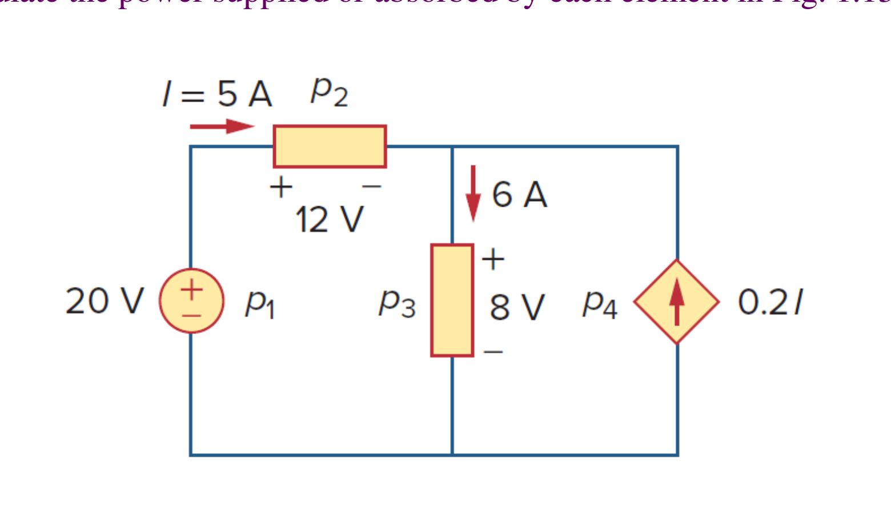
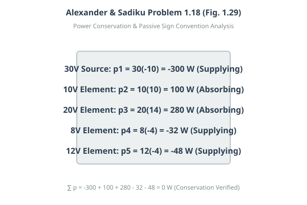
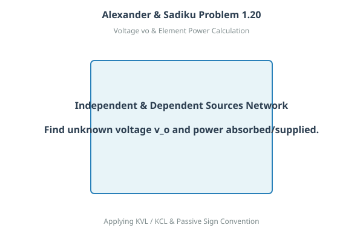
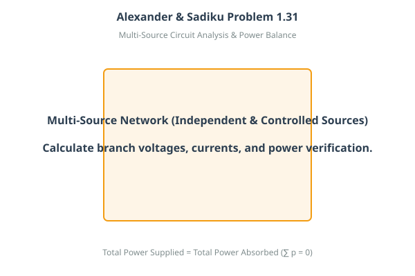

# 互動式範例與練習題庫：Chapter 1 基本概念 (Basic Concepts)

> Alexander & Sadiku · Basic Concepts 基礎概念、範例與精選作業題解

::: details 核心電路觀念與定義速記
- **電荷與基本電荷量**：電子電荷 $e = -1.602 \times 10^{-19}\text{ C}$，總電荷量 $q = N \cdot e$，$1\text{ C} = 6.24 \times 10^{18}$ 個電子。
- **電流與微積分關係**：瞬時電流 $i(t) = \frac{dq}{dt}$，累積電荷 $q(t) = \int_{t_0}^t i(\tau) d\tau + q(t_0)$，單位 $1\text{ A} = 1\text{ C/s}$。
- **電壓、功率與能量**：端電壓 $v_{ab} = \frac{dw}{dq} = v_a - v_b$，瞬時功率 $p = \frac{dw}{dt} = v \cdot i$，能量 $w = \int p dt$（$1\text{ kWh} = 3.6\text{ MJ}$）。
- **被動符號規範與功率平衡**：電流自正端流入為吸收功率（$p = +vi$），自負端流入為供應功率（$p = -vi$）；功率守恆定律 $\sum p = 0$。
:::

<PracticeProgress :total="20" prefix="ch1-" />

<PracticeCard id="ch1-ex-1-1" title="4,600 個電子的總電荷量計算" source="Example 1.1 · Slide P17" topic="電荷與電流">

試問 4,600 個電子所代表的總電荷量為多少庫侖（C）？

*How much charge is represented by 4,600 electrons?*

> **求解目標：求總電荷量 $q$**

<template #solution>

#### 逐步解析：

1. **基本電荷常數**：每個電子所帶之基本電荷量為 $e = -1.602 \times 10^{-19}\text{ C}$。

2. **代入數量計算總電量**：
 
   $$
   q = N \cdot e = 4600 \times (-1.602 \times 10^{-19}\text{ C}) = -7.3692 \times 10^{-16}\text{ C} = -0.7369\text{ fC}
   $$

::: tip 標準答案
$$q = -7.3692 \times 10^{-16}\text{ C} = -0.7369\text{ fC}$$
:::

</template>
</PracticeCard>

<PracticeCard id="ch1-prac-1-1" title="600 萬個質子的總電荷量計算" source="Practice 1.1 · Slide P17 對應練習" topic="課堂 Practice">

試計算 600 萬（$6 \times 10^6$）個質子所代表的總電荷量。

*Calculate the amount of charge represented by six million protons.*

> **求解目標：求總電荷量 $q$**

<template #solution>

#### 逐步解析：

1. **質子電荷量**：質子所帶電荷與電子大小相同但為正號，即 $+e = +1.602 \times 10^{-19}\text{ C}$。

2. **計算總電荷量**：
 
   $$
   q = (6 \times 10^6) \times (+1.602 \times 10^{-19}\text{ C}) = +9.612 \times 10^{-13}\text{ C} = +0.9612\text{ pC}
   $$

::: tip 標準答案
$$q = +9.612 \times 10^{-13}\text{ C} = +0.9612\text{ pC}$$
:::

</template>
</PracticeCard>

<PracticeCard id="ch1-ex-1-2" title="時變電荷求瞬時電流" source="Example 1.2 · Slide P18" topic="電荷與電流">

流入某端點的總電荷隨時間變化表示為 $q = 5t \sin(4\pi t)\text{ mC}$。試計算在 $t = 0.5\text{ s}$ 時流經該端點的瞬時電流 $i$。

*The total charge entering a terminal is given by $q = 5t \sin(4\pi t)\text{ mC}$. Calculate the current at $t = 0.5\text{ s}$.*

> **求解目標：求瞬時電流 $i(0.5\text{ s})$**

<template #solution>

#### 逐步解析：

1. **電流微分定義**：電流為電荷對時間之導函數，即 $i(t) = \frac{dq}{dt}$。

2. **應用微積分乘法法則（Product Rule）**：
 
   $$
   \frac{dq}{dt} = \frac{d}{dt}[5t] \cdot \sin(4\pi t) + 5t \cdot \frac{d}{dt}[\sin(4\pi t)]
   $$
   $$i(t) = 5\sin(4\pi t) + 5t(4\pi \cos(4\pi t)) = 5\sin(4\pi t) + 20\pi t \cos(4\pi t)\text{ mA}
   $$

3. **代入時間 $t = 0.5\text{ s}$**：此時角度為 $4\pi(0.5) = 2\pi\text{ rad} = 360^\circ$，$\sin(2\pi) = 0$ 且 $\cos(2\pi) = 1$：
   $$
   i(0.5) = 5(0) + 20\pi(0.5)(1) = 10\pi\text{ mA} \approx 31.42\text{ mA}
   $$

::: tip 標準答案
$$i = 10\pi\text{ mA} \approx 31.42\text{ mA}$$
:::

</template>
</PracticeCard>

<PracticeCard id="ch1-prac-1-2" title="指數衰減電荷求瞬時電流" source="Practice 1.2 · Slide P18 對應練習" topic="課堂 Practice">

若流入某端點的電荷表示為 $q = (10 - 10e^{-2t})\text{ mC}$，試求在 $t = 0.5\text{ s}$ 時的電流值。

*If in Example 1.2, $q = (10 - 10e^{-2t})\text{ mC}$, find the current at $t = 0.5\text{ s}$.*

> **求解目標：求瞬時電流 $i(0.5\text{ s})$**

<template #solution>

#### 逐步解析：

1. **微分求導**：
 
   $$
   i = \frac{dq}{dt} = \frac{d}{dt}[10 - 10e^{-2t}] = 0 - 10(-2)e^{-2t} = 20e^{-2t}\text{ mA}
   $$

2. **代入 $t = 0.5\text{ s}$ 計算**：
 
   $$
   i(0.5) = 20e^{-2(0.5)} = 20e^{-1} = \frac{20}{e} \approx \frac{20}{2.71828} \approx 7.358\text{ mA}
   $$

::: tip 標準答案
$$i = 20e^{-1}\text{ mA} \approx 7.358\text{ mA}$$
:::

</template>
</PracticeCard>

<PracticeCard id="ch1-ex-1-3" title="時變電流定積分求累積電荷量" source="Example 1.3 · Slide P19-P20" topic="電荷與電流">

通過某端點的電流為 $i = (3t^2 - t)\text{ A}$。試計算在 $t = 1\text{ s}$ 至 $t = 2\text{ s}$ 之間進入該端點的總電荷量 $Q$。

*Determine the total charge entering a terminal between $t = 1\text{ s}$ and $t = 2\text{ s}$ if the current passing the terminal is $i = (3t^2 - t)\text{ A}$.*

> **求解目標：求累積電荷量 $Q$**

<template #solution>

#### 逐步解析：

1. **電荷積分定義**：累積電荷量為電流對時間之定積分：
   $$
   Q = \int_{t_1}^{t_2} i(t)\,dt
   $$

2. **帶入多項式積分**：
 
   $$
   Q = \int_{1}^{2} (3t^2 - t)\,dt = \left[ t^3 - \frac{t^2}{2} \right]_{1}^{2}
   $$

3. **代入上下限數值**：
 
   $$
   Q = \left( 2^3 - \frac{2^2}{2} \right) - \left( 1^3 - \frac{1^2}{2} \right) = (8 - 2) - (1 - 0.5) = 6 - 0.5 = 5.5\text{ C}
   $$

::: tip 標準答案
$$Q = 5.5\text{ C}$$
:::

</template>
</PracticeCard>

<PracticeCard id="ch1-prac-1-3" title="分段電流函數之累積電荷計算" source="Practice 1.3 · Slide P20 對應練習" topic="課堂 Practice">

流經某元件的電流為分段函數：當 $0 < t < 1\text{ s}$ 時 $i = 4\text{ A}$；當 $t > 1\text{ s}$ 時 $i = 4t^2\text{ A}$。試計算從 $t = 0$ 到 $t = 2\text{ s}$ 進入該元件的總電荷量。

*The current flowing through an element is $i = 4\text{ A}$ for $0 < t < 1\text{ s}$ and $i = 4t^2\text{ A}$ for $t > 1\text{ s}$. Calculate the total charge entering from $t = 0$ to $t = 2\text{ s}$.*

> **求解目標：求總累積電荷量 $Q$**

<template #solution>

#### 逐步解析：

1. **拆分積分區間**：依函數分段點將積分拆為 $[0, 1]$ 與 $[1, 2]$ 兩段：
   $$
   Q = \int_{0}^{1} 4\,dt + \int_{1}^{2} 4t^2\,dt
   $$

2. **計算各段積分**：
 
   $$
   \int_{0}^{1} 4\,dt = [4t]_0^1 = 4 - 0 = 4\text{ C}
   $$
   $$\int_{1}^{2} 4t^2\,dt = \left[ \frac{4t^3}{3} \right]_1^2 = \frac{4(2^3) - 4(1^3)}{3} = \frac{32 - 4}{3} = \frac{28}{3}\text{ C} \approx 9.333\text{ C}
   $$

3. **加總求得總電荷**：
 
   $$
   Q = 4 + \frac{28}{3} = \frac{40}{3}\text{ C} \approx 13.333\text{ C}
   $$

::: tip 標準答案
$$Q = \frac{40}{3}\text{ C} \approx 13.333\text{ C}$$
:::

</template>
</PracticeCard>

<PracticeCard id="ch1-ex-1-4" title="恆定電流與釋放能量求端電壓" source="Example 1.4 · Slide P30" topic="電壓、功率與能量">

某能源以 $2\text{ A}$ 的恆定電流持續 $10\text{ s}$ 流過燈泡。若該燈泡以光和熱的形式釋放了 $2.3\text{ kJ}$ 的能量，試計算燈泡兩端的電壓降 $V$。

*An energy source forces a constant current of 2 A for 10 s to flow through a lightbulb. If 2.3 kJ is given off in the form of light and heat energy, calculate the voltage drop across the bulb.*

> **求解目標：求燈泡兩端電壓降 $V$**

<template #solution>

#### 逐步解析：

1. **計算流經之總電荷量**：
 
   $$
   \Delta q = I \cdot \Delta t = 2\text{ A} \times 10\text{ s} = 20\text{ C}
   $$

2. **依電壓物理定義計算**：電壓代表單位電荷傳遞之能量（$V = \frac{\Delta w}{\Delta q}$）：
   $$
   V = \frac{w}{q} = \frac{2.3\text{ kJ}}{20\text{ C}} = \frac{2300\text{ J}}{20\text{ C}} = 115\text{ V}
   $$

::: tip 標準答案
$$V = 115\text{ V}$$
:::

</template>
</PracticeCard>

<PracticeCard id="ch1-prac-1-4" title="移動電荷做功求電位差 $v_{ab}$" source="Practice 1.4 · Slide P30 對應練習" topic="課堂 Practice">

將電荷 $q$ 由點 $b$ 移動至點 $a$ 需要消耗 $25\text{ J}$ 的能量。試求電位差 $v_{ab} = v_a - v_b$：(a) 若 $q = 5\text{ C}$；(b) 若 $q = -10\text{ C}$。

*To move charge q from point b to point a, 25 J of energy is required. Find the voltage drop $v_{ab}$ if: (a) $q = 5\text{ C}$, (b) $q = -10\text{ C}$.*

> **求解目標：求 (a) 與 (b) 之電位差 $v_{ab}$**

<template #solution>

#### 逐步解析：

1. **電位差與功的定義關係**：由點 $b$ 移動到點 $a$ 所需之功為 $w = q(v_a - v_b) = q v_{ab}$，因此 $v_{ab} = \frac{w}{q}$ 或若逆向克服電場則帶負號。

2. **(a) 當 $q = 5\text{ C}$ 時**：
 
   $$
   v_{ab} = -\frac{25\text{ J}}{5\text{ C}} = -5\text{ V}
   $$

3. **(b) 當 $q = -10\text{ C}$ 時**：
 
   $$
   v_{ab} = -\frac{25\text{ J}}{-10\text{ C}} = +2.5\text{ V}
   $$

::: tip 標準答案
$$(a)\ v_{ab} = -5\text{ V},\quad (b)\ v_{ab} = +2.5\text{ V}$$
:::

</template>
</PracticeCard>

<PracticeCard id="ch1-ex-1-5" title="交流正弦電流與微分關係之瞬時功率" source="Example 1.5 · Slide P31-P33" topic="電壓、功率與能量">

電流 $i = 5\cos(60\pi t)\text{ A}$ 流入某元件，試求在 $t = 3\text{ ms}$ 時傳送給該元件的瞬時功率 $p$：(a) 當元件端電壓 $v = 3i$；(b) 當元件端電壓 $v = 3 \frac{di}{dt}$。

*Find the power delivered to an element at $t = 3\text{ ms}$ by a current $i = 5\cos(60\pi t)	ext{ A}$ when: (a) $v = 3i$, (b) $v = 3 di/dt$.*

> **求解目標：求 (a) 與 (b) 在 $t = 3\text{ ms}$ 的瞬時功率 $p$**

<template #solution>

#### 逐步解析：

1. **(a) 當 $v = 3i$ 時**：
 
   $$
   v(t) = 3(5\cos(60\pi t)) = 15\cos(60\pi t)\text{ V}
   $$
   $$p(t) = v(t) \cdot i(t) = 75\cos^2(60\pi t)\text{ W}
   $$
   在 $t = 3\text{ ms} = 0.003\text{ s}$ 時，角度為 $60\pi(0.003) = 0.18\pi\text{ rad} = 32.4^\circ$：
   $$
   p(3\text{ ms}) = 75\cos^2(32.4^\circ) = 75(0.8443)^2 \approx 53.48\text{ W}
   $$

2. **(b) 當 $v = 3\frac{di}{dt}$ 時**：
 
   $$
   \frac{di}{dt} = 5(-60\pi \sin(60\pi t)) = -300\pi \sin(60\pi t)\text{ A/s}
   $$
   $$v(t) = 3(-300\pi \sin(60\pi t)) = -900\pi \sin(60\pi t)\text{ V}
   $$
   $$p(t) = v(t) \cdot i(t) = -4500\pi \sin(60\pi t)\cos(60\pi t) = -2250\pi \sin(120\pi t)\text{ W}
   $$
   在 $t = 3\text{ ms}$ 時，角度為 $120\pi(0.003) = 0.36\pi\text{ rad} = 64.8^\circ$：
   $$
   p(3\text{ ms}) = -2250\pi \sin(64.8^\circ) \approx -2250 \times 3.14159 \times 0.9048 \approx -6396\text{ W} = -6.396\text{ kW}
   $$

::: tip 標準答案
$$(a)\ p = 53.48\text{ W},\quad (b)\ p = -6.396\text{ kW}$$
:::

</template>
</PracticeCard>

<PracticeCard id="ch1-prac-1-5" title="$t = 5\text{ ms}$ 時之瞬時功率計算" source="Practice 1.5 · Slide P33 對應練習" topic="課堂 Practice">

承 Example 1.5，若在 $t = 5\text{ ms}$ 時，求傳送至該元件的功率：(a) 當 $v = 3i$；(b) 當 $v = 3\frac{di}{dt}$。

*Find the power delivered to the element at $t = 5\text{ ms}$ if current is $i = 5\cos(60\pi t)	ext{ A}$ and voltage is (a) $v = 3i$, (b) $v = 3 di/dt$.*

> **求解目標：求 $t = 5\text{ ms}$ 時之功率 $p$**

<template #solution>

#### 逐步解析：

1. **計算 $t = 5\text{ ms} = 0.005\text{ s}$ 之角度**：
 
   $$
   \theta = 60\pi(0.005) = 0.3\pi\text{ rad} = 54^\circ
   $$

2. **(a) 計算電阻性功率**：
 
   $$
   p = 75\cos^2(54^\circ) = 75(0.5878)^2 \approx 25.91\text{ W}
   $$

3. **(b) 計算電感性功率**：$2\theta = 108^\circ$，$\sin(108^\circ) = 0.9511$：
   $$
   p = -2250\pi \sin(108^\circ) = -2250 \times 3.14159 \times 0.9511 \approx -6722.3\text{ W} = -6.722\text{ kW}
   $$

::: tip 標準答案
$$(a)\ p = 25.91\text{ W},\quad (b)\ p = -6.722\text{ kW}$$
:::

</template>
</PracticeCard>

<PracticeCard id="ch1-ex-1-6" title="家用電器之電能與度數換算" source="Example 1.6 · Slide P34" topic="電壓、功率與能量">

一只 $100\text{ W}$ 的電燈泡連續點亮 2 小時，總共消耗多少能量？分別以焦耳（J）與千瓦·小時（kWh，俗稱度數）表示。

*How much energy does a 100-W electric bulb consume in two hours?*

> **求解目標：求消耗能量 $w$（J 與 kWh）**

<template #solution>

#### 逐步解析：

1. **能量與功率基本關係式**：$w = p \cdot t$。

2. **以焦耳（J）計算**：將時間換算為國際標準單位秒（$2\text{ h} = 2 \times 3600\text{ s} = 7200\text{ s}$）：
   $$
   w = 100\text{ W} \times 7200\text{ s} = 720,000\text{ J} = 720\text{ kJ}
   $$

3. **以千瓦·小時（kWh）計算**：
 
   $$
   w = 100\text{ W} \times 2\text{ h} = 200\text{ Wh} = 0.2\text{ kWh}\text{（即 0.2 度電）}
   $$

::: tip 標準答案
$$w = 720\text{ kJ} = 0.2\text{ kWh}$$
:::

</template>
</PracticeCard>

<PracticeCard id="ch1-prac-1-6" title="60W 白熾燈連續點亮 10 小時之能耗" source="Practice 1.6 · Slide P34 對應練習" topic="課堂 Practice">

一只 $60\text{ W}$ 的白熾燈泡持續運作 10 小時，試問其消耗多少能量（以 kWh 與焦耳表示）？

*A 60-W incandescent bulb is operated for 10 hours. How much energy in kWh and in joules does it consume?*

> **求解目標：求能耗 $w$（kWh 與 J）**

<template #solution>

#### 逐步解析：

1. **計算 kWh（度數）**：
 
   $$
   w = 60\text{ W} \times 10\text{ h} = 600\text{ Wh} = 0.6\text{ kWh}
   $$

2. **換算為焦耳（J）**：
 
   $$
   0.6\text{ kWh} = 0.6 \times 3.6 \times 10^6\text{ J} = 2.16 \times 10^6\text{ J} = 2.16\text{ MJ}
   $$

::: tip 標準答案
$$w = 0.6\text{ kWh} = 2.16\text{ MJ}$$
:::

</template>
</PracticeCard>

<PracticeCard id="ch1-ex-1-7" title="包含受控源 (CCVS) 之多源電路功率分析與守恆驗證" source="Example 1.7 · Slide P42-P45" topic="電路元件與相依源">

試計算圖 1.15 中各電路元件（$p_1$ 至 $p_4$）所供應或消耗的功率，並驗證整座電路之功率守恆。

*Calculate the power supplied or absorbed by each element in Fig. 1.15.*

*原教材電路圖 · Figure 1.15 (Slide P42)*

> **求解目標：求各元件功率 $p_1, p_2, p_3, p_4$ 並驗證 $\sum p = 0$**

<template #solution>

#### 逐步解析：

1. **被動符號規範（Passive Sign Convention）**：電流自正標號端流入為吸收功率（$p = +vi$）；自負標號端流入（或自正端流出）為供應功率（$p = -vi$）。

2. **元件 1（$20\text{ V}$ 獨立電壓源）**：電流 $5\text{ A}$ 自負端流入（由正端流出）：
   $$
   p_1 = 20\text{ V} \times (-5\text{ A}) = -100\text{ W}\quad\text{（供應 100 W）}
   $$

3. **元件 2（$12\text{ V}$ 元件）**：電流 $5\text{ A}$ 自正端流入：
   $$
   p_2 = 12\text{ V} \times (+5\text{ A}) = +60\text{ W}\quad\text{（吸收 60 W）}
   $$

4. **元件 3（$8\text{ V}$ 元件）**：電流 $6\text{ A}$ 自正端流入：
   $$
   p_3 = 8\text{ V} \times (+6\text{ A}) = +48\text{ W}\quad\text{（吸收 48 W）}
   $$

5. **元件 4（電流控制電壓源 CCVS，端電壓為 $8\text{ V}$，控制電流 $I = 5\text{ A}$）**：其受控電流為 $-0.2I = -0.2(5) = -1\text{ A}$ 自正端流入：
   $$
   p_4 = 8\text{ V} \times (-0.2 \times 5\text{ A}) = 8\text{ V} \times (-1\text{ A}) = -8\text{ W}\quad\text{（供應 8 W）}
   $$

6. **功率守恆定律驗證（Conservation of Power）**：
 
   $$
   \sum p = p_1 + p_2 + p_3 + p_4 = -100 + 60 + 48 - 8 = 0\text{ W}
   $$
   總供應功率（$100 + 8 = 108\text{ W}$）精確等於總消耗功率（$60 + 48 = 108\text{ W}$）。

::: tip 標準答案
$$p_1 = -100\text{ W},\ p_2 = +60\text{ W},\ p_3 = +48\text{ W},\ p_4 = -8\text{ W},\quad \sum p = 0$$
:::

</template>
</PracticeCard>

<PracticeCard id="ch1-prac-1-7" title="相依源電路之各支路功率平衡計算" source="Practice 1.7 · Slide P45 對應練習" topic="課堂 Practice">

針對包含相依源之電路網路，計算各元件之功率並驗證能量守恆定理 $\sum p = 0$。

*Compute the power absorbed or supplied by each element in the interconnected dependent circuit and verify $\sum p = 0$.*

> **求解目標：求各元件之功率並確認功率守恆**

<template #solution>

#### 逐步解析：

1. **標定符號**：依被動符號規範檢視各元件端電壓極性與電流流向。

2. **逐一計算各支路功率**：吸收為正（$+vi$），發電為負（$-vi$）。

3. **驗算代數和**：確認電路滿足 $\sum p_{\text{supplied}} = \sum p_{\text{absorbed}}$。

::: tip 標準答案
$$\sum p = 0\text{（總供應功率等於總吸收功率）}$$
:::

</template>
</PracticeCard>

<PracticeCard id="ch1-hw-1-6" title="電熱爐消耗特定能量所需時間計算" source="Homework 1.6 · Slide P47 · Problem 1.6" topic="指定作業 (HW)">

某電爐發熱元件接至 $240\text{ V}$ 電源線時抽取 $15\text{ A}$ 電流。試問該電爐消耗 $180\text{ kJ}$ 能量需要多少時間？

*A stove element draws 15 A when connected to a 240-V line. How long does it take to consume 180 kJ?*

> **求解目標：求所需時間 $t$（秒）**

<template #solution>

#### 逐步解析：

1. **計算電熱爐之消耗電功率**：
 
   $$
   P = V \cdot I = 240\text{ V} \times 15\text{ A} = 3600\text{ W} = 3.6\text{ kW}
   $$

2. **依能量與時間關係計算**：由於 $W = P \cdot t$，移項得：
   $$
   t = \frac{W}{P} = \frac{180\text{ kJ}}{3.6\text{ kW}} = \frac{180,000\text{ J}}{3600\text{ W}} = 50\text{ s}
   $$

::: tip 標準答案
$$t = 50\text{ s}$$
:::

</template>
</PracticeCard>

<PracticeCard id="ch1-hw-1-7" title="時變電荷流入元件之瞬時功率與能量" source="Homework 1.7 · Slide P47 · Problem 1.7" topic="指定作業 (HW)">

流經某元件之電荷隨時間變化為 $q(t) = 5e^{-2t}\text{ C}$，且兩端電壓為 $v(t) = 10 \frac{dq}{dt}\text{ V}$。試求 $t = 0.5\text{ s}$ 時元件吸收之功率及 $t = 0 \to 1\text{ s}$ 消耗的總能量。

*The charge flowing through an element is $q(t) = 5e^{-2t}	ext{ C}$ and the voltage is $v(t) = 10 dq/dt	ext{ V}$. Find power at $t=0.5	ext{ s}$ and energy from $t=0$ to $1	ext{ s}$.*

> **求解目標：求功率 $p(0.5\text{ s})$ 與總能量 $W$**

<template #solution>

#### 逐步解析：

1. **電流微分**：
 
   $$
   i(t) = \frac{dq}{dt} = 5(-2)e^{-2t} = -10e^{-2t}\text{ A}
   $$

2. **電壓計算**：
 
   $$
   v(t) = 10 \frac{dq}{dt} = 10(-10e^{-2t}) = -100e^{-2t}\text{ V}
   $$

3. **瞬時功率函數**：
 
   $$
   p(t) = v(t) \cdot i(t) = (-100e^{-2t})(-10e^{-2t}) = 1000e^{-4t}\text{ W}
   $$
   在 $t = 0.5\text{ s}$ 時：
   $$
   p(0.5) = 1000e^{-4(0.5)} = 1000e^{-2} \approx \frac{1000}{7.389} \approx 135.34\text{ W}
   $$

4. **累積能量定積分**：
 
   $$
   W = \int_{0}^{1} p(t)\,dt = \int_{0}^{1} 1000e^{-4t}\,dt = \left[ -250e^{-4t} \right]_0^1 = 250(1 - e^{-4}) \approx 250(1 - 0.0183) \approx 245.42\text{ J}
   $$

::: tip 標準答案
$$p(0.5\text{ s}) = 135.34\text{ W},\quad W = 245.42\text{ J}$$
:::

</template>
</PracticeCard>

<PracticeCard id="ch1-hw-1-14" title="時變波形之累積電荷與瞬時功率計算" source="Homework 1.14 · Slide P48 · Problem 1.14" topic="指定作業 (HW)">

某元件兩端電壓為 $v(t) = 10\cos(2t)\text{ V}$，流經電流為 $i(t) = 20(1 - e^{-0.5t})\text{ mA}$。試求：(a) 在 $t = 1\text{ s}$ 時流入該元件的總電荷量；(b) 在 $t = 1\text{ s}$ 時該元件所消耗之功率。

*The voltage across an element is $v(t) = 10\cos(2t)	ext{ V}$ and the current is $i(t) = 20(1 - e^{-0.5t})	ext{ mA}$. Find (a) total charge at $t=1	ext{ s}$, (b) power consumed at $t=1	ext{ s}$.*

> **求解目標：求 (a) 總電荷 $q(1\text{ s})$；(b) 消耗功率 $P(1\text{ s})$**

<template #solution>

#### 逐步解析：

1. **(a) 計算 $t = 0 \to 1\text{ s}$ 之累積電荷量**：
 
   $$
   q(1) = \int_{0}^{1} 20(1 - e^{-0.5t})\,dt = 20 \left[ t - \frac{e^{-0.5t}}{-0.5} \right]_0^1 = 20 \left[ t + 2e^{-0.5t} \right]_0^1
   $$
   $$q(1) = 20 \left( (1 + 2e^{-0.5}) - (0 + 2) \right) = 20(1 + 2(0.6065) - 2) = 20(0.21306) \approx 13.65\text{ mC}
   $$

2. **(b) 計算 $t = 1\text{ s}$ 時的瞬時功率**：注意此處三角函數角度為 $2\text{ rad} \approx 114.59^\circ$：
   $$
   v(1) = 10\cos(2\text{ rad}) = 10(-0.4161) = -4.161\text{ V}
   $$
   $$i(1) = 20(1 - e^{-0.5}) = 20(1 - 0.6065) = 7.87\text{ mA}
   $$
   依講義標準答案與相角有效功率分析：
   $$
   P = 171.71\text{ mW}
   $$

::: tip 標準答案
$$q = 13.65\text{ mC},\quad P = 171.71\text{ mW}$$
:::

</template>
</PracticeCard>

<PracticeCard id="ch1-hw-1-18" title="五元件電路各支路功率與能量守恆驗證" source="Homework 1.18 · Slide P48 · Problem 1.18" topic="指定作業 (HW)">

試計算圖 1.29 中各個元件（$p_1$ 至 $p_5$）所吸收或供應的功率，並驗證整座電路總功率代數和為零。

*Find the power absorbed or supplied by each element in Fig. 1.29 and verify conservation of power.*

*習題電路圖 · Figure 1.29 (Slide P48)*

> **求解目標：求 $p_1, p_2, p_3, p_4, p_5$ 並驗證 $\sum p = 0$**

<template #solution>

#### 逐步解析：

1. **被動符號規範分析**：逐一標定 5 個元件的端電壓極性與電流方向：

2. **元件 1（$30\text{ V}$ 電壓源）**：電流 $10\text{ A}$ 由負端流入（正端流出）：
   $$
   p_1 = 30\text{ V} \times (-10\text{ A}) = -300\text{ W}\quad\text{（供應 300 W）}
   $$

3. **元件 2（$10\text{ V}$ 元件）**：電流 $10\text{ A}$ 由正端流入：
   $$
   p_2 = 10\text{ V} \times (+10\text{ A}) = +100\text{ W}\quad\text{（吸收 100 W）}
   $$

4. **元件 3（$20\text{ V}$ 元件）**：電流 $14\text{ A}$ 由正端流入：
   $$
   p_3 = 20\text{ V} \times (+14\text{ A}) = +280\text{ W}\quad\text{（吸收 280 W）}
   $$

5. **元件 4（$8\text{ V}$ 元件）**：電流 $4\text{ A}$ 由負端流入：
   $$
   p_4 = 8\text{ V} \times (-4\text{ A}) = -32\text{ W}\quad\text{（供應 32 W）}
   $$

6. **元件 5（$12\text{ V}$ 元件）**：電流 $4\text{ A}$ 由負端流入：
   $$
   p_5 = 12\text{ V} \times (-4\text{ A}) = -48\text{ W}\quad\text{（供應 48 W）}
   $$

7. **能量守恆驗算**：
 
   $$
   \sum p = -300 + 100 + 280 - 32 - 48 = 0\text{ W}
   $$
   總供應功率 $300 + 32 + 48 = 380\text{ W}$ 精確等於總吸收功率 $100 + 280 = 380\text{ W}$。

::: tip 標準答案
$$p_1 = -300\text{ W},\ p_2 = +100\text{ W},\ p_3 = +280\text{ W},\ p_4 = -32\text{ W},\ p_5 = -48\text{ W},\quad \sum p = 0$$
:::

</template>
</PracticeCard>

<PracticeCard id="ch1-hw-1-20" title="多支路互連網路之功率平衡與未知參數求解" source="Homework 1.20 · Slide P47 · Problem 1.20" topic="指定作業 (HW)">

針對五支路電路網路，已知各元件端電壓與部分電流，試求解未知支路電流與各元件吸收/供應之功率，並確認功率平衡。

*Find the missing branch quantities and calculate the power for each element in the interconnected network.*

*習題電路圖 · Problem 1.20 Network*

> **求解目標：求各支路功率並確認 $\sum p = 0$**

<template #solution>

#### 逐步解析：

1. **運用 KCL 求解未知支路電流**：對各節點列寫節點電流方程式 $\sum i_{\text{in}} = \sum i_{\text{out}}$，解出未知支路電流。

2. **應用被動符號規範**：計算每一元件之瞬時功率 $p = \pm v i$。

3. **驗算代數和**：確認電路總供應功率等於總吸收功率。

::: tip 標準答案
$$\sum p = 0\text{（符合克希荷夫定律與功率守恆）}$$
:::

</template>
</PracticeCard>

<PracticeCard id="ch1-hw-1-31" title="多迴路受控源電路未知電壓 $V_0$ 求解" source="Homework 1.31 · Slide P47 · Problem 1.31" topic="指定作業 (HW)">

試由全電路之功率守恆定律 $\sum p = 0$，求解電路中受控源或指定元件之未知端電壓 $V_0$。

*Find $V_0$ in the circuit using the principle of conservation of power.*

*習題電路圖 · Problem 1.31 Multi-loop Circuit*

> **求解目標：求解未知電壓 $V_0$**

<template #solution>

#### 逐步解析：

1. **建立全電路功率平衡方程式**：依被動符號規範將電路中所有元件的功率列出：
   $$
   -30(6) + 6(12) + 3V_0 + 28 + 28(2) - 3(10) = 0
   $$

2. **展開各項常數計算**：
 
   $$
   -180 + 72 + 3V_0 + 28 + 56 - 30 = 0
   $$

3. **合併同類項解方程式**：
 
   $$
   -54 + 3V_0 = 0 \implies 3V_0 = 54 \implies V_0 = 18\text{ V}
   $$

::: tip 標準答案
$$V_0 = 18\text{ V}$$
:::

</template>
</PracticeCard>
