# 互動式範例與練習題庫：Chapter 2 基礎電路定律 (Basic Laws)

> Alexander & Sadiku · Basic Laws 基礎電路定律與範例題解

::: details 核心電路定律與公式速記
- **歐姆定律與電導**：$v = i R$，$i = G v$，$G = 1/R$（單位：S），$p = v i = i^2 R = \frac{v^2}{R}$。
- **拓撲與克希荷夫定律**：拓撲定理 $b = l + n - 1$，KCL $\sum i_{\text{in}} = \sum i_{\text{out}}$，KVL $\sum v = 0$。
- **串並聯與分壓分流**：分壓 $v_1 = v \cdot \frac{R_1}{R_1 + R_2}$，分流 $i_1 = i \cdot \frac{R_2}{R_1 + R_2}$，並聯等效 $R_{eq} = \frac{R_1 R_2}{R_1 + R_2}$。
- **Δ-Y 互換法則**：$\Delta \to Y$ 為 $R_1 = \frac{R_b R_c}{\Sigma R_\Delta}$（相鄰積/總和），$Y \to \Delta$ 為 $R_a = \frac{\Sigma R_1 R_2}{R_1}$（兩兩積和/對面）。
:::

<PracticeFilter prefix="ch2-" />
<PracticeProgress :total="34" prefix="ch2-" />

<PracticeCard id="ch2-ex-2-1" type="example" title="電熨斗等效電阻計算" source="Example 2.1 · Slide P17" topic="歐姆定律與電導">

某電熨斗在 $120\text{ V}$ 電壓下運作，消耗電流為 $2\text{ A}$。試計算其內部加熱元件之等效電阻值 $R$。

*An electric iron draws 2 A at 120 V. Find its resistance R.*

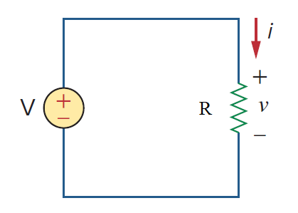

*原教材電路圖 · Slide P17*

> **求解目標：求電阻 $R$**

<template #solution>

#### 逐步解析：

1. **歐姆定律基本關係式**：導體兩端電壓與流經電流成正比，即 $v = i R$。

2. **移項計算電阻值**：
 
   $$
   R = \frac{v}{i} = \frac{120\text{ V}}{2\text{ A}} = 60\ \Omega
   $$

::: tip 標準答案
$$R = 60\ \Omega$$
:::

</template>
</PracticeCard>

<PracticeCard id="ch2-ex-2-2" type="example" title="直流電阻電路之電流、電導與功率計算" source="Example 2.2 · Slide P18" topic="歐姆定律與電導">

在電路中，已知 $30\text{ V}$ 直流電壓源跨接於 $5\text{ k}\Omega$ 電阻兩端。試計算電路電流 $i$、電阻之電導 $G$ 以及電阻所消耗之電功率 $p$。

*In the circuit shown in Fig. 2.8, calculate the current i, the conductance G, and the power p. (v = 30 V, R = 5 kΩ)*

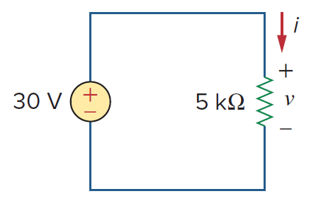

*原教材電路圖 · Slide P18*

> **求解目標：求電流 $i$、電導 $G$、功率 $p$**

<template #solution>

#### 逐步解析：

1. **計算電流 $i$**：應用歐姆定律：
   $$
   i = \frac{v}{R} = \frac{30\text{ V}}{5 \times 10^3\ \Omega} = 6 \times 10^{-3}\text{ A} = 6\text{ mA}
   $$

2. **計算電導 $G$**：電導為電阻之倒數：
   $$
   G = \frac{1}{R} = \frac{1}{5\text{ k}\Omega} = 0.2\text{ mS} = 200\ \mu\text{S}
   $$

3. **計算消耗功率 $p$**：
 
   $$
   p = v \cdot i = (30\text{ V})(6\text{ mA}) = 180\text{ mW}
   $$
   *（驗算：$p = i^2 R = (6\text{ mA})^2 \times 5000\ \Omega = 180\text{ mW}$，或 $p = \frac{v^2}{R} = \frac{30^2}{5000} = 180\text{ mW}$）*

::: tip 標準答案
$$i = 6\text{ mA},\quad G = 0.2\text{ mS} = 200\ \mu\text{S},\quad p = 180\text{ mW}$$
:::

</template>
</PracticeCard>

<PracticeCard id="ch2-ex-2-3" type="example" title="正弦交流時變電壓源的電流與瞬時功率" source="Example 2.3 · Slide P20" topic="歐姆定律與電導">

時變交流電壓源 $v(t) = 20\sin(\pi t)\text{ V}$ 跨接於 $5\text{ k}\Omega$ 電阻兩端。試求解流經該電阻之瞬時電流函數 $i(t)$ 以及瞬時消耗功率函數 $p(t)$。

*A voltage source of v = 20 sin(πt) V is connected across a 5-kΩ resistor. Find the current through the resistor and the power dissipated.*

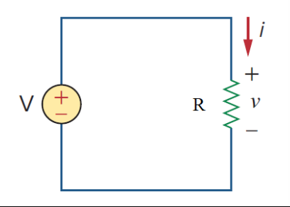

*原教材電路圖 · Slide P20*

> **求解目標：求瞬時電流 $i(t)$ 與瞬時功率 $p(t)$**

<template #solution>

#### 逐步解析：

1. **求解瞬時電流 $i(t)$**：由歐姆定律：
   $$
   i(t) = \frac{v(t)}{R} = \frac{20\sin(\pi t)\text{ V}}{5000\ \Omega} = 4\sin(\pi t)\text{ mA}
   $$

2. **求解瞬時消耗功率 $p(t)$**：由功率定義 $p(t) = v(t) \cdot i(t)$：
   $$
   p(t) = [20\sin(\pi t)\text{ V}] \times [4\sin(\pi t)\text{ mA}] = 80\sin^2(\pi t)\text{ mW}
   $$

::: tip 標準答案
$$i(t) = 4\sin(\pi t)\text{ mA},\quad p(t) = 80\sin^2(\pi t)\text{ mW}$$
:::

</template>
</PracticeCard>

<PracticeCard id="ch2-ex-2-4" type="example" title="網路分支數、節點數與串並聯拓撲判定" source="Example 2.4 · Slide P27" topic="拓撲、KCL 與 KVL">

分析如圖 2.12 所示電路：計算電路中的分支數（Branches）與節點數（Nodes），並指出哪些元件處於串聯（Series），哪些處於並聯（Parallel）。

*Determine the number of branches and nodes in the circuit shown in Fig. 2.12. Identify which elements are in series and which are in parallel.*

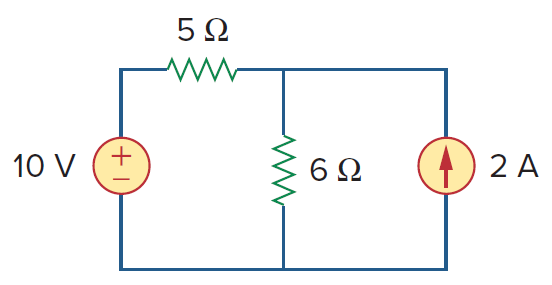

*原教材電路圖 · Slide P27*

> **求解目標：求分支數 $b$、節點數 $n$、串聯與並聯元件組合**

<template #solution>

#### 逐步解析：

1. **分支數（Branches, $b$）**：一個分支代表一個二端元件。電路包含 $10\text{ V}$ 電壓源、$5\ \Omega$ 電阻、$6\ \Omega$ 電阻、$2\text{ A}$ 電流源，共 4 個元件，因此
   $$
   b = 4
   $$

2. **節點數（Nodes, $n$）**：節點為兩條或多條分支之連接點。由電路圖標示可知共有 3 個獨立節點（頂部左、頂部右、底部整條連通之參考節點），因此
   $$
   n = 3
   $$

3. **串聯判定（Series）**：$10\text{ V}$ 電壓源與 $5\ \Omega$ 電阻串聯，因為兩者單端相接且無任何分支分流，流經完全相同之電流。

4. **並聯判定（Parallel）**：$6\ \Omega$ 電阻與 $2\text{ A}$ 電流源並聯，因為兩者的兩端皆跨接在相同的節點 2 與節點 3 之間（承受完全相同之端電壓）。

::: tip 標準答案
$$b = 4,\quad n = 3;\quad (10\text{V} \text{ 串聯 } 5\Omega),\quad (6\Omega \text{ 並聯 } 2\text{A})$$
:::

</template>
</PracticeCard>

<PracticeCard id="ch2-ex-2-5" type="example" title="單迴路克希荷夫電壓定律 (KVL) 求解端電壓" source="Example 2.5 · Slide P38" topic="拓撲、KCL 與 KVL">

在單迴路電路中，含 $20\text{ V}$ 獨立電壓源、頂部 $2\ \Omega$ 電阻（端電壓標示為 $+ v_1 -$，左正右負）及右側 $3\ \Omega$ 電阻（端電壓標示為 $- v_2 +$，上負下正）。試求解 $v_1$ 與 $v_2$。

*For the circuit in Fig. 2.21(a), find voltages v1 and v2. (20V source, 2Ω with + v1 -, 3Ω with - v2 +)*

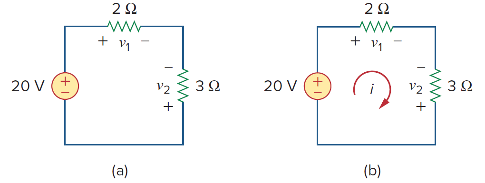

*原教材電路圖 · Slide P38*

> **求解目標：求電壓 $v_1$ 與 $v_2$**

<template #solution>

#### 逐步解析：

1. **設定順時針迴路電流 $i$**：依被動元件符號約定（Passive Sign Convention）：
   • 對 $2\ \Omega$ 電阻：電流由正端流入，故 $v_1 = 2i$
   • 對 $3\ \Omega$ 電阻：電流由負端流入，故 $v_2 = -3i$

2. **沿順時針方向列寫 KVL**：
 
   $$
   -20 + v_1 - v_2 = 0
   $$

3. **代入電流關係式**：
 
   $$
   -20 + (2i) - (-3i) = 0 \implies 5i = 20 \implies i = 4\text{ A}
   $$

4. **求解端電壓**：
 
   $$
   v_1 = 2(4) = 8\text{ V},\quad v_2 = -3(4) = -12\text{ V}
   $$

::: tip 標準答案
$$v_1 = 8\text{ V},\quad v_2 = -12\text{ V}$$
:::

</template>
</PracticeCard>

<PracticeCard id="ch2-ex-2-6" type="example" title="含相依電壓源 (Dependent Source) 的單迴路分析" source="Example 2.6 · Slide P40" topic="拓撲、KCL 與 KVL">

如圖 2.23(a) 所示單迴路，左側 $12\text{ V}$ 電壓源，頂部有 $4\ \Omega$ 電阻與相依電壓源 $2v_o$（左正右負），右側為 $4\text{ V}$ 電壓源（上負下正），底部為 $6\ \Omega$ 電阻（端電壓標示 $+ v_o -$，左正右負）。求電流 $i$ 與電壓 $v_o$。

*Determine vo and i in the circuit shown in Fig. 2.23(a). (12V source, 4Ω, 2vo dep source, 4V source, 6Ω with + vo -)*

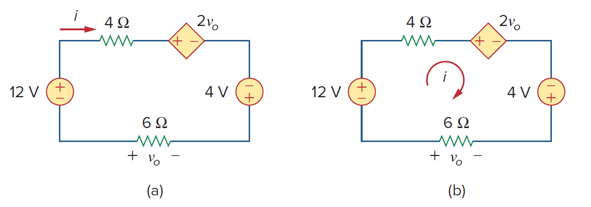

*原教材電路圖 · Slide P40*

> **求解目標：求電流 $i$ 與電壓 $v_o$**

<template #solution>

#### 逐步解析：

1. **找出受控變數 $v_o$ 與電流 $i$ 關係**：順時針電流 $i$ 流經底部 $6\ \Omega$ 電阻時，是由右向左（由負端流向正端），因此：
   $$
   v_o = -6i
   $$

2. **沿順時針方向列寫全迴路 KVL**：
 
   $$
   -12 + 4i + 2v_o - 4 + 6i = 0
   $$

3. **整理並將 $v_o = -6i$ 代入**：
 
   $$
   -16 + 10i + 2(-6i) = 0 \implies -16 - 2i = 0 \implies i = -8\text{ A}
   $$

4. **計算電壓 $v_o$**：
 
   $$
   v_o = -6(-8) = 48\text{ V}
   $$

::: tip 標準答案
$$i = -8\text{ A},\quad v_o = 48\text{ V}$$
:::

</template>
</PracticeCard>

<PracticeCard id="ch2-ex-2-7" type="example" title="並聯節點克希荷夫電流定律 (KCL) 與相依電流源分析" source="Example 2.7 · Slide P43" topic="拓撲、KCL 與 KVL">

如圖 2.25 所示並聯節點電路，包含相依電流源 $0.5i_o$（方向向上）、$4\ \Omega$ 電阻（向下電流標示為 $i_o$，端電壓為 $v_o$）以及獨立電流源 $3\text{ A}$（方向向上）。試求電流 $i_o$ 與電壓 $v_o$。

*Find current io and voltage vo in the circuit shown in Fig. 2.25. (0.5io dep source ↑, 4Ω with io ↓ and vo, 3A source ↑)*

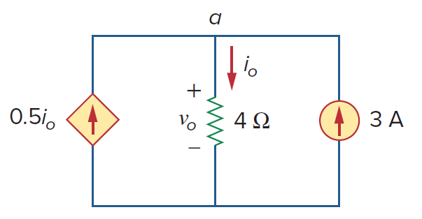

*原教材電路圖 · Slide P43*

> **求解目標：求電流 $i_o$ 與電壓 $v_o$**

<template #solution>

#### 逐步解析：

1. **對頂部節點 $a$ 應用 KCL（流入總和 = 流出總和）**：
 
   $$
   \sum i_{\text{in}} = \sum i_{\text{out}} \implies 0.5i_o + 3 = i_o
   $$

2. **移項求解電流 $i_o$**：
 
   $$
   i_o - 0.5i_o = 3 \implies 0.5i_o = 3 \implies i_o = \frac{3}{0.5} = 6\text{ A}
   $$

3. **應用歐姆定律求端電壓 $v_o$**：
 
   $$
   v_o = 4 \times i_o = 4 \times 6 = 24\text{ V}
   $$

::: tip 標準答案
$$i_o = 6\text{ A},\quad v_o = 24\text{ V}$$
:::

</template>
</PracticeCard>

<PracticeCard id="ch2-ex-2-8" type="example" title="串並聯結合 KCL/KVL 綜合多未知數求解" source="Example 2.8 · Slide P44" topic="拓撲、KCL 與 KVL">

如圖 2.27(a) 所示電路，包含 $30\text{ V}$ 電壓源串聯 $8\ \Omega$（電流 $i_1$，電壓 $v_1$），後接並聯的 $3\ \Omega$（電流 $i_2$，電壓 $v_2$）與 $6\ \Omega$（電流 $i_3$，電壓 $v_3$）。試求各支路電流與各元件跨壓。

*Find currents (i1, i2, i3) and voltages (v1, v2, v3) in the circuit shown in Fig. 2.27(a). (30V source, 8Ω, 3Ω || 6Ω)*

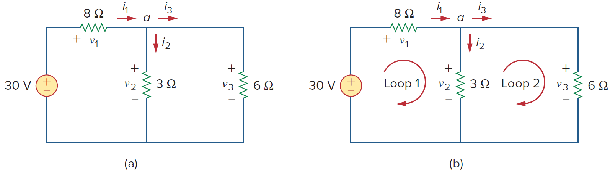

*原教材電路圖 · Slide P44*

> **求解目標：求 $i_1, i_2, i_3$ 與 $v_1, v_2, v_3$**

<template #solution>

#### 逐步解析：

1. **計算並聯部分等效電阻**：
 
   $$
   R_p = 3\ \Omega \parallel 6\ \Omega = \frac{3 \times 6}{3 + 6} = 2\ \Omega
   $$

2. **計算全電路總等效電阻**：
 
   $$
   R_{eq} = 8 + R_p = 8 + 2 = 10\ \Omega
   $$

3. **求解總電流 $i_1$**：
 
   $$
   i_1 = \frac{30\text{ V}}{10\ \Omega} = 3\text{ A}
   $$

4. **求解各電阻端電壓**：• $v_1 = 8 \times i_1 = 8 \times 3 = 24\text{ V}$
   • $v_2 = v_3 = 30 - v_1 = 30 - 24 = 6\text{ V}$

5. **求解各支路分流**：• $i_2 = \frac{v_2}{3\ \Omega} = \frac{6}{3} = 2\text{ A}$
   • $i_3 = \frac{v_3}{6\ \Omega} = \frac{6}{6} = 1\text{ A}$ *（驗證 KCL：$i_1 = i_2 + i_3 = 2 + 1 = 3\text{ A}$）*

::: tip 標準答案
$$i_1 = 3\text{ A},\ i_2 = 2\text{ A},\ i_3 = 1\text{ A};\quad v_1 = 24\text{ V},\ v_2 = 6\text{ V},\ v_3 = 6\text{ V}$$
:::

</template>
</PracticeCard>

<PracticeCard id="ch2-ex-2-9" type="example" title="階梯狀 (Ladder) 電阻網路等效電阻化簡" source="Example 2.9 · Slide P55" topic="串並聯化簡與分壓分流">

如圖 2.34 所示梯形電阻網路，輸入端包含 $4\ \Omega$ 與 $8\ \Omega$，中間支路為 $2\ \Omega$ 串聯 $(6\ \Omega \parallel 3\ \Omega)$，最右側支路為 $1\ \Omega + 5\ \Omega$。試由電路最遠端向輸入端逐步簡化，求解等效電阻 $R_{eq}$。

*Find Req for the circuit shown in Fig. 2.34.*

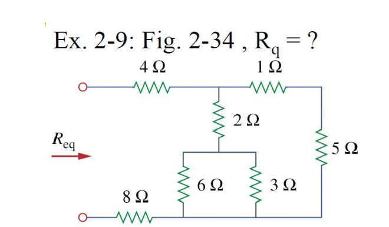

*原教材電路圖 · Slide P55*

> **求解目標：求等效電阻 $R_{eq}$**

<template #solution>

#### 逐步解析：

1. **最右側支路串聯**：$1\ \Omega + 5\ \Omega = 6\ \Omega$

2. **中間下方兩電阻並聯**：$6\ \Omega \parallel 3\ \Omega = \frac{6 \times 3}{6 + 3} = 2\ \Omega$

3. **中間垂直支路串聯總和**：$2\ \Omega + 2\ \Omega = 4\ \Omega$

4. **中間支路與右側支路並聯**：$4\ \Omega \parallel 6\ \Omega = \frac{4 \times 6}{4 + 6} = 2.4\ \Omega$

5. **與輸入端上下兩電阻串聯相加**：
 
   $$
   R_{eq} = 4 + 2.4 + 8 = 14.4\ \Omega
   $$

**講義完整解答圖示：**

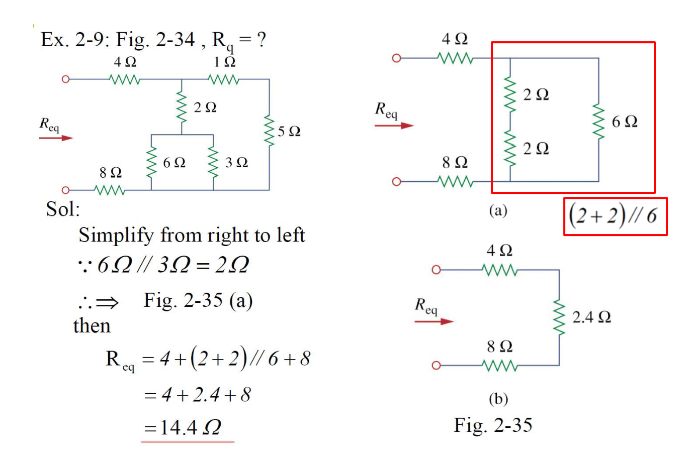

::: tip 標準答案
$$R_{eq} = 14.4\ \Omega$$
:::

</template>
</PracticeCard>

<PracticeCard id="ch2-ex-2-10" type="example" title="多節點交叉連接電阻網路等效電阻計算" source="Example 2.10 · Slide P56-57" topic="串並聯化簡與分壓分流">

計算端點 $a-b$ 間的等效電阻 $R_{ab}$。電路如圖 2.37 所示，包含輸入端 $10\ \Omega$、節點 $c-b$ 間並聯之 $3\ \Omega$ 與 $6\ \Omega$、節點 $d-b$ 間之 $12\ \Omega$ 與 $4\ \Omega$、跨接 $c-d$ 之 $1\ \Omega$ 以及最右端 $(1\ \Omega + 5\ \Omega)$。

*Calculate the equivalent resistance Rab in the circuit in Fig. 2.37.*

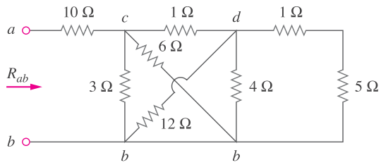

*原教材電路圖 · Slide P56-57*

> **求解目標：求等效電阻 $R_{ab}$**

<template #solution>

#### 逐步解析：

1. **化簡節點 c 與 b 之間並聯**：$3\ \Omega \parallel 6\ \Omega = \frac{3 \times 6}{3 + 6} = 2\ \Omega$

2. **化簡節點 d 與 b 之間並聯**：$12\ \Omega \parallel 4\ \Omega = \frac{12 \times 4}{12 + 4} = 3\ \Omega$

3. **化簡最右側支路並與 d-b 並聯**：右側 $1 + 5 = 6\ \Omega$，與 $3\ \Omega$ 並聯得 $6\ \Omega \parallel 3\ \Omega = 2\ \Omega$

4. **計算路徑 c-d-b 串聯值**：$1\ \Omega + 2\ \Omega = 3\ \Omega$

5. **節點 c 與 b 間總並聯**：$3\ \Omega \parallel 2\ \Omega = \frac{3 \times 2}{3 + 2} = 1.2\ \Omega$

6. **加上前級串聯電阻**：
 
   $$
   R_{ab} = 10\ \Omega + 1.2\ \Omega = 11.2\ \Omega
   $$

::: tip 標準答案
$$R_{ab} = 11.2\ \Omega$$
:::

</template>
</PracticeCard>

<PracticeCard id="ch2-ex-2-11" type="example" title="純電導網路 (Conductance) 的等效電導計算" source="Example 2.11 · Slide P58" topic="串並聯化簡與分壓分流">

如圖 2.40(a) 所示電導網路（單位為 Siemens, S），最右端為並聯的 $8\text{ S}$ 與 $12\text{ S}$，上方串聯 $5\text{ S}$，左端並聯 $6\text{ S}$。試求總等效電導 $G_{eq}$。

*Find equivalent conductance Geq for the circuit shown in Fig. 2.40(a). (Conductances: 6S, 5S, 8S, 12S)*

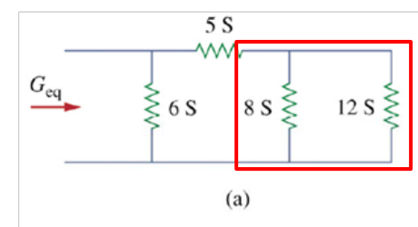

*原教材電路圖 · Slide P58*

> **求解目標：求等效電導 $G_{eq}$**

<template #solution>

#### 逐步解析：

1. **右側兩並聯電導直接相加**：
 
   $$
   G_{p1} = 8\text{ S} + 12\text{ S} = 20\text{ S}
   $$

2. **與頂部 $5\text{ S}$ 電導串聯計算**：
 
   $$
   G_{s} = \frac{20 \times 5}{20 + 5} = \frac{100}{25} = 4\text{ S}
   $$

3. **與最左側 $6\text{ S}$ 電導並聯相加**：
 
   $$
   G_{eq} = 6\text{ S} + G_s = 6\text{ S} + 4\text{ S} = 10\text{ S}
   $$

**講義完整解答圖示：**

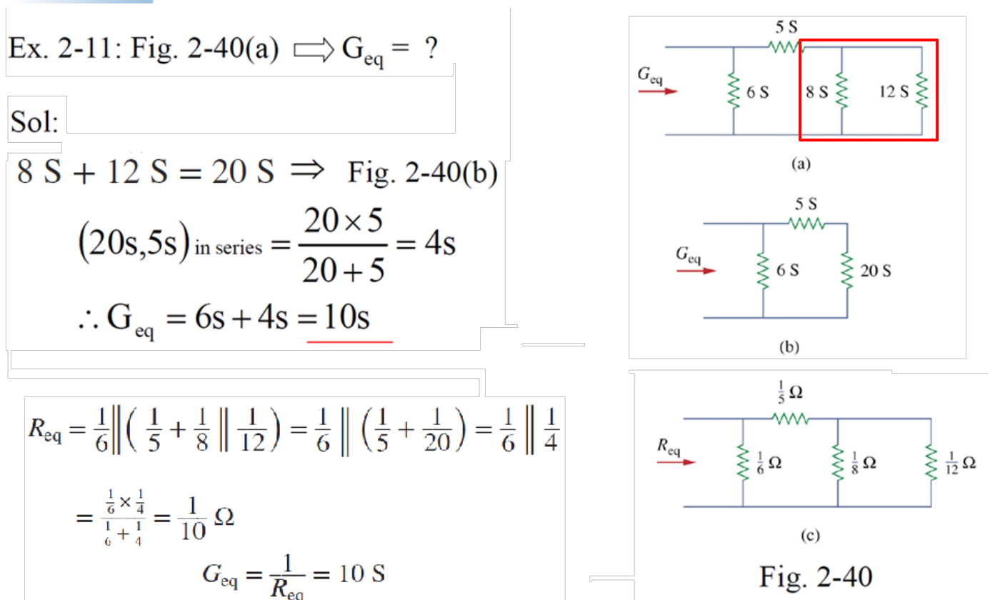

::: tip 標準答案
$$G_{eq} = 10\text{ S}$$
:::

</template>
</PracticeCard>

<PracticeCard id="ch2-ex-2-12" type="example" title="分壓、分流定律與特定電阻功率消耗分析" source="Example 2.12 · Slide P59-60" topic="串並聯化簡與分壓分流">

如圖 2.42(a) 所示，包含 $12\text{ V}$ 電壓源串聯 $4\ \Omega$ 電阻後，並聯 $6\ \Omega$ 與 $3\ \Omega$ 電阻（$3\ \Omega$ 上之電流為 $i_o$，端電壓為 $v_o$）。求 $i_o, v_o$ 及 $3\ \Omega$ 消耗的功率 $P_{3\Omega}$。

*Find io, vo, and the power P3Ω dissipated by the 3 Ω resistor in the circuit shown in Fig. 2.42(a).*

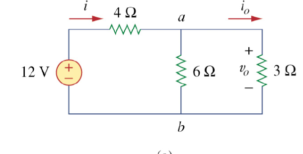

*原教材電路圖 · Slide P59-60*

> **求解目標：求 $i_o$、電壓 $v_o$ 與消耗功率 $P_{3\Omega}$**

<template #solution>

#### 逐步解析：

1. **計算全電路總等效電阻**：
 
   $$
   R_{eq} = 4 + (6 \parallel 3) = 4 + 2 = 6\ \Omega
   $$

2. **計算電源總電流 $i$**：
 
   $$
   i = \frac{12\text{ V}}{6\ \Omega} = 2\text{ A}
   $$

3. **應用分流公式求 $i_o$**：
 
   $$
   i_o = i \times \frac{6}{6 + 3} = 2 \times \frac{2}{3} = \frac{4}{3}\text{ A} \approx 1.333\text{ A}
   $$

4. **計算 $3\ \Omega$ 端電壓 $v_o$**：
 
   $$
   v_o = i_o \times 3\ \Omega = \frac{4}{3} \times 3 = 4\text{ V}
   $$

5. **計算 $3\ \Omega$ 電阻消耗功率 $P_{3\Omega}$**：
 
   $$
   P_{3\Omega} = v_o \cdot i_o = (4\text{ V}) \times \left(\frac{4}{3}\text{ A}\right) = \frac{16}{3}\text{ W} \approx 5.333\text{ W}
   $$

**講義完整解答圖示：**

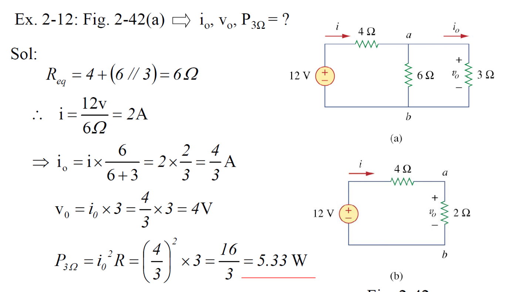

::: tip 標準答案
$$i_o = \frac{4}{3}\text{ A} \approx 1.333\text{ A},\quad v_o = 4\text{ V},\quad P_{3\Omega} = \frac{16}{3}\text{ W} \approx 5.333\text{ W}$$
:::

</template>
</PracticeCard>

<PracticeCard id="ch2-ex-2-13" type="example" title="電流源並聯分流與全電路功率守恆平衡" source="Example 2.13 · Slide P61-64" topic="串並聯化簡與分壓分流">

在圖 2.44(a) 電路中，包含 $30\text{ mA}$ 獨立電流源，並聯 $9\text{ k}\Omega$ 電阻（端電壓 $v_o$）以及 $(6\text{ k}\Omega + 12\text{ k}\Omega)$ 串聯支路。求：(a) 電壓 $v_o$；(b) 電流源提供的功率；(c) 各電阻消耗功率。

*In Fig. 2.44(a), determine: (a) the voltage vo, (b) the power supplied by the current source, (c) the power absorbed by each resistor. (30mA source, 9kΩ, 6kΩ, 12kΩ)*

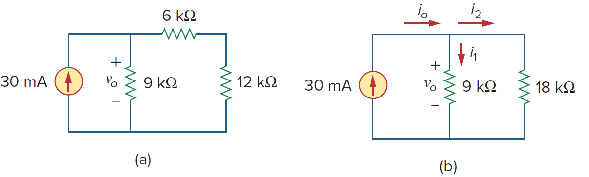

*原教材電路圖 · Slide P61-64*

> **求解目標：求 $v_o$、電源供電功率 $p_{\text{src}}$、各電阻吸收功率**

<template #solution>

#### 逐步解析：

1. **計算電壓 $v_o$**：右側支路總電阻 $= 6\text{ k}\Omega + 12\text{ k}\Omega = 18\text{ k}\Omega$
   並聯等效電阻 $R_{eq} = 9\text{ k}\Omega \parallel 18\text{ k}\Omega = \frac{9 \times 18}{27} = 6\text{ k}\Omega$
   $$
   v_o = 30\text{ mA} \times 6\text{ k}\Omega = 180\text{ V}
   $$

2. **計算電流源供電功率**：
 
   $$
   p_{\text{src}} = v_o \times i_s = 180\text{ V} \times 30\text{ mA} = 5400\text{ mW} = 5.4\text{ W}
   $$

3. **計算各電阻吸收功率**：• $9\text{ k}\Omega$ 電阻電流 $i_1 = \frac{180}{9\text{ k}} = 20\text{ mA} \implies p_{9k} = 180\text{ V} \times 20\text{ mA} = 3.6\text{ W}$
   • 右側支路電流 $i_2 = 30\text{ mA} - 20\text{ mA} = 10\text{ mA}$
   • $6\text{ k}\Omega$ 電阻功率：$p_{6k} = (10\text{ mA})^2 \times 6\text{ k}\Omega = 0.6\text{ W}$
   • $12\text{ k}\Omega$ 電阻功率：$p_{12k} = (10\text{ mA})^2 \times 12\text{ k}\Omega = 1.2\text{ W}$
   • **功率守恆驗證：** $3.6 + 0.6 + 1.2 = 5.4\text{ W}$（總吸收功率 = 總提供功率）

::: tip 標準答案
$$v_o = 180\text{ V},\quad p_{\text{src}} = 5.4\text{ W},\quad p_{9k} = 3.6\text{ W},\ p_{6k} = 0.6\text{ W},\ p_{12k} = 1.2\text{ W}$$
:::

</template>
</PracticeCard>

<PracticeCard id="ch2-ex-2-14" type="example" title="三角形 (Δ) 網路至等效星形 (Y) 網路轉換" source="Example 2.14 · Slide P82-83" topic="Δ-Y 轉換">

將三頂點為 $a, b, c$ 的三角形（$\Delta$）網路轉換為等效星形（$Y$）網路（$R_1, R_2, R_3$）。已知如圖 2.50(a)：$R_c = 25\ \Omega$（連接於 $a-b$）、$R_a = 15\ \Omega$（連接於 $b-c$）、$R_b = 10\ \Omega$（連接於 $c-a$）。

*Convert the Δ network in Fig. 2.50(a) to an equivalent Y network. (Rc = 25 Ω at a-b, Ra = 15 Ω at b-c, Rb = 10 Ω at c-a)*

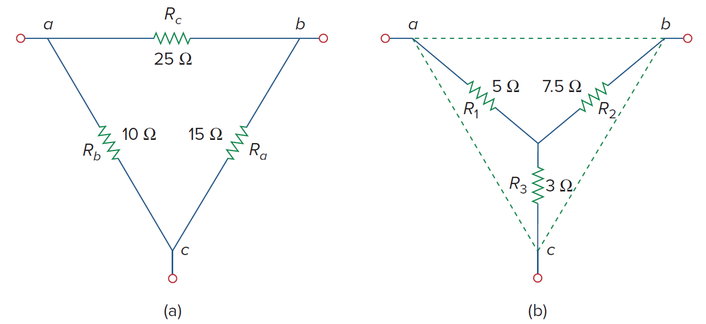

*原教材電路圖 · Slide P82-83*

> **求解目標：求星形各臂電阻 $R_1, R_2, R_3$**

<template #solution>

#### 逐步解析：

1. **計算 $\Delta$ 網路三電阻總和**：
 
   $$
   \Sigma R_{\Delta} = R_a + R_b + R_c = 15 + 10 + 25 = 50\ \Omega
   $$

2. **求 $R_1$（連接端點 a）**：相鄰兩臂乘積除以總和：
   $$
   R_1 = \frac{R_b R_c}{\Sigma R_{\Delta}} = \frac{10 \times 25}{50} = 5\ \Omega
   $$

3. **求 $R_2$（連接端點 b）**：
 
   $$
   R_2 = \frac{R_a R_c}{\Sigma R_{\Delta}} = \frac{15 \times 25}{50} = 7.5\ \Omega
   $$

4. **求 $R_3$（連接端點 c）**：
 
   $$
   R_3 = \frac{R_a R_b}{\Sigma R_{\Delta}} = \frac{15 \times 10}{50} = 3\ \Omega
   $$

::: tip 標準答案
$$R_1 = 5\ \Omega,\quad R_2 = 7.5\ \Omega,\quad R_3 = 3\ \Omega$$
:::

</template>
</PracticeCard>

<PracticeCard id="ch2-ex-2-15" type="example" title="利用 Δ-Y 轉換求解非對稱橋式電路等效電阻與電流" source="Example 2.15 · Slide P84-91" topic="Δ-Y 轉換">

如圖 2.52 所示橋式電路連接至 $120\text{ V}$ 電壓源。頂部節點 $a$ 接 $12.5\ \Omega$（至 $c$）、$10\ \Omega$（至 $n$）及旁路 $30\ \Omega$（至 $b$）；中間跨接 $5\ \Omega$（$c-n$ 間）；底部節點 $c$ 接 $15\ \Omega$（至 $b$），$n$ 接 $20\ \Omega$（至 $b$）。求等效電阻 $R_{ab}$ 與總電流 $i$。

*Obtain the equivalent resistance Rab for the circuit in Fig. 2.52 and use it to find current i. (120V source, bridge with 12.5Ω, 10Ω, 5Ω, 15Ω, 20Ω, 30Ω)*

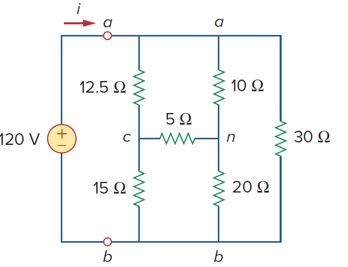

*原教材電路圖 · Slide P84-91*

> **求解目標：求等效電阻 $R_{ab}$ 與總電流 $i$**

<template #solution>

#### 逐步解析：

1. **將上半部 $\Delta(a-c-n)$ 轉為星形 $Y$**：三臂電阻為 $10\ \Omega, 12.5\ \Omega, 5\ \Omega$，總和 $\Sigma = 10 + 12.5 + 5 = 27.5\ \Omega$
   • $R_1 (\text{接 } a) = \frac{10 \times 12.5}{27.5} = 4.545\ \Omega$
   • $R_2 (\text{接 } c) = \frac{5 \times 12.5}{27.5} = 2.273\ \Omega$
   • $R_3 (\text{接 } n) = \frac{5 \times 10}{27.5} = 1.818\ \Omega$

2. **下半部串並聯化簡**：• 左臂：$R_2 + 15\ \Omega = 2.273 + 15 = 17.273\ \Omega$
   • 右臂：$R_3 + 20\ \Omega = 1.818 + 20 = 21.818\ \Omega$
   • 兩臂並聯：$R_{db} = 17.273 \parallel 21.818 = \frac{17.273 \times 21.818}{17.273 + 21.818} = 9.641\ \Omega$

3. **計算橋路等效電阻**：
 
   $$
   R_{ab}' = R_1 + R_{db} = 4.545 + 9.641 = 14.186\ \Omega
   $$

4. **與最外側 $30\ \Omega$ 旁路電阻並聯**：
 
   $$
   R_{ab} = 14.186 \parallel 30 = \frac{14.186 \times 30}{14.186 + 30} \approx 9.632\ \Omega
   $$

5. **計算電源總電流 $i$**：
 
   $$
   i = \frac{V_s}{R_{ab}} = \frac{120\text{ V}}{9.632\ \Omega} \approx 12.458\text{ A}
   $$

::: tip 標準答案
$$R_{ab} \approx 9.632\ \Omega,\quad i \approx 12.458\text{ A}$$
:::

</template>
</PracticeCard>

<PracticeCard id="ch2-prac-2-14" type="practice" title="星形 (Y) 網路至等效三角形 (Δ) 網路轉換" source="Practice 2.14 · Slide P92" topic="課堂 Practice 測驗">

將星形（$Y$）網路（如圖 2.51：$R_1 = 10\ \Omega, R_2 = 20\ \Omega, R_3 = 40\ \Omega$）轉換為等效三角形（$\Delta$）網路（$R_a, R_b, R_c$）。

*Transform the wye ($Y$) network in Fig. 2.51 to a delta ($\Delta$) network. ($R_1 = 10\ \Omega, R_2 = 20\ \Omega, R_3 = 40\ \Omega$)*

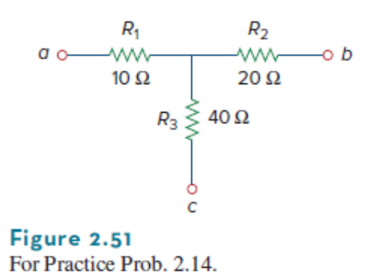

*原教材電路圖 · Slide P92*

> **求解目標：求 $\Delta$ 型各邊電阻 $R_a, R_b, R_c$**

<template #solution>

#### 逐步解析：

1. **計算分子（所有兩兩乘積總和）**：
 
   $$
   N = R_1 R_2 + R_2 R_3 + R_3 R_1 = (10)(20) + (20)(40) + (40)(10) = 200 + 800 + 400 = 1400\ \Omega^2
   $$

2. **應用 $Y \to \Delta$ 公式（除以對面之電阻）**：• $R_a = \frac{N}{R_1} = \frac{1400}{10} = 140\ \Omega$
   • $R_b = \frac{N}{R_2} = \frac{1400}{20} = 70\ \Omega$
   • $R_c = \frac{N}{R_3} = \frac{1400}{40} = 35\ \Omega$

::: tip 標準答案
$$R_a = 140\ \Omega,\quad R_b = 70\ \Omega,\quad R_c = 35\ \Omega$$
:::

</template>
</PracticeCard>

<PracticeCard id="ch2-prac-2-15" type="practice" title="含前級串聯電阻之非對稱橋式網路求解" source="Practice 2.15 · Slide P92" topic="課堂 Practice 測驗">

如圖 2.54 所示電路，$240\text{ V}$ 電源接端點 $a$，先經 $13\ \Omega$ 電阻後進入橋路（包含 $24\ \Omega, 10\ \Omega, 20\ \Omega, 30\ \Omega, 50\ \Omega$）。試求端點 $a-b$ 間等效電阻 $R_{ab}$ 以及電源總電流 $i$。

*For the bridge network in Fig. 2.54, find $R_{ab}$ and $i$. ($V_s = 240\text{V}$, top resistor $13\Omega$, bridge resistors $24\Omega, 10\Omega, 20\Omega, 30\Omega, 50\Omega$)*

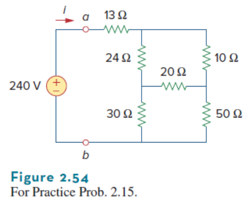

*原教材電路圖 · Slide P92*

> **求解目標：求等效電阻 $R_{ab}$ 與電流 $i$**

<template #solution>

#### 逐步解析：

1. **化簡內部橋路**：對橋路內部之三角形網路（$24\ \Omega, 10\ \Omega, 20\ \Omega$）進行 $\Delta \to Y$ 轉換。

2. **計算橋路等效電阻**：化簡串並聯後得橋路部分之等效電阻為 $R_{\text{bridge}} = 27\ \Omega$。

3. **加上前級串聯之 $13\ \Omega$**：
 
   $$
   R_{ab} = 13\ \Omega + 27\ \Omega = 40\ \Omega
   $$

4. **計算總電流 $i$**：
 
   $$
   i = \frac{V_s}{R_{ab}} = \frac{240\text{ V}}{40\ \Omega} = 6\text{ A}
   $$

::: tip 標準答案
$$R_{ab} = 40\ \Omega,\quad i = 6\text{ A}$$
:::

</template>
</PracticeCard>

## 教材直接來源補齊

<PracticeCard id="ch2-pr1" type="practice" title="Practice Problem 2.1" source="課本 p.40" topic="歐姆定律與電阻功率">

電烤麵包機的核心元件是一個將電能轉換為熱能的電氣元件（電阻器）。一個電阻為 $15\ \Omega$、兩端電壓為 $120\ \mathrm{V}$ 的烤麵包機，所吸取的電流是多少？

<template #solution>

**教材答案：** $8\ \mathrm{A}$

</template>

</PracticeCard>

<PracticeCard id="ch2-pr2" type="practice" title="Practice Problem 2.2" source="課本 p.41" topic="歐姆定律與電阻功率">

對於圖 2.9 所示的電路，計算電壓 $v$、導納 $G$ 與功率 $p$。

<template #solution>

**教材答案：** $v=30\ \mathrm{V}$、$G=100\ \mu\mathrm{S}$、$p=90\ \mathrm{mW}$

</template>

</PracticeCard>

<PracticeCard id="ch2-pr3" type="practice" title="Practice Problem 2.3" source="課本 p.41" topic="時變電壓與電阻功率">

某電阻器接於電壓源 $v=15\cos t\ \mathrm{V}$ 時，吸收的瞬時功率為 $30\cos^2 t\ \mathrm{mW}$。求電流 $i$ 與電阻 $R$。

<template #solution>

**教材答案：** $i=2\cos t\ \mathrm{mA}$、$R=7.5\ \mathrm{k}\Omega$

</template>

</PracticeCard>

<PracticeCard id="ch2-pr4" type="practice" title="Practice Problem 2.4" source="課本 p.43" topic="節點、分支與串並聯">

圖 2.14 所示的電路有多少個分支與節點？請辨識哪些元件串聯、哪些元件並聯。

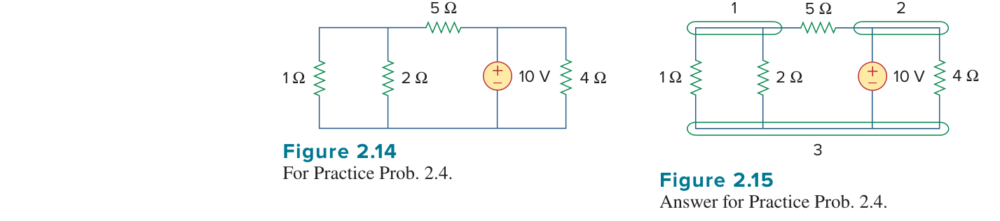

<template #solution>

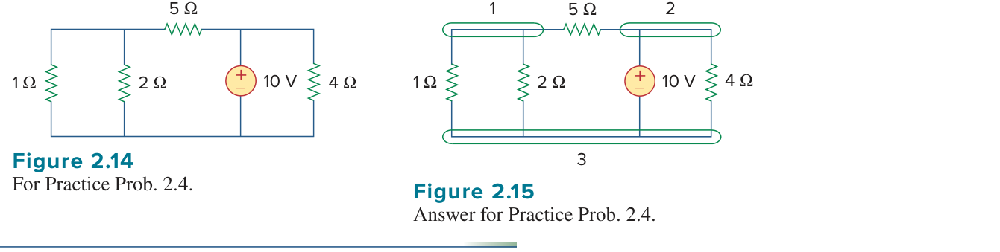

圖 2.15 顯示此電路有五個分支與三個節點。$1\ \Omega$ 與 $2\ \Omega$ 電阻並聯；$4\ \Omega$ 電阻與 $10\ \mathrm{V}$ 電壓源也並聯。沒有任何元件串聯。

</template>

</PracticeCard>

<PracticeCard id="ch2-pr5" type="practice" title="Practice Problem 2.5" source="課本 p.47" topic="基爾霍夫電壓定律">

求圖 2.22 電路中的電壓 $v_1$ 與 $v_2$。

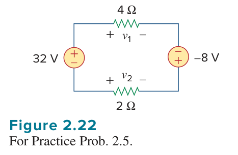

<template #solution>

**教材答案：** $v_1=16\ \mathrm{V}$、$v_2=-8\ \mathrm{V}$

</template>

</PracticeCard>

<PracticeCard id="ch2-pr6" type="practice" title="Practice Problem 2.6" source="課本 p.47" topic="基爾霍夫電壓定律與受控電壓源">

求圖 2.24 電路中的 $v_x$ 與 $v_o$。

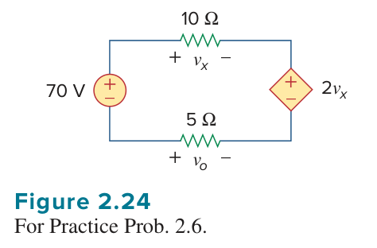

<template #solution>

**教材答案：** $v_x=20\ \mathrm{V}$、$v_o=-10\ \mathrm{V}$

</template>

</PracticeCard>

<PracticeCard id="ch2-pr7" type="practice" title="練習題 2.7：受控電流源電路" source="課本 p.48" topic="KCL 與歐姆定律">

如圖 2.26 所示，求 $v_o$ 與 $i_o$，並求出各支路的電流與電壓。

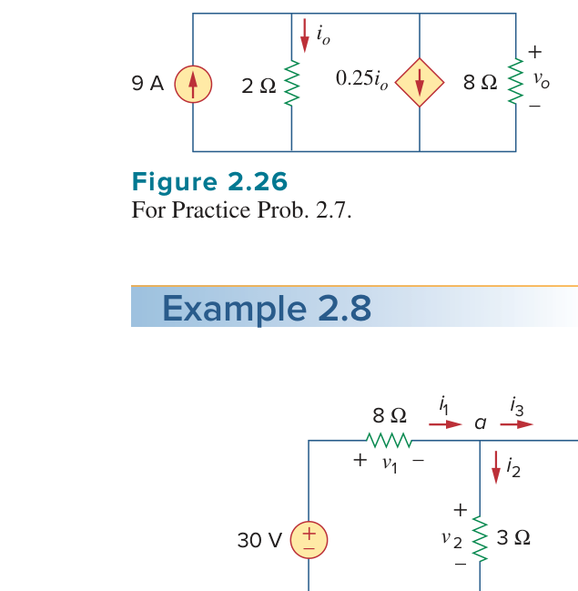

<template #solution>

圖中的各支路都跨接在同一對節點，因此 2-$\Omega$ 與 8-$\Omega$ 電阻的端電壓相同。依圖示參考方向，

$$
v_o=2i_o.
$$

在上方節點套用 KCL。9 A 電流源注入節點，而離開節點的電流包括 $i_o$、受控電流源的 $0.25i_o$，以及 8-$\Omega$ 電阻中的電流：

$$
9=i_o+0.25i_o+\frac{v_o}{8}.
$$

代入 $v_o=2i_o$，得

$$
9=i_o+\frac14i_o+\frac{2i_o}{8}
=\frac32i_o,
$$

所以

$$
i_o=6\ \mathrm{A},
\qquad
v_o=2(6)=12\ \mathrm{V}.
$$

其他支路量為

$$
i_{0.25i_o}=0.25(6)=1.5\ \mathrm{A},
\qquad
i_{8\Omega}=\frac{v_o}{8}=1.5\ \mathrm{A}.
$$

驗算：離開上方節點的電流為 $6+1.5+1.5=9\ \mathrm{A}$，與 9 A 電流源注入的電流相等。

**課本答案：** $i_o=6\ \mathrm{A}$，$v_o=12\ \mathrm{V}$。

</template>

</PracticeCard>

<PracticeCard id="ch2-pr8" type="practice" title="練習題 2.8：含兩個電壓源的電阻電路" source="課本 p.49" topic="KCL、KVL 與歐姆定律">

求圖 2.28 電路中的所有電流與電壓。

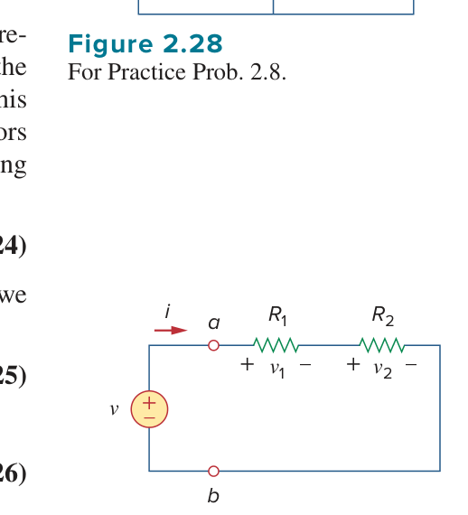

<template #solution>

令中間上方節點電壓為 $v_a$，下方導線為參考節點。依圖示極性，左側節點為 $10\ \mathrm{V}$，右側 6-V 電壓源的上端為 $-6\ \mathrm{V}$。由歐姆定律與圖示極性，

$$
i_1=\frac{10-v_a}{2},
\qquad
i_2=\frac{v_a}{8},
\qquad
i_3=\frac{v_a-(-6)}{4}.
$$

在節點 $a$ 套用 KCL：

$$
\frac{10-v_a}{2}=\frac{v_a}{8}+\frac{v_a+6}{4}.
$$

乘以 8 並整理：

$$
4(10-v_a)=v_a+2(v_a+6)
\quad\Longrightarrow\quad
v_a=4\ \mathrm{V}.
$$

因此

$$
\begin{aligned}
v_1&=10-v_a=6\ \mathrm{V},
&i_1&=\frac{v_1}{2}=3\ \mathrm{A},\\
v_2&=v_a=4\ \mathrm{V},
&i_2&=\frac{v_2}{8}=0.5\ \mathrm{A}=500\ \mathrm{mA},\\
v_3&=v_a+6=10\ \mathrm{V},
&i_3&=\frac{v_3}{4}=2.5\ \mathrm{A}.
\end{aligned}
$$

驗算節點電流：

$$
i_1-i_2-i_3=3-0.5-2.5=0.
$$

**課本答案：** $v_1=6\ \mathrm{V}$、$v_2=4\ \mathrm{V}$、$v_3=10\ \mathrm{V}$、$i_1=3\ \mathrm{A}$、$i_2=500\ \mathrm{mA}$、$i_3=2.5\ \mathrm{A}$。

</template>

</PracticeCard>

<PracticeCard id="ch2-pr9" type="practice" title="練習題 2.9：串並聯等效電阻" source="課本 p.53" topic="串聯與並聯電阻化簡">

將圖 2.36 中的電阻組合化簡，求端點所見的等效電阻 $R_{\mathrm{eq}}$。

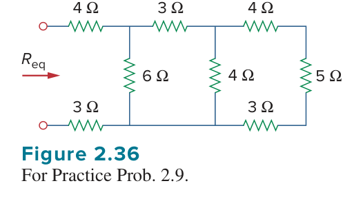

<template #solution>

先由最右側的串聯支路開始。右側支路的 4-$\Omega$、5-$\Omega$ 與 3-$\Omega$ 電阻串聯，因此

$$
R_{\mathrm{right}}=4+5+3=12\ \Omega.
$$

它與中間的 4-$\Omega$ 電阻並聯：

$$
R_{m}=4\parallel12
=\frac{4\times12}{4+12}
=3\ \Omega.
$$

再與上方的 3-$\Omega$ 電阻串聯，得到

$$
R_{b}=3+R_{m}=3+3=6\ \Omega.
$$

這個 6-$\Omega$ 支路與中央的 6-$\Omega$ 電阻並聯，所以內部網路等效為

$$
R_{i}=6\parallel6=3\ \Omega.
$$

最後再加上端點左側的 4-$\Omega$ 與 3-$\Omega$ 串聯電阻：

$$
R_{\mathrm{eq}}=4+R_{\text{i}}+3
=4+3+3
=10\ \Omega.
$$

**課本答案：** $R_{\mathrm{eq}}=10\ \Omega$。

</template>

</PracticeCard>

<PracticeCard id="ch2-pr10" type="practice" title="練習題 2.10：橋式電阻網路的等效電阻" source="課本 p.54" topic="串並聯電阻化簡">

求圖 2.39 端點 $a$-$b$ 所見的等效電阻 $R_{ab}$。

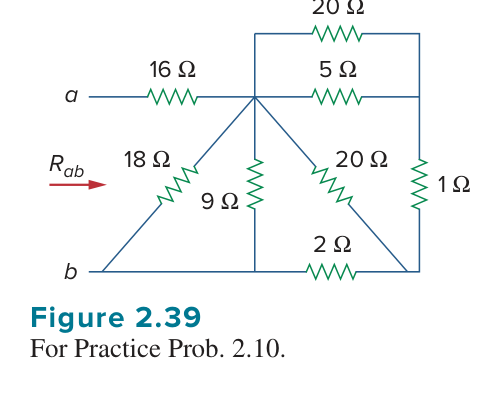

<template #solution>

先化簡右上方的並聯電阻：

$$
20\parallel5=\frac{20\times5}{20+5}=4\ \Omega.
$$

此結果與 1-$\Omega$ 電阻串聯，再與斜向的 20-$\Omega$ 電阻並聯：

$$
\begin{aligned}
R_1&=4+1=5\ \Omega,\\
R_2&=5\parallel20
=\frac{5\times20}{5+20}=4\ \Omega,\\
R_3&=R_2+2=4+2=6\ \Omega.
\end{aligned}
$$

另一條由中心節點連到 $b$ 的支路為 18-$\Omega$ 與 9-$\Omega$ 並聯：

$$
18\parallel9=\frac{18\times9}{18+9}=6\ \Omega.
$$

因此中心節點到 $b$ 的等效電阻為

$$
R_{\text{center}}=6\parallel6=3\ \Omega.
$$

最後與 $a$ 端的 16-$\Omega$ 電阻串聯：

$$
R_{ab}=16+3=19\ \Omega.
$$

**課本答案：** $R_{ab}=19\ \Omega$。

</template>

</PracticeCard>

<PracticeCard id="ch2-pr11" type="practice" title="練習題 2.11：等效電導" source="課本 p.55" topic="電導的串並聯化簡">

求圖 2.41 電路的等效電導 $G_{\mathrm{eq}}$。

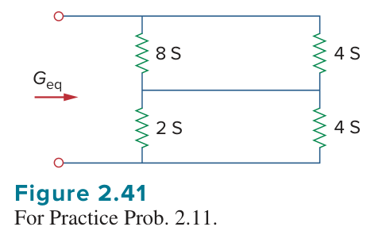

<template #solution>

先將兩組並聯電導相加：

$$
G_1=8+4=12\ \mathrm{S},
\qquad
G_2=2+4=6\ \mathrm{S}.
$$

兩組等效電導彼此串聯。串聯時應對電阻相加，換成電導表示為

$$
\frac{1}{G_{\mathrm{eq}}}
=\frac{1}{G_1}+\frac{1}{G_2}
=\frac{1}{12}+\frac{1}{6}
=\frac14.
$$

所以

$$
G_{\mathrm{eq}}=4\ \mathrm{S}.
$$

**課本答案：** $G_{\mathrm{eq}}=4\ \mathrm{S}$。

</template>

</PracticeCard>

<PracticeCard id="ch2-pr12" type="practice" title="練習題 2.12：並聯電阻與功率計算" source="課本 p.56" topic="並聯電阻、電流分配與功率">

求圖 2.43 中的 $v_1$、$v_2$、$i_1$ 與 $i_2$，並計算 12-$\Omega$ 與 40-$\Omega$ 電阻所消耗的功率。

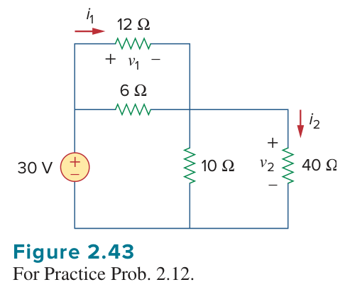

<template #solution>

圖中左側的 12-$\Omega$ 與 6-$\Omega$ 電阻並聯，右側的 10-$\Omega$ 與 40-$\Omega$ 電阻並聯。先求兩個並聯組合：

$$
R_L=12\parallel6
=\frac{12\times6}{12+6}=4\ \Omega,
$$

$$
R_R=10\parallel40
=\frac{10\times40}{10+40}=8\ \Omega.
$$

兩個等效電阻串聯，因此總電阻與總電流為

$$
R_{\mathrm{eq}}=R_L+R_R=4+8=12\ \Omega,
\qquad
I=\frac{30}{12}=2.5\ \mathrm{A}.
$$

左側並聯組合的端電壓為

$$
v_1=I R_L=2.5(4)=10\ \mathrm{V}.
$$

右側並聯組合的端電壓為

$$
v_2=I R_R=2.5(8)=20\ \mathrm{V}.
$$

由歐姆定律求指定支路電流：

$$
i_1=\frac{v_1}{12}=\frac{10}{12}=0.8333\ \mathrm{A}=833.3\ \mathrm{mA},
$$

$$
i_2=\frac{v_2}{40}=\frac{20}{40}=0.5\ \mathrm{A}=500\ \mathrm{mA}.
$$

兩個指定電阻的功率為

$$
p_1=v_1i_1=10\left(\frac{10}{12}\right)=8.333\ \mathrm{W},
$$

$$
p_2=v_2i_2=20(0.5)=10\ \mathrm{W}.
$$

驗算左側總電流：

$$
\frac{10}{12}+\frac{10}{6}=2.5\ \mathrm{A},
$$

右側總電流亦為

$$
\frac{20}{10}+\frac{20}{40}=2.5\ \mathrm{A}.
$$

**課本答案：** $v_1=10\ \mathrm{V}$、$i_1=833.3\ \mathrm{mA}$、$p_1=8.333\ \mathrm{W}$、$v_2=20\ \mathrm{V}$、$i_2=500\ \mathrm{mA}$、$p_2=10\ \mathrm{W}$。

</template>

</PracticeCard>

<PracticeCard id="ch2-pr13" type="practice" title="Practice Problem 2.13：並聯網路的電壓與功率" source="課本 p.57" topic="串並聯化簡與功率">

在圖 2.45 的電路中，$30\text{ mA}$ 電流源與三條並聯支路相接：左支路為 $3\text{ k}\Omega$ 與 $1\text{ k}\Omega$ 串聯，中支路為 $5\text{ k}\Omega$，右支路為 $20\text{ k}\Omega$。電壓 $v_1$ 標示在 $3\text{ k}\Omega$ 電阻兩端，$v_2$ 標示在 $20\text{ k}\Omega$ 電阻兩端。求：

1. $v_1$ 與 $v_2$。
2. $3\text{ k}\Omega$ 與 $20\text{ k}\Omega$ 電阻所消耗的功率。
3. 電流源所提供的功率。

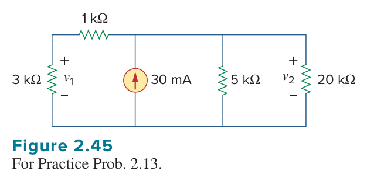

<template #solution>

#### 逐步解析

左支路的串聯等效電阻為

$$
R_L=3\text{ k}\Omega+1\text{ k}\Omega=4\text{ k}\Omega。
$$

三條支路皆跨接在電流源兩端，因此其端電壓相同。先以總電導求端電壓：

$$
G_{\text{eq}}=\frac{1}{4\text{ k}\Omega}+\frac{1}{5\text{ k}\Omega}+\frac{1}{20\text{ k}\Omega}
=0.5\text{ mS},
$$

$$
V=\frac{I_s}{G_{\text{eq}}}
=\frac{30\text{ mA}}{0.5\text{ mS}}
=60\text{ V}。
$$

左支路電流為

$$
I_L=\frac{60\text{ V}}{4\text{ k}\Omega}=15\text{ mA}。
$$

因此，$3\text{ k}\Omega$ 電阻上的電壓為

$$
v_1=I_L(3\text{ k}\Omega)=(15\text{ mA})(3\text{ k}\Omega)=45\text{ V}，
$$

而右側 $20\text{ k}\Omega$ 電阻直接跨接於並聯端點，所以

$$
v_2=60\text{ V}。
$$

$3\text{ k}\Omega$ 電阻的功率為

$$
P_{3\text{ k}\Omega}=I_L^2R=(15\text{ mA})^2(3\text{ k}\Omega)=675\text{ mW}。
$$

$20\text{ k}\Omega$ 電阻的電流為

$$
I_{20\text{ k}\Omega}=\frac{60\text{ V}}{20\text{ k}\Omega}=3\text{ mA},
$$

故其功率為

$$
P_{20\text{ k}\Omega}=v_2I_{20\text{ k}\Omega}=(60\text{ V})(3\text{ mA})=180\text{ mW}。
$$

電流源提供的功率為

$$
P_s=VI_s=(60\text{ V})(30\text{ mA})=1.8\text{ W}。
$$

功率對帳：其餘電阻的功率為 $1.8\text{ W}-0.675\text{ W}-0.180\text{ W}=0.945\text{ W}$，所以總吸收功率與電流源提供的 $1.8\text{ W}$ 相符。

::: tip 標準答案

$$v_1=45\text{ V},\quad v_2=60\text{ V},\quad P_{3\text{ k}\Omega}=675\text{ mW},\quad P_{20\text{ k}\Omega}=180\text{ mW},\quad P_s=1.8\text{ W}$$

:::

</template>
</PracticeCard>

<PracticeCard id="ch2-ex16" type="example" title="Example 2.16：三顆燈泡的電流與等效電阻" source="課本 p.64" topic="照明系統與功率">

三顆燈泡接在 $9\text{ V}$ 電池上：一顆額定功率為 $20\text{ W}$ 的燈泡單獨形成一條支路，另兩顆額定功率分別為 $15\text{ W}$ 與 $10\text{ W}$ 的燈泡串聯形成另一條支路。將每顆燈泡視為電阻，求：

1. 電池提供的總電流。
2. 流過每顆燈泡的電流。
3. 每顆燈泡的等效電阻。

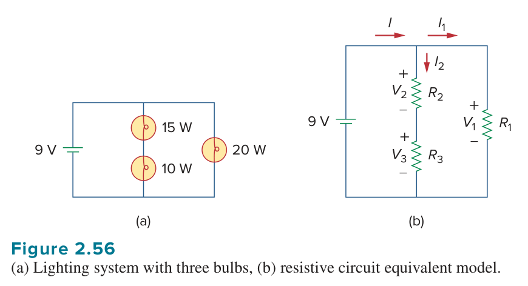

<template #solution>

#### 逐步解析

三顆燈泡吸收的總功率為

$$
P=15\text{ W}+10\text{ W}+20\text{ W}=45\text{ W}。
$$

由 $P=VI$，電池提供的總電流為

$$
I=\frac{P}{V}=\frac{45\text{ W}}{9\text{ V}}=5\text{ A}。
$$

令 $R_1$ 表示 $20\text{ W}$ 燈泡，$R_2$ 表示 $15\text{ W}$ 燈泡，$R_3$ 表示 $10\text{ W}$ 燈泡。$R_1$ 與電池並聯，也與 $R_2$、$R_3$ 的串聯組合並聯，因此

$$
V_1=V_2+V_3=9\text{ V}。
$$

$R_1$ 中的電流為

$$
I_1=\frac{P_1}{V_1}=\frac{20\text{ W}}{9\text{ V}}=2.222\text{ A}。
$$

由 KCL，流過串聯組合 $R_2$、$R_3$ 的電流為

$$
I_2=I-I_1=5-2.222=2.778\text{ A}。
$$

由於 $R_2$ 與 $R_3$ 串聯，兩者電流相同，故 $I_3=I_2=2.778\text{ A}$。使用 $P=I^2R$ 計算各燈泡電阻：

$$
R_1=\frac{P_1}{I_1^2}=\frac{20}{(2.222)^2}=4.05\ \Omega,
$$

$$
R_2=\frac{P_2}{I_2^2}=\frac{15}{(2.778)^2}=1.945\ \Omega,
$$

$$
R_3=\frac{P_3}{I_3^2}=\frac{10}{(2.778)^2}=1.297\ \Omega。
$$

::: tip 標準答案

$$I=5\text{ A},\quad I_1=2.222\text{ A},\quad I_2=I_3=2.778\text{ A}$$

$$R_1=4.05\ \Omega,\quad R_2=1.945\ \Omega,\quad R_3=1.297\ \Omega$$

:::

</template>
</PracticeCard>

<PracticeCard id="ch2-pr16" type="practice" title="Practice Problem 2.16：串聯與並聯燈泡的電流" source="課本 p.65" topic="照明系統與串並聯">

有兩組燈泡：一組有 $10$ 顆相同燈泡並聯，另一組有 $10$ 顆相同燈泡串聯。兩種接法中，每顆燈泡皆須在額定功率 $40\text{ W}$ 下運作；並聯接法與串聯接法的電源電壓皆為 $120\text{ V}$。求兩種接法中每顆燈泡的電流。

<template #solution>

#### 逐步解析

**並聯接法：** 每顆燈泡直接跨接於 $120\text{ V}$ 電源，因此每顆燈泡的電流為

$$
I_{\parallel}=\frac{P}{V}=\frac{40\text{ W}}{120\text{ V}}=0.333\text{ A}=333\text{ mA}。
$$

**串聯接法：** $10$ 顆相同燈泡分攤 $120\text{ V}$，所以每顆燈泡的電壓為

$$
V_{\text{lamp}}=\frac{120\text{ V}}{10}=12\text{ V}。
$$

串聯支路的電流相同，因此每顆燈泡的電流為

$$
I_{\text{series}}=\frac{P}{V_{\text{lamp}}}=\frac{40\text{ W}}{12\text{ V}}=3.33\text{ A}。
$$

::: tip 標準答案

$$I_{\parallel}=333\text{ mA},\quad I_{\text{series}}=3.33\text{ A}$$

:::

</template>
</PracticeCard>

<PracticeCard id="ch2-ex17" type="example" title="Example 2.17：多量程直流電壓表設計" source="課本 p.68" topic="直流電表設計">

設計一個多量程直流電壓表，量程為：

1. $0$–$1\text{ V}$。
2. $0$–$5\text{ V}$。
3. $0$–$50\text{ V}$。
4. $0$–$100\text{ V}$。

電表內部電阻為 $R_m=2\text{ k}\Omega$，滿刻度電流為 $I_{fs}=100\ \mu\text{A}$。求各量程所需的串聯倍增電阻 $R_1$、$R_2$、$R_3$、$R_4$。

<template #solution>

#### 逐步解析

電壓表的倍增電阻與內部電阻串聯。滿刻度時，整體電阻兩端的電壓為 $V_{fs}$，所以

$$
V_{fs}=I_{fs}(R_n+R_m),
$$

整理得

$$
R_n=\frac{V_{fs}}{I_{fs}}-R_m。
$$

代入 $R_m=2\text{ k}\Omega$ 與 $I_{fs}=100\ \mu\text{A}$：

$$
R_1=\frac{1\text{ V}}{100\ \mu\text{A}}-2\text{ k}\Omega
=10\text{ k}\Omega-2\text{ k}\Omega=8\text{ k}\Omega,
$$

$$
R_2=\frac{5\text{ V}}{100\ \mu\text{A}}-2\text{ k}\Omega
=50\text{ k}\Omega-2\text{ k}\Omega=48\text{ k}\Omega,
$$

$$
R_3=\frac{50\text{ V}}{100\ \mu\text{A}}-2\text{ k}\Omega
=500\text{ k}\Omega-2\text{ k}\Omega=498\text{ k}\Omega,
$$

$$
R_4=\frac{100\text{ V}}{100\ \mu\text{A}}-2\text{ k}\Omega
=1000\text{ k}\Omega-2\text{ k}\Omega=998\text{ k}\Omega。
$$

::: tip 標準答案

$$R_1=8\text{ k}\Omega,\quad R_2=48\text{ k}\Omega,\quad R_3=498\text{ k}\Omega,\quad R_4=998\text{ k}\Omega$$

:::

</template>
</PracticeCard>

<PracticeCard id="ch2-pr17" type="practice" title="Practice Problem 2.17：多量程直流電流表設計" source="課本 p.69" topic="直流電表設計">

設計一個多量程直流電流表，量程為 $0$–$1\text{ A}$、$0$–$100\text{ mA}$ 與 $0$–$10\text{ mA}$。電表機芯的滿刻度電流為 $I_m=1\text{ mA}$，內部電阻為 $R_m=50\ \Omega$。求各量程所需的並聯分流電阻。

<template #solution>

#### 逐步解析

在滿刻度時，總電流 $I_{fs}$ 分成流過電表機芯的 $I_m$ 與流過分流電阻的電流。由電流分配公式，分流電阻 $R_n$ 為

$$
R_n=\frac{I_m}{I_{fs}-I_m}R_m。
$$

**$0$–$1\text{ A}$ 量程：**

$$
R_1=\frac{1\text{ mA}}{1\text{ A}-1\text{ mA}}(50\ \Omega)
=0.05005\ \Omega\approx50\text{ m}\Omega。
$$

**$0$–$100\text{ mA}$ 量程：**

$$
R_2=\frac{1\text{ mA}}{100\text{ mA}-1\text{ mA}}(50\ \Omega)
=0.505\ \Omega=505\text{ m}\Omega。
$$

**$0$–$10\text{ mA}$ 量程：**

$$
R_3=\frac{1\text{ mA}}{10\text{ mA}-1\text{ mA}}(50\ \Omega)
=5.556\ \Omega。
$$

::: tip 標準答案

$$R_1\approx50\text{ m}\Omega,\quad R_2=505\text{ m}\Omega,\quad R_3=5.556\ \Omega$$

:::

</template>
</PracticeCard>

<PracticeCard id="ch2-hw-section" type="homework" title="第二章 課堂指定作業習題與重點解答提示" source="Homework 清單 · Slide P93-94" topic="課後作業清單">

課堂指定之課後作業題號清單，包含簡報所提供之解答提示（P22: $V_o = -11.905\text{ V}, P_{\text{dep}} = 566.9\text{ W}$；P38: $R_{eq} = 10\ \Omega, i_o = 3.5\text{ A}$）。

*Chapter 2 Textbook Homework Problems: #8, 11, 15, 22, 31, 38, 47, 55.*

- Prob #8
- Prob #11
- Prob #15
- Prob #22 
- Prob #31
- Prob #38 
- Prob #47
- Prob #55

> **求解目標：課本課後習題自主演練**

<template #solution>

#### 逐步解析：

- **Prob #22 簡報提示**：$V_o = -11.905\text{ V},\quad P_{\text{dependent source}} = 566.9\text{ W}$

- **Prob #38 簡報提示**：$R_{eq} = 10\ \Omega,\quad i_o = 3.5\text{ A}$

- 其餘指定題號（#8, #11, #15, #31, #47, #55）請參考課本對應習題，循序應用歐姆定律、KCL、KVL 與串並聯公式練習。

::: tip 標準答案
$$\text{指定題號：\#8, \#11, \#15, \#22, \#31, \#38, \#47, \#55}$$
:::

</template>
</PracticeCard>
