# Chapter 3 分析方法：例題與練習題

本頁面彙整 Alexander & Sadiku《Fundamentals of Electric Circuits》第 3 章之核心 Example 與 Practice Problem。點擊「查看詳解」可展開分步推導與計算結果；完成題目後可勾選標記學習進度。

<PracticeProgress :total="26" prefix="ch3-" />

<PracticeCard id="ch3-ex1" title="例題 3.1：兩節點電壓法" source="課本 p.88" topic="節點分析">

求圖 3.3(a) 電路的節點電壓 $v_1$ 與 $v_2$。

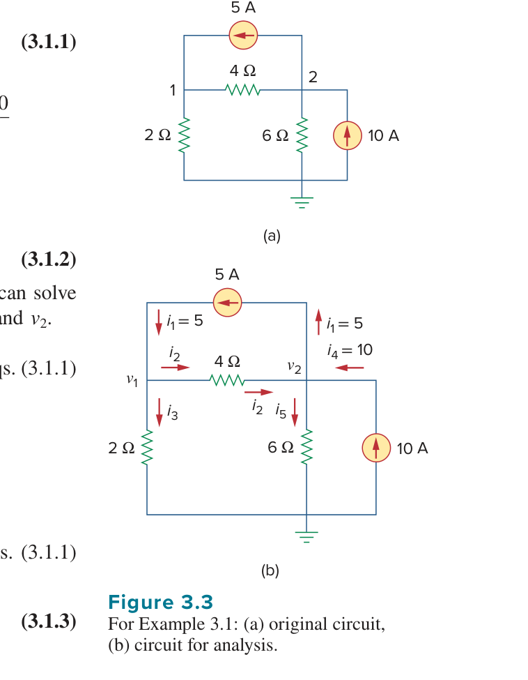

<template #solution>

以底部導線為參考節點。由節點 1 的 KCL：

$$
5=\frac{v_1-v_2}{4}+\frac{v_1}{2}
\quad\Longrightarrow\quad
3v_1-v_2=20.
$$

由節點 2 的 KCL：

$$
\frac{v_1-v_2}{4}+10=5+\frac{v_2}{6}
\quad\Longrightarrow\quad
-3v_1+5v_2=60.
$$

兩式相加得 $4v_2=80$，故 $v_2=20\ \mathrm{V}$；代回第一式得

$$
v_1=\frac{40}{3}\ \mathrm{V}=13.333\ \mathrm{V}.
$$

驗算：代回兩個 KCL 式皆成立；例如 $i_2=(v_1-v_2)/4=-1.6668\ \mathrm{A}$，負號表示實際方向與假設相反。

</template>

</PracticeCard>

<PracticeCard id="ch3-pr1" title="練習題 3.1：兩節點電壓" source="課本 p.89" topic="節點分析">

求圖 3.4 電路的節點電壓 $v_1$ 與 $v_2$。

<template #solution>

以圖中的參考節點為 $0\ \mathrm{V}$，依電流源箭頭方向在兩個非參考節點分別套用 KCL，並以歐姆定律將每個電阻支路電流改寫為節點電壓差除以電阻；解該二元聯立式。

**課本答案：**

$$
v_1=-6\ \mathrm{V},\qquad v_2=-42\ \mathrm{V}.
$$

驗算時，以這兩個節點電壓重算各電阻電流，代回兩個節點的 KCL；電流源方向須以圖 3.4 的箭頭為準。

</template>

</PracticeCard>

<PracticeCard id="ch3-ex2" title="例題 3.2：三節點與受控電流源" source="課本 p.90" topic="節點分析">

求圖 3.5(a) 三個非參考節點的電壓 $v_1$、$v_2$、$v_3$。

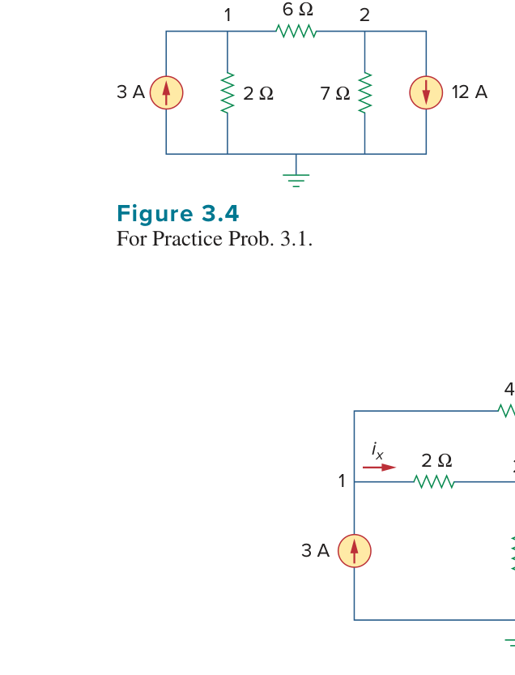

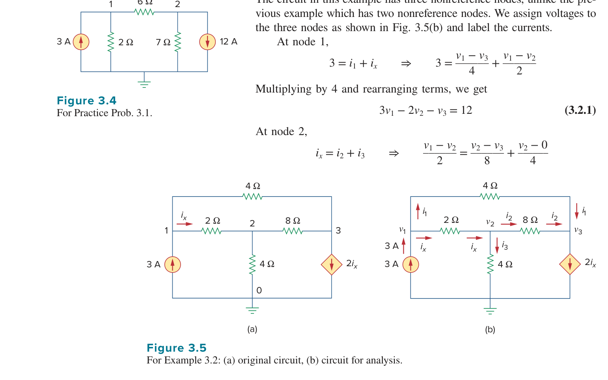

<template #solution>

由圖中的 $i_x=(v_1-v_2)/2$，在三個節點套用 KCL，得到

$$
\begin{aligned}
3v_1-2v_2-v_3&=12,\\
-4v_1+7v_2-v_3&=0,\\
2v_1-3v_2+v_3&=0.
\end{aligned}
$$

第一式加第三式，及第二式加第三式，分別給出

$$
v_1-v_2=2.4,\qquad v_1=2v_2.
$$

因此 $v_2=2.4\ \mathrm{V}$、$v_1=4.8\ \mathrm{V}$；再代入第三式，$v_3=-2.4\ \mathrm{V}$。三個結果代回上列 KCL 方程式，殘差皆為零。

</template>

</PracticeCard>

<PracticeCard id="ch3-pr2" title="練習題 3.2：受控源節點分析" source="課本 p.92" topic="節點分析">

求圖 3.6 三個非參考節點的電壓 $v_1$、$v_2$、$v_3$。

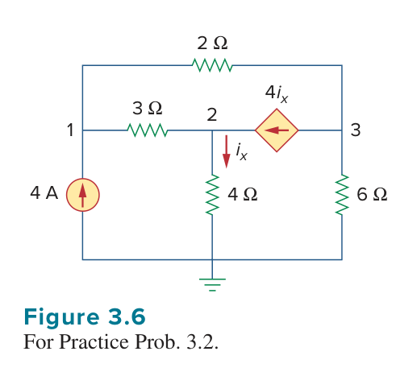

<template #solution>

先依圖示電阻與 $i_x$ 的定義，以節點電壓表示各支路電流；再於節點 1、2、3 套用 KCL，受控電流源的值須保持為圖示的 $4i_x$，最後解三元聯立方程式。

**課本答案：**

$$
v_1=32\ \mathrm{V},\qquad v_2=-25.6\ \mathrm{V},\qquad v_3=62.4\ \mathrm{V}.
$$

驗算時將結果代回每一節點的 KCL，並特別核對 $i_x$ 的參考方向與受控源 $4i_x$ 的箭頭方向。

</template>

</PracticeCard>

<PracticeCard id="ch3-ex3" title="例題 3.3：超節點" source="課本 p.94" topic="含電壓源的節點分析">

求圖 3.9 電路的節點電壓。

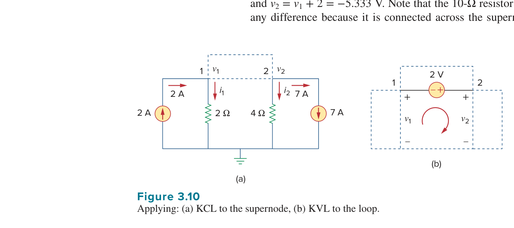

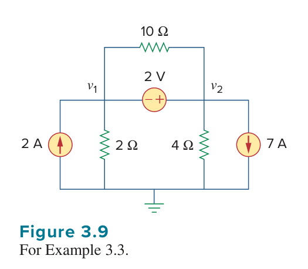

<template #solution>

將 2-V 電壓源兩端的節點 1、2 與其並聯元件視為超節點。對超節點寫 KCL：

$$
2=\frac{v_1}{2}+\frac{v_2}{4}+7
\quad\Longrightarrow\quad
v_2=-20-2v_1.
$$

穿過 2-V 電壓源寫 KVL，依圖的極性有

$$
-v_1-2+v_2=0
\quad\Longrightarrow\quad
v_2=v_1+2.
$$

聯立後得到

$$
v_1=-7.333\ \mathrm{V},\qquad v_2=-5.333\ \mathrm{V}.
$$

回代兩個方程式可得零殘差。跨接超節點的 $10\ \Omega$ 電阻不會出現在超節點的外部 KCL 方程式中。

</template>

</PracticeCard>

<PracticeCard id="ch3-pr3" title="練習題 3.3：含電壓源的節點分析" source="課本 p.94" topic="超節點">

求圖 3.11 電路的 $v$ 與 $i$。

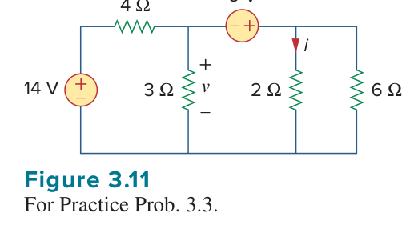

<template #solution>

以圖中電壓源連接的兩個非參考節點建立超節點：先對超節點邊界套用 KCL，再依兩個獨立電壓源的極性列出電壓拘束式；聯立後以題圖的 $v$ 正負標示及 $i$ 箭頭取值。

**課本答案：**

$$
v=-400\ \mathrm{mV},\qquad i=2.8\ \mathrm{A}.
$$

驗算時，代回超節點 KCL 與所有電壓源拘束式；$v$ 的負號表示實際極性與圖中指定極性相反。

</template>

</PracticeCard>

<PracticeCard id="ch3-ex4" title="例題 3.4：雙超節點與受控電壓源" source="課本 p.95" topic="超節點">

求圖 3.12 電路的節點電壓。

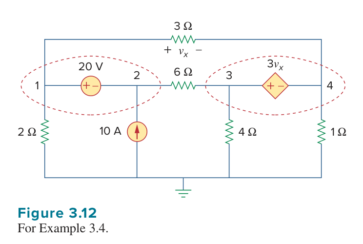

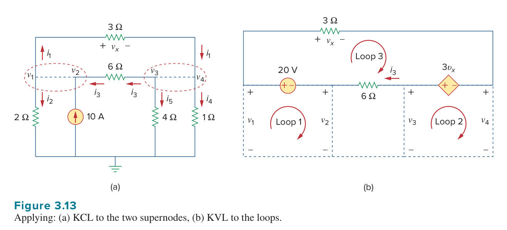

<template #solution>

節點 1–2 與節點 3–4 各形成一個超節點。由兩個超節點的 KCL 得

$$
\begin{aligned}
5v_1+v_2-v_3-2v_4&=60,\\
4v_1+2v_2-5v_3-16v_4&=0.
\end{aligned}
$$

再由電壓源支路的 KVL，取四個獨立方程中的另外兩式：

$$
v_1-v_2=20,\qquad 3v_1-v_3-2v_4=0.
$$

令 $v_2=v_1-20$ 後解聯立式，得到

$$
v_1=26.67\ \mathrm{V},\quad v_2=6.667\ \mathrm{V},\quad
v_3=173.33\ \mathrm{V},\quad v_4=-46.67\ \mathrm{V}.
$$

將結果代入未用的 KVL 式 $-2v_1-v_2+v_3+2v_4=20$，左右同為 $20\ \mathrm{V}$，完成回代驗算。

</template>

</PracticeCard>

<PracticeCard id="ch3-pr4" title="練習題 3.4：含受控電壓源的節點分析" source="課本 p.97" topic="節點分析">

使用節點分析，求圖 3.14 電路的 $v_1$、$v_2$、$v_3$。

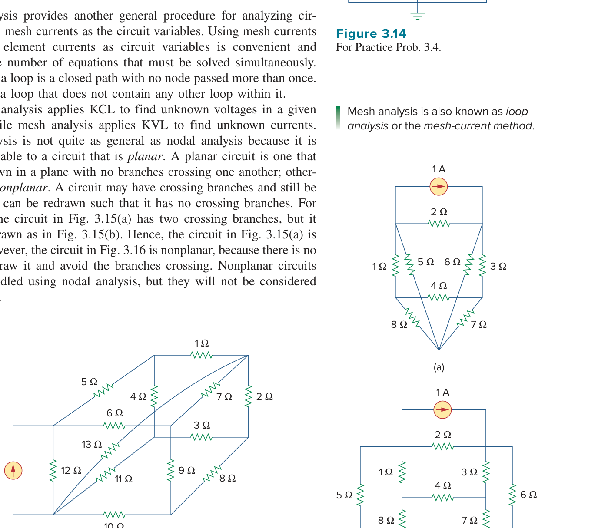

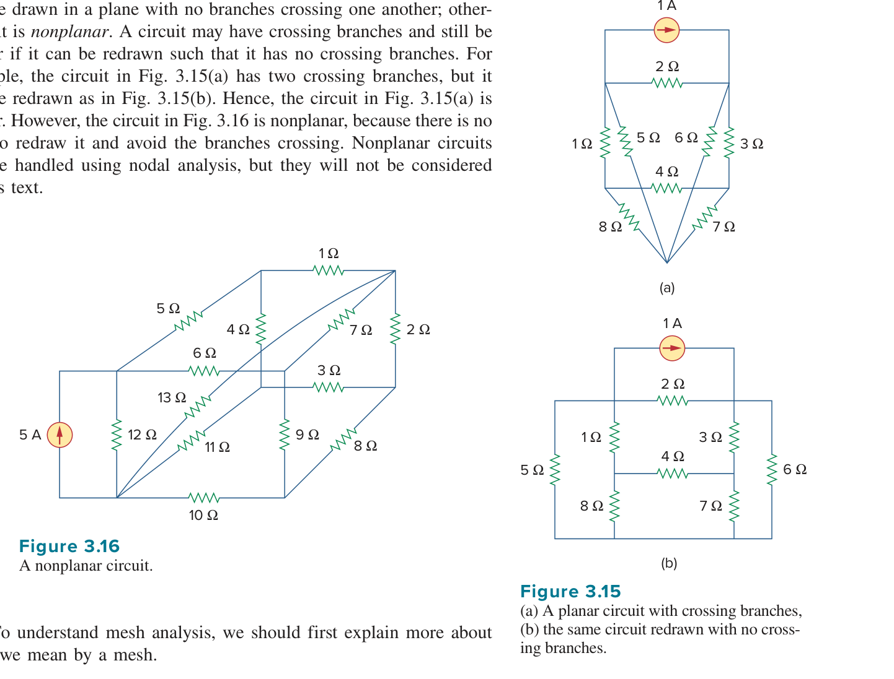

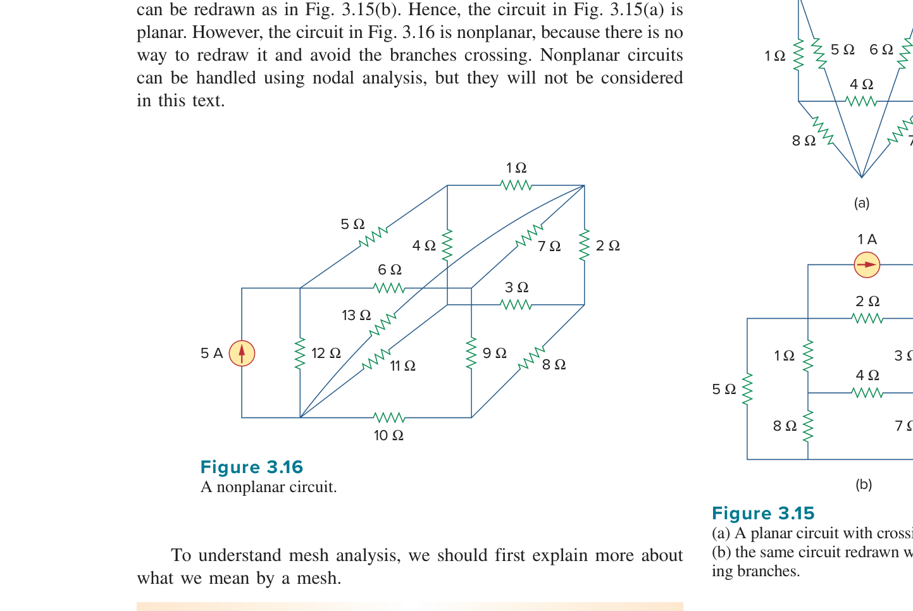

<template #solution>

依圖 3.14 的 $i$ 參考方向表示受控電壓源 $5i$；對各非參考節點（或必要的超節點）寫 KCL，並將 $25\ \mathrm{V}$ 電壓源與 $5i$ 的極性各自列為電壓拘束式後解聯立方程式。

**課本答案：**

$$
v_1=7.608\ \mathrm{V},\qquad v_2=-17.39\ \mathrm{V},\qquad v_3=1.6305\ \mathrm{V}.
$$

驗算時須以圖 3.14 的電流箭頭重新計算 $i$，並確認受控源的值與極性皆為 $5i$；圖 3.15、3.16 為本段關於平面與非平面電路的隨附圖。

</template>

</PracticeCard>

<PracticeCard id="ch3-ex5" title="例題 3.5：網孔分析求支路電流" source="課本 p.99" topic="網孔分析">

使用網孔分析，求圖 3.18 的支路電流 $I_1$、$I_2$、$I_3$。

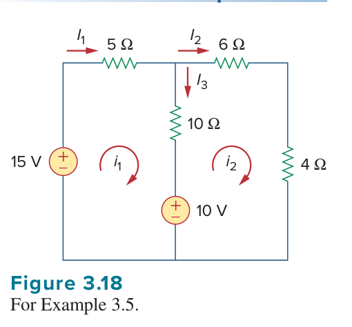

<template #solution>

令兩個網孔電流皆為順時針 $i_1$、$i_2$。套用 KVL 後得到

$$
3i_1-2i_2=1,
\qquad
i_1=2i_2-1.
$$

代入解得

$$
i_2=1\ \mathrm{A},\qquad i_1=1\ \mathrm{A}.
$$

由支路與網孔電流的關係

$$
I_1=i_1,\qquad I_2=i_2,\qquad I_3=i_1-i_2,
$$

故

$$
I_1=1\ \mathrm{A},\qquad I_2=1\ \mathrm{A},\qquad I_3=0\ \mathrm{A}.
$$

回代兩個 KVL 方程式分別為 $3(1)-2(1)=1$ 與 $1=2(1)-1$，均成立。

</template>

</PracticeCard>

<PracticeCard id="ch3-pr5" title="Practice Problem 3.5：兩網孔電流" source="課本 p.100" topic="網孔分析">

求圖 3.19 電路的網孔電流 $i_1$ 與 $i_2$。

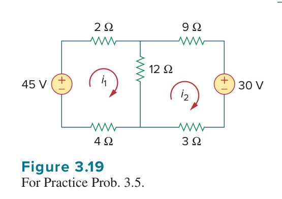

<template #solution>

依圖示的順時針網孔方向，先為兩個網孔各寫一條 KVL 方程；共用的 $4\,\Omega$ 支路電流須以兩網孔電流之差表示。聯立兩式後，依原題的參考方向得到：

$$
i_1=2.5\ \mathrm{A},\qquad i_2=0\ \mathrm{A}.
$$

回代時，兩個網孔的電壓升與壓降代數和皆應為零。上述為課本答案。

</template>

</PracticeCard>

<PracticeCard id="ch3-ex6" title="Example 3.6：含受控源的網孔分析" source="課本 p.100" topic="網孔分析、受控源">

以網孔分析求圖 3.20 中的電流 $I_o$。

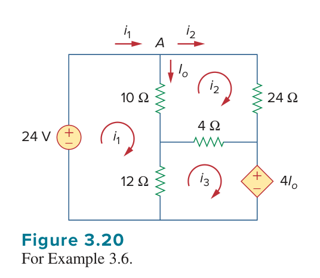

<template #solution>

三個網孔的 KVL 方程（同除以 $2$ 後）為：

$$
\begin{aligned}
11i_1-5i_2-6i_3&=12,\\
-5i_1+19i_2-2i_3&=0.
\end{aligned}
$$

節點 $A$ 的控制關係為 $I_o=i_1-i_2$；代入第三個網孔的 KVL，得

$$
-i_1-i_2+2i_3=0.
$$

解此聯立方程，課本得到

$$
i_1=2.25\ \mathrm{A},\quad i_2=0.75\ \mathrm{A},\quad i_3=1.5\ \mathrm{A}.
$$

故

$$
I_o=i_1-i_2=1.5\ \mathrm{A}.
$$

將此三個網孔電流代回上列三式，殘差皆為零。

</template>

</PracticeCard>

<PracticeCard id="ch3-pr6" title="Practice Problem 3.6：受控源網孔電流" source="課本 p.102" topic="網孔分析、受控源">

以網孔分析求圖 3.21 中的 $I_o$。

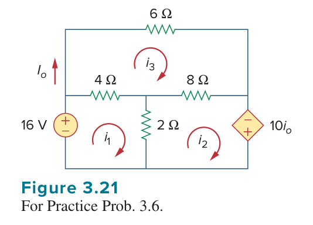

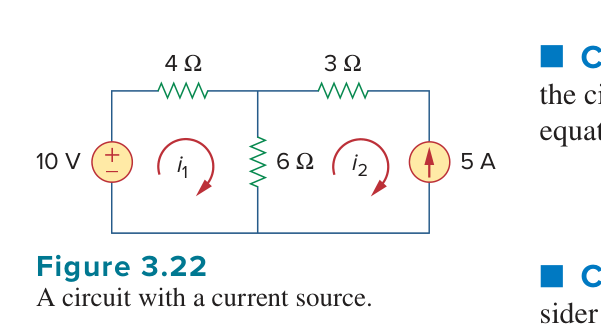

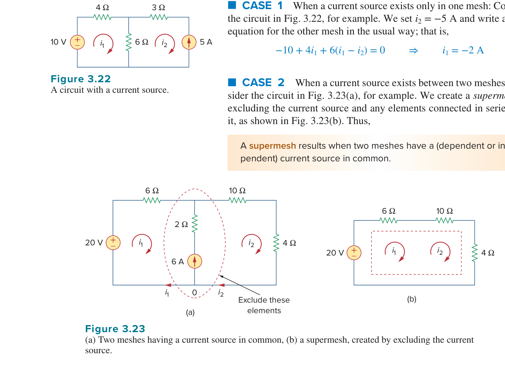

<template #solution>

依圖中兩個順時針網孔電流，分別寫出 KVL；中間 $2\,\Omega$ 電阻的支路電流要寫成兩網孔電流之差，並以圖示極性把受控電壓源 $10I_o$ 納入方程。再以 $I_o$ 的圖示參考方向建立控制關係並聯立求解。

課本答案為

$$
I_o=-4\ \mathrm{A}.
$$

負號表示實際電流方向與圖中 $I_o$ 的參考箭頭相反。

</template>

</PracticeCard>

<PracticeCard id="ch3-ex7" title="Example 3.7：交疊超網孔" source="課本 p.103" topic="超網孔分析">

利用網孔分析求圖 3.24 的 $i_1$ 至 $i_4$。

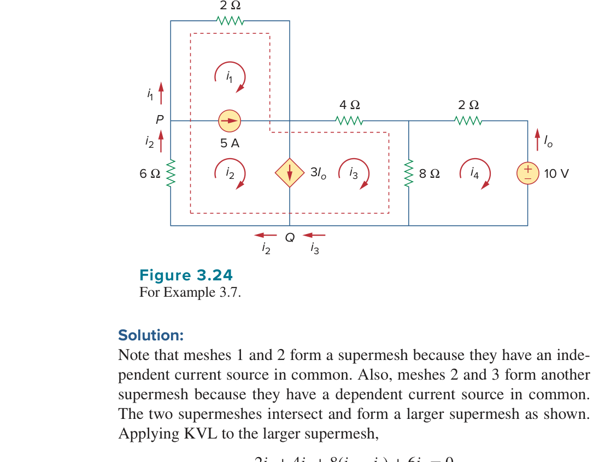

<template #solution>

網孔 1、2 與網孔 2、3 各有一個共用電流源；兩個超網孔相交，因此取其外圍形成較大的超網孔。KVL 與兩個電流源拘束式為

$$
\begin{aligned}
i_1+3i_2+6i_3-4i_4&=0,\\
i_2&=i_1+5,\\
i_2&=i_3-3i_4.
\end{aligned}
$$

又 $I_o=-i_4$，網孔 4 的 KVL 為

$$
5i_4-4i_3=-5.
$$

聯立後，課本結果為

$$
i_1=-7.5\ \mathrm{A},\quad i_2=-2.5\ \mathrm{A},\quad
i_3=3.93\ \mathrm{A},\quad i_4=2.143\ \mathrm{A}.
$$

代回兩個拘束式可分別得到 $-2.5=-7.5+5$ 與 $-2.5=3.93-3(2.143)$（四捨五入誤差除外）。

</template>

</PracticeCard>

<PracticeCard id="ch3-pr7" title="Practice Problem 3.7：網孔法求三個電流" source="課本 p.104" topic="網孔分析">

使用網孔分析求圖 3.25 的 $i_1$、$i_2$ 與 $i_3$。

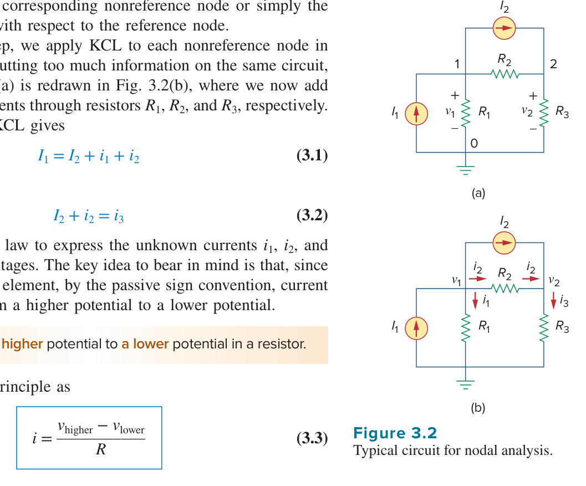

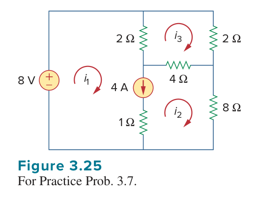

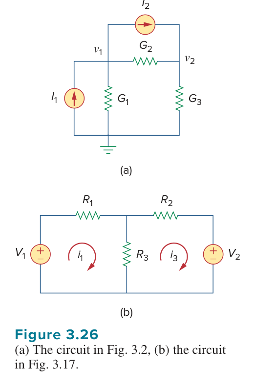

<template #solution>

依圖示三個順時針網孔設定 $i_1,i_2,i_3$。對各網孔寫 KVL；兩網孔共用的 $2\,\Omega$ 與 $4\,\Omega$ 支路，須用相鄰網孔電流之差表示。右側 $4\,\mathrm{A}$ 電流源提供相應的拘束式，將三式聯立即可求解。

課本答案為

$$
i_1=4.632\ \mathrm{A},\qquad
i_2=631.6\ \mathrm{mA},\qquad
i_3=1.4736\ \mathrm{A}.
$$

驗算時應以 $i_2=0.6316\ \mathrm{A}$ 代入各網孔 KVL，並確認電流源支路的拘束式成立。

</template>

</PracticeCard>

<PracticeCard id="ch3-ex8" title="Example 3.8：由檢視法建立節點電壓矩陣" source="課本 p.106" topic="節點分析、檢視法">

以檢視法寫出圖 3.27 的節點電壓矩陣方程。

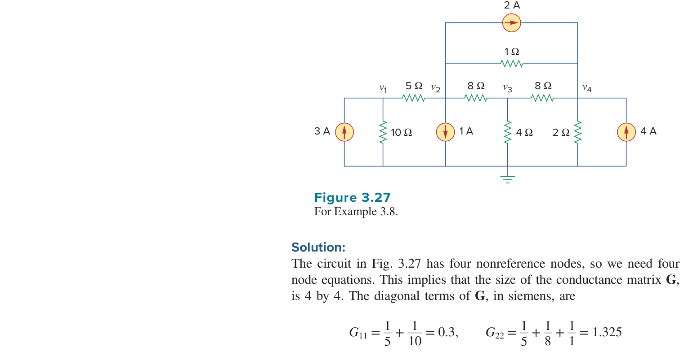

<template #solution>

四個非參考節點形成 $4\times4$ 導納矩陣。對角元素是接到該節點的導納和，非對角元素是兩節點間導納的負值；電流向節點流入取正。因此

$$
\begin{bmatrix}
0.3 & -0.2 & 0 & 0\\
-0.2 & 1.325 & -0.125 & -1\\
0 & -0.125 & 0.5 & -0.125\\
0 & -1 & -0.125 & 1.625
\end{bmatrix}
\begin{bmatrix}v_1\\v_2\\v_3\\v_4\end{bmatrix}
=
\begin{bmatrix}3\\-3\\0\\6\end{bmatrix}.
$$

例如 $G_{22}=1/5+1/8+1/1=1.325\ \mathrm{S}$，且 $i_2=-1-2=-3\ \mathrm{A}$；其餘項目以相同規則得到。這就是課本的矩陣方程。

</template>

</PracticeCard>

<PracticeCard id="ch3-pr8" title="Practice Problem 3.8：節點方程的檢視法" source="課本 p.107" topic="節點分析、檢視法">

以檢視法求出圖 3.28 的節點電壓方程。

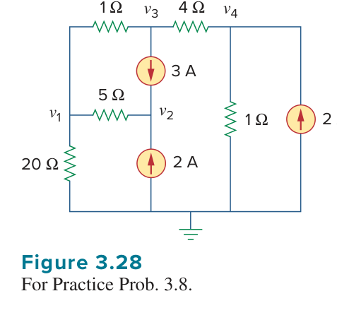

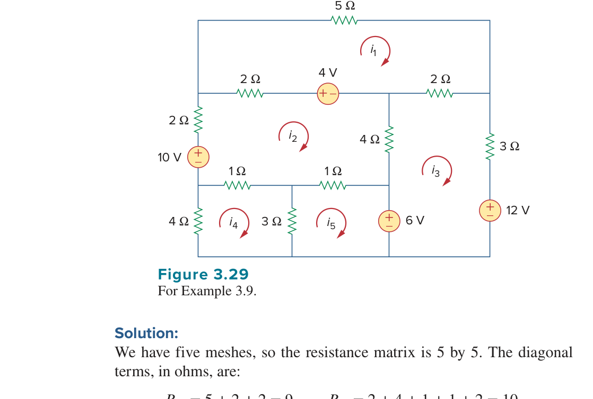

<template #solution>

各對角元素取該節點相連電阻的導納和，節點間的非對角元素取負導納；右側向量為流入節點的獨立電流源代數和。課本答案為

$$
\begin{bmatrix}
1.25 & -0.2 & -1 & 0\\
-0.2 & 0.2 & 0 & 0\\
-1 & 0 & 1.25 & -0.25\\
0 & 0 & -0.25 & 1.25
\end{bmatrix}
\begin{bmatrix}v_1\\v_2\\v_3\\v_4\end{bmatrix}
=
\begin{bmatrix}0\\5\\-3\\2\end{bmatrix}.
$$

例如 $G_{13}=-1\ \mathrm{S}$ 對應節點 1 與 3 間的 $1\,\Omega$ 電阻；逐項套用此規則即可驗證矩陣。

</template>

</PracticeCard>

<PracticeCard id="ch3-ex9" title="Example 3.9：由檢視法建立網孔電流矩陣" source="課本 p.107" topic="網孔分析、檢視法">

以檢視法寫出圖 3.29 的網孔電流方程。

<template #solution>

共有五個網孔。電阻矩陣對角元素為各網孔電阻和，非對角元素為兩網孔共用電阻的負值；右側向量為沿順時針方向取的電壓源代數和。故

$$
\begin{bmatrix}
9 & -2 & -2 & 0 & 0\\
-2 & 10 & -4 & -1 & -1\\
-2 & -4 & 9 & 0 & 0\\
0 & -1 & 0 & 8 & -3\\
0 & -1 & 0 & -3 & 4
\end{bmatrix}
\begin{bmatrix}i_1\\i_2\\i_3\\i_4\\i_5\end{bmatrix}
=
\begin{bmatrix}4\\6\\-6\\0\\-6\end{bmatrix}.
$$

例如 $R_{22}=2+4+1+1+2=10\,\Omega$，而 $v_2=10-4=6\ \mathrm{V}$。這是課本建立的網孔方程。

</template>

</PracticeCard>

<PracticeCard id="ch3-pr9" title="Practice Problem 3.9：網孔方程的檢視法" source="課本 p.108" topic="網孔分析、檢視法">

以檢視法求出圖 3.30 的網孔電流方程。

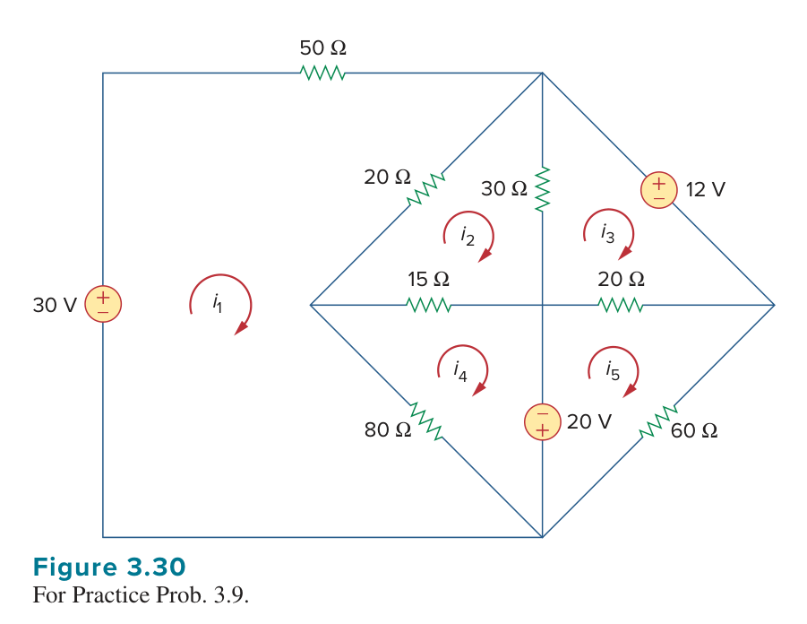

<template #solution>

以每個網孔電阻總和填入對角線、以共用電阻的負值填入非對角線，並按順時針方向計算各網孔的獨立電壓源代數和。課本答案為

$$
\begin{bmatrix}
150 & -20 & 0 & -80 & 0\\
-20 & 65 & -30 & -15 & 0\\
0 & -30 & 50 & 0 & -20\\
-80 & -15 & 0 & 95 & 0\\
0 & 0 & -20 & 0 & 80
\end{bmatrix}
\begin{bmatrix}i_1\\i_2\\i_3\\i_4\\i_5\end{bmatrix}
=
\begin{bmatrix}30\\0\\-12\\20\\-20\end{bmatrix}.
$$

例如 $R_{12}=-20\,\Omega$ 表示網孔 1、2 共用 $20\,\Omega$ 電阻，且第一列右側為 $30\ \mathrm{V}$。逐列核對電阻及電源極性即可驗證結果。

</template>

</PracticeCard>

<PracticeCard id="ch3-ex10" title="Example 3.10：以 PSpice 求節點電壓" source="課本 p.103–104" topic="PSpice 直流節點分析">

使用 PSpice 求圖 3.31 電路的節點電壓。

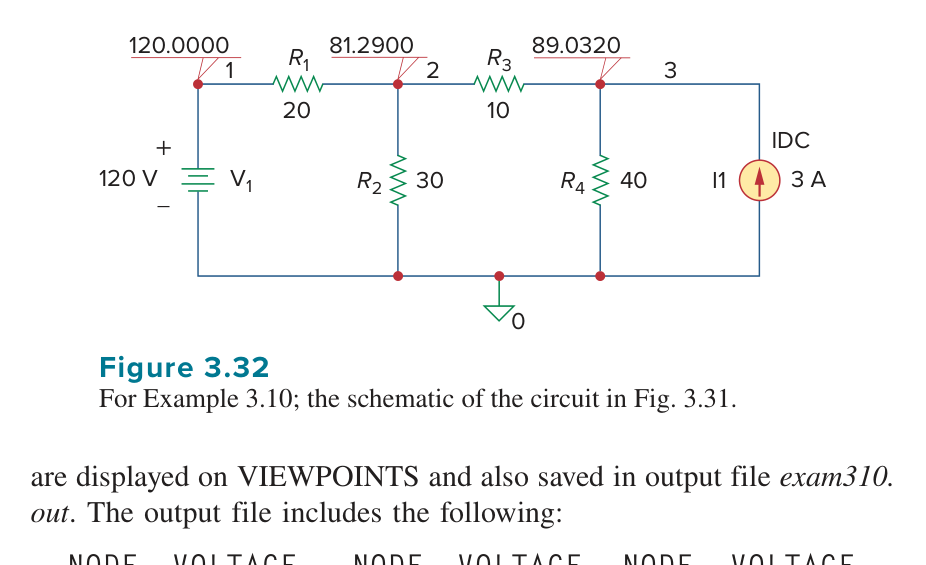

<template #solution>

1. 依圖 3.31 建立直流電路圖；獨立電壓源使用 `VDC`、獨立電流源使用 `IDC`，並以 `VIEWPOINTS` 顯示所需節點電壓。
2. 執行直流模擬後，輸出檔的 `NODE VOLTAGE` 欄列出各節點電壓。
3. 讀取結果：$V_1=120\ \mathrm{V}$、$V_2=81.29\ \mathrm{V}$、$V_3=89.032\ \mathrm{V}$。

課本答案：$V_1=120\ \mathrm{V}$、$V_2=81.29\ \mathrm{V}$、$V_3=89.032\ \mathrm{V}$。

</template>

</PracticeCard>

<PracticeCard id="ch3-pr10" title="Practice Problem 3.10：PSpice 節點電壓" source="課本 p.104" topic="PSpice 直流節點分析">

對圖 3.33 的電路使用 PSpice，求節點電壓 $V_1$、$V_2$ 與 $V_3$。

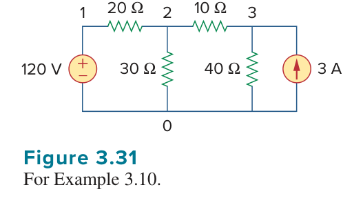

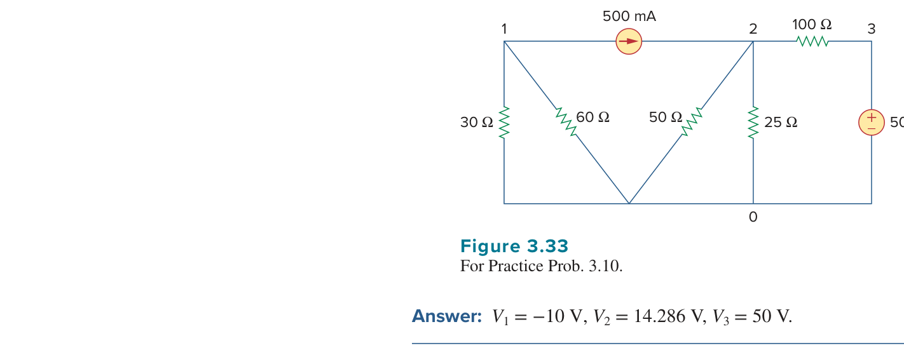

<template #solution>

1. 依圖 3.33 輸入元件數值，將 $50\ \mathrm{V}$ 電壓源與 $500\ \mathrm{mA}$ 電流源設為直流源，並將節點 $1$、$2$、$3$ 設為量測點。
2. 執行直流偏壓模擬，從節點電壓輸出讀取三個節點的結果。

課本答案：$V_1=-10\ \mathrm{V}$、$V_2=14.286\ \mathrm{V}$、$V_3=50\ \mathrm{V}$。

</template>

</PracticeCard>

<PracticeCard id="ch3-ex11" title="Example 3.11：以 PSpice 求受控源電路電流" source="課本 p.104–105" topic="PSpice 與受控電壓源">

在圖 3.34 的電路中，求電流 $i_1$、$i_2$ 與 $i_3$。

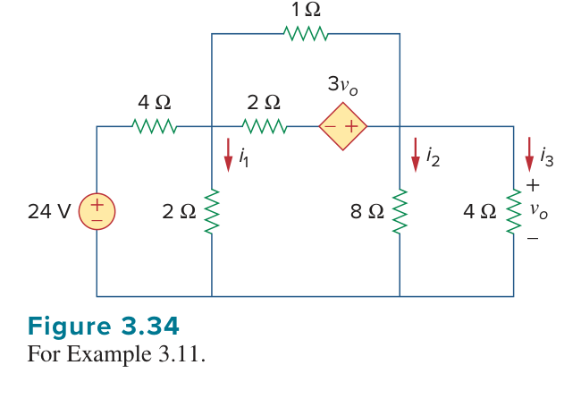

<template #solution>

1. 在 PSpice 中建立圖 3.34；以電壓控制電壓源 `E1` 表示受控源，其控制電壓為 $4\ \Omega$ 電阻兩端電壓，增益設為 $3$。
2. 在欲量測的支路插入 `IPROBES`，執行直流模擬並讀取各探針電流。
3. 模擬結果為 $i_1=i_2=1.333\ \mathrm{A}$，且 $i_3=2.667\ \mathrm{A}$。

課本答案：$i_1=i_2=1.333\ \mathrm{A}$、$i_3=2.667\ \mathrm{A}$。

</template>

</PracticeCard>

<PracticeCard id="ch3-pr11" title="Practice Problem 3.11：PSpice 支路電流" source="課本 p.105" topic="PSpice 直流支路電流">

使用 PSpice，求圖 3.36 電路中的 $i_1$、$i_2$ 與 $i_3$。

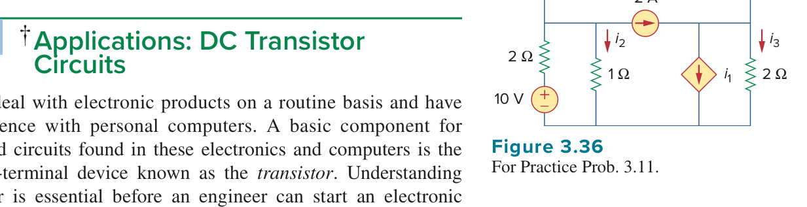

<template #solution>

1. 依圖 3.36 建立直流電路，並在標示 $i_1$、$i_2$、$i_3$ 的支路放置電流探針。
2. 執行直流模擬；電流讀值的正負號均以圖中的參考箭頭為準。

課本答案：$i_1=-428.6\ \mathrm{mA}$、$i_2=2.286\ \mathrm{A}$、$i_3=2\ \mathrm{A}$。

</template>

</PracticeCard>

<PracticeCard id="ch3-ex12" title="Example 3.12：BJT 主動模式偏壓" source="課本 p.108" topic="BJT 直流分析">

求圖 3.41 電晶體電路中的 $I_B$、$I_C$ 與 $v_o$。假設電晶體工作於主動模式，且 $\beta=50$。

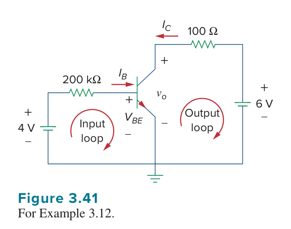

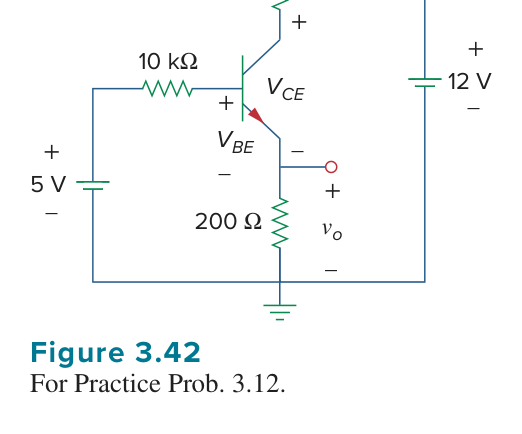

<template #solution>

主動模式下取 $V_{BE}=0.7\ \mathrm{V}$。輸入迴路套用 KVL：

$$
-4+I_B(200\times10^3)+V_{BE}=0
$$

因此

$$
I_B=\frac{4-0.7}{200\times10^3}=16.5\ \mu\mathrm{A}
$$

集極電流為

$$
I_C=\beta I_B=50(16.5\ \mu\mathrm{A})=0.825\ \mathrm{mA}
$$

輸出迴路給出

$$
v_o=6-100I_C=6-0.0825=5.917\ \mathrm{V}
$$

此處 $v_o=V_{CE}$。課本答案：$I_B=16.5\ \mu\mathrm{A}$、$I_C=0.825\ \mathrm{mA}$、$v_o=5.917\ \mathrm{V}$。

</template>

</PracticeCard>

<PracticeCard id="ch3-pr12" title="Practice Problem 3.12：BJT 輸出電壓與 VCE" source="課本 p.108" topic="BJT 直流分析">

對圖 3.42 的電晶體電路，令 $\beta=100$、$V_{BE}=0.7\ \mathrm{V}$，求 $v_o$ 與 $V_{CE}$。

<template #solution>

1. 以主動模式的固定壓降模型 $V_{BE}=0.7\ \mathrm{V}$ 取代基極—射極接面。
2. 由輸入迴路求 $I_B$，再用 $I_C=\beta I_B$ 求集極電流。
3. 將所得電流代回集極與射極電阻的電壓關係，即可得到輸出電壓與 $V_{CE}$。

課本答案：$v_o=2.876\ \mathrm{V}$、$V_{CE}=2.005\ \mathrm{V}$。

</template>

</PracticeCard>

<PracticeCard id="ch3-ex13" title="Example 3.13：以網孔與節點法分析 BJT" source="課本 p.109–110" topic="BJT 網孔分析與節點分析">

圖 3.43 的 BJT 電路中，$\beta=150$、$V_{BE}=0.7\ \mathrm{V}$。求輸出電壓 $v_o$。

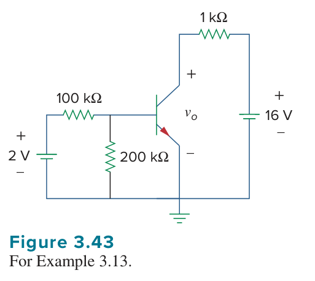

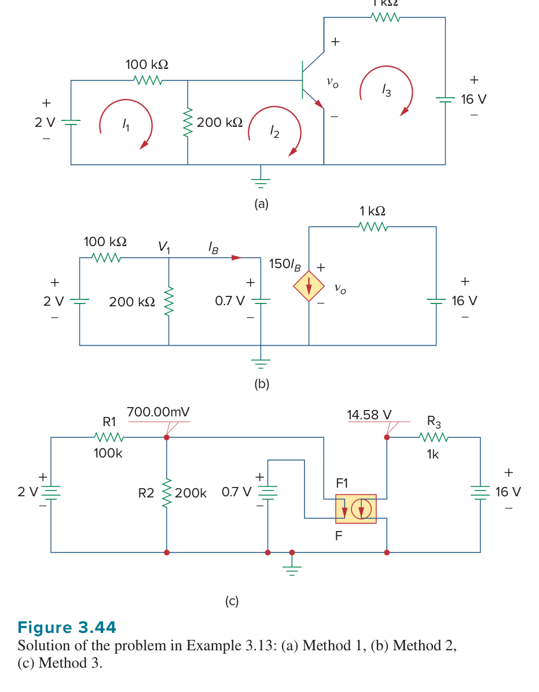

<template #solution>

以圖 3.44(a) 的網孔電流列 KVL：

$$
3I_1-2I_2=2\times10^{-5},\qquad -2I_1+2I_2=-0.7\times10^{-5}
$$

解得

$$
I_1=1.3\times10^{-5}\ \mathrm{A},\qquad I_2=9.5\ \mu\mathrm{A}
$$

受控電流為

$$
I_3=-150I_2=-1.425\ \mathrm{mA}
$$

最後一個迴路：

$$
-v_o+(1\ \mathrm{k}\Omega)I_3+16=0
$$

所以

$$
v_o=16-1.425=14.575\ \mathrm{V}
$$

以圖 3.44(b) 的節點法亦有 $I_B=9.5\ \mu\mathrm{A}$，故結果相符。課本答案：$v_o=14.575\ \mathrm{V}$。

</template>

</PracticeCard>

<PracticeCard id="ch3-pr13" title="Practice Problem 3.13：BJT 輸出電壓與電流" source="課本 p.110" topic="BJT 直流分析">

圖 3.45 的電晶體電路具有 $\beta=80$ 與 $V_{BE}=0.7\ \mathrm{V}$。求 $v_o$ 與 $I_o$。

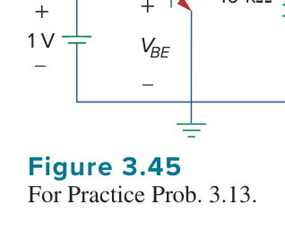

<template #solution>

1. 以主動模式模型，令基極—射極電壓為 $V_{BE}=0.7\ \mathrm{V}$。
2. 由基極支路的 KVL 或等效電路求得基極電流，再以 $I_C=\beta I_B$ 決定集極支路電流。
3. 將集極電流代回輸出支路的電阻壓降，得到 $v_o$；$I_o$ 的方向則依圖中的箭頭定義。

課本答案：$v_o=9\ \mathrm{V}$、$I_o=900\ \mu\mathrm{A}$。

</template>

</PracticeCard>
