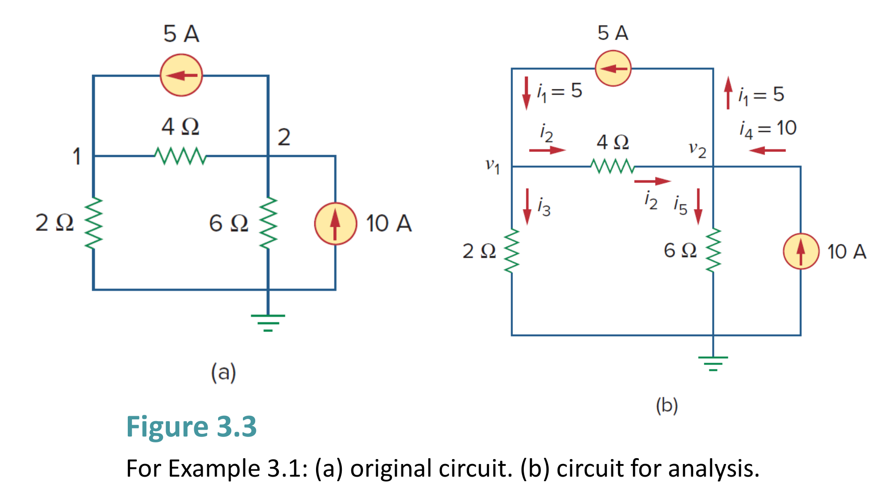
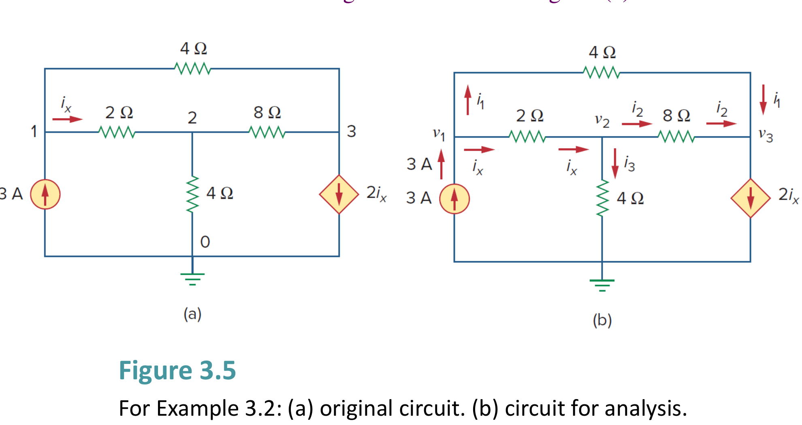
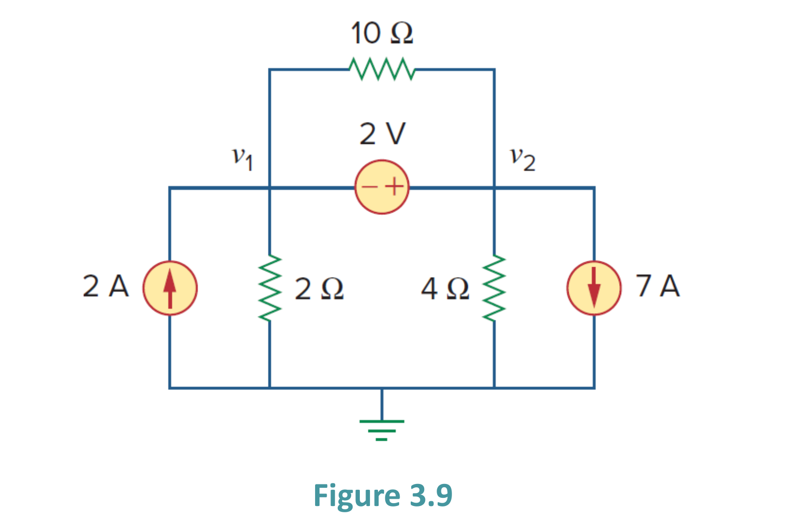
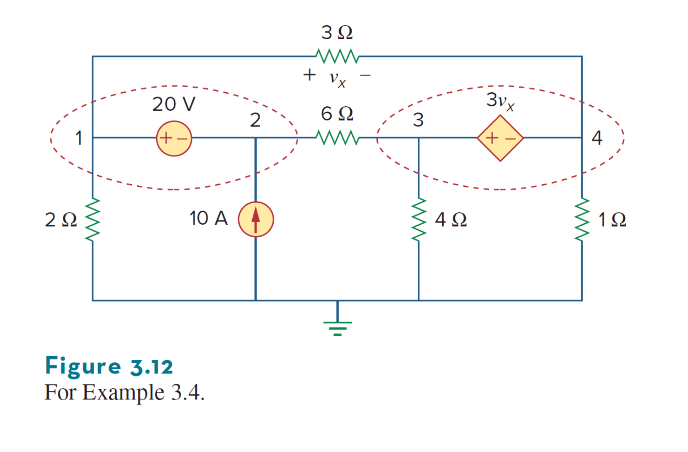
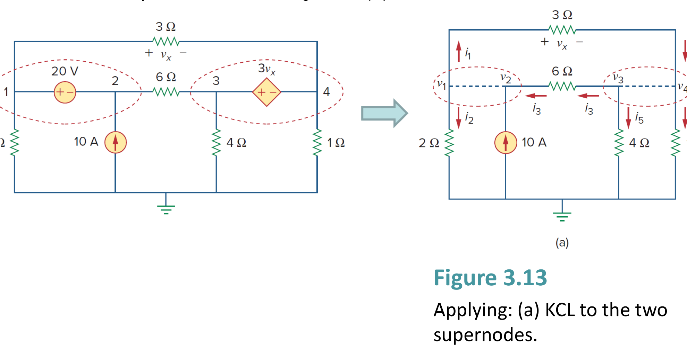
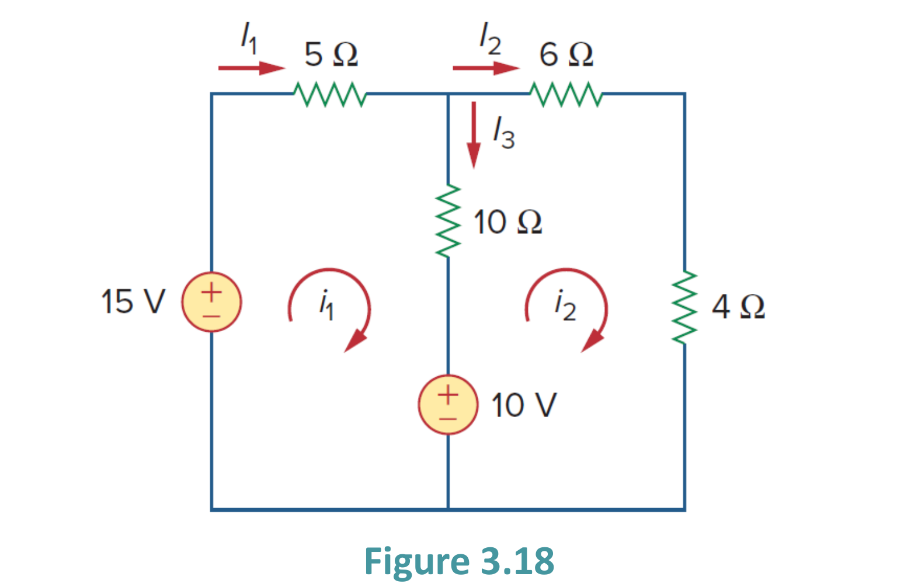
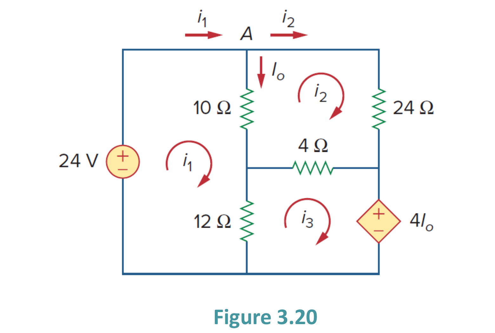
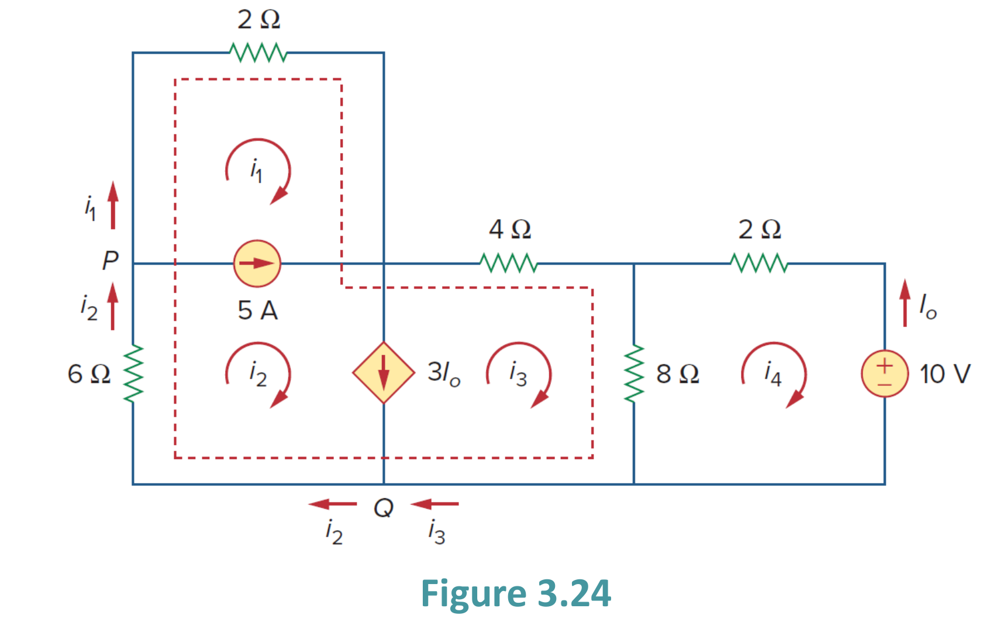
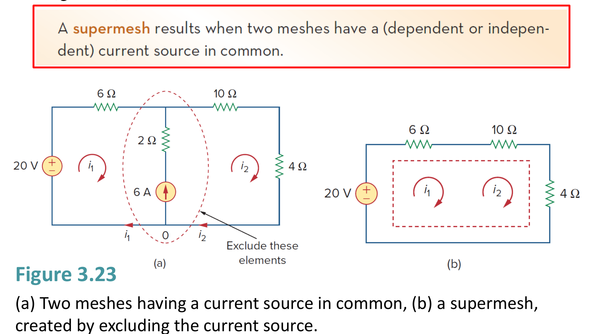
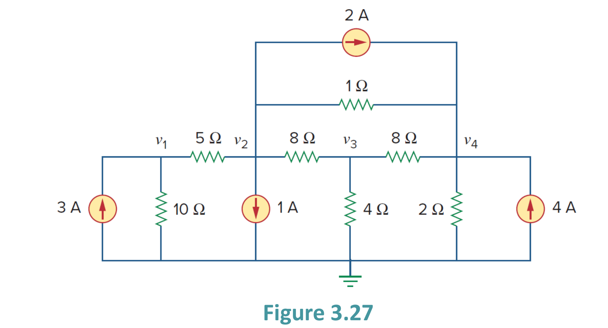

# 互動式範例與練習題庫：Chapter 3 電路分析方法 (Methods of Analysis)

> Alexander & Sadiku · Methods of Analysis 節點與網孔電路分析法精解

::: details 核心分析方法與矩陣觀念速記
- **節點電壓法 (Nodal Analysis)**：選定參考接地點 ($0\text{ V}$)，對各非參考節點列 KCL：$\sum i_{\text{out}} = 0 \implies \sum \frac{v_k - v_j}{R} = 0$。若含相依源，需補列控制量拘束方程式。
- **超節點技巧 (Supernode)**：當兩非參考節點間連接電壓源時，將電壓源包絡為廣義超節點列寫 KCL；搭配內部端電壓拘束式 $v_a - v_b = V_s$。
- **網孔電流法 (Mesh Analysis)**：定義平面網孔順時針電流 $i_k$，對各網孔繞行列 KVL：$\sum v = 0$；共用支路壓降為 $R(i_k - i_j)$。
- **超網孔與觀察法矩陣**：兩網孔共用電流源時繞大迴路列 KVL，拘束式 $i_a - i_b = I_s$；觀察法矩陣 $[G][v] = [i]$，主對角線為自導和，非對角線為互導負值。
:::

<PracticeProgress :total="8" prefix="ch3-" />

<PracticeCard id="ch3-ex-3-1" title="雙節點電路之節點電壓與支路電流計算" source="Example 3.1 · Slide P.8–13" topic="節點電壓法 (Nodal Analysis)">

計算圖 3.3(a) 電路中的各節點電壓 $v_1, v_2$ 以及流經各支路的電流 $i_1 \sim i_5$。

*Calculate the node voltages in the circuit shown in Fig. 3.3 and find branch currents.*

*原教材電路圖 · Figure 3.3 (Slide P.8)*

> **求解目標：求解節點電壓 $v_1, v_2$ 及支路電流 $i_1, i_2, i_3, i_4, i_5$**

<template #solution>

#### 逐步解析：

1. **設定參考節點與標定電壓**：選擇電路底部節點為接地參考點（電位為 $0\text{ V}$）。標定非參考節點 1 之電壓為 $v_1$，節點 2 之電壓為 $v_2$。

2. **對節點 1 套用克希荷夫電流定律 (KCL)**：流入電流 = 流出電流：
   $$
   i_1 = i_2 + i_3 \implies 5 = \frac{v_1 - v_2}{4} + \frac{v_1 - 0}{2}
   $$
   方程式兩邊同乘以 4 進行整數化：
   $$
   20 = (v_1 - v_2) + 2v_1 \implies 3v_1 - v_2 = 20 \quad \cdots (1)
   $$

3. **對節點 2 套用 KCL**：流入電流 = 流出電流：
   $$
   i_2 + i_4 = i_1 + i_5 \implies \frac{v_1 - v_2}{4} + 10 = 5 + \frac{v_2 - 0}{6}
   $$
   兩邊同乘以 12 整理：
   $$
   3(v_1 - v_2) + 120 = 60 + 2v_2 \implies -3v_1 + 5v_2 = 60 \quad \cdots (2)
   $$

4. **聯立方程式求解 (代入消去法 / Cramer's Rule)**：將第 $(1)$ 式與第 $(2)$ 式直接相加 $(1) + (2)$：
   $$
   (3v_1 - v_2) + (-3v_1 + 5v_2) = 20 + 60 \implies 4v_2 = 80 \implies v_2 = 20\text{ V}
   $$
   將 $v_2 = 20\text{ V}$ 代回第 $(1)$ 式：
   $$
   3v_1 - 20 = 20 \implies 3v_1 = 40 \implies v_1 = \frac{40}{3}\text{ V} \approx 13.333\text{ V}
   $$
   *矩陣形式 (Cramer's Rule 驗證)：*
   $$
   \begin{bmatrix} 3 & -1 \\ -3 & 5 \end{bmatrix} \begin{bmatrix} v_1 \\ v_2 \end{bmatrix} = \begin{bmatrix} 20 \\ 60 \end{bmatrix}, \quad \Delta = 15 - 3 = 12
   $$
   $$v_1 = \frac{\Delta_1}{\Delta} = \frac{100 - (-60)}{12} = \frac{160}{12} = 13.333\text{ V}, \quad v_2 = \frac{\Delta_2}{\Delta} = \frac{180 - (-60)}{12} = \frac{240}{12} = 20\text{ V}
   $$

5. **計算各支路電流**：
 
   $$
   i_1 = 5\text{ A}
   $$
   $$i_2 = \frac{v_1 - v_2}{4} = \frac{13.333 - 20}{4} = -1.667\text{ A} \quad \text{（負號表示實際流向為節點 2 流向節點 1）}
   $$
   $$i_3 = \frac{v_1}{2} = \frac{13.333}{2} = 6.667\text{ A}
   $$
   $$i_4 = 10\text{ A}
   $$
   $$i_5 = \frac{v_2}{6} = \frac{20}{6} = 3.333\text{ A}
   $$

::: tip 標準答案
$$v_1 = 13.333\text{ V}\ (\frac{40}{3}\text{ V}),\ v_2 = 20\text{ V}$
$i_1 = 5\text{ A},\ i_2 = -1.667\text{ A},\ i_3 = 6.667\text{ A},\ i_4 = 10\text{ A},\ i_5 = 3.333\text{ A}$$
:::

</template>
</PracticeCard>

<PracticeCard id="ch3-ex-3-2" title="含受控電流源之三節點電路分析" source="Example 3.2 · Slide P.14–18" topic="節點電壓法 (Nodal Analysis)">

求解圖 3.5(a) 電路中各非參考節點的電壓值 $v_1, v_2, v_3$（電路中包含相依電流源 $2i_x$）。

*Determine the voltages at the nodes in Fig. 3.5.*

*原教材電路圖 · Figure 3.5 (Slide P.14)*

> **求解目標：求解節點電壓 $v_1, v_2, v_3$**

<template #solution>

#### 逐步解析：

1. **表示相依源控制量 $i_x$**：電流 $i_x$ 為由節點 1 流向節點 2 的支路電流（通過 $2\ \Omega$ 電阻）：
   $$
   i_x = \frac{v_1 - v_2}{2}
   $$
   受控電流源為 $2i_x = 2 \left(\frac{v_1 - v_2}{2}\right) = v_1 - v_2$。

2. **對節點 1 套用 KCL**：
 
   $$
   3 = i_x + i_1 \implies 3 = \frac{v_1 - v_2}{2} + \frac{v_1 - v_3}{4}
   $$
   兩邊同乘 4 整理：
   $$
   2(v_1 - v_2) + (v_1 - v_3) = 12 \implies 3v_1 - 2v_2 - v_3 = 12 \quad \cdots (1)
   $$

3. **對節點 2 套用 KCL**：
 
   $$
   i_x = i_2 + i_3 \implies \frac{v_1 - v_2}{2} = \frac{v_2 - 0}{4} + \frac{v_2 - v_3}{8}
   $$
   兩邊同乘 8 整理：
   $$
   4(v_1 - v_2) = 2v_2 + (v_2 - v_3) \implies -4v_1 + 7v_2 - v_3 = 0 \quad \cdots (2)
   $$

4. **對節點 3 套用 KCL**：
 
   $$
   i_1 + i_3 + 2i_x = 0 \implies \frac{v_1 - v_3}{4} + \frac{v_2 - v_3}{8} + 2\left(\frac{v_1 - v_2}{2}\right) = 0
   $$
   或以節點 3 流出電流列式：
   $$
   \frac{v_3 - v_1}{4} + \frac{v_3 - v_2}{8} + 2i_x = 0 \implies 2v_1 - 3v_2 + v_3 = 0 \quad \cdots (3)
   $$

5. **矩陣形式與求解**：
 
   $$
   \begin{bmatrix} 3 & -2 & -1 \\ -4 & 7 & -1 \\ 2 & -3 & 1 \end{bmatrix} \begin{bmatrix} v_1 \\ v_2 \\ v_3 \end{bmatrix} = \begin{bmatrix} 12 \\ 0 \\ 0 \end{bmatrix}
   $$
   利用克拉瑪法則 (Cramer's Rule) 或高斯消去法：
   $$
   \Delta = 10, \quad \Delta_1 = 48, \quad \Delta_2 = 24, \quad \Delta_3 = -24
   $$
   $$v_1 = \frac{48}{10} = 4.8\text{ V}, \quad v_2 = \frac{24}{10} = 2.4\text{ V}, \quad v_3 = \frac{-24}{10} = -2.4\text{ V}
   $$

::: tip 標準答案
$$v_1 = 4.8\text{ V}, \quad v_2 = 2.4\text{ V}, \quad v_3 = -2.4\text{ V}$$
:::

</template>
</PracticeCard>

<PracticeCard id="ch3-ex-3-3" title="含浮動獨立電壓源之超節點分析" source="Example 3.3 · Slide P.25–27" topic="超節點技巧 (Supernode)">

求解圖 3.9 電路之節點電壓 $v_1, v_2$（節點 1 與 2 之間跨接有 $2\text{ V}$ 獨立電壓源與 $10\ \Omega$ 電阻）。

*For the circuit shown in Fig. 3.9, find the node voltages.*

*原教材電路圖 · Figure 3.9 (Slide P.25)*

> **求解目標：求解節點電壓 $v_1, v_2$**

<template #solution>

#### 逐步解析：

1. **識別超節點 (Supernode)**：由於節點 1 與節點 2 之間跨接 $2\text{ V}$ 電壓源（兩端均非接地端），我們將 $2\text{ V}$ 電壓源及其並聯之 $10\ \Omega$ 電阻包絡為一個**超節點 (Supernode 1-2)**。

2. **建立電壓源拘束方程式 (Constraint Equation)**：觀察電壓源極性（正極接在節點 2，負極接在節點 1）：
   $$
   v_2 - v_1 = 2 \implies v_2 = v_1 + 2 \quad \cdots (1)
   $$

3. **對超節點 1-2 列 KCL 方程式**：流入超節點之電流 = 流出超節點之電流：
   $$
   2 = 7 + \frac{v_1}{2} + \frac{v_2}{4}
   $$
   移項整理：
   $$
   \frac{v_1}{2} + \frac{v_2}{4} = 2 - 7 = -5
   $$
   兩邊同乘 4：
   $$
   2v_1 + v_2 = -20 \quad \cdots (2)
   $$

4. **代入求解**：將第 $(1)$ 式 $v_2 = v_1 + 2$ 代入第 $(2)$ 式：
   $$
   2v_1 + (v_1 + 2) = -20 \implies 3v_1 = -22 \implies v_1 = -\frac{22}{3}\text{ V} \approx -7.333\text{ V}
   $$
   代回計算 $v_2$：
   $$
   v_2 = v_1 + 2 = -\frac{22}{3} + 2 = -\frac{16}{3}\text{ V} \approx -5.333\text{ V}
   $$

::: tip 標準答案
$$v_1 = -7.333\text{ V}\ \left(-\frac{22}{3}\text{ V}\right), \quad v_2 = -5.333\text{ V}\ \left(-\frac{16}{3}\text{ V}\right)$$
:::

</template>
</PracticeCard>

<PracticeCard id="ch3-ex-3-4" title="多重超節點與受控電壓源之 4 節點電路分析" source="Example 3.4 · Slide P.28–36" topic="超節點技巧 (Supernode)">

求解圖 3.12 所示電路中的節點電壓 $v_1, v_2, v_3, v_4$（電路包含獨立電壓源 $20\text{ V}$ 與受控電壓源 $3v_x$ 形成的兩個超節點）。

*For the circuit shown in Fig. 3.12, find the node voltages.*

*原教材電路圖 · Figure 3.12 (Slide P.28)*

> **求解目標：求解節點電壓 $v_1, v_2, v_3, v_4$**

<template #solution>

#### 逐步解析：

1. **識別兩個超節點與拘束方程式**：- **超節點 1-2**（含 $20\text{ V}$ 電壓源）：
   $$
   v_1 - v_2 = 20 \implies v_2 = v_1 - 20 \quad \cdots (1)
   $$
   - **超節點 3-4**（含 $3v_x$ 相依電壓源）：
   $$
   v_3 - v_4 = 3v_x
   $$
   - 控制電壓 $v_x$ 跨接於 $3\ \Omega$ 電阻（節點 1 與 4 之間）：
   $$
   v_x = v_1 - v_4
   $$
   代入得拘束式：
   $$
   v_3 - v_4 = 3(v_1 - v_4) = 3v_1 - 3v_4 \implies v_3 = 3v_1 - 2v_4 \quad \cdots (2)
   $$

2. **對超節點 1-2 套用 KCL**：流出超節點 1-2 的所有支路電流總和：
   $$
   \frac{v_1 - 0}{2} + \frac{v_1 - v_4}{3} + \frac{v_2 - v_3}{6} = 10
   $$
   同乘 6 展開：
   $$
   3v_1 + 2(v_1 - v_4) + (v_2 - v_3) = 60 \implies 5v_1 + v_2 - v_3 - 2v_4 = 60 \quad \cdots (3)
   $$

3. **對超節點 3-4 套用 KCL**：流出超節點 3-4 的所有支路電流總和：
   $$
   \frac{v_3 - v_2}{6} + \frac{v_3 - 0}{4} + \frac{v_4 - 0}{1} + \frac{v_4 - v_1}{3} = 0
   $$
   同乘 12 展開：
   $$
   2(v_3 - v_2) + 3v_3 + 12v_4 + 4(v_4 - v_1) = 0 \implies -4v_1 - 2v_2 + 5v_3 + 16v_4 = 0 \quad \cdots (4)
   $$

4. **代入消去法化簡與求解**：將第 $(1)$ 式 $v_2 = v_1 - 20$ 與第 $(2)$ 式 $v_3 = 3v_1 - 2v_4$ 代入第 $(3)$ 式：
   $$
   5v_1 + (v_1 - 20) - (3v_1 - 2v_4) - 2v_4 = 60
   $$
   $$3v_1 - 20 = 60 \implies 3v_1 = 80 \implies v_1 = \frac{80}{3}\text{ V} \approx 26.67\text{ V}
   $$
   立即求出 $v_2$：
   $$
   v_2 = v_1 - 20 = \frac{80}{3} - 20 = \frac{20}{3}\text{ V} \approx 6.67\text{ V}
   $$
   將 $v_1, v_2, v_3$ 代入第 $(4)$ 式求 $v_4$：
   $$
   -4v_1 - 2(v_1 - 20) + 5(3v_1 - 2v_4) + 16v_4 = 0
   $$
   $$9v_1 + 6v_4 + 40 = 0 \implies 9\left(\frac{80}{3}\right) + 6v_4 = -40
   $$
   $$240 + 6v_4 = -40 \implies 6v_4 = -280 \implies v_4 = -\frac{140}{3}\text{ V} \approx -46.67\text{ V}
   $$
   代回第 $(2)$ 式求 $v_3$：
   $$
   v_3 = 3\left(\frac{80}{3}\right) - 2\left(-\frac{140}{3}\right) = 80 + \frac{280}{3} = \frac{520}{3}\text{ V} \approx 173.33\text{ V}
   $$

::: tip 標準答案
$$v_1 = 26.67\text{ V}\ \left(\frac{80}{3}\text{ V}\right),\quad v_2 = 6.67\text{ V}\ \left(\frac{20}{3}\text{ V}\right)$$
$$v_3 = 173.33\text{ V}\ \left(\frac{520}{3}\text{ V}\right),\quad v_4 = -46.67\text{ V}\ \left(-\frac{140}{3}\text{ V}\right)$$
:::

</template>
</PracticeCard>

<PracticeCard id="ch3-ex-3-5" title="基本雙網孔電路與各支路電流計算" source="Example 3.5 · Slide P.44–48" topic="網孔電流法 (Mesh Analysis)">

利用網孔分析法求解圖 3.18 電路中的各支路電流 $I_1, I_2, I_3$。

*For the circuit in Fig. 3.18, find the branch currents I1, I2, and I3 using mesh analysis.*

*原教材電路圖 · Figure 3.18 (Slide P.44)*

> **求解目標：求解支路電流 $I_1, I_2, I_3$**

<template #solution>

#### 逐步解析：

1. **定義網孔電流**：設定左邊網孔 1 的順時針電流為 $i_1$，右邊網孔 2 的順時針電流為 $i_2$。

2. **對網孔 1 套用 KVL**：
 
   $$
   -15 + 5i_1 + 10(i_1 - i_2) + 10 = 0
   $$
   $$15i_1 - 10i_2 = 5 \implies 3i_1 - 2i_2 = 1 \quad \cdots (1)
   $$

3. **對網孔 2 套用 KVL**：
 
   $$
   -10 + 10(i_2 - i_1) + 6i_2 + 4i_2 = 0
   $$
   $$-10i_1 + 20i_2 = 10 \implies -i_1 + 2i_2 = 1 \quad \cdots (2)
   $$

4. **聯立求解網孔電流 $i_1, i_2$**：將第 $(1)$ 式與第 $(2)$ 式相加 $(1) + (2)$：
   $$
   (3i_1 - 2i_2) + (-i_1 + 2i_2) = 1 + 1 \implies 2i_1 = 2 \implies i_1 = 1\text{ A}
   $$
   代回第 $(1)$ 式：
   $$
   3(1) - 2i_2 = 1 \implies 2i_2 = 2 \implies i_2 = 1\text{ A}
   $$
   *矩陣形式 (Cramer's Rule 驗證)：*
   $$
   \begin{bmatrix} 3 & -2 \\ -1 & 2 \end{bmatrix} \begin{bmatrix} i_1 \\ i_2 \end{bmatrix} = \begin{bmatrix} 1 \\ 1 \end{bmatrix}, \quad \Delta = 6 - 2 = 4
   $$
   $$i_1 = \frac{\Delta_1}{\Delta} = \frac{2 - (-2)}{4} = 1\text{ A}, \quad i_2 = \frac{\Delta_2}{\Delta} = \frac{3 - (-1)}{4} = 1\text{ A}
   $$

5. **轉換為各支路電流**：- 左側支路電流：$I_1 = i_1 = 1\text{ A}$
   - 右側支路電流：$I_2 = i_2 = 1\text{ A}$
   - 中間共用支路電流：$I_3 = i_1 - i_2 = 1 - 1 = 0\text{ A}$

::: tip 標準答案
$$I_1 = 1\text{ A}, \quad I_2 = 1\text{ A}, \quad I_3 = 0\text{ A}$$
:::

</template>
</PracticeCard>

<PracticeCard id="ch3-ex-3-6" title="含受控電壓源之三網孔電流分析" source="Example 3.6 · Slide P.49–56" topic="網孔電流法 (Mesh Analysis)">

利用網孔分析法求解圖 3.20 電路中的支路電流 $I_o$（電路包含受控電壓源 $4I_o$）。

*Use mesh analysis to find the current Io in the circuit of Fig. 3.20.*

*原教材電路圖 · Figure 3.20 (Slide P.49)*

> **求解目標：求解支路電流 $I_o$**

<template #solution>

#### 逐步解析：

1. **標記網孔電流與相依源控制變數**：設定三個網孔電流分別為 $i_1, i_2, i_3$（皆為順時針方向）。
   支路電流 $I_o$ 流經 $10\ \Omega$ 電阻（由上往下）：
   $$
   I_o = i_1 - i_2
   $$
   相依電壓源大小為 $4I_o = 4(i_1 - i_2)$。

2. **對網孔 1 列 KVL**：
 
   $$
   -24 + 10(i_1 - i_2) + 12(i_1 - i_3) = 0 \implies 22i_1 - 10i_2 - 12i_3 = 24
   $$
   同除以 2：
   $$
   11i_1 - 5i_2 - 6i_3 = 12 \quad \cdots (1)
   $$

3. **對網孔 2 列 KVL**：
 
   $$
   24i_2 + 4(i_2 - i_3) + 10(i_2 - i_1) = 0 \implies -10i_1 + 38i_2 - 4i_3 = 0
   $$
   同除以 2：
   $$
   -5i_1 + 19i_2 - 2i_3 = 0 \quad \cdots (2)
   $$

4. **對網孔 3 列 KVL（含受控電壓源）**：
 
   $$
   4(i_3 - i_2) + 4I_o + 12(i_3 - i_1) = 0
   $$
   將 $I_o = i_1 - i_2$ 代入：
   $$
   4(i_3 - i_2) + 4(i_1 - i_2) + 12(i_3 - i_1) = 0
   $$
   $$-8i_1 - 8i_2 + 16i_3 = 0 \implies -i_1 - i_2 + 2i_3 = 0 \quad \cdots (3)
   $$

5. **矩陣形式與 Cramer's Rule 求解**：
 
   $$
   \begin{bmatrix} 11 & -5 & -6 \\ -5 & 19 & -2 \\ -1 & -1 & 2 \end{bmatrix} \begin{bmatrix} i_1 \\ i_2 \\ i_3 \end{bmatrix} = \begin{bmatrix} 12 \\ 0 \\ 0 \end{bmatrix}
   $$
   計算行列式：
   $$
   \Delta = 192, \quad \Delta_1 = 432, \quad \Delta_2 = 144, \quad \Delta_3 = 288
   $$
   $$i_1 = \frac{432}{192} = 2.25\text{ A}, \quad i_2 = \frac{144}{192} = 0.75\text{ A}, \quad i_3 = \frac{288}{192} = 1.5\text{ A}
   $$

6. **計算目標電流 $I_o$**：
 
   $$
   I_o = i_1 - i_2 = 2.25\text{ A} - 0.75\text{ A} = 1.5\text{ A}
   $$

::: tip 標準答案
$$I_o = 1.5\text{ A} \quad (i_1 = 2.25\text{ A}, \quad i_2 = 0.75\text{ A}, \quad i_3 = 1.5\text{ A})$$
:::

</template>
</PracticeCard>

<PracticeCard id="ch3-ex-3-7" title="複合超網孔與受控電流源之 4 網孔電路分析" source="Example 3.7 · Slide P.62–66" topic="超網孔技巧 (Supermesh)">

求解圖 3.24 電路中的各網孔電流 $i_1, i_2, i_3, i_4$（網孔 1, 2, 3 共用獨立電流源 $5\text{ A}$ 與相依電流源 $3I_o$，形成複合大型超網孔）。

*For the circuit in Fig. 3.24, find i1 to i4 using mesh analysis.*

*原教材電路圖 · Figure 3.24 (Slide P.62)*

> **求解目標：求解網孔電流 $i_1, i_2, i_3, i_4$**

<template #solution>

#### 逐步解析：

1. **識別大型超網孔 (Supermesh 1-2-3)**：- 網孔 1 與 2 共用 $5\text{ A}$ 獨立電流源。
   - 網孔 2 與 3 共用 $3I_o$ 相依電流源。
   兩者相連形成跨越網孔 1、2、3 的大型超網孔（紅色虛線路徑）。

2. **建立電流源拘束方程式 (KCL at Nodes P & Q)**：
   - **節點 P**（獨立電流源向右）：
   $$
   i_2 - i_1 = 5 \implies i_1 = i_2 - 5 \quad \cdots (1)
   $$
   - **節點 Q**（相依電流源向下）：
   $$
   i_2 - i_3 = 3I_o \quad \cdots (2)
   $$
   - 觀察控制電流 $I_o$（在右側支路中向上流動，與順時針網孔電流 $i_4$ 反向）：
   $$
   I_o = -i_4
   $$
   代入 $(2)$ 式得：
   $$
   i_2 - i_3 = 3(-i_4) = -3i_4 \implies i_2 = i_3 - 3i_4 \quad \cdots (3)
   $$
   將 $(3)$ 式代入 $(1)$ 式：
   $$
   i_1 = i_3 - 3i_4 - 5
   $$

3. **對大型超網孔 1-2-3 繞行列 KVL**：
 
   $$
   6i_2 + 2i_1 + 4i_3 + 8(i_3 - i_4) = 0
   $$
   整理合併：
   $$
   2i_1 + 6i_2 + 12i_3 - 8i_4 = 0 \implies i_1 + 3i_2 + 6i_3 - 4i_4 = 0 \quad \cdots (4)
   $$

4. **對網孔 4 列 KVL**：
 
   $$
   2i_4 + 10 + 8(i_4 - i_3) = 0 \implies -8i_3 + 10i_4 = -10 \implies -4i_3 + 5i_4 = -5 \quad \cdots (5)
   $$

5. **聯立方程式消去求解**：將第 $(1)$ 式與第 $(3)$ 式代入第 $(4)$ 式，可化簡為 $i_3, i_4$ 之二元聯立方程式：
   $$
   (i_3 - 3i_4 - 5) + 3(i_3 - 3i_4) + 6i_3 - 4i_4 = 0 \implies 10i_3 - 16i_4 = 5
   $$
   聯立系統：
   $$
   \begin{cases} 10i_3 - 16i_4 = 5 \\ -4i_3 + 5i_4 = -5 \end{cases}
   $$
   利用克拉瑪法則 (Cramer's Rule)：
   $$
   \Delta = \begin{vmatrix} 10 & -16 \\ -4 & 5 \end{vmatrix} = (10)(5) - (-16)(-4) = 50 - 64 = -14
   $$
   $$\Delta_3 = \begin{vmatrix} 5 & -16 \\ -5 & 5 \end{vmatrix} = 25 - 80 = -55 \implies i_3 = \frac{-55}{-14} = \frac{55}{14}\text{ A} \approx 3.929\text{ A}
   $$
   $$\Delta_4 = \begin{vmatrix} 10 & 5 \\ -4 & -5 \end{vmatrix} = -50 - (-20) = -30 \implies i_4 = \frac{-30}{-14} = \frac{15}{7}\text{ A} \approx 2.143\text{ A}
   $$
   代回求得 $i_2$ 與 $i_1$：
   $$
   i_2 = i_3 - 3i_4 = \frac{55}{14} - 3\left(\frac{15}{7}\right) = -\frac{35}{14}\text{ A} = -2.5\text{ A}
   $$
   $$
   i_1 = i_2 - 5 = -2.5 - 5 = -7.5\text{ A}
   $$

::: tip 標準答案
$$i_1 = -7.5\text{ A},\quad i_2 = -2.5\text{ A}$$
$$i_3 = \frac{55}{14}\text{ A} \approx 3.929\text{ A},\quad i_4 = \frac{15}{7}\text{ A} \approx 2.143\text{ A}$$
:::

</template>
</PracticeCard>

<PracticeCard id="ch3-ex-3-8" title="利用觀察法直接建立 4 節點電導矩陣方程式" source="Example 3.8 · Slide P.69–72" topic="觀察法矩陣 (By Inspection)">

以觀察法（Inspection Method）寫出圖 3.27 電路的節點電壓矩陣方程式 $[G][v] = [i]$。

*Write the node-voltage matrix equations for the circuit in Fig. 3.27 by inspection.*

*原教材電路圖 · Figure 3.27 (Slide P.69)*

> **求解目標：寫出 4x4 節點電導矩陣方程式 $[G][v] = [i]$**

<template #solution>

#### 逐步解析：

1. **觀察法矩陣形式原理**：對於僅含線性電阻與獨立電流源的 $N$ 節點電路（選定參考節點後有 $N-1$ 個非參考節點），節點方程式可直接寫為：
   $$
   \begin{bmatrix} G_{11} & G_{12} & G_{13} & G_{14} \\ G_{21} & G_{22} & G_{23} & G_{24} \\ G_{31} & G_{32} & G_{33} & G_{34} \\ G_{41} & G_{42} & G_{43} & G_{44} \end{bmatrix} \begin{bmatrix} v_1 \\ v_2 \\ v_3 \\ v_4 \end{bmatrix} = \begin{bmatrix} i_1 \\ i_2 \\ i_3 \\ i_4 \end{bmatrix}
   $$
   - **主對角線項（自電導 $G_{kk}$）：** 連接到節點 $k$ 的所有支路電導總和（值恆為正）。
   - **非對角線項（互電導 $G_{kj} = G_{jk}$）：** 連接在節點 $k$ 與節點 $j$ 之間的支路電導總和取負值（無連接則為 0）。
   - **電流項 ($i_k$)：** 直接流入節點 $k$ 的獨立電流源總和（流入為正，流出為負）。

2. **逐一計算各項電導元素值**：- **節點 1：**
   $$
   G_{11} = \frac{1}{10} + \frac{1}{5} = 0.1 + 0.2 = 0.3\text{ S}
   $$
   $$G_{12} = -\frac{1}{5} = -0.2\text{ S}, \quad G_{13} = 0, \quad G_{14} = 0
   $$
   $$i_1 = 3\text{ A} \quad \text{（$3\text{ A}$ 電流源流入）}
   $$
   - **節點 2：**
   $$
   G_{22} = \frac{1}{5} + \frac{1}{8} + \frac{1}{1} = 0.2 + 0.125 + 1.0 = 1.325\text{ S}
   $$
   $$G_{21} = -0.2\text{ S}, \quad G_{23} = -\frac{1}{8} = -0.125\text{ S}, \quad G_{24} = -\frac{1}{1} = -1.0\text{ S}
   $$
   $$i_2 = -1\text{ A} - 2\text{ A} = -3\text{ A} \quad \text{（$1\text{ A}$ 向下流出，頂部 $2\text{ A}$ 向右流出）}
   $$
   - **節點 3：**
   $$
   G_{33} = \frac{1}{8} + \frac{1}{4} + \frac{1}{8} = 0.125 + 0.25 + 0.125 = 0.5\text{ S}
   $$
   $$G_{31} = 0, \quad G_{32} = -0.125\text{ S}, \quad G_{34} = -\frac{1}{8} = -0.125\text{ S}
   $$
   $$i_3 = 0\text{ A} \quad \text{（無獨立電流源連接）}
   $$
   - **節點 4：**
   $$
   G_{44} = \frac{1}{8} + \frac{1}{2} + \frac{1}{1} = 0.125 + 0.5 + 1.0 = 1.625\text{ S}
   $$
   $$G_{41} = 0, \quad G_{42} = -1.0\text{ S}, \quad G_{43} = -0.125\text{ S}
   $$
   $$i_4 = 4\text{ A} + 2\text{ A} = 6\text{ A} \quad \text{（右側 $4\text{ A}$ 流入，頂部 $2\text{ A}$ 流入）}
   $$

3. **組成完整對稱電導矩陣方程式**：
 
   $$
   \begin{bmatrix}
   (\frac{1}{5}+\frac{1}{10}) & -\frac{1}{5} & 0 & 0 \\
   -\frac{1}{5} & (\frac{1}{5}+\frac{1}{8}+\frac{1}{1}) & -\frac{1}{8} & -\frac{1}{1} \\
   0 & -\frac{1}{8} & (\frac{1}{8}+\frac{1}{4}+\frac{1}{8}) & -\frac{1}{8} \\
   0 & -\frac{1}{1} & -\frac{1}{8} & (\frac{1}{8}+\frac{1}{2}+\frac{1}{1})
   \end{bmatrix}
   \begin{bmatrix} v_1 \\ v_2 \\ v_3 \\ v_4 \end{bmatrix}
   =
   \begin{bmatrix} 3 \\ -3 \\ 0 \\ 6 \end{bmatrix}
   $$

::: tip 標準答案
$$\begin{bmatrix} 0.3 & -0.2 & 0 & 0 \\ -0.2 & 1.325 & -0.125 & -1 \\ 0 & -0.125 & 0.5 & -0.125 \\ 0 & -1 & -0.125 & 1.625 \end{bmatrix} \begin{bmatrix} v_1 \\ v_2 \\ v_3 \\ v_4 \end{bmatrix} = \begin{bmatrix} 3 \\ -3 \\ 0 \\ 6 \end{bmatrix}$$
:::

</template>
</PracticeCard>

<PracticeCard id="ch3-hw-ch3" title="Chapter 3 課後作業題目清單與參考答案" source="H.W. Index · Slide P.73–74" topic="第三章指定作業題庫索引" :hide-checkbox="true">

根據課堂指定作業，第三章課後練習題庫如下。請同學務必手算演練，熟悉節點電壓法與網孔電流法之技巧。

**指定練習題號（教科書第 3 章習題）：**

- Problem #7
- Problem #10
- Problem #12
- Problem #22
- Problem #33
- Problem #39
- Problem #44
- Problem #49
- Problem #57

<template #solution>

**投影片附錄參考數值驗算：**

- **Problem 10:** $I_o = -4\text{ A}$
- **Problem 12:** $V_o = 60\text{ V}$
- **Problem 22:** $V_1 = -10.91\text{ V}, V_2 = -100.37\text{ V}$
- **Problem 44:** $I_o = -26\text{ A}$

</template>
</PracticeCard>
