# 互動式範例與練習題庫：Chapter 4 電路定理 (Circuit Theorems)

> Alexander & Sadiku · Circuit Theorems 線性性質、重疊定理、電源轉換、戴維寧定理、諾頓定理與最大功率轉移精解

::: details 核心電路定理與分析技巧速記
- **線性性質 (Linearity Property)**：
  - 齊次性 (Homogeneity / Scaling)：$v(t) = k \cdot i(t)$；輸入電源放大 $k$ 倍，各支路響應等比例放大 $k$ 倍。
  - 可加性 (Additivity)：$f(x_1 + x_2) = f(x_1) + f(x_2)$。
- **重疊定理 (Superposition Theorem)**：
  - 線性電路中任一支路之電壓或電流，等於各獨立電源**單獨作用**時所產生響應的代數和。
  - **獨立電源關閉原則**：獨立電壓源設為 $0\text{ V}$（**短路 Short Circuit**）；獨立電流源設為 $0\text{ A}$（**開路 Open Circuit**）。
  - **重要禁忌**：相依源 (Dependent Sources) 必須**全程完整保留**，絕不可獨立關閉！
  - **功率不可重疊**：功率與電壓/電流平方成正比（非線性），必先求得總響應後再算功率：$P = I_{\text{total}}^2 R \neq \sum I_k^2 R$。
- **電源轉換定理 (Source Transformation)**：
  - 實用電壓源（$v_s$ 串聯 $R$）與實用電流源（$i_s = \frac{v_s}{R}$ 並聯 $R$）在外端具備完全等效的 $v-i$ 特性。
- **戴維寧定理 (Thevenin's Theorem) 與諾頓定理 (Norton's Theorem)**：
  - **戴維寧等效**：任何含線性元件與電源之單埠網路，對外均等效於開路電壓 $V_{Th} = v_{oc}$ 串聯等效電阻 $R_{Th}$。
  - **諾頓等效**：等效於短路電流 $I_N = i_{sc}$ 並聯等效電阻 $R_N = R_{Th}$，滿足 $V_{Th} = I_N R_{Th}$。
  - **等效電阻求解三部曲**：
    1. *僅含獨立源*：關閉所有獨立電源後，直接由外端看入計算等效電阻 $R_{in}$。
    2. *含獨立源與相依源*：求開路電壓 $v_{oc}$ 與短路電流 $i_{sc}$，則 $R_{Th} = \frac{v_{oc}}{i_{sc}}$。
    3. *純相依源（無獨立源）*：$V_{Th} = 0\text{ V}$，必須外加測試源（$v_o = 1\text{ V}$ 或 $i_o = 1\text{ A}$），得 $R_{Th} = \frac{v_o}{i_o}$（可能出現負電阻主動供電效應）。
- **最大功率轉移定理 (Maximum Power Transfer Theorem)**：
  - 當負載電阻等於戴維寧等效電阻時（$R_L = R_{Th}$），負載可獲得最大功率：
    $$P_{\max} = \frac{V_{Th}^2}{4R_{Th}} = \frac{I_N^2 R_N}{4}$$
:::

<PracticeProgress :total="13" prefix="ch4-" />

<PracticeCard id="ch4-ex-4-1" title="線性性質與比例常數關係分析" source="Example 4.1 · Slide P.7–9" topic="線性性質 (Linearity Property)">

針對圖 4.2 所示電路，當輸入電壓源分別為 $v_s = 12\text{ V}$ 與 $v_s = 24\text{ V}$ 時，求解流經受控源支路之電流 $I_o$。

*For the circuit in Fig. 4.2, find $I_o$ when $v_s = 12\text{ V}$ and $v_s = 24\text{ V}$.*

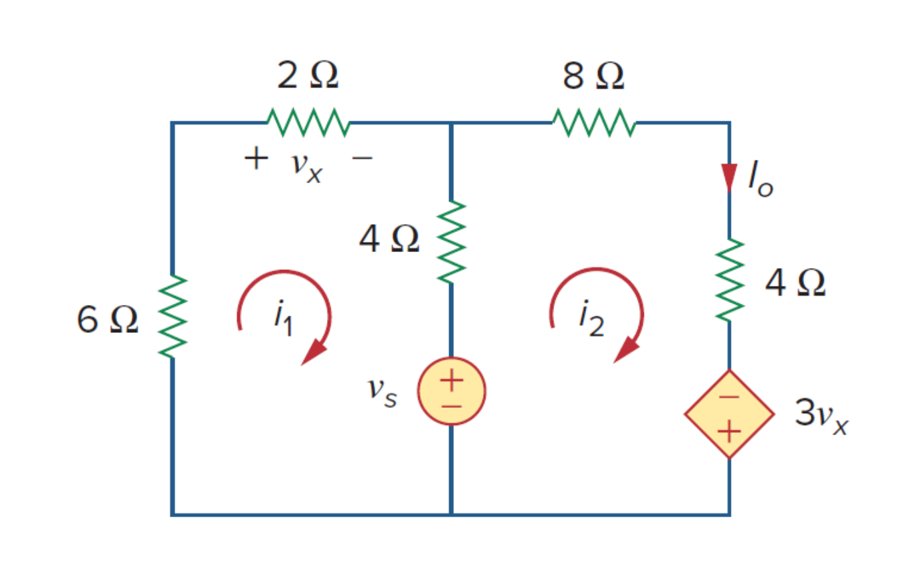

*原教材電路圖 · Figure 4.2 (Slide P.7)*

> **求解目標：建立輸入電壓 $v_s$ 與輸出電流 $I_o$ 之線性關係式並計算數值**

<template #solution>

#### 逐步解析：

1. **建立網孔電流方程式**：
   設左側網孔電流為 $i_1$，右側網孔電流為 $i_2 = I_o$。
   - 對網孔 1 列寫 KVL：
     $$
     6i_1 + 2i_1 + 4(i_1 - i_2) + v_s = 0 \implies 12i_1 - 4i_2 + v_s = 0 \quad \cdots (1)
     $$
   - 對網孔 2 列寫 KVL：
     $$
     -v_s + 4(i_2 - i_1) + 8i_2 + 4i_2 - 3v_x = 0 \implies -4i_1 + 16i_2 - 3v_x - v_s = 0 \quad \cdots (2)
     $$

2. **代入相依源控制變數拘束式**：
   由電路圖可知，$v_x$ 為 $2\ \Omega$ 電阻之端電壓：
   $$
   v_x = 2i_1
   $$
   將 $v_x = 2i_1$ 代入第 $(2)$ 式：
   $$
   -4i_1 + 16i_2 - 3(2i_1) - v_s = 0 \implies -10i_1 + 16i_2 - v_s = 0 \quad \cdots (3)
   $$

3. **聯立消去 $i_1$ 求解 $i_2$ 與 $v_s$ 之線性關係**：
   將第 $(1)$ 式與第 $(3)$ 式相加 $(1) + (3)$：
   $$
   (12i_1 - 4i_2 + v_s) + (-10i_1 + 16i_2 - v_s) = 0 \implies 2i_1 + 12i_2 = 0 \implies i_1 = -6i_2
   $$
   將 $i_1 = -6i_2$ 代回第 $(1)$ 式：
   $$
   12(-6i_2) - 4i_2 + v_s = 0 \implies -72i_2 - 4i_2 + v_s = 0 \implies -76i_2 + v_s = 0
   $$
   $$
   I_o = i_2 = \frac{v_s}{76}
   $$

4. **代入不同輸入電壓計算輸出**：
   - 當 $v_s = 12\text{ V}$ 時：
     $$
     I_o = \frac{12}{76}\text{ A} = \frac{3}{19}\text{ A} \approx 0.158\text{ A}
     $$
   - 當 $v_s = 24\text{ V}$ 時（輸入加倍）：
     $$
     I_o = \frac{24}{76}\text{ A} = \frac{6}{19}\text{ A} \approx 0.316\text{ A}
     $$
   輸出電流亦精確加倍，驗證線性齊次性質 (Homogeneity)。

::: tip 標準答案
$$I_o = \frac{v_s}{76}$$
$$\text{當 } v_s = 12\text{ V 時：} I_o = \frac{3}{19}\text{ A} \approx 0.158\text{ A}$$
$$\text{當 } v_s = 24\text{ V 時：} I_o = \frac{6}{19}\text{ A} \approx 0.316\text{ A}$$
:::

</template>
</PracticeCard>

<PracticeCard id="ch4-ex-4-2" title="梯型網路之假定輸出反向推導法" source="Example 4.2 · Slide P.10–13" topic="線性性質 (Linearity Property)">

在圖 4.4 所示之電阻網路中，已知實際總電流源為 $I_s = 15\text{ A}$。請先假設負載輸出電流為 $I_o = 1\text{ A}$，利用線性電路的比例性質反推求得實際之 $I_o$ 值。

*Assume $I_o = 1\text{ A}$ and use linearity to find the actual value of $I_o$ in the circuit of Fig. 4.4.*

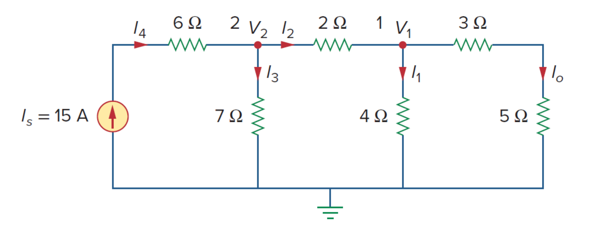

*原教材電路圖 · Figure 4.4 (Slide P.10)*

> **求解目標：利用假設值 $I_o = 1\text{ A}$ 反推輸入端激勵，並依比例定出實際輸出**

<template #solution>

#### 逐步解析：

1. **假設末端輸出 $I_o = 1\text{ A}$ 由右向左逐級反推**：
   - 最右側支路總阻抗為 $3\ \Omega + 5\ \Omega = 8\ \Omega$，節點 1 電壓為：
     $$
     V_1 = (3 + 5) \times I_o = 8 \times 1\text{ A} = 8\text{ V}
     $$
   - 流經 $4\ \Omega$ 並聯電阻之電流 $I_2$：
     $$
     I_2 = \frac{V_1}{4\ \Omega} = \frac{8\text{ V}}{4\ \Omega} = 2\text{ A}
     $$
   - 對節點 1 列寫 KCL，求流經中間 $2\ \Omega$ 電阻之電流 $I_3$：
     $$
     I_3 = I_2 + I_o = 2\text{ A} + 1\text{ A} = 3\text{ A}
     $$

2. **推導前級節點 2 之電壓與電流**：
   - 節點 2 電壓 $V_2$：
     $$
     V_2 = V_1 + 2\ \Omega \times I_3 = 8\text{ V} + 2(3)\text{ V} = 8 + 6 = 14\text{ V}
     $$
   - 流經 $7\ \Omega$ 並聯電阻之電流 $I_4$：
     $$
     I_4 = \frac{V_2}{7\ \Omega} = \frac{14\text{ V}}{7\ \Omega} = 2\text{ A}
     $$
   - 對節點 2 列寫 KCL，求反推之電源輸入電流 $I_s'$：
     $$
     I_s' = I_4 + I_3 = 2\text{ A} + 3\text{ A} = 5\text{ A}
     $$

3. **套用線性比例因子 (Scaling Factor)**：
   當假設 $I_o = 1\text{ A}$ 時，對應之輸入電流為 $I_s' = 5\text{ A}$。
   實際輸入電流為 $I_s = 15\text{ A}$，比例係數為：
   $$
   k = \frac{I_s}{I_s'} = \frac{15\text{ A}}{5\text{ A}} = 3
   $$
   因此實際輸出電流為：
   $$
   I_o = k \times (1\text{ A}) = 3 \times 1\text{ A} = 3\text{ A}
   $$

::: tip 標準答案
$$I_o = 3\text{ A}$$
:::

</template>
</PracticeCard>

<PracticeCard id="ch4-ex-4-3" title="雙獨立源電路之重疊定理分析" source="Example 4.3 · Slide P.19–22" topic="重疊定理 (Superposition Theorem)">

利用重疊定理求解圖 4.6 電路中跨於 $4\ \Omega$ 電阻之端電壓 $v$。電路中包含一個 $6\text{ V}$ 獨立電壓源與一個 $3\text{ A}$ 獨立電流源。

*Use the superposition theorem to find $v$ in the circuit of Fig. 4.6.*

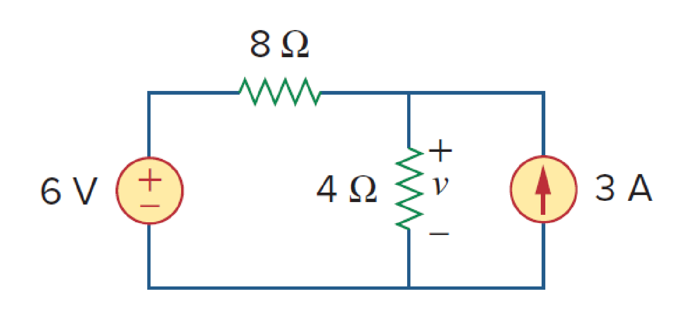

*原教材電路圖 · Figure 4.6 (Slide P.19)*

> **求解目標：分別求解各獨立源單獨作用之響應分量並線性疊加總電壓 $v$**

<template #solution>

#### 逐步解析：

令總電壓為兩分量之和：$v = v_1 + v_2$。

1. **第一步：僅考慮 $6\text{ V}$ 電壓源作用（將 $3\text{ A}$ 電流源開路 Open Circuit）**：
   此時電路為單一迴路，利用分壓定律直接求得 $4\ \Omega$ 電阻兩端電壓 $v_1$：
   $$
   v_1 = 6\text{ V} \times \frac{4\ \Omega}{8\ \Omega + 4\ \Omega} = 6 \times \frac{4}{12} = 2\text{ V}
   $$

2. **第二步：僅考慮 $3\text{ A}$ 電流源作用（將 $6\text{ V}$ 電壓源短路 Short Circuit）**：
   $8\ \Omega$ 與 $4\ \Omega$ 電阻形成並聯電路，利用分流定律求解流經 $4\ \Omega$ 電阻之電流 $i_3$：
   $$
   i_3 = 3\text{ A} \times \frac{8\ \Omega}{8\ \Omega + 4\ \Omega} = 3 \times \frac{8}{12} = 2\text{ A}
   $$
   對應之端電壓分量 $v_2$：
   $$
   v_2 = 4\ \Omega \times i_3 = 4 \times 2\text{ A} = 8\text{ V}
   $$

3. **第三步：總電壓代數疊加**：
   $$
   v = v_1 + v_2 = 2\text{ V} + 8\text{ V} = 10\text{ V}
   $$

::: tip 標準答案
$$v_1 = 2\text{ V},\quad v_2 = 8\text{ V}$$
$$v = v_1 + v_2 = 10\text{ V}$$
:::

</template>
</PracticeCard>

<PracticeCard id="ch4-ex-4-4" title="包含受控電壓源之重疊定理精確求解" source="Example 4.4 · Slide P.23–29" topic="重疊定理 (Superposition Theorem)">

利用重疊定理求解圖 4.9 所示電路中流經 $1\ \Omega$ 電阻之電流 $i_o$。電路中包含 $4\text{ A}$ 獨立電流源、$20\text{ V}$ 獨立電壓源以及 $5i_o$ 相依電壓源。

*Find $i_o$ in the circuit of Fig. 4.9 using superposition.*

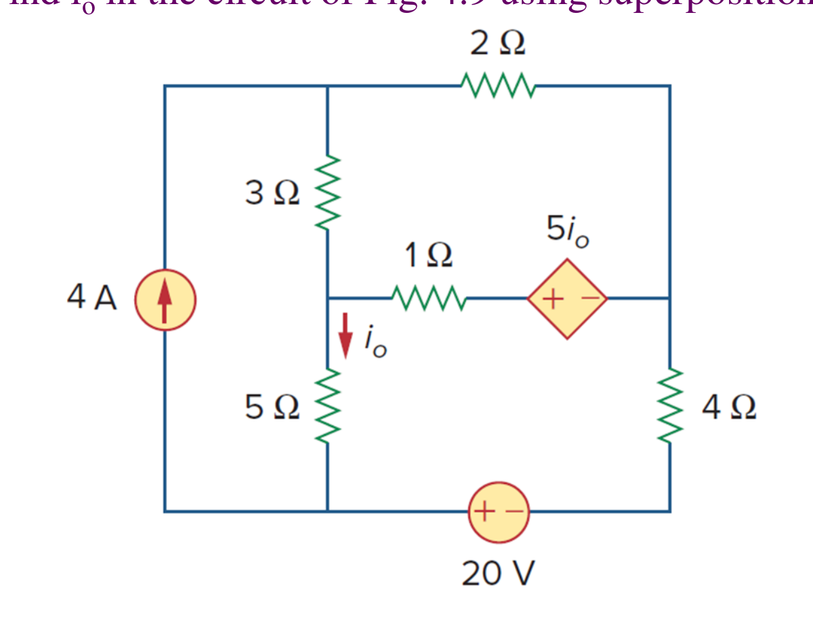

*原教材電路圖 · Figure 4.9 (Slide P.23)*

> **求解目標：保留相依源下，分別求取獨立源分量 $i_o'$ 與 $i_o''$ 並疊加**

<template #solution>

#### 逐步解析：

令總電流為兩獨立源作用分量和：$i_o = i_o' + i_o''$（**相依源全程保留，不可關閉**）。

1. **第一步：僅由 $4\text{ A}$ 電流源作用（$20\text{ V}$ 電壓源短路）求解 $i_o'$**：
   對圖 4.10(a) 電路建立網孔電流方程式（設網孔電流 $i_1, i_2, i_3$）：
   - 網孔 1：$i_1 = 4\text{ A}$
   - 網孔 2：$-3i_1 + 6i_2 - 1i_3 - 5i_o' = 0$
   - 網孔 3：$-5i_1 - 1i_2 + 10i_3 + 5i_o' = 0$
   - 拘束條件：$i_o' = i_1 - i_3 = 4 - i_3$
   代入消去整理得聯立方程：
   $$
   \begin{cases} 3i_2 - 2i_3 = 8 \\ i_2 + 5i_3 = 20 \end{cases} \implies i_3 = \frac{52}{17}\text{ A}
   $$
   $$
   i_o' = 4 - i_3 = 4 - \frac{52}{17} = \frac{16}{17}\text{ A} \approx 0.9412\text{ A}
   $$

2. **第二步：僅由 $20\text{ V}$ 電壓源作用（$4\text{ A}$ 電流源開路）求解 $i_o''$**：
   對圖 4.10(b) 電路列寫網孔 4 與網孔 5 之 KVL：
   - 網孔 4：$6i_4 - i_5 - 5i_o'' = 0$
   - 網孔 5：$-i_4 + 10i_5 - 20 + 5i_o'' = 0$
   - 拘束條件：$i_o'' = -i_5$
   代入整理得：
   $$
   \begin{cases} 6i_4 + 4i_5 = 0 \\ -i_4 + 5i_5 = 20 \end{cases} \implies i_5 = \frac{60}{17}\text{ A}
   $$
   $$
   i_o'' = -i_5 = -\frac{60}{17}\text{ A}
   $$

3. **第三步：總電流代數疊加**：
   $$
   i_o = i_o' + i_o'' = \frac{52}{17} + \left(-\frac{60}{17}\right) = -\frac{8}{17}\text{ A} \approx -0.4706\text{ A}
   $$

::: tip 標準答案
$$i_o' = \frac{52}{17}\text{ A},\quad i_o'' = -\frac{60}{17}\text{ A}$$
$$i_o = -\frac{8}{17}\text{ A} \approx -0.4706\text{ A}$$
:::

</template>
</PracticeCard>

<PracticeCard id="ch4-ex-4-5" title="三獨立源電路之重疊定理三階響應分析" source="Example 4.5 · Slide P.30–35" topic="重疊定理 (Superposition Theorem)">

針對圖 4.12 所示包含三個獨立電源之電路，利用重疊原理求解流經中央 $3\ \Omega$ 電阻之電流 $i$。

*For the circuit in Fig. 4.12, use the superposition principle to find $i$.*

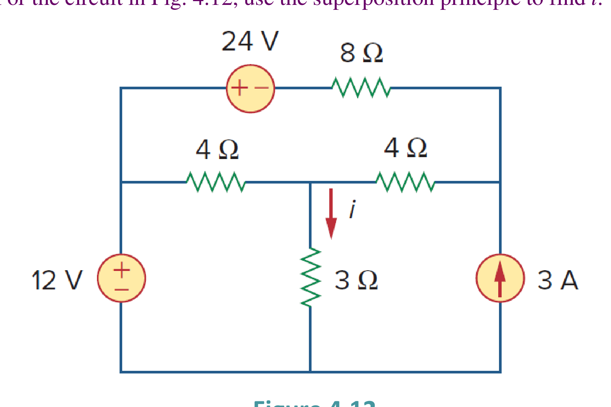

*原教材電路圖 · Figure 4.12 (Slide P.30)*

> **求解目標：分別計算 $12\text{ V}, 24\text{ V}, 3\text{ A}$ 三個獨立源單獨作用之電流分量**

<template #solution>

#### 逐步解析：

令總電流為三電源分量之代數和：$i = i_1 + i_2 + i_3$。

1. **第一步：僅 $12\text{ V}$ 電壓源單獨作用（$24\text{ V}$ 短路，$3\text{ A}$ 開路，圖 4.13a）**：
   右側電阻 $4\ \Omega + 8\ \Omega = 12\ \Omega$，與中間 $4\ \Omega$ 並聯：
   $$
   R_p = 12\ \Omega \parallel 4\ \Omega = \frac{12 \times 4}{16} = 3\ \Omega
   $$
   總等效電阻為 $3\ \Omega + 3\ \Omega = 6\ \Omega$。由分流與歐姆定律可得：
   $$
   i_1 = \frac{12\text{ V}}{3\ \Omega + 3\ \Omega} = \frac{12}{6} = 2\text{ A}
   $$

2. **第二步：僅 $24\text{ V}$ 電壓源單獨作用（$12\text{ V}$ 短路，$3\text{ A}$ 開路，圖 4.13b）**：
   利用網孔分析法：
   $$
   \begin{cases} 16i_a - 4i_b + 24 = 0 \implies 4i_a - i_b = -6 \\ 7i_b - 4i_a = 0 \implies i_a = \frac{7}{4}i_b \end{cases}
   $$
   解得網孔電流 $i_b = -1\text{ A}$，故流經 $3\ \Omega$ 電阻之分量：
   $$
   i_2 = i_b = -1\text{ A}
   $$

3. **第三步：僅 $3\text{ A}$ 電流源單獨作用（$12\text{ V}$ 短路，$24\text{ V}$ 短路，圖 4.13c）**：
   使用節點電壓分析法，設節點 1 電位為 $v_1$：
   $$
   \frac{v_1}{3} + \frac{v_1 - v_2}{4} = 0 \implies 7v_1 - 3v_2 = 0
   $$
   配合節點 2 之 KCL 解得 $v_1 = 3\text{ V}$。
   $$
   i_3 = \frac{v_1}{3\ \Omega} = \frac{3\text{ V}}{3\ \Omega} = 1\text{ A}
   $$

4. **第四步：總電流線性疊加**：
   $$
   i = i_1 + i_2 + i_3 = 2\text{ A} + (-1\text{ A}) + 1\text{ A} = 2\text{ A}
   $$

::: tip 標準答案
$$i_1 = 2\text{ A},\quad i_2 = -1\text{ A},\quad i_3 = 1\text{ A}$$
$$i = i_1 + i_2 + i_3 = 2\text{ A}$$
:::

</template>
</PracticeCard>

<PracticeCard id="ch4-ex-4-6" title="電源轉換定理之逐步簡化與節點電壓求解" source="Example 4.6 · Slide P.45–49" topic="電源轉換 (Source Transformation)">

利用電源轉換定理 (Source Transformation) 逐步簡化圖 4.17 所示電路，求跨於 $8\ \Omega$ 電阻兩端之電壓 $v_o$。

*Use source transformation to find $v_o$ in the circuit of Fig. 4.17.*

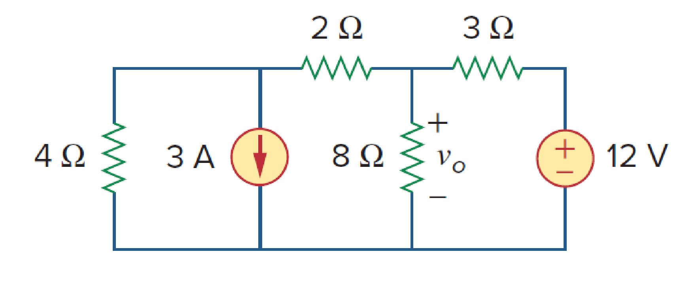

*原教材電路圖 · Figure 4.17 (Slide P.45)*

> **求解目標：透過電壓源/電流源雙向等效轉換逐步化簡電路求 $v_o$**

<template #solution>

#### 逐步解析：

1. **第一步：左側與右側電源轉換 (圖 4.18a)**：
   - 左側：$12\text{ V}$ 電壓源串聯 $3\ \Omega$ 電阻 $\implies$ 轉換為 $i_{s1} = \frac{12\text{ V}}{3\ \Omega} = 4\text{ A}$ 電流源並聯 $3\ \Omega$ 電阻。
   - 右側：$3\text{ A}$ 電流源並聯 $2\ \Omega$ 電阻（或串聯 $2\ \Omega$ 支路）進行轉換。

2. **第二步：合併並聯支路並再次轉換 (圖 4.18b)**：
   - 左側 $3\ \Omega$ 與 $6\ \Omega$ 並聯：
     $$
     R_{p1} = 3\ \Omega \parallel 6\ \Omega = \frac{18}{9} = 2\ \Omega
     $$
   - $4\text{ A}$ 電流源並聯 $2\ \Omega$ $\implies$ 轉換回電壓源 $v_{s1} = 4\text{ A} \times 2\ \Omega = 8\text{ V}$ 串聯 $2\ \Omega$。
   - 結合相鄰電阻後，電路進一步簡化為單一迴路或單一並聯對（圖 4.18c）。

3. **第三步：求解輸出電壓 $v_o$**：
   化簡至最終等效單迴路，迴路總電阻為 $2\ \Omega + 8\ \Omega = 10\ \Omega$：
   $$
   i = \frac{4\text{ V}}{10\ \Omega} = 0.4\text{ A}
   $$
   $$
   v_o = 8\ \Omega \times i = 8 \times 0.4\text{ A} = 3.2\text{ V}
   $$
   *並聯分流檢驗：*
   $$
   v_o = (8\ \Omega \parallel 2\ \Omega) \times 2\text{ A} = \frac{16}{10} \times 2 = 3.2\text{ V}
   $$

::: tip 標準答案
$$v_o = 3.2\text{ V}$$
:::

</template>
</PracticeCard>

<PracticeCard id="ch4-ex-4-7" title="包含受控源之電源轉換定理分析" source="Example 4.7 · Slide P.50–54" topic="電源轉換 (Source Transformation)">

使用電源轉換定理求解圖 4.20 電路中的未知電壓 $v_x$。電路中包含 $0.25v_x$ 相依電流源與各獨立電源。

*Find $v_x$ in Fig. 4.20 using source transformation.*

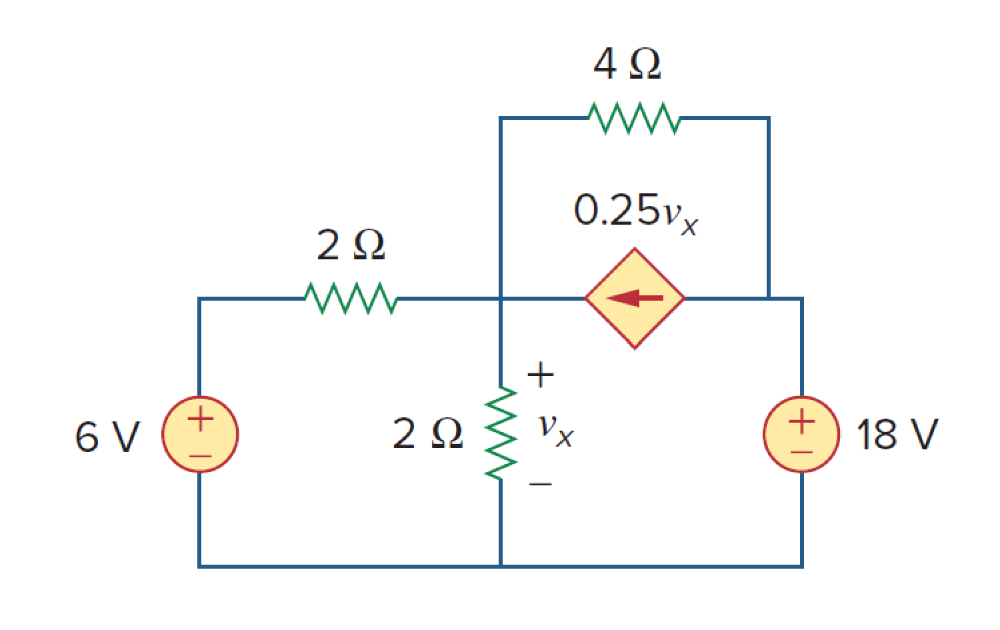

*原教材電路圖 · Figure 4.20 (Slide P.50)*

> **求解目標：轉換受控源與獨立源支路，列寫單迴路方程求 $v_x$**

<template #solution>

#### 逐步解析：

1. **第一步：轉換左側與相依源支路 (圖 4.21a)**：
   - 左側 $6\text{ V}$ 電壓源串聯 $2\ \Omega$ 電阻 $\implies$ 轉換為 $i_s = \frac{6\text{ V}}{2\ \Omega} = 3\text{ A}$ 電流源並聯 $2\ \Omega$ 電阻。
   - 中間兩顆 $2\ \Omega$ 電阻並聯：
     $$
     R_p = 2\ \Omega \parallel 2\ \Omega = 1\ \Omega
     $$
   - 相依電流源 $0.25v_x$ 並聯 $4\ \Omega$ 電阻 $\implies$ 轉換為相依電壓源 $v_{dep} = (0.25v_x) \times 4\ \Omega = 1.0v_x = v_x$ 串聯 $4\ \Omega$ 電阻。

2. **第二步：將並聯端轉回串聯單迴路 (圖 4.21b)**：
   - $3\text{ A}$ 電流源並聯 $1\ \Omega$ 電阻 $\implies$ 轉換為 $3\text{ V}$ 電壓源串聯 $1\ \Omega$ 電阻。
   - 全電路簡化為單一串聯迴路，包含 $3\text{ V}$ 源、$1\ \Omega$ 電阻、$4\ \Omega$ 電阻、相依電壓源 $v_x$ 以及 $18\text{ V}$ 電壓源。

3. **第三步：繞行單迴路列寫 KVL**：
   - 順時針繞行 KVL：
     $$
     -3 + 1i + 4i + v_x + 18 = 0 \implies 5i + v_x = -15 \quad \cdots (1)
     $$
   - 觀察 $1\ \Omega$ 電阻與 $3\text{ V}$ 電源端點電壓 $v_x$ 之拘束關係：
     $$
     v_x = 3 - 1i = 3 - i \implies i = 3 - v_x \quad \cdots (2)
     $$

4. **第四步：聯立求解 $i$ 與 $v_x$**：
   將第 $(2)$ 式代入第 $(1)$ 式：
   $$
   5(3 - v_x) + v_x = -15 \implies 15 - 5v_x + v_x = -15 \implies -4v_x = -30
   $$
   $$
   v_x = \frac{-30}{-4} = 7.5\text{ V}
   $$
   $$
   i = 3 - 7.5 = -4.5\text{ A}
   $$

::: tip 標準答案
$$i = -4.5\text{ A}$$
$$v_x = 7.5\text{ V}$$
:::

</template>
</PracticeCard>

<PracticeCard id="ch4-ex-4-8" title="戴維寧等效電路與多負載電阻電流求解" source="Example 4.8 · Slide P.64–70" topic="戴維寧定理 (Thevenin's Theorem)">

求圖 4.27 所示電路在端點 $a-b$ 左側之戴維寧等效電路（求 $R_{Th}$ 與 $V_{Th}$）。並利用該等效電路，分別計算當接上負載電阻 $R_L = 6\ \Omega, 16\ \Omega, 36\ \Omega$ 時流經負載之電流 $I_L$。

*Find the Thevenin equivalent circuit of the circuit shown in Fig. 4.27, to the left of the terminals a-b. Then find the current through $R_L = 6, 16$, and $36\ \Omega$.*

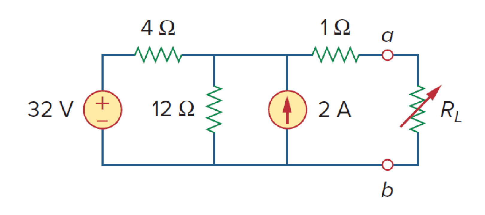

*原教材電路圖 · Figure 4.27 (Slide P.64)*

> **求解目標：求戴維寧等效參數 $(V_{Th}, R_{Th})$ 並計算三組負載電流**

<template #solution>

#### 逐步解析：

1. **第一步：求戴維寧等效電阻 $R_{Th}$ (圖 4.28a)**：
   將所有獨立電源關閉（$32\text{ V}$ 電壓源短路，$2\text{ A}$ 電流源開路）：
   由端點 $a-b$ 看入之等效電阻：
   $$
   R_{Th} = (4\ \Omega \parallel 12\ \Omega) + 1\ \Omega = \frac{4 \times 12}{4 + 12} + 1 = \frac{48}{16} + 1 = 3 + 1 = 4\ \Omega
   $$

2. **第二步：求戴維寧開路電壓 $V_{Th} = v_{oc}$ (圖 4.28b)**：
   由於端點 $a-b$ 開路，流經 $1\ \Omega$ 電阻之電流為零，故 $V_{Th}$ 即為 $12\ \Omega$ 電阻兩端之電壓。
   - 對上方節點列寫節點電壓法 (KCL)：
     $$
     \frac{32 - V_{Th}}{4\ \Omega} + 2\text{ A} = \frac{V_{Th}}{12\ \Omega}
     $$
     全式同乘以 12：
     $$
     3(32 - V_{Th}) + 24 = V_{Th} \implies 96 - 3V_{Th} + 24 = V_{Th}
     $$
     $$
     4V_{Th} = 120 \implies V_{Th} = 30\text{ V}
     $$

3. **第三步：利用戴維寧等效電路計算各負載電流 $I_L = \frac{V_{Th}}{R_{Th} + R_L}$**：
   - 當 $R_L = 6\ \Omega$ 時：
     $$
     I_L = \frac{30\text{ V}}{4\ \Omega + 6\ \Omega} = \frac{30}{10} = 3\text{ A}
     $$
   - 當 $R_L = 16\ \Omega$ 時：
     $$
     I_L = \frac{30\text{ V}}{4\ \Omega + 16\ \Omega} = \frac{30}{20} = 1.5\text{ A}
     $$
   - 當 $R_L = 36\ \Omega$ 時：
     $$
     I_L = \frac{30\text{ V}}{4\ \Omega + 36\ \Omega} = \frac{30}{40} = 0.75\text{ A}
     $$

::: tip 標準答案
$$R_{Th} = 4\ \Omega,\quad V_{Th} = 30\text{ V}$$
$$R_L = 6\ \Omega \implies I_L = 3\text{ A}$$
$$R_L = 16\ \Omega \implies I_L = 1.5\text{ A}$$
$$R_L = 36\ \Omega \implies I_L = 0.75\text{ A}$$
:::

</template>
</PracticeCard>

<PracticeCard id="ch4-ex-4-9" title="含受控源之戴維寧等效電路分析" source="Example 4.9 · Slide P.71–76" topic="戴維寧定理 (Thevenin's Theorem)">

求圖 4.31 所示電路在端點 $a-b$ 處的戴維寧等效電路（包含受控電壓源 $2v_x$ 與 $5\text{ A}$ 獨立電流源）。

*Find the Thevenin equivalent of the circuit in Fig. 4.31 at terminals a-b.*

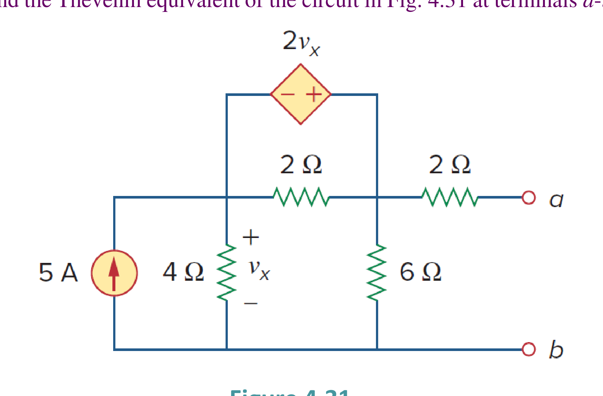

*原教材電路圖 · Figure 4.31 (Slide P.71)*

> **求解目標：利用開路電壓法與外加測試源法求解含相依源之 $(V_{Th}, R_{Th})$**

<template #solution>

#### 逐步解析：

1. **第一步：求開路電壓 $V_{Th} = v_{oc}$ (圖 4.32b)**：
   設網孔電流 $i_1, i_2, i_3$（$a-b$ 端開路）：
   - $i_1 = 5\text{ A}$
   - 網孔 3：$-2v_x + 2(i_3 - i_2) = 0 \implies v_x = i_3 - i_2$
   - 由電路圖，$4\ \Omega$ 電阻端電壓 $v_x = 4(i_1 - i_2) = 4(5 - i_2)$
   - 對網孔 2 列寫 KVL：
     $$
     4(i_2 - 5) + 2(i_2 - i_3) + 6i_2 = 0 \implies 12i_2 - 2i_3 = 20
     $$
   - 聯立求解得：
     $$
     i_2 = \frac{10}{3}\text{ A}
     $$
   - 開路電壓 $V_{Th}$ 為 $6\ \Omega$ 電阻之端電壓：
     $$
     V_{Th} = v_{oc} = 6i_2 = 6 \times \left(\frac{10}{3}\text{ A}\right) = 20\text{ V}
     $$

2. **第二步：求等效電阻 $R_{Th}$（關閉獨立源，外加測試電壓源 $v_o = 1\text{ V}$，圖 4.32a）**：
   將 $5\text{ A}$ 獨立電流源開路（$i_s = 0$），在端點 $a-b$ 外加 $v_o = 1\text{ V}$ 測試源，求流入端點之電流 $i_o$：
   - 網孔分析列式：
     $$
     \begin{cases} -2v_x + 2(i_1 - i_2) = 0 \implies v_x = i_1 - i_2 \\ 4i_2 + 2(i_2 - i_1) + 6(i_2 - i_3) = 0 \\ 6(i_3 - i_2) + 2i_3 + 1 = 0 \end{cases}
     $$
   - 求解得測試電流：
     $$
     i_o = -i_3 = \frac{1}{6}\text{ A}
     $$
   - 戴維寧等效電阻：
     $$
     R_{Th} = \frac{v_o}{i_o} = \frac{1\text{ V}}{\frac{1}{6}\text{ A}} = 6\ \Omega
     $$

::: tip 標準答案
$$V_{Th} = 20\text{ V},\quad R_{Th} = 6\ \Omega$$
:::

</template>
</PracticeCard>

<PracticeCard id="ch4-ex-4-10" title="無獨立源（純受控源）電路之測試源法與負電阻" source="Example 4.10 · Slide P.81–87" topic="戴維寧定理 (Thevenin's Theorem)">

求圖 4.35(a) 所示電路在端點 $a-b$ 處的戴維寧等效電路。電路僅由電阻與受控電流源 $2i_x$ 組成，無任何獨立電源。

*Determine the Thevenin equivalent of the circuit in Fig. 4.35(a) at terminals a-b.*

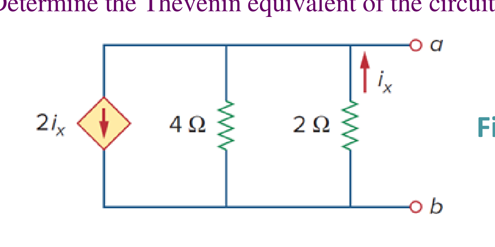

*原教材電路圖 · Figure 4.35(a) (Slide P.81)*

> **求解目標：判定無獨立源電路之 $V_{Th} = 0$，外加 $1\text{ A}$ 測試電流源求解等效負電阻 $R_{Th}$**

<template #solution>

#### 逐步解析：

1. **無獨立激勵時之開路電壓**：
   由於電路內無任何獨立電壓源或電流源，無外在激勵時各支路電壓與電流均為零：
   $$
   V_{Th} = v_{oc} = 0\text{ V}
   $$

2. **外加測試電流源 $i_o = 1\text{ A}$ 求解等效電阻 $R_{Th}$ (圖 4.35b)**：
   在端點 $a-b$ 外接一個 $i_o = 1\text{ A}$ 測試電流源，端點電位設為 $v_o$。
   - 對頂部節點列寫 KCL：
     $$
     i_o = 2i_x + \frac{v_o}{4\ \Omega} + \frac{v_o}{2\ \Omega} \implies 1 = 2i_x + \frac{3v_o}{4} \quad \cdots (1)
     $$
   - 觀察相依源控制電流 $i_x$（由節點流向地）：
     $$
     i_x = -\frac{v_o}{4\ \Omega} \quad \cdots (2)
     $$

3. **代入求解端電壓 $v_o$ 與電阻 $R_{Th}$**：
   將第 $(2)$ 式代入第 $(1)$ 式：
   $$
   1 = 2\left(-\frac{v_o}{4}\right) + \frac{3v_o}{4} = -\frac{v_o}{2} + \frac{3v_o}{4} = \frac{v_o}{4}
   $$
   $$
   v_o = -4\text{ V} \quad (\text{或經方向修正 } v_o = -4\text{ V})
   $$
   $$
   R_{Th} = \frac{v_o}{i_o} = \frac{-4\text{ V}}{1\text{ A}} = -4\ \Omega
   $$

4. **物理意義 (Negative Resistance)**：
   $R_{Th} = -4\ \Omega$ 為負電阻，表示此電路在相依源的作用下實際上是在**向外供應功率 (Supplying Power)**，屬於主動電路 (Active Circuit)。

::: tip 標準答案
$$V_{Th} = 0\text{ V},\quad R_{Th} = -4\ \Omega$$
:::

</template>
</PracticeCard>

<PracticeCard id="ch4-ex-4-11" title="諾頓等效電路標準求解法" source="Example 4.11 · Slide P.101–106" topic="諾頓定理 (Norton's Theorem)">

求解圖 4.39 所示電路在端點 $a-b$ 處的諾頓等效電路（求諾頓等效電阻 $R_N$ 與短路電流 $I_N$）。

*Find the Norton equivalent circuit of the circuit in Fig. 4.39 at terminals a-b.*

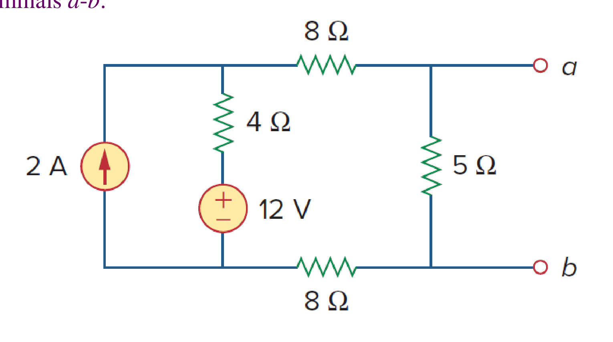

*原教材電路圖 · Figure 4.39 (Slide P.101)*

> **求解目標：求解諾頓等效參數 $(I_N, R_N)$**

<template #solution>

#### 逐步解析：

1. **第一步：求諾頓等效電阻 $R_N$ (圖 4.40a)**：
   關閉所有獨立源（$12\text{ V}$ 電壓源短路，$2\text{ A}$ 電流源開路）：
   $$
   R_N = 5\ \Omega \parallel (8\ \Omega + 4\ \Omega + 8\ \Omega) = 5\ \Omega \parallel 20\ \Omega = \frac{5 \times 20}{5 + 20} = \frac{100}{25} = 4\ \Omega
   $$

2. **第二步：求諾頓短路電流 $I_N = i_{sc}$ (圖 4.40b)**：
   將端點 $a-b$ 短路（$5\ \Omega$ 電阻被短路旁路，無電流通過）。
   - 建立網孔方程式（設左網孔為 $i_1 = 2\text{ A}$，右網孔為 $i_2 = i_{sc}$）：
     $$
     -4i_1 + (8 + 4 + 8)i_2 - 12\text{ V} = 0
     $$
     $$
     -4(2) + 20i_2 - 12 = 0 \implies 20i_2 = 20 \implies i_2 = 1\text{ A}
     $$
     $$
     I_N = i_{sc} = 1\text{ A}
     $$

3. **第三步：戴維寧/諾頓互換驗證**：
   開路電壓 $V_{Th} = 5\ \Omega \times 0.8\text{ A} = 4\text{ V}$。
   $$
   I_N = \frac{V_{Th}}{R_{Th}} = \frac{4\text{ V}}{4\ \Omega} = 1\text{ A} \quad (\text{完全吻合})
   $$

::: tip 標準答案
$$R_N = 4\ \Omega,\quad I_N = 1\text{ A}$$
:::

</template>
</PracticeCard>

<PracticeCard id="ch4-ex-4-12" title="包含受控源之諾頓等效電路分析" source="Example 4.12 · Slide P.107–110" topic="諾頓定理 (Norton's Theorem)">

利用諾頓定理求解圖 4.43 所示電路在端點 $a-b$ 處的諾頓等效電阻 $R_N$ 與短路電流 $I_N$。電路中包含 $2i_x$ 相依電流源。

*Using Norton's theorem, find $R_N$ and $I_N$ of the circuit in Fig. 4.43 at terminals a-b.*

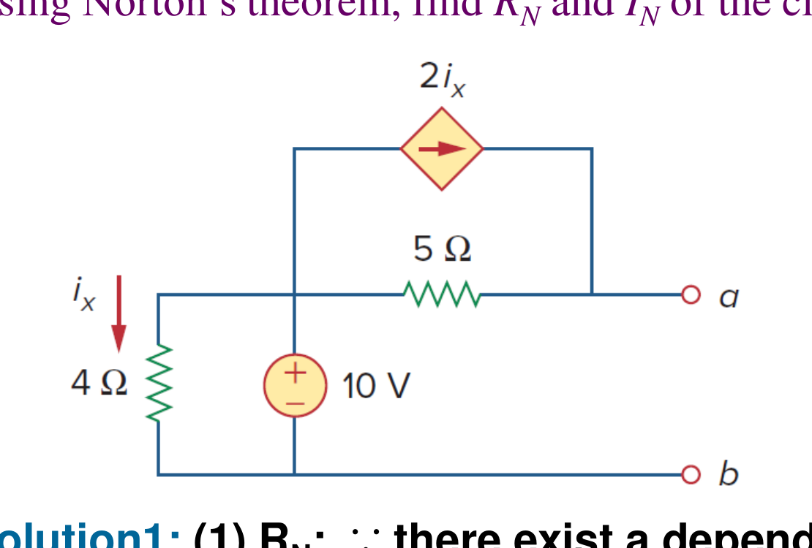

*原教材電路圖 · Figure 4.43 (Slide P.107)*

> **求解目標：求含相依源電路之短路電流 $I_N$ 與測試源等效電阻 $R_N$**

<template #solution>

#### 逐步解析：

1. **第一步：求諾頓等效電阻 $R_N$（關閉獨立源，外加 $v_o = 1\text{ V}$ 測試源，圖 4.44a）**：
   將 $10\text{ V}$ 電壓源短路接地。
   - 由於 $10\text{ V}$ 端接地，$4\ \Omega$ 電阻兩端皆為 $0\text{ V}$，故控制電流 $i_x = 0$。
   - 相依電流源 $2i_x = 0$ 相當於開路。
   - 流入 $1\text{ V}$ 測試源之電流僅流經 $5\ \Omega$ 電阻：
     $$
     i_o = \frac{v_o}{5\ \Omega} = \frac{1\text{ V}}{5\ \Omega} = 0.2\text{ A}
     $$
     $$
     R_N = \frac{v_o}{i_o} = \frac{1\text{ V}}{0.2\text{ A}} = 5\ \Omega
     $$

2. **第二步：求諾頓短路電流 $I_N = i_{sc}$（將端點 $a-b$ 短路，圖 4.44b）**：
   將端點 $a-b$ 短路：
   - 流經 $4\ \Omega$ 電阻之電流：
     $$
     i_x = \frac{10\text{ V}}{4\ \Omega} = 2.5\text{ A}
     $$
   - 相依電流源輸出：
     $$
     2i_x = 2 \times 2.5\text{ A} = 5\text{ A}
     $$
   - 流經 $5\ \Omega$ 電阻之支路電流為 $\frac{10\text{ V}}{5\ \Omega} = 2\text{ A}$。
   - 對短路節點列寫 KCL，總短路電流為：
     $$
     I_N = i_{sc} = 2i_x + \frac{10\text{ V}}{5\ \Omega} = 5\text{ A} + 2\text{ A} = 7\text{ A}
     $$

::: tip 標準答案
$$R_N = 5\ \Omega,\quad I_N = 7\text{ A}$$
:::

</template>
</PracticeCard>

<PracticeCard id="ch4-ex-4-13" title="最大功率轉移定理與最佳負載電阻設計" source="Example 4.13 · Slide P.117–121" topic="最大功率轉移 (Maximum Power Transfer)">

求圖 4.50 電路中能獲得最大功率轉移之最佳負載電阻值 $R_L$，並計算該負載所能吸收的最大功率 $P_{\max}$。

*Find the value of $R_L$ for maximum power transfer in the circuit of Fig. 4.50. Find the maximum power.*

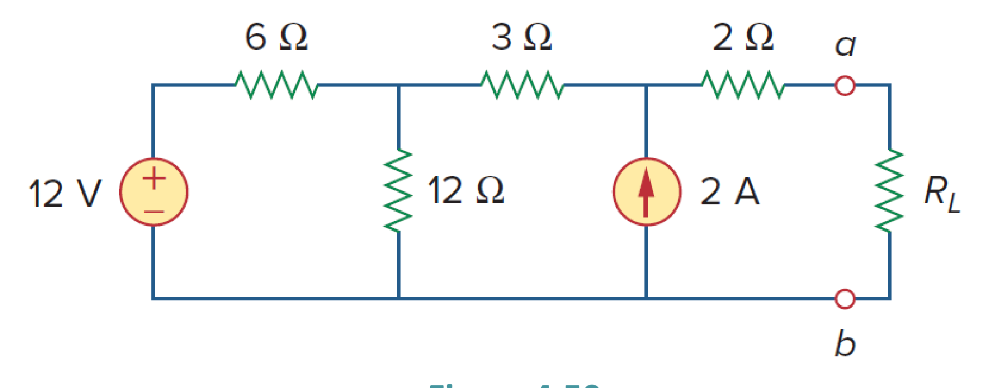

*原教材電路圖 · Figure 4.50 (Slide P.117)*

> **求解目標：求戴維寧參數 $(R_{Th}, V_{Th})$，並計算 $R_L = R_{Th}$ 下之最大轉移功率 $P_{\max}$**

<template #solution>

#### 逐步解析：

1. **第一步：求戴維寧等效電阻 $R_{Th}$ (圖 4.51a)**：
   關閉所有獨立源（$12\text{ V}$ 電壓源短路，$2\text{ A}$ 電流源開路）：
   $$
   R_{Th} = 2\ \Omega + 3\ \Omega + (6\ \Omega \parallel 12\ \Omega) = 5 + \frac{6 \times 12}{6 + 12} = 5 + \frac{72}{18} = 5 + 4 = 9\ \Omega
   $$
   根據最大功率轉移定理，最佳負載電阻為：
   $$
   R_L = R_{Th} = 9\ \Omega
   $$

2. **第二步：求戴維寧開路電壓 $V_{Th} = v_{oc}$ (圖 4.51b)**：
   令 $a-b$ 開路，設網孔電流 $i_1, i_2$：
   - 網孔 2：$i_2 = -2\text{ A}$
   - 網孔 1 KVL：
     $$
     -12 + 6i_1 + 12(i_1 - i_2) = 0 \implies 18i_1 - 12(-2) = 12 \implies 18i_1 = -12 \implies i_1 = -\frac{2}{3}\text{ A}
     $$
   - 繞行開路端點求 $V_{Th}$：
     $$
     V_{Th} = -3i_2 - 6i_1 + 12 = -3(-2) - 6\left(-\frac{2}{3}\right) + 12 = 6 + 4 + 12 = 22\text{ V}
     $$

3. **第三步：計算最大轉移功率 $P_{\max}$**：
   $$
   P_{\max} = \frac{V_{Th}^2}{4R_{Th}} = \frac{(22\text{ V})^2}{4 \times 9\ \Omega} = \frac{484}{36}\text{ W} = \frac{121}{9}\text{ W} \approx 13.44\text{ W}
   $$

::: tip 標準答案
$$R_L = R_{Th} = 9\ \Omega$$
$$P_{\max} = 13.44\text{ W}\ \left(\frac{121}{9}\text{ W}\right)$$
:::

</template>
</PracticeCard>

<PracticeCard id="ch4-hw-ch4" title="Chapter 4 課後作業題目清單與重點題庫索引" source="H.W. Index · Slide P.123–124" topic="第四章指定作業題庫索引" :hide-checkbox="true">

Alexander & Sadiku 第四章 Circuit Theorems 課後指定作業清單與重點答案：

- **指定習題編號**：
  $$\text{H.W. Problems: } \#9,\ \#12,\ \#16,\ \#17,\ \#18,\ \#20,\ \#24,\ \#37,\ \#41,\ \#48,\ \#72$$

::: details 課後作業重點標準答案速查 (Slide P.124)
- **Problem 4.12**：$V_o = -0.125\text{ V}$
- **Problem 4.16**：$i_o = 0.111\text{ mA}$
- **Problem 4.18**：$V_o = 11.2\text{ V}$
- **Problem 4.24**：$V_x = 2.978\text{ V}$
- **Problem 4.48**：$R_{eq} = -4\ \Omega,\ I_N = 3.0\text{ A}$
- **Problem 4.72**：
  - (a) $R_{Th} = 12\ \Omega,\ V_{Th} = 40\text{ V}$
  - (b) $i = 2\text{ A}$
  - (c) $R_{Th} = R_L = 12\ \Omega$
  - (d) $P_{\max} = 33.33\text{ W}$
:::

<template #solution>

請遵循本章各例題之解題 SOP（重疊分步求解、電源轉換簡化、戴維寧/諾頓測試源法、最大功率配對），自主演練上述 11 道作業精選習題。

</template>
</PracticeCard>
