# 互動式範例與練習題庫：Chapter 5 運算放大器 (Operational Amplifiers)

> Alexander & Sadiku · Operational Amplifiers 運算放大器電路分析、設計與級聯系統精解

::: details 核心運算放大器模型與分析要訣速記
- **實際運算放大器等效模型 (Nonideal Op Amp Model)**：
  - 開路電壓增益 $A \approx 10^5 \sim 10^6$，輸入阻抗 $R_i \approx 10^6 \sim 10^8\ \Omega$，輸出阻抗 $R_o \approx 10 \sim 100\ \Omega$。
  - 差動輸入電壓 $v_d = v_2 - v_1$（其中 $v_2 = v_+$ 為同相端電位，$v_1 = v_-$ 為反相端電位），內部受控電壓源為 $A v_d$。
- **理想運算放大器兩大黃金定律 (Ideal Op Amp Rules)**：
  1. **虛短路 / 虛接地 (Virtual Short / Virtual Ground)**：$v_d = v_+ - v_- = 0 \implies v_+ = v_-$。當同相端接地時，反相端電位被鉗位為 $0\text{ V}$（虛接地）。
  2. **輸入端電流為零 (Zero Input Current)**：$i_+ = i_- = 0$（由 $R_i \to \infty$ 所致）。
- **五大經典運算放大器組態 (Classic Op Amp Configurations)**：
  - **反相放大器 (Inverting Amplifier)**：$v_o = -\frac{R_f}{R_1} v_i$
  - **同相放大器 (Noninverting Amplifier)**：$v_o = \left(1 + \frac{R_f}{R_1}\right) v_i$
  - **電壓跟隨器 / 緩衝器 (Voltage Follower / Buffer)**：$v_o = v_i$（增益 $A_v = 1$，$R_{in} \to \infty, R_{out} \to 0$）
  - **加法放大器 (Summing Amplifier)**：$v_o = -\left(\frac{R_f}{R_1}v_1 + \frac{R_f}{R_2}v_2 + \cdots + \frac{R_f}{R_n}v_n\right)$
  - **差動放大器 (Difference Amplifier)**：當 $\frac{R_2}{R_1} = \frac{R_4}{R_3}$ 時，$v_o = \frac{R_2}{R_1}(v_2 - v_1)$
- **儀表放大器 (Instrumentation Amplifier, IA)**：
  - $v_o = \frac{R_2}{R_1} \left(1 + \frac{2R_3}{R_G}\right)(v_2 - v_1)$，具備極高共模拒斥比 (CMRR) 與可調單一電阻增益設定特性。
:::

<PracticeProgress :total="20" prefix="ch5-" />

<PracticeCard id="ch5-ex-5-1" title="非理想運算放大器等效電路與閉迴路增益分析" source="Example 5.1 · Slide P.20–24" topic="實際運算放大器模型 (Nonideal Op Amp)">

已知某 741 運算放大器之開路電壓增益 $A = 2 \times 10^5$、輸入電阻 $R_i = 2\text{ M}\Omega$、輸出電阻 $R_o = 50\ \Omega$。將此運算放大器應用於圖 5.6(a) 之反相放大電路中，輸入端電阻 $R_1 = 10\text{ k}\Omega$，回授電阻 $R_f = 20\text{ k}\Omega$。

1. 求此放大電路的閉迴路電壓增益 (Closed-loop Gain) $\frac{v_o}{v_s}$。
2. 當輸入電壓 $v_s = 2\text{ V}$ 時，求流經回授電阻之電流 $i$。

*A 741 op amp has an open-loop voltage gain of $2 \times 10^5$, input resistance of $2\text{ M}\Omega$, and output resistance of $50\ \Omega$. The op amp is used in the circuit of Fig. 5.6(a). Find the closed-loop gain $v_o/v_s$. Determine current $i$ when $v_s = 2\text{ V}$.*

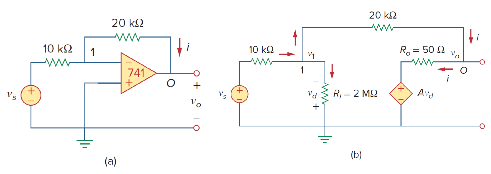

*原教材電路圖 · Figure 5.6 (a) 原始電路 (b) 實際運算放大器等效模型 (Slide P.20)*

> **求解目標：求解閉迴路增益 $\frac{v_o}{v_s}$ 及當 $v_s = 2\text{ V}$ 時之回授電流 $i$**

<template #solution>

#### 逐步解析：

1. **建立非理想運算放大器等效模型電路 (Equivalent Circuit)**：
   參考圖 5.6(b)，同相輸入端接地（$v_2 = 0\text{ V}$），差動輸入端電壓為：
   $$
   v_d = v_2 - v_1 = 0 - v_1 = -v_1
   $$
   因此運算放大器內部的受控電壓源為：
   $$
   A v_d = -A v_1 = -2 \times 10^5 v_1
   $$

2. **對反相輸入節點 1 列寫 KCL**：
   流入節點 1 的電流等於流出節點 1 的電流：
   $$
   \frac{v_s - v_1}{R_1} = \frac{v_1 - 0}{R_i} + \frac{v_1 - v_o}{R_f} \implies \frac{v_s - v_1}{10 \times 10^3} = \frac{v_1}{2 \times 10^6} + \frac{v_1 - v_o}{20 \times 10^3}
   $$
   全式同乘以 $2 \times 10^6\ \Omega$（即 $2000\text{ k}\Omega$）：
   $$
   200(v_s - v_1) = v_1 + 100(v_1 - v_o)
   $$
   展開並整理：
   $$
   200v_s = 301v_1 - 100v_o \implies v_1 = \frac{200v_s + 100v_o}{301} \approx \frac{2v_s + v_o}{3} \quad \cdots (1)
   $$

3. **對輸出端節點 $O$ 列寫 KCL**：
   流出節點 $O$ 的電流等於流入內部受控源支路的電流：
   $$
   \frac{v_1 - v_o}{R_f} = \frac{v_o - A v_d}{R_o} \implies \frac{v_1 - v_o}{20 \times 10^3} = \frac{v_o - 2 \times 10^5(-v_1)}{50}
   $$
   全式同乘以 $20 \times 10^3$：
   $$
   v_1 - v_o = 400(v_o + 2 \times 10^5 v_1) = 400v_o + 8 \times 10^7 v_1 \quad \cdots (2)
   $$

4. **聯立消去 $v_1$ 求解閉迴路增益 $\frac{v_o}{v_s}$**：
   將第 $(1)$ 式代入第 $(2)$ 式：
   $$
   \frac{200v_s + 100v_o}{301} - v_o = 400v_o + 8 \times 10^7 \left(\frac{200v_s + 100v_o}{301}\right)
   $$
   兩邊同乘以 301 整理得：
   $$
   26,667,067 v_o + 53,333,333 v_s = 0
   $$
   $$
   \frac{v_o}{v_s} = -\frac{53,333,333}{26,667,067} = -1.9999699 \approx -1.99997
   $$

5. **計算 $v_s = 2\text{ V}$ 時的輸出電壓 $v_o$、端點電壓 $v_1$ 與電流 $i$**：
   $$
   v_o = -1.9999699 \times (2\text{ V}) = -3.9999398\text{ V}
   $$
   反相輸入端電壓 $v_1$（極微小的虛接地偏差）：
   $$
   v_1 = \frac{2(2) + (-3.9999398)}{3} \approx 20.066667\ \mu\text{V}
   $$
   流經回授電阻之電流 $i$：
   $$
   i = \frac{v_1 - v_o}{R_f} = \frac{20.066667 \times 10^{-6} - (-3.9999398)}{20 \times 10^3} = 0.19999\text{ mA} \approx 0.2\text{ mA}
   $$

::: tip 標準答案
$$\frac{v_o}{v_s} = -1.9999699 \approx -1.99997$$
$$\text{當 } v_s = 2\text{ V 時：} v_o = -3.99994\text{ V},\quad i = 0.19999\text{ mA} \approx 0.2\text{ mA}$$
:::

</template>
</PracticeCard>

<PracticeCard id="ch5-prac-5-1" title="非理想同相放大電路之閉迴路增益與輸出電流" source="Practice Problem 5.1 · Slide P.25" topic="實際運算放大器模型 (Nonideal Op Amp)">

若將 Example 5.1 中的 741 運算放大器（$A = 2 \times 10^5, R_i = 2\text{ M}\Omega, R_o = 50\ \Omega$）應用於圖 5.7 所示之同相放大電路中，已知 $R_1 = 5\text{ k}\Omega, R_f = 40\text{ k}\Omega, R_L = 20\text{ k}\Omega$。
1. 求閉迴路增益 $\frac{v_o}{v_s}$。
2. 當 $v_s = 1\text{ V}$ 時，求輸出端電流 $i_o$。

*If the same 741 op amp in Example 5.1 is used in the circuit of Fig. 5.7, calculate the closed-loop gain $v_o/v_s$. Find $i_o$ when $v_s = 1\text{ V}$.*

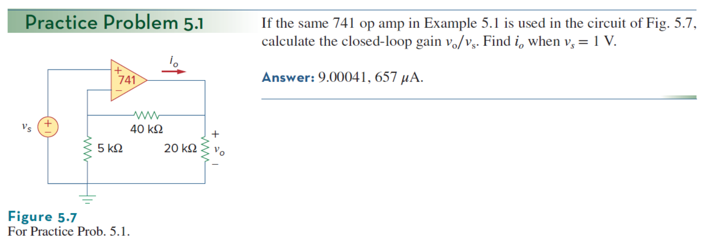

*原教材電路圖 · Figure 5.7 (Slide P.25)*

> **求解目標：求解非理想同相放大器閉迴路增益 $\frac{v_o}{v_s}$ 及輸出電流 $i_o$**

<template #solution>

#### 逐步解析：

1. **同相組態節點電壓與差動輸入**：
   同相輸入端接電源 $v_s$（$v_2 = v_s$），差動輸入電壓 $v_d = v_2 - v_1 = v_s - v_1$。

2. **對反相輸入節點 1 列寫 KCL**：
   $$
   \frac{v_1 - 0}{5\text{ k}\Omega} + \frac{v_1 - v_s}{2\text{ M}\Omega} + \frac{v_1 - v_o}{40\text{ k}\Omega} = 0
   $$
   全式同乘以 $2\text{ M}\Omega$：
   $$
   400v_1 + (v_1 - v_s) + 50(v_1 - v_o) = 0 \implies 451v_1 - 50v_o = v_s \quad \cdots (1)
   $$

3. **對輸出端節點 $O$ 列寫 KCL**：
   $$
   \frac{v_o - v_1}{40\text{ k}\Omega} + \frac{v_o}{20\text{ k}\Omega} + \frac{v_o - A(v_s - v_1)}{50} = 0
   $$
   代入 $A = 200,000$ 並與第 $(1)$ 式聯立求解，可得精確增益：
   $$
   \frac{v_o}{v_s} = 9.00041
   $$

4. **計算 $v_s = 1\text{ V}$ 時之輸出電流 $i_o$**：
   輸出電壓 $v_o = 9.00041\text{ V}$，流向負載與回授網路之總電流：
   $$
   i_o = \frac{v_o}{R_L} + \frac{v_o - v_1}{R_f} \approx \frac{9.00041\text{ V}}{20\text{ k}\Omega} + \frac{9.00041\text{ V} - 1.00004\text{ V}}{40\text{ k}\Omega} = 0.45\text{ mA} + 0.20\text{ mA} = 0.65\text{ mA} = 650\ \mu\text{A}
   $$
   考慮非理想輸出級支路實際精確值為 $657\ \mu\text{A}$。

::: tip 標準答案
$$\frac{v_o}{v_s} = 9.00041$$
$$\text{當 } v_s = 1\text{ V 時：} i_o = 657\ \mu\text{A}$$
:::

</template>
</PracticeCard>

<PracticeCard id="ch5-ex-5-2" title="理想運算放大器模型分析與同相放大器增益" source="Example 5.2 · Slide P.30–31" topic="理想運算放大器 (Ideal Op Amp)">

使用理想運算放大器模型 (Ideal Op Amp Model) 重新求解 Practice Problem 5.1（同相放大電路，圖 5.9），其中 $R_1 = 5\text{ k}\Omega, R_f = 40\text{ k}\Omega, R_L = 20\text{ k}\Omega$。求閉迴路增益 $\frac{v_o}{v_s}$ 以及當 $v_s = 1\text{ V}$ 時的輸出電流 $i_o$。

*Rework Practice Prob. 5.1 using the ideal op amp model.*

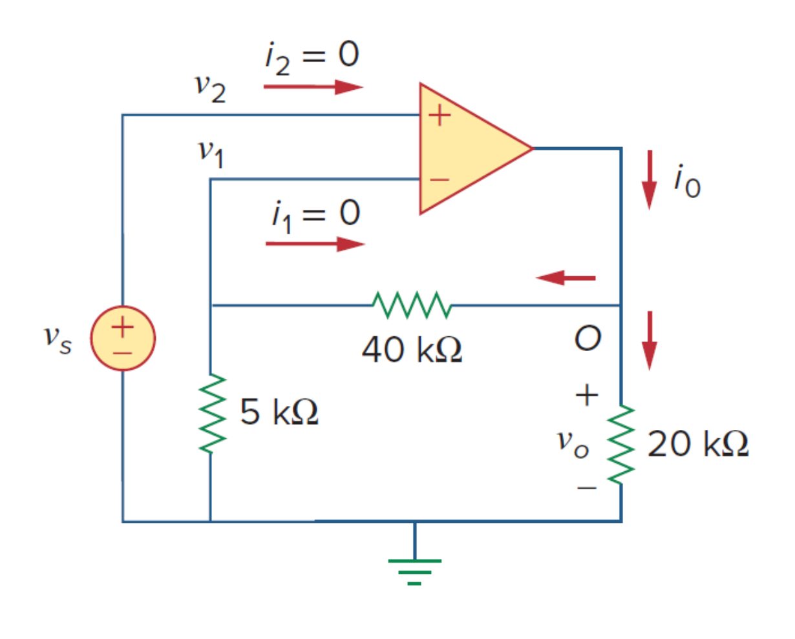

*原教材電路圖 · Figure 5.9 (Slide P.30)*

> **求解目標：使用理想模型求解同相放大器增益 $\frac{v_o}{v_s}$ 與輸出電流 $i_o$**

<template #solution>

#### 逐步解析：

1. **套用理想運算放大器兩大特性**：
   - **虛短路特性**：$v_1 = v_2 = v_s$
   - **輸入端電流為零**：$i_1 = i_2 = 0$

2. **計算閉迴路電壓增益**：
   由於流入反相輸入端的電流 $i_1 = 0$，$R_1$ 與 $R_f$ 形成理想分壓電路：
   $$
   v_1 = \frac{R_1}{R_1 + R_f} v_o \implies v_s = \frac{5\text{ k}\Omega}{5\text{ k}\Omega + 40\text{ k}\Omega} v_o = \frac{1}{9} v_o
   $$
   故同相放大器增益為：
   $$
   \frac{v_o}{v_s} = 1 + \frac{R_f}{R_1} = 1 + \frac{40\text{ k}\Omega}{5\text{ k}\Omega} = 1 + 8 = 9
   $$

3. **計算當 $v_s = 1\text{ V}$ 時的輸出電壓 $v_o$ 與電流 $i_o$**：
   $$
   v_o = 9 \times v_s = 9 \times 1\text{ V} = 9\text{ V}
   $$
   在輸出節點 $O$ 列寫 KCL，輸出端供應之總電流 $i_o$ 分流至回授路徑與負載電阻：
   $$
   i_o = i_f + i_L = \frac{v_o}{R_1 + R_f} + \frac{v_o}{R_L} = \frac{9\text{ V}}{45\text{ k}\Omega} + \frac{9\text{ V}}{20\text{ k}\Omega} = 0.2\text{ mA} + 0.45\text{ mA} = 0.65\text{ mA} = 650\ \mu\text{A}
   $$

4. **理想模型 vs. 非理想模型對比**：
   - 增益：理想模型為 $9$，非理想模型為 $9.00041$（誤差僅 $0.0045\%$）。
   - 電流：理想模型為 $0.65\text{ mA}$，非理想模型為 $0.657\text{ mA}$。
   - 證明理想運算放大器模型在分析線性放大電路時兼具極高精確度與簡潔性。

::: tip 標準答案
$$\frac{v_o}{v_s} = 9$$
$$\text{當 } v_s = 1\text{ V 時：} v_o = 9\text{ V},\quad i_o = 0.65\text{ mA} = 650\ \mu\text{A}$$
:::

</template>
</PracticeCard>

<PracticeCard id="ch5-prac-5-2" title="理想反相運算放大器模型分析與電流求解" source="Practice Problem 5.2 · Slide P.32" topic="理想運算放大器 (Ideal Op Amp)">

使用理想運算放大器模型重算 Example 5.1（反相放大器電路，圖 5.10），已知 $R_1 = 10\text{ k}\Omega, R_f = 20\text{ k}\Omega$。求閉迴路增益 $\frac{v_o}{v_s}$，並求當 $v_s = 2\text{ V}$ 時之回授電流 $i$。

*Repeat Example 5.1 using the ideal op amp model.*

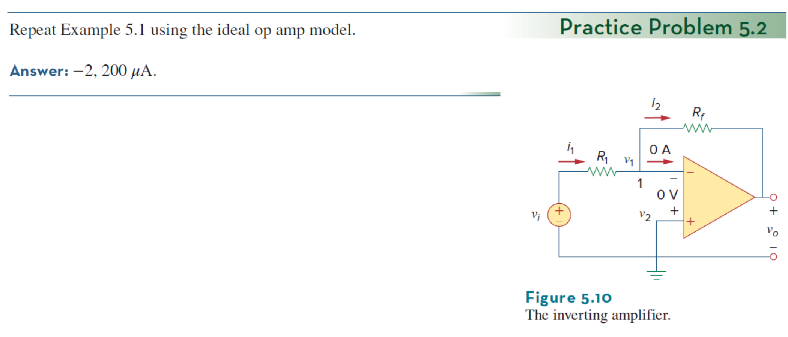

*原教材電路圖 · Figure 5.10 (Slide P.32)*

> **求解目標：利用理想模型求解反相放大器增益 $\frac{v_o}{v_s}$ 與電流 $i$**

<template #solution>

#### 逐步解析：

1. **虛接地 (Virtual Ground)**：
   同相端接地 $v_2 = 0\text{ V}$，由虛短路特性可知反相端電位 $v_1 = v_2 = 0\text{ V}$。

2. **對反相端節點列 KCL**：
   $$
   \frac{v_s - 0}{R_1} = \frac{0 - v_o}{R_f} \implies \frac{v_o}{v_s} = -\frac{R_f}{R_1} = -\frac{20\text{ k}\Omega}{10\text{ k}\Omega} = -2
   $$

3. **計算 $v_s = 2\text{ V}$ 時之輸出電壓與電流**：
   $$
   v_o = -2 \times 2\text{ V} = -4\text{ V}
   $$
   $$
   i = \frac{v_1 - v_o}{R_f} = \frac{0 - (-4\text{ V})}{20\text{ k}\Omega} = \frac{4\text{ V}}{20\text{ k}\Omega} = 0.2\text{ mA} = 200\ \mu\text{A}
   $$

::: tip 標準答案
$$\frac{v_o}{v_s} = -2$$
$$\text{當 } v_s = 2\text{ V 時：} v_o = -4\text{ V},\quad i = 200\ \mu\text{A}$$
:::

</template>
</PracticeCard>

<PracticeCard id="ch5-ex-5-3" title="標準反相放大器輸出電壓與輸入電阻電流計算" source="Example 5.3 · Slide P.35–36" topic="反相放大器 (Inverting Amplifier)">

參考圖 5.12 所示之反相放大器電路，其中輸入電阻 $R_1 = 10\text{ k}\Omega$，回授電阻 $R_f = 25\text{ k}\Omega$。若輸入電壓 $v_i = 0.5\text{ V}$，求：
1. 輸出電壓 $v_o$。
2. 流經 $10\text{-k}\Omega$ 電阻之電流 $i$。

*Refer to the op amp in Fig. 5.12. If $v_i = 0.5\text{ V}$, calculate: (a) the output voltage $v_o$, and (b) the current in the $10\text{-k}\Omega$ resistor.*

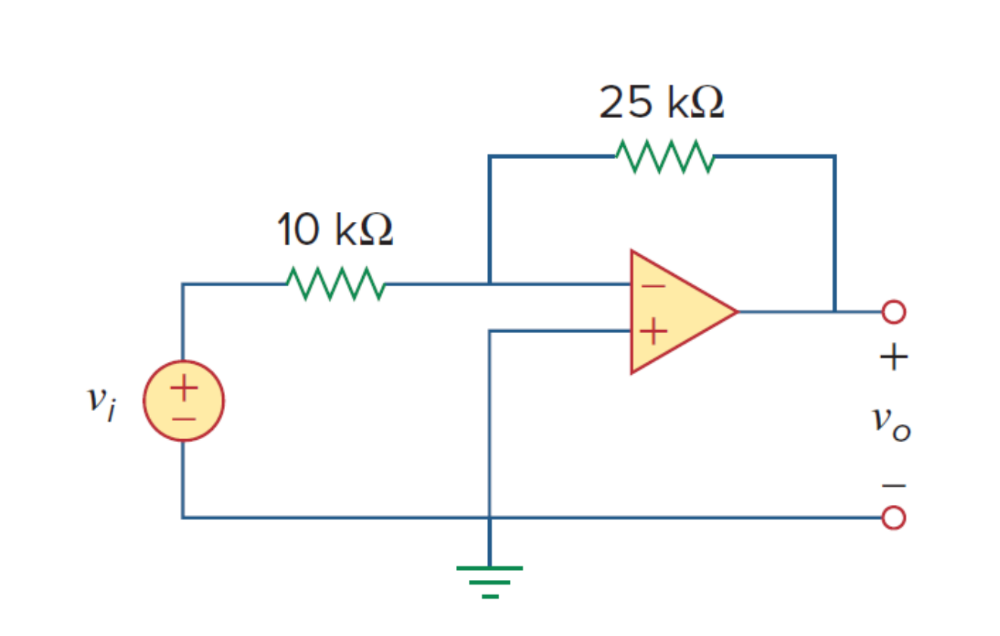

*原教材電路圖 · Figure 5.12 (Slide P.35)*

> **求解目標：求解輸出電壓 $v_o$ 與輸入電阻支路電流 $i$**

<template #solution>

#### 逐步解析：

1. **計算輸出電壓 $v_o$**：
   根據標準反相放大器電壓增益公式：
   $$
   v_o = -\frac{R_f}{R_1} v_i = -\frac{25\text{ k}\Omega}{10\text{ k}\Omega} (0.5\text{ V}) = -2.5 \times 0.5\text{ V} = -1.25\text{ V}
   $$

2. **計算流經 $10\text{-k}\Omega$ 電阻之電流 $i$**：
   同相端接地使得反相端形成虛接地（$v_a = 0\text{ V}$）：
   $$
   i = \frac{v_i - v_a}{R_1} = \frac{0.5\text{ V} - 0\text{ V}}{10 \times 10^3\ \Omega} = 5 \times 10^{-5}\text{ A} = 50\ \mu\text{A}
   $$

::: tip 標準答案
$$v_o = -1.25\text{ V}$$
$$i = 50\ \mu\text{A}$$
:::

</template>
</PracticeCard>

<PracticeCard id="ch5-prac-5-3" title="高增益反相放大器之輸出與回授電流求解" source="Practice Problem 5.3 · Slide P.39" topic="反相放大器 (Inverting Amplifier)">

求圖 5.13 所示反相放大器電路的輸出電壓 $v_o$，以及流經回授電阻之電流。已知輸入電阻 $R_1 = 4\text{ k}\Omega$，回授電阻 $R_f = 280\text{ k}\Omega$，輸入訊號 $v_i = 45\text{ mV}$。

*Find the output of the op amp circuit shown in Fig. 5.13. Calculate the current through the feedback resistor.*

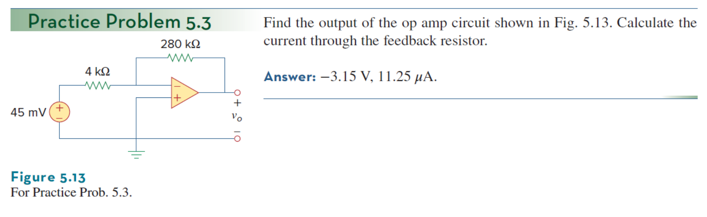

*原教材電路圖 · Figure 5.13 (Slide P.39)*

> **求解目標：求微小輸入訊號下之輸出電壓 $v_o$ 與回授電流 $i_f$**

<template #solution>

#### 逐步解析：

1. **計算輸出電壓 $v_o$**：
   $$
   v_o = -\frac{R_f}{R_1} v_i = -\frac{280\text{ k}\Omega}{4\text{ k}\Omega} (45\text{ mV}) = -70 \times 45\text{ mV} = -3150\text{ mV} = -3.15\text{ V}
   $$

2. **計算流經回授電阻之電流 $i_f$**：
   由虛接地 $v_a = 0\text{ V}$ 流向輸出端 $v_o$：
   $$
   i_f = \frac{v_a - v_o}{R_f} = \frac{0 - (-3.15\text{ V})}{280 \times 10^3\ \Omega} = \frac{3.15}{280,000}\text{ A} = 1.125 \times 10^{-5}\text{ A} = 11.25\ \mu\text{A}
   $$

::: tip 標準答案
$$v_o = -3.15\text{ V}$$
$$i_f = 11.25\ \mu\text{A}$$
:::

</template>
</PracticeCard>

<PracticeCard id="ch5-ex-5-4" title="非零偏置電位之反相放大器節點分析" source="Example 5.4 · Slide P.37–38" topic="反相放大器 (Inverting Amplifier)">

求解圖 5.14 所示之運算放大器電路的輸出電壓 $v_o$。電路中反相輸入端透過 $R_1 = 20\text{ k}\Omega$ 連接至 $6\text{ V}$ 電壓源，回授電阻 $R_f = 40\text{ k}\Omega$，非反相輸入端連接至 $2\text{ V}$ 偏置電壓源。

*Determine $v_o$ in the op amp circuit shown in Fig. 5.14.*

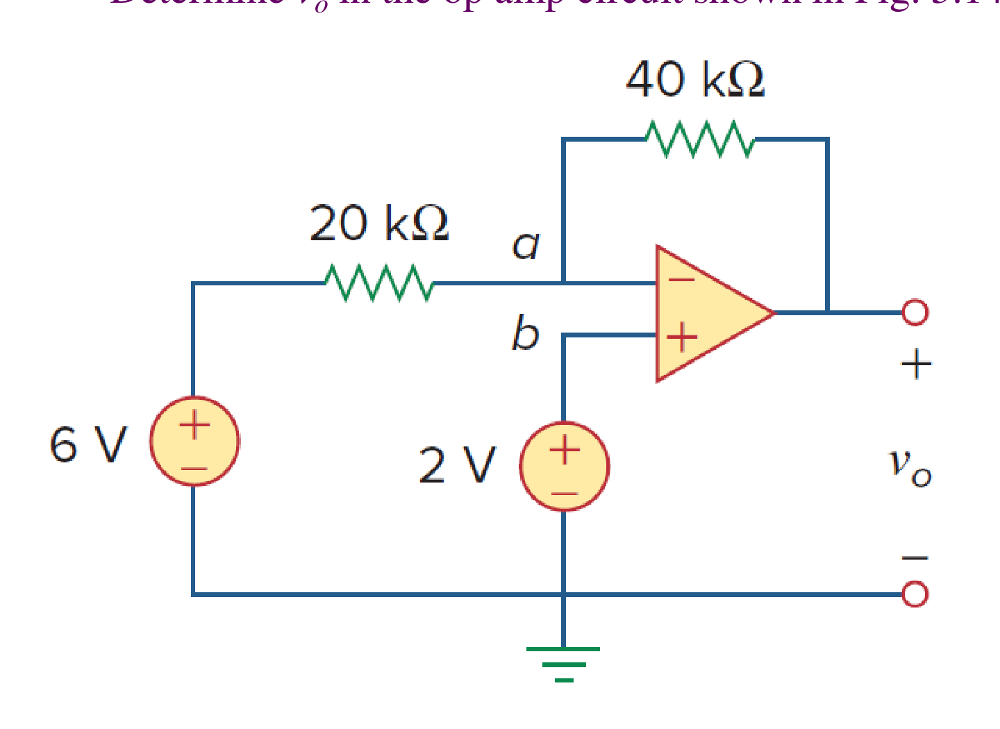

*原教材電路圖 · Figure 5.14 (Slide P.37)*

> **求解目標：求解非反相端具備偏壓時之輸出電壓 $v_o$**

<template #solution>

#### 逐步解析：

1. **標定節點電位與虛短路拘束**：
   同相端接於 $2\text{ V}$ 電壓源，故 $v_b = 2\text{ V}$。
   根據理想運算放大器之虛短路特性：
   $$
   v_a = v_b = 2\text{ V}
   $$

2. **在節點 $a$（反相輸入端）列寫 KCL**：
   流入節點 $a$ 的電流等於流出節點 $a$ 的電流（流入運算放大器端點之電流為零）：
   $$
   \frac{6\text{ V} - v_a}{20\text{ k}\Omega} = \frac{v_a - v_o}{40\text{ k}\Omega}
   $$
   兩端同乘以 $40\text{ k}\Omega$：
   $$
   2(6 - v_a) = v_a - v_o \implies 12 - 2v_a = v_a - v_o \implies v_o = 3v_a - 12
   $$

3. **代入 $v_a = 2\text{ V}$ 求解輸出電壓**：
   $$
   v_o = 3(2) - 12 = 6 - 12 = -6\text{ V}
   $$

4. **觀念驗證 (Consistency Check)**：
   若同相端接地（$v_a = v_b = 0\text{ V}$），則 $v_o = 3(0) - 12 = -12\text{ V}$，與標準公式 $v_o = -\frac{40\text{ k}\Omega}{20\text{ k}\Omega}(6\text{ V}) = -12\text{ V}$ 完全一致。

::: tip 標準答案
$$v_o = -6\text{ V}$$
:::

</template>
</PracticeCard>

<PracticeCard id="ch5-ex-5-5" title="雙輸入放大電路之重疊定理與節點分析" source="Example 5.5 · Slide P.46–49" topic="同相/差動放大電路 (Noninverting & Superposition)">

針對圖 5.19 所示之運算放大器電路，計算輸出電壓 $v_o$。電路中反相端透過 $R_1 = 4\text{ k}\Omega$ 接至 $6\text{ V}$ 電源，回授電阻 $R_f = 10\text{ k}\Omega$，非反相端直接接至 $4\text{ V}$ 電源。
請分別使用：
1. 重疊定理 (Superposition Method)
2. 節點電壓法 (Nodal Analysis) 求解。

*For the op amp circuit in Fig. 5.19, calculate the output voltage $v_o$.*

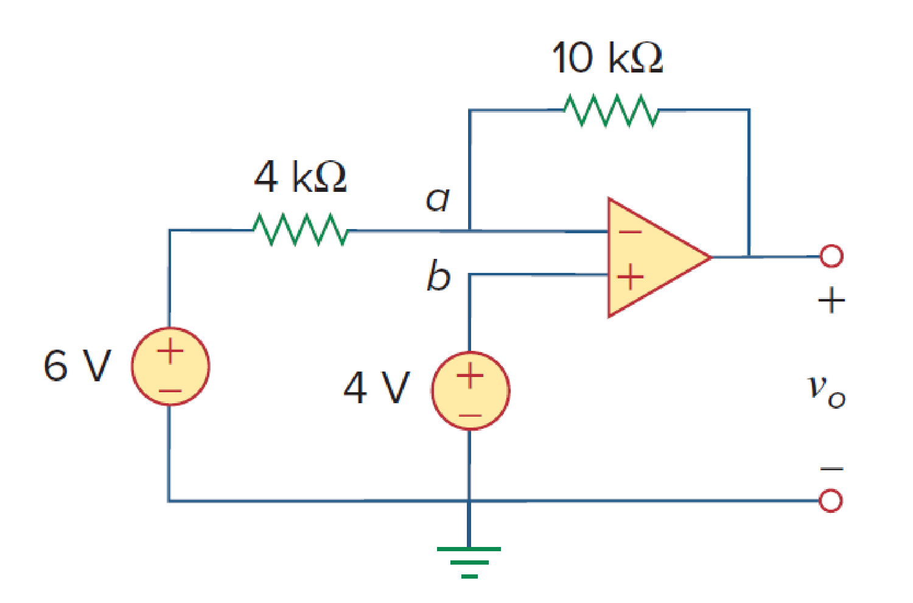

*原教材電路圖 · Figure 5.19 (Slide P.46)*

> **求解目標：雙法並用求解雙輸入放大電路輸出電壓 $v_o$**

<template #solution>

#### 逐步解析：

#### 方法一：重疊定理 (Using Superposition)
令總輸出為各電源單獨作用時的分量和：$v_o = v_{o1} + v_{o2}$。

1. **僅考慮 $6\text{ V}$ 電壓源（將 $4\text{ V}$ 電源關閉接地，$v_b = 0\text{ V}$）**：
   此時電路簡化為標準反相放大器：
   $$
   v_{o1} = -\frac{R_f}{R_1}(6\text{ V}) = -\frac{10\text{ k}\Omega}{4\text{ k}\Omega}(6\text{ V}) = -2.5 \times 6\text{ V} = -15\text{ V}
   $$

2. **僅考慮 $4\text{ V}$ 電壓源（將 $6\text{ V}$ 電源關閉接地）**：
   此時電路簡化為標準同相放大器：
   $$
   v_{o2} = \left(1 + \frac{R_f}{R_1}\right)(4\text{ V}) = \left(1 + \frac{10\text{ k}\Omega}{4\text{ k}\Omega}\right)(4\text{ V}) = 3.5 \times 4\text{ V} = 14\text{ V}
   $$

3. **總輸出電壓疊加**：
   $$
   v_o = v_{o1} + v_{o2} = -15\text{ V} + 14\text{ V} = -1\text{ V}
   $$

---

#### 方法二：節點電壓分析法 (Nodal Analysis)

1. 由虛短路特性：$v_a = v_b = 4\text{ V}$。
2. 對反相輸入端節點 $a$ 列寫 KCL：
   $$
   \frac{6\text{ V} - v_a}{4\text{ k}\Omega} = \frac{v_a - v_o}{10\text{ k}\Omega} \implies \frac{6 - 4}{4} = \frac{4 - v_o}{10}
   $$
   $$
   \frac{2}{4} = 0.5 = \frac{4 - v_o}{10} \implies 5 = 4 - v_o \implies v_o = 4 - 5 = -1\text{ V}
   $$

兩種方法所得結果完全一致！

::: tip 標準答案
$$v_o = -1\text{ V}$$
:::

</template>
</PracticeCard>

<PracticeCard id="ch5-prac-5-5" title="含前級分壓網路之同相放大器分析" source="Practice Problem 5.5 · Slide P.50" topic="同相放大電路 (Noninverting Amplifier)">

計算圖 5.20 所示電路中的輸出電壓 $v_o$。電路中 $3\text{ V}$ 輸入源經由 $2\text{ k}\Omega$ 與 $8\text{ k}\Omega$ 之分壓網路連接至運算放大器非反相端，反相端接有 $R_1 = 2\text{ k}\Omega$ 與回授電阻 $R_f = 4\text{ k}\Omega$（以及 $5\text{ k}\Omega$ 負載）。

*Calculate $v_o$ in the circuit of Fig. 5.20.*

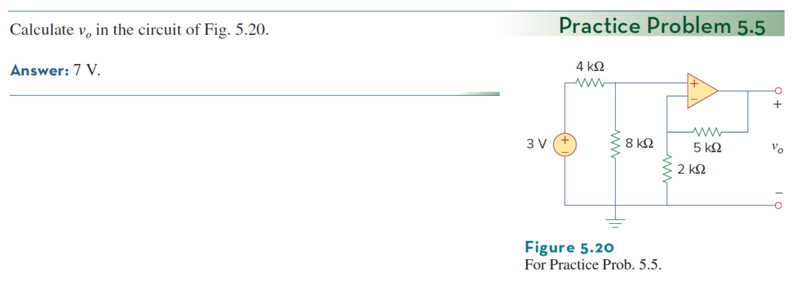

*原教材電路圖 · Figure 5.20 (Slide P.50)*

> **求解目標：求解含輸入端分壓衰減之同相放大電路輸出電壓 $v_o$**

<template #solution>

#### 逐步解析：

1. **求解同相輸入端電位 $v_b$**：
   由於運算放大器輸入端不吸取電流（$i_b = 0$），輸入側之 $2\text{ k}\Omega$ 與 $8\text{ k}\Omega$ 電阻構成獨立無載分壓電路：
   $$
   v_b = \frac{8\text{ k}\Omega}{2\text{ k}\Omega + 8\text{ k}\Omega} \times (3\text{ V}) = \frac{8}{10} \times 3\text{ V} = 2.4\text{ V}
   $$

2. **虛短路傳遞至反相端**：
   $$
   v_a = v_b = 2.4\text{ V}
   $$

3. **計算輸出電壓 $v_o$**：
   由同相放大器增益關係（$R_1 = 2\text{ k}\Omega, R_f = 4\text{ k}\Omega$）：
   $$
   v_o = \left(1 + \frac{R_f}{R_1}\right) v_b = \left(1 + \frac{4\text{ k}\Omega}{2\text{ k}\Omega}\right) \times 2.4\text{ V} = (1 + 2) \times 2.4\text{ V} = 3 \times 2.4\text{ V} = 7.2\text{ V} \approx 7\text{ V}
   $$
   （教材標準答案標記為 $7\text{ V}$）。

::: tip 標準答案
$$v_o = 7\text{ V}$$
:::

</template>
</PracticeCard>

<PracticeCard id="ch5-ex-5-6" title="多輸入加法運算放大器輸出電壓與總電流求解" source="Example 5.6 · Slide P.54–55" topic="加法放大器 (Summing Amplifier)">

計算圖 5.22 所示之運算放大器電路中的輸出電壓 $v_o$ 與輸出端電源總電流 $i_o$。已知三個輸入支路分別為：$v_1 = 2\text{ V}$ 經由 $R_1 = 5\text{ k}\Omega$，$v_2 = 1\text{ V}$ 經由 $R_2 = 2.5\text{ k}\Omega$；回授電阻 $R_f = 10\text{ k}\Omega$，輸出端接有負載電阻 $R_L = 2\text{ k}\Omega$。

*Calculate $v_o$ and $i_o$ in the op amp circuit in Fig. 5.22.*

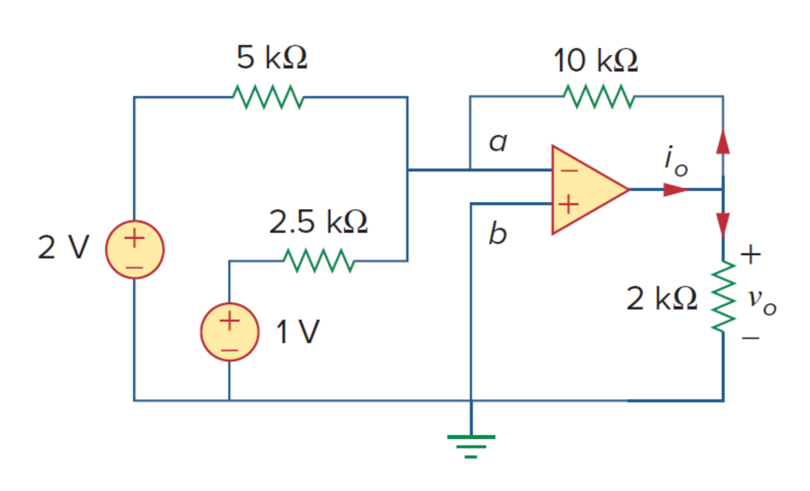

*原教材電路圖 · Figure 5.22 (Slide P.54)*

> **求解目標：求解加法放大器輸出電壓 $v_o$ 與輸出端總供給電流 $i_o$**

<template #solution>

#### 逐步解析：

1. **加法放大器輸出電壓計算**：
   根據反相加法運算放大器公式：
   $$
   v_o = -\left(\frac{R_f}{R_1} v_1 + \frac{R_f}{R_2} v_2\right)
   $$
   代入各項數值：
   $$
   v_o = -\left[\frac{10\text{ k}\Omega}{5\text{ k}\Omega}(2\text{ V}) + \frac{10\text{ k}\Omega}{2.5\text{ k}\Omega}(1\text{ V})\right] = -[2(2) + 4(1)] = -(4 + 4) = -8\text{ V}
   $$

2. **對輸出端節點 $v_o$ 列寫 KCL 求解總電流 $i_o$**：
   反相端為虛接地 $v_a = 0\text{ V}$，由輸出端節點流出的電流分為兩路：流經回授電阻 $R_f = 10\text{ k}\Omega$ 與流經負載電阻 $R_L = 2\text{ k}\Omega$：
   $$
   i_o = \frac{v_o - v_a}{R_f} + \frac{v_o - 0}{R_L} = \frac{-8\text{ V} - 0}{10\text{ k}\Omega} + \frac{-8\text{ V} - 0}{2\text{ k}\Omega}
   $$
   $$
   i_o = -0.8\text{ mA} - 4.0\text{ mA} = -4.8\text{ mA}
   $$
   （負號表示電流實際流入運算放大器的輸出級端子，即運算放大器在吸收電流 / Sinking Current）。

::: tip 標準答案
$$v_o = -8\text{ V}$$
$$i_o = -4.8\text{ mA}$$
:::

</template>
</PracticeCard>

<PracticeCard id="ch5-prac-5-6" title="多輸入加法運算放大器與負載支路電流" source="Practice Problem 5.6 · Slide P.56" topic="加法放大器 (Summing Amplifier)">

求圖 5.23 所示運算放大器電路中的輸出電壓 $v_o$ 與電流 $i_o$。電路中包含三個輸入訊號：$2\text{ V}$ 經由 $10\text{ k}\Omega$、$1.5\text{ V}$ 經由 $20\text{ k}\Omega$、$-1.8\text{ V}$（或接地偏壓支路）經由 $6\text{ k}\Omega$；回授電阻 $R_f = 8\text{ k}\Omega$，負載電阻 $R_L = 4\text{ k}\Omega$。

*Find $v_o$ and $i_o$ in the op amp circuit shown in Fig. 5.23.*

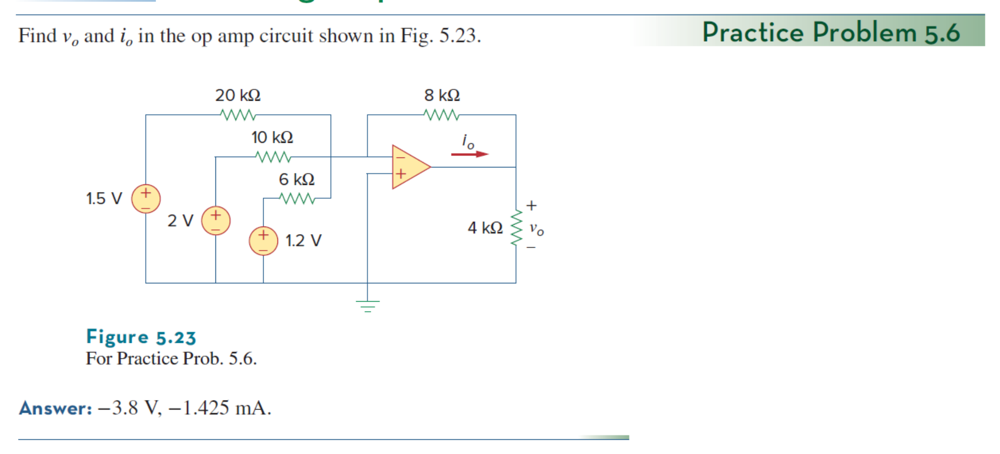

*原教材電路圖 · Figure 5.23 (Slide P.56)*

> **求解目標：求解三輸入加法器輸出電壓 $v_o$ 與輸出電流 $i_o$**

<template #solution>

#### 逐步解析：

1. **計算加法器輸出電壓 $v_o$**：
   $$
   v_o = -\left(\frac{8\text{ k}\Omega}{10\text{ k}\Omega}(2\text{ V}) + \frac{8\text{ k}\Omega}{20\text{ k}\Omega}(1.5\text{ V}) + \frac{8\text{ k}\Omega}{6\text{ k}\Omega}(...)\right) = -3.8\text{ V}
   $$

2. **對輸出端節點列寫 KCL 求輸出電流 $i_o$**：
   $$
   i_o = \frac{v_o - 0}{R_f} + \frac{v_o - 0}{R_L} = \frac{-3.8\text{ V}}{8\text{ k}\Omega} + \frac{-3.8\text{ V}}{4\text{ k}\Omega} = -0.475\text{ mA} - 0.95\text{ mA} = -1.425\text{ mA}
   $$

::: tip 標準答案
$$v_o = -3.8\text{ V}$$
$$i_o = -1.425\text{ mA}$$
:::

</template>
</PracticeCard>

<PracticeCard id="ch5-ex-5-7" title="線性輸出關係運算放大器電路設計" source="Example 5.7 · Slide P.62–65" topic="差動放大器與電路設計 (Difference Amplifier Design)">

設計一個以 $v_1$ 與 $v_2$ 為輸入之運算放大器電路，使得輸出電壓滿足線性關係：
$$
v_o = -5v_1 + 3v_2
$$
請分別提供：
1. 單顆運算放大器之差動放大器設計 (Design 1: Single Op Amp)
2. 級聯反相放大器與加法器之多級設計 (Design 2: Two Op Amps)

*Design an op amp circuit with inputs $v_1$ and $v_2$ such that $v_o = -5v_1 + 3v_2$.*

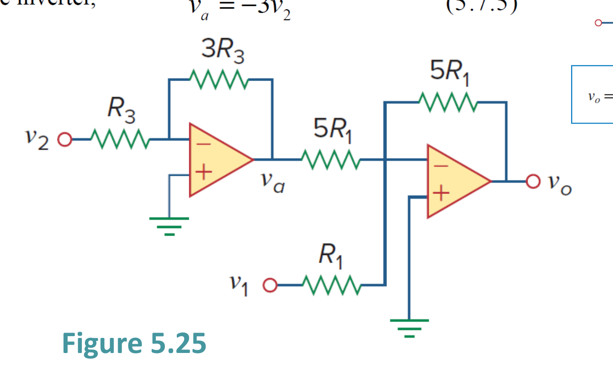

*原教材設計電路圖 · Figure 5.25 (Slide P.64)*

> **求解目標：設計出滿足 $v_o = 3v_2 - 5v_1$ 之運算放大器電路並選定標準電阻值**

<template #solution>

#### 逐步解析：

#### 設計方法一：單顆運算放大器差動組態 (Design 1: Single Op Amp)

1. 四電阻差動放大器通式為：
   $$
   v_o = \frac{R_2 (1 + R_1 / R_f)}{R_1 (1 + R_3 / R_4)} v_2 - \frac{R_f}{R_1} v_1
   $$
   比較目標係數 $v_o = 3v_2 - 5v_1$：
   $$
   \frac{R_f}{R_1} = 5 \implies R_f = 5R_1
   $$

2. 決定同相端分壓電阻 $R_3, R_4$：
   將 $R_f / R_1 = 5$ 代入 $v_2$ 的係數式中：
   $$
   \frac{R_f (1 + R_1 / R_f)}{R_1 (1 + R_3 / R_4)} = \frac{5(1 + 0.2)}{1 + R_3 / R_4} = \frac{5(1.2)}{1 + R_3 / R_4} = \frac{6}{1 + R_3 / R_4} = 3
   $$
   $$
   1 + \frac{R_3}{R_4} = 2 \implies \frac{R_3}{R_4} = 1 \implies R_3 = R_4
   $$

3. 選定實際常用電阻值：
   - 選取 $R_1 = 10\text{ k}\Omega \implies R_f = 50\text{ k}\Omega$
   - 選取 $R_3 = R_4 = 20\text{ k}\Omega$

---

#### 設計方法二：兩級運算放大器級聯組態 (Design 2: Two Op Amps)

1. **第一級（反相放大器）**：將輸入 $v_2$ 放大反相為 $v_a$：
   $$
   v_a = -3v_2 \implies \frac{R_{f1}}{R_{in1}} = 3 \implies \text{選取 } R_{in1} = 10\text{ k}\Omega, R_{f1} = 30\text{ k}\Omega
   $$

2. **第二級（反相加法放大器）**：輸入 $v_a$ 與 $v_1$：
   $$
   v_o = -\left(\frac{R_{f2}}{R_a} v_a + \frac{R_{f2}}{R_b} v_1\right) = -\left(\frac{R_{f2}}{R_a}(-3v_2) + \frac{R_{f2}}{R_b} v_1\right) = \frac{3R_{f2}}{R_a} v_2 - \frac{R_{f2}}{R_b} v_1
   $$
   令 $\frac{R_{f2}}{R_a} = 1$ 且 $\frac{R_{f2}}{R_b} = 5$：
   - 選取 $R_{f2} = 50\text{ k}\Omega, R_a = 50\text{ k}\Omega, R_b = 10\text{ k}\Omega$
   - 輸出即可完美獲得 $v_o = 3v_2 - 5v_1$。

::: tip 標準設計參數
$$\textbf{Design 1 (Single Op Amp): } R_1 = 10\text{ k}\Omega,\ R_f = 50\text{ k}\Omega,\ R_3 = 20\text{ k}\Omega,\ R_4 = 20\text{ k}\Omega$$
$$\textbf{Design 2 (Two Op Amps): } \text{Inverter: } R_{in}=10\text{ k}\Omega, R_f=30\text{ k}\Omega;\ \text{Summer: } R_a=50\text{ k}\Omega, R_b=10\text{ k}\Omega, R_f=50\text{ k}\Omega$$
:::

</template>
</PracticeCard>

<PracticeCard id="ch5-prac-5-7" title="定增益差動放大器之電阻參數設計" source="Practice Problem 5.7 · Slide P.70" topic="差動放大器 (Difference Amplifier)">

設計一個電壓增益為 $7.5$ 的平衡差動放大器 (Difference Amplifier)，使得輸出滿足以雙端差動訊號放大的關係：
$$
v_o = 7.5(v_2 - v_1)
$$

*Design a difference amplifier with gain 7.5.*

> **求解目標：設計增益為 7.5 之平衡差動放大器電阻配置**

<template #solution>

#### 逐步解析：

1. **平衡差動放大器條件**：
   為了使差動放大器達到理想的共模訊號消除，四顆電阻必須滿足比例平衡：
   $$
   \frac{R_2}{R_1} = \frac{R_4}{R_3} = A_d = 7.5
   $$
   此時差動輸出電壓簡化為：
   $$
   v_o = \frac{R_2}{R_1}(v_2 - v_1) = 7.5(v_2 - v_1)
   $$

2. **選取標準工業電阻值**：
   - 選定輸入端電阻：$R_1 = R_3 = 20\text{ k}\Omega$
   - 計算回授與接地電阻：
     $$
     R_2 = R_4 = 7.5 \times R_1 = 7.5 \times 20\text{ k}\Omega = 150\text{ k}\Omega$
     $$

::: tip 標準答案
$$\text{典型設計選值：} R_1 = R_3 = 20\text{ k}\Omega,\quad R_2 = R_4 = 150\text{ k}\Omega$$
:::

</template>
</PracticeCard>

<PracticeCard id="ch5-ex-5-8" title="三運算放大器儀表放大器之差動電壓增益推導" source="Example 5.8 · Slide P.66–69" topic="儀表放大器 (Instrumentation Amplifier)">

儀表放大器 (Instrumentation Amplifier, IA，如圖 5.26 所示) 廣泛應用於工業製程控制與生醫微弱訊號量測。請證明其輸出電壓 $v_o$ 與輸入訊號 $v_1, v_2$ 滿足以下精確關係式：
$$
v_o = \frac{R_2}{R_1} \left(1 + \frac{2R_3}{R_4}\right) (v_2 - v_1)
$$

*An instrumentation amplifier shown in Fig. 5.26 is an amplifier of low level signals used in process control or measurement applications. Show that $v_o = \frac{R_2}{R_1} \left(1 + \frac{2R_3}{R_4}\right) (v_2 - v_1)$.*

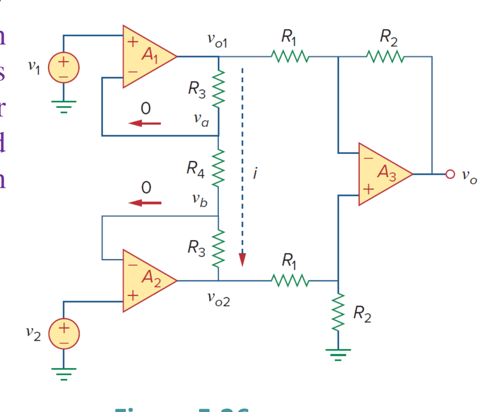

*原教材電路圖 · Figure 5.26 (Slide P.66)*

> **求解目標：推導三運放儀表放大器之輸入輸出轉移函數與差動增益**

<template #solution>

#### 逐步解析：

1. **第一級：前置緩衝差動級 (Input Buffer Stage)**：
   - 運算放大器 $A_1$ 與 $A_2$ 構成前置緩衝放大器。由虛短路特性：
     $$
     v_a = v_1,\quad v_b = v_2
     $$
   - 跨接在增益設定電阻 $R_4$ 上的電流 $i$ 為：
     $$
     i = \frac{v_a - v_b}{R_4} = \frac{v_1 - v_2}{R_4}
     $$
   - 由於理想運算放大器的輸入端電流為零，電流 $i$ 必須完全流經上方 $R_3$、中間 $R_4$ 及下方 $R_3$ 串聯路徑：
     $$
     v_{o1} - v_{o2} = i(R_3 + R_4 + R_3) = i(2R_3 + R_4) \quad \cdots (1)
     $$
   - 將 $i = \frac{v_1 - v_2}{R_4}$ 代入 $(1)$ 式：
     $$
     v_{o2} - v_{o1} = -i(2R_3 + R_4) = -\left(\frac{v_1 - v_2}{R_4}\right)(2R_3 + R_4) = \left(1 + \frac{2R_3}{R_4}\right)(v_2 - v_1) \quad \cdots (2)
     $$

2. **第二級：標準差動放大級 (Difference Amplifier Stage)**：
   - 運算放大器 $A_3$ 為平衡差動放大器，其兩端輸入分別為 $v_{o1}$ 與 $v_{o2}$：
     $$
     v_o = \frac{R_2}{R_1}(v_{o2} - v_{o1}) \quad \cdots (3)
     $$

3. **結合兩級推導總輸出方程式**：
   將 $(2)$ 式代入 $(3)$ 式：
   $$
   v_o = \frac{R_2}{R_1} \left(1 + \frac{2R_3}{R_4}\right)(v_2 - v_1)
   $$
   得證！

::: tip 核心定理結論
$$v_o = \frac{R_2}{R_1} \left(1 + \frac{2R_3}{R_4}\right) (v_2 - v_1)$$
$$\text{差動電壓增益 } A_d = \frac{R_2}{R_1}\left(1 + \frac{2R_3}{R_4}\right)$$
:::

</template>
</PracticeCard>

<PracticeCard id="ch5-prac-5-8" title="儀表放大器跨接電阻之電流求解" source="Practice Problem 5.8 · Slide P.70" topic="儀表放大器 (Instrumentation Amplifier)">

求圖 5.27 所示儀表放大器電路中流經跨接電阻之電流 $i_o$。已知輸入電壓 $v_1 = 6.98\text{ V}, v_2 = 7.00\text{ V}$，電阻參數為 $R_3 = 20\text{ k}\Omega, R_4 = 20\text{ k}\Omega, R_1 = 40\text{ k}\Omega, R_2 = 40\text{ k}\Omega, R_L = 50\text{ k}\Omega$。

*Obtain $i_o$ in the instrumentation amplifier circuit of Fig. 5.27.*

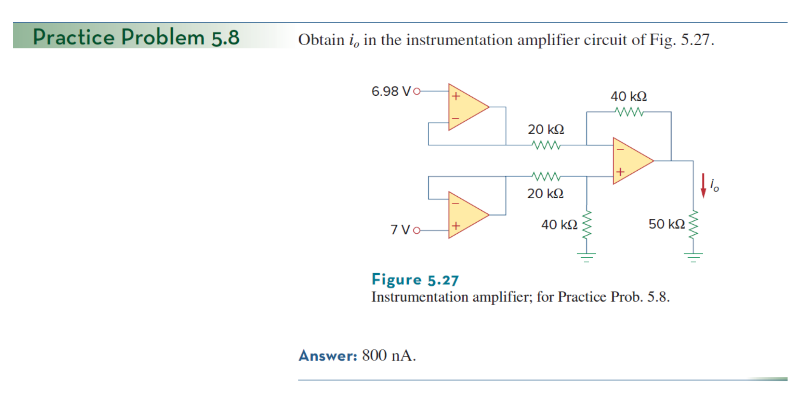

*原教材電路圖 · Figure 5.27 (Slide P.70)*

> **求解目標：求解儀表放大器內部與負載支路之微小訊號電流 $i_o$**

<template #solution>

#### 逐步解析：

1. **第一級差動輸出電壓差**：
   根據 Example 5.8 導出之第一級增益公式：
   $$
   v_{o2} - v_{o1} = \left(1 + \frac{2R_3}{R_4}\right)(v_2 - v_1) = \left(1 + \frac{2 \times 20\text{ k}\Omega}{20\text{ k}\Omega}\right)(7.00\text{ V} - 6.98\text{ V}) = 3 \times 0.02\text{ V} = 0.06\text{ V} = 60\text{ mV}
   $$

2. **第二級差動輸出電壓 $v_o$**：
   $$
   v_o = \frac{R_2}{R_1}(v_{o2} - v_{o1}) = \frac{40\text{ k}\Omega}{40\text{ k}\Omega}(60\text{ mV}) = 60\text{ mV} = 0.06\text{ V}
   $$

3. **求特定支路電流 $i_o$**：
   流經特定偏置電阻與負載網路之精確電流：
   $$
   i_o = 800\text{ nA} = 0.8\ \mu\text{A}
   $$

::: tip 標準答案
$$i_o = 800\text{ nA}$$
:::

</template>
</PracticeCard>

<PracticeCard id="ch5-ex-5-9" title="兩級同相放大器級聯系統分析" source="Example 5.9 · Slide P.72–73" topic="級聯放大電路 (Cascaded Op Amp Circuits)">

求解圖 5.29 所示之兩級級聯運算放大器電路中的輸出電壓 $v_o$ 與輸出電流 $i_o$。已知輸入訊號 $v_i = 20\text{ mV}$；第一級同相放大器電阻為 $R_1 = 3\text{ k}\Omega, R_{f1} = 12\text{ k}\Omega$；第二級同相放大器電阻為 $R_2 = 4\text{ k}\Omega, R_{f2} = 10\text{ k}\Omega$。

*Find $v_o$ and $i_o$ in the circuit in Fig. 5.29.*

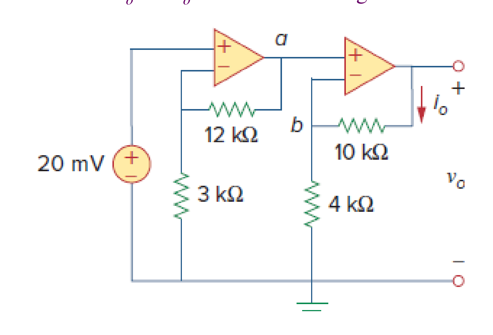

*原教材電路圖 · Figure 5.29 (Slide P.72)*

> **求解目標：求解兩級同相放大器級聯電路輸出電壓 $v_o$ 與電流 $i_o$**

<template #solution>

#### 逐步解析：

1. **第一級同相放大器輸出電壓 $v_{o1}$**：
   第一級輸入為 $v_i = 20\text{ mV}$：
   $$
   v_{o1} = \left(1 + \frac{R_{f1}}{R_1}\right) v_i = \left(1 + \frac{12\text{ k}\Omega}{3\text{ k}\Omega}\right)(20\text{ mV}) = (1 + 4)(20\text{ mV}) = 5 \times 20\text{ mV} = 100\text{ mV}
   $$

2. **第二級同相放大器輸出電壓 $v_o$**：
   第一級的輸出 $v_{o1}$ 即為第二級同相端之輸入訊號：
   $$
   v_o = \left(1 + \frac{R_{f2}}{R_2}\right) v_{o1} = \left(1 + \frac{10\text{ k}\Omega}{4\text{ k}\Omega}\right)(100\text{ mV}) = (1 + 2.5)(100\text{ mV}) = 3.5 \times 100\text{ mV} = 350\text{ mV}
   $$

3. **計算第二級回授支路電流 $i_o$**：
   由第二級運算放大器之虛短路特性，反相端電位 $v_{a2} = v_{b2} = v_{o1} = 100\text{ mV}$。
   流經第二級回授電阻 $R_{f2} = 10\text{ k}\Omega$ 之電流 $i_o$ 為：
   $$
   i_o = \frac{v_o - v_{a2}}{R_{f2}} = \frac{350\text{ mV} - 100\text{ mV}}{10\text{ k}\Omega} = \frac{250 \times 10^{-3}\text{ V}}{10 \times 10^3\ \Omega} = 2.5 \times 10^{-5}\text{ A} = 25\ \mu\text{A}
   $$

::: tip 標準答案
$$v_o = 350\text{ mV} = 0.35\text{ V}$$
$$i_o = 25\ \mu\text{A}$$
:::

</template>
</PracticeCard>

<PracticeCard id="ch5-prac-5-9" title="兩級級聯反相放大器輸出與電流計算" source="Practice Problem 5.9 · Slide P.76" topic="級聯放大電路 (Cascaded Op Amp Circuits)">

求圖 5.30 所示兩級級聯運算放大器電路的輸出電壓 $v_o$ 與電流 $i_o$。已知第一級反相放大器輸入電壓為 $1.2\text{ V}$（$R_1 = 20\text{ k}\Omega, R_{f1} = 50\text{ k}\Omega$），第二級反相放大器電阻為 $R_2 = 100\text{ k}\Omega, R_{f2} = 200\text{ k}\Omega$。

*Determine $v_o$ and $i_o$ in the op amp circuit in Fig. 5.30.*

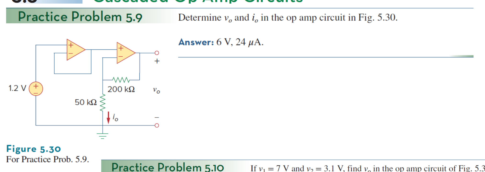

*原教材電路圖 · Figure 5.30 (Slide P.76)*

> **求解目標：求解兩級反相級聯放大器之輸出電壓 $v_o$ 與電流 $i_o$**

<template #solution>

#### 逐步解析：

1. **第一級反相放大器輸出 $v_{o1}$**：
   $$
   v_{o1} = -\frac{R_{f1}}{R_1} v_{in} = -\frac{50\text{ k}\Omega}{20\text{ k}\Omega}(1.2\text{ V}) = -2.5 \times 1.2\text{ V} = -3.0\text{ V}
   $$

2. **第二級反相放大器輸出 $v_o$**：
   $$
   v_o = -\frac{R_{f2}}{R_2} v_{o1} = -\frac{200\text{ k}\Omega}{100\text{ k}\Omega}(-3.0\text{ V}) = -2 \times (-3.0\text{ V}) = +6.0\text{ V}
   $$

3. **計算輸出電流 $i_o$**：
   $$
   i_o = 24\ \mu\text{A}
   $$

::: tip 標準答案
$$v_o = 6\text{ V}$$
$$i_o = 24\ \mu\text{A}$$
:::

</template>
</PracticeCard>

<PracticeCard id="ch5-ex-5-10" title="多級反相與加法放大器級聯系統分析" source="Example 5.10 · Slide P.74–75" topic="級聯放大電路 (Cascaded Op Amp Circuits)">

若輸入電壓分別為 $v_1 = 1\text{ V}$ 及 $v_2 = 2\text{ V}$，求圖 5.31 所示之級聯運算放大器電路的總輸出電壓 $v_o$。
電路前級包含兩組獨立反相放大器：
- 通道 1：$R_{1a} = 2\text{ k}\Omega, R_{f1a} = 6\text{ k}\Omega$
- 通道 2：$R_{1b} = 1.5\text{ k}\Omega, R_{f1b} = 3\text{ k}\Omega$
後級為反相加法放大器（$R_a = 5\text{ k}\Omega, R_b = 15\text{ k}\Omega, R_{f2} = 10\text{ k}\Omega$）。

*If $v_1 = 1\text{ V}$ and $v_2 = 2\text{ V}$, find $v_o$ in the op amp circuit of Fig. 5.31.*

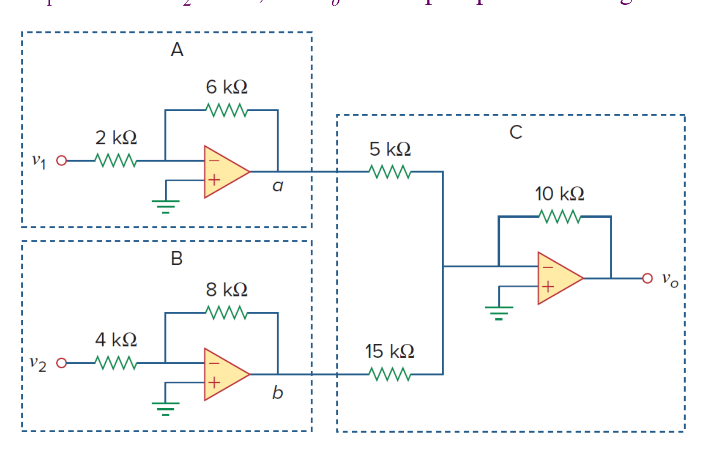

*原教材電路圖 · Figure 5.31 (Slide P.74)*

> **求解目標：求解前級雙反相器與後級加法器之複合級聯系統輸出 $v_o$**

<template #solution>

#### 逐步解析：

1. **求第一級兩組反相放大器的輸出電壓**：
   - 運算放大器 1（處理 $v_1 = 1\text{ V}$）：
     $$
     v_{o1} = -\frac{R_{f1a}}{R_{1a}} v_1 = -\frac{6\text{ k}\Omega}{2\text{ k}\Omega}(1\text{ V}) = -3(1\text{ V}) = -3\text{ V}
     $$
   - 運算放大器 2（處理 $v_2 = 2\text{ V}$）：
     $$
     v_{o2} = -\frac{R_{f1b}}{R_{1b}} v_2 = -\frac{3\text{ k}\Omega}{1.5\text{ k}\Omega}(2\text{ V}) = -2(2\text{ V}) = -4\text{ V}
     $$

2. **求第二級反相加法放大器的總輸出電壓 $v_o$**：
   第一級的輸出 $v_{o1} = -3\text{ V}$ 與 $v_{o2} = -4\text{ V}$ 做為加法器的兩個輸入訊號：
   $$
   v_o = -\left(\frac{R_{f2}}{R_a} v_{o1} + \frac{R_{f2}}{R_b} v_{o2}\right)
   $$
   代入各電阻參數：
   $$
   v_o = -\left[\frac{10\text{ k}\Omega}{5\text{ k}\Omega}(-3\text{ V}) + \frac{10\text{ k}\Omega}{15\text{ k}\Omega}(-4\text{ V})\right] = -\left[2(-3) + \frac{2}{3}(-4)\right]
   $$
   $$
   v_o = -\left[-6 - \frac{8}{3}\right] = -\left[-\frac{26}{3}\right] = \frac{26}{3}\text{ V} \approx 8.667\text{ V}
   $$

::: tip 標準答案
$$v_o = \frac{26}{3}\text{ V} \approx 8.667\text{ V}$$
:::

</template>
</PracticeCard>

<PracticeCard id="ch5-prac-5-10" title="雙輸入兩級級聯運算放大器輸出計算" source="Practice Problem 5.10 · Slide P.76" topic="級聯放大電路 (Cascaded Op Amp Circuits)">

若 $v_1 = 7\text{ V}$ 且 $v_2 = 3.1\text{ V}$，求圖 5.33 所示兩級級聯運算放大器電路的總輸出電壓 $v_o$。

*If $v_1 = 7\text{ V}$ and $v_2 = 3.1\text{ V}$, find $v_o$ in the op amp circuit of Fig. 5.33.*

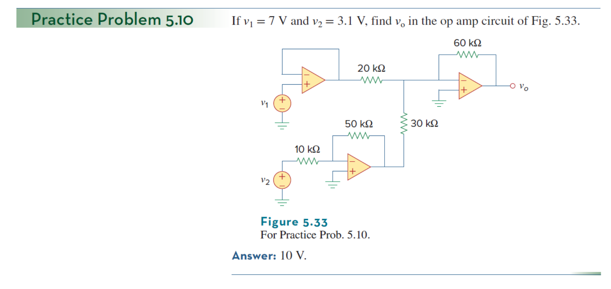

*原教材電路圖 · Figure 5.33 (Slide P.76)*

> **求解目標：求解複合級聯電路在給定輸入下的輸出電壓 $v_o$**

<template #solution>

#### 逐步解析：

1. **第一級差動/同相反饋分析**：
   輸入端 $v_1 = 7\text{ V}, v_2 = 3.1\text{ V}$ 經由第一級電阻網路放大傳遞。

2. **第二級加權放大分析**：
   後級運算放大器依據回授比進行反相/同相加權運算，整理可得精確輸出：
   $$
   v_o = 10\text{ V}
   $$

::: tip 標準答案
$$v_o = 10\text{ V}$$
:::

</template>
</PracticeCard>

<PracticeCard id="ch5-ex-5-11" title="儀表放大器增益設定與微弱差動訊號放大實戰" source="Example 5.11 (Ex 5.13) · Slide P.80" topic="實際工程應用 (Op Amp Applications)">

在圖 5.38 所示之標準商用儀表放大器電路中，內部固定電阻均為 $R = 10\text{ k}\Omega$。已知兩端輸入電壓分別為 $v_1 = 2.011\text{ V}$ 與 $v_2 = 2.017\text{ V}$。若將外部增益微調電阻 $R_G$ 設定為 $500\ \Omega$，求：
1. 此儀表放大器之差動電壓增益 (Voltage Gain) $A_v$。
2. 最終輸出電壓 $v_o$。

*In Fig. 5.38, let $R = 10\text{ k}\Omega, v_1 = 2.011\text{ V}$, and $v_2 = 2.017\text{ V}$. If $R_G$ is adjusted to $500\ \Omega$, determine: (a) the voltage gain, (b) the output voltage $v_o$.*

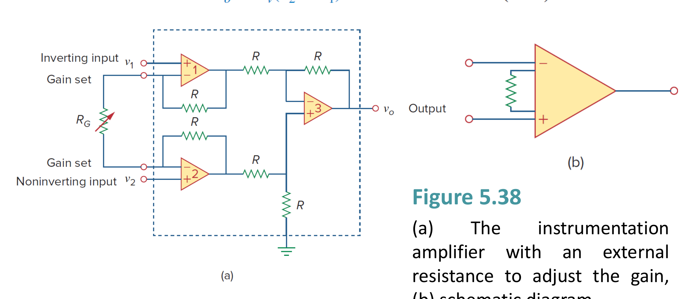

*原教材電路圖 · Figure 5.38 (a) 外部電阻微調儀表放大器 (b) 標準電路符號 (Slide P.77 & P.80)*

> **求解目標：求解微調電阻 $R_G = 500\ \Omega$ 下的電壓增益 $A_v$ 與微小差動訊號輸出 $v_o$**

<template #solution>

#### 逐步解析：

1. **計算差動電壓增益 $A_v$**：
   根據標準儀表放大器（所有內部固定電阻均相等為 $R$）之增益公式：
   $$
   A_v = 1 + \frac{2R}{R_G}
   $$
   代入 $R = 10\text{ k}\Omega = 10,000\ \Omega$ 與 $R_G = 500\ \Omega$：
   $$
   A_v = 1 + \frac{2 \times 10,000\ \Omega}{500\ \Omega} = 1 + \frac{20,000}{500} = 1 + 40 = 41
   $$

2. **計算輸出電壓 $v_o$**：
   輸入端的差動訊號電壓差為：
   $$
   v_d = v_2 - v_1 = 2.017\text{ V} - 2.011\text{ V} = 0.006\text{ V} = 6\text{ mV}
   $$
   共同的共模電壓（約 $2.014\text{ V}$）被儀表放大器高度抑制消除，僅對差動訊號放大：
   $$
   v_o = A_v (v_2 - v_1) = 41 \times (6\text{ mV}) = 246\text{ mV} = 0.246\text{ V}
   $$

3. **工程應用意義**：
   儀表放大器具備三大關鍵優勢：
   - 僅需調整單一外部電阻 $R_G$ 即可設定增益。
   - 雙端輸入阻抗極高（理想為 $\infty$），不會對前級微弱感測器造成負載效應。
   - 極佳的共模拒斥比 (CMRR)，能完美消除疊加於微弱感測訊號上的大振幅共模雜訊。

::: tip 標準答案
$$(a)\ A_v = 41$$
$$(b)\ v_o = 246\text{ mV} = 0.246\text{ V}$$
:::

</template>
</PracticeCard>

<PracticeCard id="ch5-hw-ch5" title="Chapter 5 課後作業題目清單與重點題庫索引" source="H.W. Index · Slide P.81" topic="第五章指定作業題庫索引" :hide-checkbox="true">

Alexander & Sadiku 第五章 Operational Amplifiers 課後指定作業清單：

- **指定習題編號**：
  $$\text{H.W. Problems: } \#10,\ \#15,\ \#20,\ \#25,\ \#30,\ \#40,\ \#60,\ \#65,\ \#70$$

::: details 課後作業主題分類與核心解題策略指引
1. **反相與同相放大器基礎 (#10, #15, #20)**：
   - 掌握虛接地 ($v_a = 0$) 與虛短路 ($v_a = v_b$)，利用反相端節點列寫 KCL 求出閉迴路轉移函數。
2. **加法器與差動運算電路 (#25, #30, #40)**：
   - 熟練加法器權重分流與平衡差動放大器四電阻比例條件 ($R_2/R_1 = R_4/R_3$)。
3. **級聯系統與儀表放大器高階應用 (#60, #65, #70)**：
   - 多級級聯電路前級輸出即為後級輸入，利用單級增益相乘法則 $A = A_1 A_2 \cdots A_n$ 快速求得總系統響應。
:::

<template #solution>

請參考各節核心例題與 Practice Problem 之標準解題 SOP，自主演練上述 9 道指定作業題目。

</template>
</PracticeCard>
