# 互動式範例與練習題庫：Chapter 6 電容與電感 (Capacitors and Inductors)

歡迎來到《電路學》第六章 **電容與電感 (Capacitors and Inductors)** 的互動式範例與練習題庫！本頁面收錄了本章所有核心例題與練習題的詳細解析、步驟推導與公式應用。

::: details Chapter 6 核心公式與解題要訣

### 1. 電容器 (Capacitor)
- **伏安特性（V-I Relationship）**：
  $$i(t) = C \frac{dv(t)}{dt}$$
- **電壓與電流互換（積分形式）**：
  $$v(t) = v(t_0) + \frac{1}{C} \int_{t_0}^{t} i(\tau) d\tau$$
- **電荷量與電壓關係**：
  $$q(t) = C v(t)$$
- **儲存電場能量 (Energy Storage)**：
  $$w(t) = \frac{1}{2} C v^2(t) = \frac{q^2(t)}{2C}$$
- **串聯與並聯組合**：
  - **串聯 (Series)**：$\frac{1}{C_{\text{eq}}} = \frac{1}{C_1} + \frac{1}{C_2} + \cdots + \frac{1}{C_n}$
  - **並聯 (Parallel)**：$C_{\text{eq}} = C_1 + C_2 + \cdots + C_n$

### 2. 電感器 (Inductor)
- **伏安特性（V-I Relationship）**：
  $$v(t) = L \frac{di(t)}{dt}$$
- **電流與電壓互換（積分形式）**：
  $$i(t) = i(t_0) + \frac{1}{L} \int_{t_0}^{t} v(\tau) d\tau$$
- **儲存磁場能量 (Energy Storage)**：
  $$w(t) = \frac{1}{2} L i^2(t)$$
- **串聯與並聯組合**：
  - **串聯 (Series)**：$L_{\text{eq}} = L_1 + L_2 + \cdots + L_n$
  - **並聯 (Parallel)**：$\frac{1}{L_{\text{eq}}} = \frac{1}{L_1} + \frac{1}{L_2} + \cdots + \frac{1}{L_n}$

:::

<PracticeProgress :total="30" prefix="ch6-" />

---

<PracticeCard id="ch6-ex1" title="電容器儲存電荷量與靜電能量計算" source="Example 6.1 · Page 224" topic="電容基本特性與儲能 (Capacitor Charge & Energy)">

(a) 計算跨接 $20\text{ V}$ 電壓之 $3\text{ pF}$ 電容器所儲存的電荷量 $q$。

(b) 求該電容器所儲存的靜電能量 $w$。

*(a) Calculate the charge stored on a $3\text{-pF}$ capacitor with $20\text{ V}$ across it.*

*(b) Find the energy stored in the capacitor.*

> **求解目標：計算電容器儲存的電荷量 $q$ 與靜電能量 $w$**

<template #solution>

#### 逐步解析：

1. **電荷量計算**：
   根據電容器之電荷-電壓基本定義式：
   $$
   q = C v
   $$
   代入已知參數 $C = 3\text{ pF} = 3 \times 10^{-12}\text{ F}$ 與端電壓 $v = 20\text{ V}$：
   $$
   q = (3 \times 10^{-12}\text{ F}) \times (20\text{ V}) = 60 \times 10^{-12}\text{ C} = 60\text{ pC}
   $$

2. **儲存能量計算**：
   電容器儲存之靜電能量 $w$ 可由端電壓與電容量計算：
   $$
   w = \frac{1}{2} C v^2 = \frac{1}{2} \times (3 \times 10^{-12}\text{ F}) \times (20\text{ V})^2 = \frac{1}{2} \times (3 \times 10^{-12}) \times 400 = 600 \times 10^{-12}\text{ J} = 600\text{ pJ}
   $$
   亦可利用電荷公式 $w = \frac{q^2}{2C}$ 相互驗證：
   $$
   w = \frac{q^2}{2C} = \frac{(60 \times 10^{-12}\text{ C})^2}{2 \times (3 \times 10^{-12}\text{ F})} = \frac{3600 \times 10^{-24}}{6 \times 10^{-12}} = 600\text{ pJ}
   $$

::: tip 標準答案

$$\text{(a) } q = 60\text{ pC}$$

$$\text{(b) } w = 600\text{ pJ}$$

:::

</template>

</PracticeCard>

<PracticeCard id="ch6-pr1" title="電容器端電壓與儲能反求計算" source="Practice Problem 6.1 · Page 224" topic="電容基本特性與儲能 (Capacitor Charge & Energy)">

若一個 $4.5\ \mu\text{F}$ 電容器其中一個極板上的電荷量為 $0.12\text{ mC}$，試求其兩端電壓 $v$ 為何？此時電容器儲存了多少能量 $w$？

*What is the voltage across a $4.5\text{-}\mu\text{F}$ capacitor if the charge on one plate is $0.12\text{ mC}$? How much energy is stored?*

> **求解目標：由給定電荷量與電容量反求電壓 $v$ 及儲存能量 $w$**

<template #solution>

#### 逐步解析：

1. **求解電容器兩端電壓 $v$**：
   根據電荷與電容之關係式 $q = C v$，反求電壓 $v$：
   $$
   v = \frac{q}{C}
   $$
   代入 $q = 0.12\text{ mC} = 0.12 \times 10^{-3}\text{ C}$ 與 $C = 4.5\ \mu\text{F} = 4.5 \times 10^{-6}\text{ F}$：
   $$
   v = \frac{0.12 \times 10^{-3}\text{ C}}{4.5 \times 10^{-6}\text{ F}} = \frac{120}{4.5}\text{ V} = \frac{80}{3}\text{ V} \approx 26.67\text{ V}
   $$

2. **計算儲存能量 $w$**：
   利用儲能關係式 $w = \frac{1}{2} q v$ 計算：
   $$
   w = \frac{1}{2} q v = \frac{1}{2} \times (0.12 \times 10^{-3}\text{ C}) \times \left(\frac{80}{3}\text{ V}\right) = 1.6 \times 10^{-3}\text{ J} = 1.6\text{ mJ}
   $$
   亦可由 $w = \frac{q^2}{2C}$ 進行驗算：
   $$
   w = \frac{q^2}{2C} = \frac{(0.12 \times 10^{-3}\text{ C})^2}{2 \times (4.5 \times 10^{-6}\text{ F})} = \frac{1.44 \times 10^{-8}}{9 \times 10^{-6}} = 1.6 \times 10^{-3}\text{ J} = 1.6\text{ mJ}
   $$

::: tip 標準答案

$$v = \frac{80}{3}\text{ V} \approx 26.67\text{ V},\quad w = 1.6\text{ mJ}$$

:::

</template>

</PracticeCard>

<PracticeCard id="ch6-ex2" title="弦波電壓激勵下電容器電流響應" source="Example 6.2 · Page 224" topic="電容時域微分特性 (Capacitor v-i Relation)">

某 $5\ \mu\text{F}$ 電容器兩端之端電壓為 $v(t) = 10\cos(6000t)\text{ V}$，試計算流經該電容器之電流 $i(t)$。

*The voltage across a $5\text{-}\mu\text{F}$ capacitor is $v(t) = 10\cos(6000t)\text{ V}$. Calculate the current through it.*

> **求解目標：由時變電壓函數利用微分特性求電流 $i(t)$**

<template #solution>

#### 逐步解析：

1. **建立電容器端電壓與電流之微分關係式**：
   $$
   i(t) = C \frac{dv(t)}{dt}
   $$

2. **對時間進行微分**：
   已知 $C = 5\ \mu\text{F} = 5 \times 10^{-6}\text{ F}$，端電壓為 $v(t) = 10\cos(6000t)\text{ V}$：
   $$
   \frac{dv(t)}{dt} = \frac{d}{dt}\left[10\cos(6000t)\right] = 10 \times (-6000)\sin(6000t) = -60{,}000\sin(6000t)\text{ V/s}
   $$

3. **代入計算電流 $i(t)$**：
   $$
   i(t) = (5 \times 10^{-6}\text{ F}) \times \left[-60{,}000\sin(6000t)\right] = -0.3\sin(6000t)\text{ A}
   $$

::: tip 標準答案

$$i(t) = -0.3\sin(6000t)\text{ A}$$

:::

</template>

</PracticeCard>

<PracticeCard id="ch6-pr2" title="正弦電壓源驅動下之電容電流推導" source="Practice Problem 6.2 · Page 225" topic="電容時域微分特性 (Capacitor v-i Relation)">

若某 $10\ \mu\text{F}$ 電容器連接至電壓源 $v(t) = 75\sin(2000t)\text{ V}$，試求流經該電容器之電流 $i(t)$。

*If a $10\text{-}\mu\text{F}$ capacitor is connected to a voltage source with $v(t) = 75\sin(2000t)\text{ V}$, determine the current through the capacitor.*

> **求解目標：求解正弦電壓激勵下的電容分支電流 $i(t)$**

<template #solution>

#### 逐步解析：

1. **微分關係式**：
   電容器電流為端電壓對時間之變化率乘上電容量：
   $$
   i(t) = C \frac{dv(t)}{dt}
   $$

2. **對時間求導**：
   已知 $C = 10\ \mu\text{F} = 10 \times 10^{-6}\text{ F}$，電壓為 $v(t) = 75\sin(2000t)\text{ V}$：
   $$
   \frac{dv(t)}{dt} = \frac{d}{dt}\left[75\sin(2000t)\right] = 75 \times 2000\cos(2000t) = 150{,}000\cos(2000t)\text{ V/s}
   $$

3. **計算電流 $i(t)$**：
   $$
   i(t) = (10 \times 10^{-6}\text{ F}) \times \left[150{,}000\cos(2000t)\right] = 1.5\cos(2000t)\text{ A}
   $$
   *(註：原課本初稿印本答案誤植單位為 $\text{V}$，此處依電路物理量規範校正為安培 $\text{A}$)*

::: tip 標準答案

$$i(t) = 1.5\cos(2000t)\text{ A}$$

:::

</template>

</PracticeCard>

<PracticeCard id="ch6-ex3" title="指數衰減電流激勵下電容器電壓積分響應" source="Example 6.3 · Page 225" topic="電容時域積分特性 (Capacitor Integral Relation)">

若流經某 $2\ \mu\text{F}$ 電容器之電流為 $i(t) = 6e^{-3000t}\text{ mA}$，且初始電壓為零（$v(0) = 0$），試求該電容器兩端之端電壓 $v(t)$。

*Determine the voltage across a $2\text{-}\mu\text{F}$ capacitor if the current through it is $i(t) = 6e^{-3000t}\text{ mA}$. Assume that the initial capacitor voltage is zero.*

> **求解目標：利用定積分與初始條件求解電容端電壓函數 $v(t)$**

<template #solution>

#### 逐步解析：

1. **建立積分關係式**：
   根據電容器電壓之積分定義式：
   $$
   v(t) = \frac{1}{C}\int_0^t i(\tau)\,d\tau + v(0)
   $$
   已知初始電壓 $v(0) = 0\text{ V}$。

2. **代入參數與定積分計算**：
   已知 $C = 2\ \mu\text{F} = 2 \times 10^{-6}\text{ F}$，電流 $i(\tau) = 6 \times 10^{-3} e^{-3000\tau}\text{ A}$：
   $$
   v(t) = \frac{1}{2 \times 10^{-6}} \int_0^t 6 \times 10^{-3} e^{-3000\tau}\,d\tau + 0
   $$
   提出常數並求積分：
   $$
   v(t) = \frac{6 \times 10^{-3}}{2 \times 10^{-6}} \left[ \frac{e^{-3000\tau}}{-3000} \right]_0^t = 3000 \times \left( -\frac{1}{3000} \right) \left[ e^{-3000t} - e^0 \right]
   $$
   化簡整理得：
   $$
   v(t) = -1 \cdot (e^{-3000t} - 1) = 1 - e^{-3000t}\text{ V}\quad (t \ge 0)
   $$

::: tip 標準答案

$$v(t) = (1 - e^{-3000t})\text{ V}$$

:::

</template>

</PracticeCard>

<PracticeCard id="ch6-pr3" title="正弦交變電流激勵下指定時刻電容電壓計算" source="Practice Problem 6.3 · Page 225" topic="電容時域積分特性 (Capacitor Integral Relation)">

流經某 $100\ \mu\text{F}$ 電容器之電流為 $i(t) = 50\sin(120\pi t)\text{ mA}$。設初始電壓 $v(0) = 0\text{ V}$，試計算在 $t = 1\text{ ms}$ 與 $t = 5\text{ ms}$ 時該電容器兩端之端電壓。

*The current through a $100\text{-}\mu\text{F}$ capacitor is $i(t) = 50\sin(120\pi t)\text{ mA}$. Calculate the voltage across it at $t = 1\text{ ms}$ and $t = 5\text{ ms}$. Take $v(0) = 0$.*

> **求解目標：導出端電壓積分函數並計算特定時間點之數值**

<template #solution>

#### 逐步解析：

1. **導出時域電壓函數 $v(t)$**：
   由電容積分本質式：
   $$
   v(t) = \frac{1}{C}\int_0^t i(\tau)\,d\tau + v(0)
   $$
   代入 $C = 100\ \mu\text{F} = 10^{-4}\text{ F}$、$i(\tau) = 50 \times 10^{-3}\sin(120\pi\tau)\text{ A}$ 與 $v(0) = 0$：
   $$
   v(t) = \frac{1}{10^{-4}} \int_0^t 50 \times 10^{-3} \sin(120\pi\tau)\,d\tau = 500 \left[ -\frac{\cos(120\pi\tau)}{120\pi} \right]_0^t
   $$
   $$
   v(t) = \frac{500}{120\pi} \left[1 - \cos(120\pi t)\right] = \frac{25}{6\pi}\left[1 - \cos(120\pi t)\right]\text{ V}
   $$
   其中常數係數 $\frac{25}{6\pi} \approx 1.326291\text{ V}$。

2. **計算 $t = 1\text{ ms} = 10^{-3}\text{ s}$ 時之端電壓**：
   $$
   120\pi t = 120\pi \times 10^{-3} = 0.12\pi\text{ rad} = 21.6^\circ
   $$
   $$
   \cos(0.12\pi) = \cos(21.6^\circ) \approx 0.929776
   $$
   $$
   v(1\text{ ms}) = 1.326291 \times (1 - 0.929776) = 1.326291 \times 0.070224 \approx 0.093138\text{ V} = 93.14\text{ mV}
   $$

3. **計算 $t = 5\text{ ms} = 5 \times 10^{-3}\text{ s}$ 時之端電壓**：
   $$
   120\pi t = 120\pi \times 5 \times 10^{-3} = 0.6\pi\text{ rad} = 108^\circ
   $$
   $$
   \cos(0.6\pi) = \cos(108^\circ) \approx -0.309017
   $$
   $$
   v(5\text{ ms}) = 1.326291 \times [1 - (-0.309017)] = 1.326291 \times 1.309017 \approx 1.73614\text{ V} \approx 1.736\text{ V}
   $$

::: tip 標準答案

$$v(1\text{ ms}) = 93.14\text{ mV},\quad v(5\text{ ms}) = 1.736\text{ V}$$

:::

</template>

</PracticeCard>

<PracticeCard id="ch6-ex4" title="分段折線電壓波形之電容電流推導與繪圖" source="Example 6.4 · Page 225" topic="電容波形分析 (Capacitor Waveform Derivative)">

某 $200\ \mu\text{F}$ 電容器兩端之端電壓波形如圖 6.9 所示。試求流經該電容器之電流 $i(t)$ 並繪出其電流波形。

*Determine the current through a $200\text{-}\mu\text{F}$ capacitor whose voltage is shown in Fig. 6.9.*

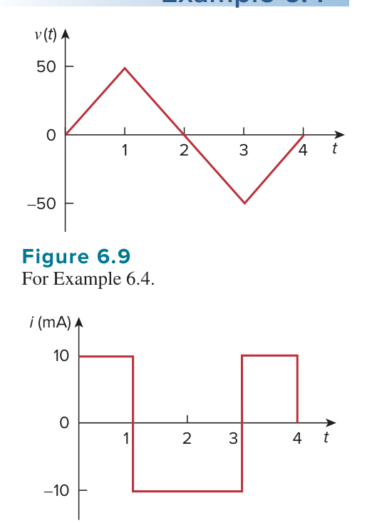

*原教材電壓波形圖 · Figure 6.9 For Example 6.4 (Page 225)*

> **求解目標：建立分段連續電壓數學函數，藉由逐段求導繪出電流響應波形圖**

<template #solution>

#### 逐步解析：

1. **建立電壓波形 $v(t)$ 之分段數學式**：
   由圖 6.9 可知各時間區間之電壓直線方程式：
   - 當 $0 < t < 1\text{ s}$：直線通過 $(0, 0)$ 與 $(1, 50)$，斜率為 $50\text{ V/s}$：
     $$v(t) = 50t\text{ V}$$
   - 當 $1 < t < 3\text{ s}$：直線通過 $(1, 50)$ 與 $(3, -50)$，斜率為 $\frac{-50 - 50}{3 - 1} = -50\text{ V/s}$：
     $$v(t) - 50 = -50(t - 1) \implies v(t) = 100 - 50t\text{ V}$$
   - 當 $3 < t < 4\text{ s}$：直線通過 $(3, -50)$ 與 $(4, 0)$，斜率為 $\frac{0 - (-50)}{4 - 3} = 50\text{ V/s}$：
     $$v(t) - 0 = 50(t - 4) \implies v(t) = -200 + 50t\text{ V}$$
   - 當 $t < 0$ 或 $t > 4$ 時：$v(t) = 0\text{ V}$。

   整理可得完整的電壓函數：
   $$
   v(t) = \begin{cases}
   50t\text{ V}, & 0 < t < 1 \\
   100 - 50t\text{ V}, & 1 < t < 3 \\
   -200 + 50t\text{ V}, & 3 < t < 4 \\
   0, & \text{其他 (otherwise)}
   \end{cases}
   $$

2. **逐段微分求解電流 $i(t) = C \frac{dv}{dt}$**：
   已知電容值 $C = 200\ \mu\text{F} = 200 \times 10^{-6}\text{ F} = 2 \times 10^{-4}\text{ F}$。
   計算各區間斜率 $\frac{dv}{dt}$：
   $$
   \frac{dv}{dt} = \begin{cases}
   50\text{ V/s}, & 0 < t < 1 \\
   -50\text{ V/s}, & 1 < t < 3 \\
   50\text{ V/s}, & 3 < t < 4 \\
   0, & \text{其他}
   \end{cases}
   $$
   將各斜率代入電流公式 $i(t) = C \frac{dv}{dt}$：
   $$
   i(t) = (200 \times 10^{-6}\text{ F}) \times \frac{dv}{dt} = \begin{cases}
   10\text{ mA}, & 0 < t < 1 \\
   -10\text{ mA}, & 1 < t < 3 \\
   10\text{ mA}, & 3 < t < 4 \\
   0, & \text{其他}
   \end{cases}
   $$

3. **繪製電流波形**：
   所得之階波電流響應波形如圖 6.10 所示：

   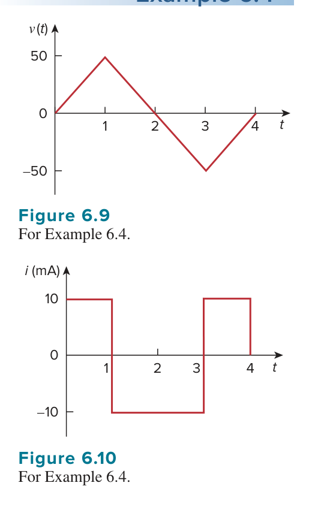

   *原教材電流響應波形圖 · Figure 6.10 For Example 6.4 (Page 225)*

::: tip 標準答案

$$i(t) = \begin{cases}
10\text{ mA}, & 0 < t < 1\text{ s} \\
-10\text{ mA}, & 1 < t < 3\text{ s} \\
10\text{ mA}, & 3 < t < 4\text{ s} \\
0, & \text{其他}
\end{cases}$$

*(電流響應波形如圖 6.10 所示)*

:::

</template>

</PracticeCard>

<PracticeCard id="ch6-pr4" title="給定電流波形求解特定時刻電容電壓" source="Practice Problem 6.4 · Page 226" topic="電容波形分析 (Capacitor Waveform Integral)">

一個初始未充電（$v(0) = 0$）的 $1\text{ mF}$ 電容器，其流經之電流波形如圖 6.11 所示。試計算在 $t = 2\text{ ms}$ 與 $t = 5\text{ ms}$ 時該電容器兩端之端電壓。

*An initially uncharged $1\text{-mF}$ capacitor has the current shown in Fig. 6.11 across it. Calculate the voltage across it at $t = 2\text{ ms}$ and $t = 5\text{ ms}$.*

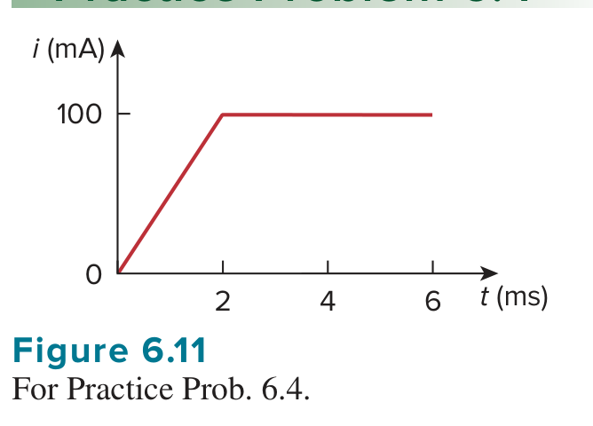

*原教材電流激勵波形圖 · Figure 6.11 For Practice Prob. 6.4 (Page 226)*

> **求解目標：利用幾何面積積分法（或分段積分）求指定時間點之電容端電壓**

<template #solution>

#### 逐步解析：

1. **積分原理與電荷累積幾何詮釋**：
   由電容器電壓積分基本關係式：
   $$
   v(t) = \frac{1}{C}\int_0^t i(\tau)\,d\tau + v(0) = \frac{q(t)}{C}
   $$
   其中 $\int_0^t i(\tau)\,d\tau$ 即為 $i-t$ 曲線在時間區間 $[0, t]$ 圍成之幾何面積。

2. **計算 $t = 2\text{ ms}$ 時之端電壓**：
   由圖 6.11 可知，在 $0 \le t \le 2\text{ ms}$ 期間，電流由 $0$ 線性上升至 $100\text{ mA}$。
   其所圍之面積為底為 $2\text{ ms}$、高為 $100\text{ mA}$ 的三角形面積：
   $$
   q(2\text{ ms}) = \frac{1}{2} \times (2 \times 10^{-3}\text{ s}) \times (100 \times 10^{-3}\text{ A}) = 100 \times 10^{-6}\text{ C} = 100\ \mu\text{C}
   $$
   代入電容值 $C = 1\text{ mF} = 1 \times 10^{-3}\text{ F}$：
   $$
   v(2\text{ ms}) = \frac{q(2\text{ ms})}{C} = \frac{100 \times 10^{-6}\text{ C}}{1 \times 10^{-3}\text{ F}} = 100 \times 10^{-3}\text{ V} = 100\text{ mV}
   $$

3. **計算 $t = 5\text{ ms}$ 時之端電壓**：
   在 $2\text{ ms} \le t \le 5\text{ ms}$ 期間，電流維持恆定值 $100\text{ mA}$。
   此區間內新增的電荷量為矩形面積：
   $$
   \Delta q = (5\text{ ms} - 2\text{ ms}) \times 100\text{ mA} = (3 \times 10^{-3}\text{ s}) \times (100 \times 10^{-3}\text{ A}) = 300 \times 10^{-6}\text{ C} = 300\ \mu\text{C}
   $$
   因此在 $t = 5\text{ ms}$ 時累積的總電荷量為：
   $$
   q(5\text{ ms}) = q(2\text{ ms}) + \Delta q = 100\ \mu\text{C} + 300\ \mu\text{C} = 400\ \mu\text{C} = 400 \times 10^{-6}\text{ C}
   $$
   代入電容值求得端電壓：
   $$
   v(5\text{ ms}) = \frac{q(5\text{ ms})}{C} = \frac{400 \times 10^{-6}\text{ C}}{1 \times 10^{-3}\text{ F}} = 400 \times 10^{-3}\text{ V} = 400\text{ mV}
   $$

::: tip 標準答案

$$v(2\text{ ms}) = 100\text{ mV},\quad v(5\text{ ms}) = 400\text{ mV}$$

:::

</template>

</PracticeCard>

<PracticeCard id="ch6-ex5" title="直流穩態下電阻電容電路之端電壓與儲能分析" source="Example 6.5 · Page 226" topic="直流穩態電容等效 (DC Steady State Analysis)">

在直流 (dc) 穩態條件下，求圖 6.12(a) 中各電容器所儲存的靜電能量。

*Obtain the energy stored in each capacitor in Fig. 6.12(a) under dc conditions.*

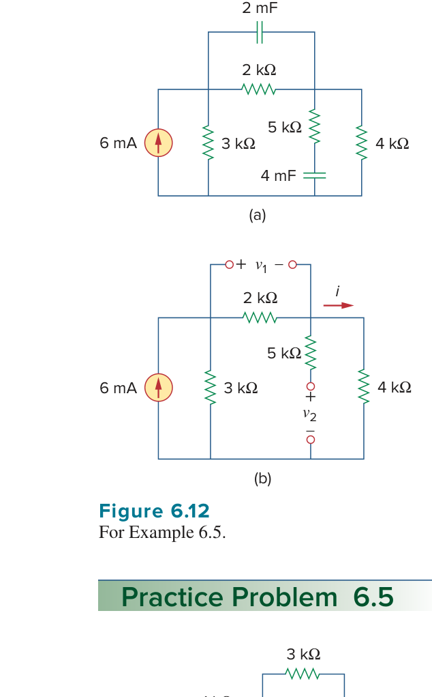

*原教材電路圖與直流等效電路 · Figure 6.12 (a) 原始電路 (b) 直流開路等效電路 (Page 226)*

> **求解目標：應用電容直流開路特性，計算電容端電壓與各電容儲能**

<template #solution>

#### 逐步解析：

1. **建立直流穩態開路等效電路**：
   在直流穩態條件下，電壓與電流不隨時間改變（$\frac{dv}{dt} = 0$），因此電容電流 $i_C = C \frac{dv}{dt} = 0$。所有電容器皆等效為**開路 (Open Circuit)**，等效電路如圖 6.12(b) 所示。

2. **分析等效電路求解支路電流 $i$**：
   - 最右側的 $5\text{ k}\Omega$ 電阻與開路端串聯，無電流流通（$i_{5\text{k}} = 0$）。
   - 獨立電流源 $6\text{ mA}$ 由兩條並聯支路承載：一條為 $3\text{ k}\Omega$ 電阻支路，另一條為 $2\text{ k}\Omega$ 與 $4\text{ k}\Omega$ 串聯組成的支路（總電阻 $2\text{ k}\Omega + 4\text{ k}\Omega = 6\text{ k}\Omega$）。
   - 利用分流定則 (Current Division) 計算流經串聯支路之電流 $i$：
     $$
     i = \frac{3\text{ k}\Omega}{3\text{ k}\Omega + (2\text{ k}\Omega + 4\text{ k}\Omega)} \times (6\text{ mA}) = \frac{3}{9} \times 6\text{ mA} = 2\text{ mA}
     $$

3. **計算各電容器端電壓 $v_1$ 與 $v_2$**：
   - 電容 $C_1 = 2\text{ mF}$ 跨接於 $2\text{ k}\Omega$ 電阻兩端，端電壓為：
     $$
     v_1 = 2\text{ k}\Omega \times i = (2000\ \Omega) \times (2 \times 10^{-3}\text{ A}) = 4\text{ V}
     $$
   - 電容 $C_2 = 4\text{ mF}$ 跨接於 $4\text{ k}\Omega$ 與 $5\text{ k}\Omega$ 支路外端至參考地。由於 $5\text{ k}\Omega$ 電阻無電流通過（零壓降），故 $v_2$ 等於 $4\text{ k}\Omega$ 電阻兩端電壓：
     $$
     v_2 = 4\text{ k}\Omega \times i = (4000\ \Omega) \times (2 \times 10^{-3}\text{ A}) = 8\text{ V}
     $$

4. **計算各電容器儲存之能量**：
   - 電容 $C_1 = 2\text{ mF}$ 所儲存能量 $w_1$：
     $$
     w_1 = \frac{1}{2} C_1 v_1^2 = \frac{1}{2} \times (2 \times 10^{-3}\text{ F}) \times (4\text{ V})^2 = 16 \times 10^{-3}\text{ J} = 16\text{ mJ}
     $$
   - 電容 $C_2 = 4\text{ mF}$ 所儲存能量 $w_2$：
     $$
     w_2 = \frac{1}{2} C_2 v_2^2 = \frac{1}{2} \times (4 \times 10^{-3}\text{ F}) \times (8\text{ V})^2 = 128 \times 10^{-3}\text{ J} = 128\text{ mJ}
     $$

::: tip 標準答案

$$w_1 = 16\text{ mJ},\quad w_2 = 128\text{ mJ}$$

:::

</template>

</PracticeCard>

<PracticeCard id="ch6-pr5" title="橋接網絡直流穩態電容儲能計算" source="Practice Problem 6.5 · Page 226" topic="直流穩態電容等效 (DC Steady State Analysis)">

在直流 (dc) 穩態條件下，試求圖 6.13 所示電路中各電容器所儲存的能量。

*Under dc conditions, find the energy stored in the capacitors in Fig. 6.13.*

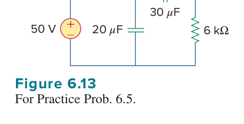

*原教材電路圖 · Figure 6.13 For Practice Prob. 6.5 (Page 226)*

> **求解目標：將電容直流開路化簡電路，求解各電容端電壓與儲能**

<template #solution>

#### 逐步解析：

1. **直流穩態電容開路等效分析**：
   在直流穩態下，電容器充飽電後等效為**開路 (Open Circuit)**，無電流流過電容分支。
   將 $20\ \mu\text{F}$ 與 $30\ \mu\text{F}$ 兩個電容器視為開路後，電路成為單一串聯迴路：
   - 獨立電壓源 $50\text{ V}$ 與電阻 $1\text{ k}\Omega$、$3\text{ k}\Omega$、$6\text{ k}\Omega$ 依序串聯回接地端。

2. **計算迴路電流與各節點電壓**：
   - 迴路總串聯電阻：
     $$
     R_{\text{total}} = 1\text{ k}\Omega + 3\text{ k}\Omega + 6\text{ k}\Omega = 10\text{ k}\Omega
     $$
   - 迴路電流：
     $$
     I = \frac{50\text{ V}}{10\text{ k}\Omega} = 5\text{ mA}
     $$
   - 設電路底端為接地參考節點（$0\text{ V}$）：
     - 節點 A（$1\text{ k}\Omega$、$3\text{ k}\Omega$ 與 $20\ \mu\text{F}$ 電容之交點）：
       $$
       V_A = 50\text{ V} - I \times (1\text{ k}\Omega) = 50\text{ V} - (5\text{ mA}) \times (1\text{ k}\Omega) = 45\text{ V}
       $$
     - 節點 B（$3\text{ k}\Omega$、$6\text{ k}\Omega$ 與 $30\ \mu\text{F}$ 電容之交點）：
       $$
       V_B = I \times (6\text{ k}\Omega) = (5\text{ mA}) \times (6\text{ k}\Omega) = 30\text{ V}
       $$

3. **計算各電容器之端電壓**：
   - 對於 $C_1 = 20\ \mu\text{F}$ 電容器：
     此電容器接於節點 A 與接地端之間，端電壓為：
     $$
     v_{20\mu\text{F}} = V_A - 0 = 45\text{ V}
     $$
   - 對於 $C_2 = 30\ \mu\text{F}$ 電容器：
     此電容器跨接於節點 A 與節點 B 之間（即跨接於 $3\text{ k}\Omega$ 電阻兩端），端電壓為：
     $$
     v_{30\mu\text{F}} = V_A - V_B = 45\text{ V} - 30\text{ V} = 15\text{ V}
     $$
     （亦可由歐姆定律驗算：$v_{30\mu\text{F}} = I \times 3\text{ k}\Omega = 5\text{ mA} \times 3\text{ k}\Omega = 15\text{ V}$）

4. **計算各電容器儲存之能量**：
   - $20\ \mu\text{F}$ 電容器儲存之能量 $w_1$：
     $$
     w_1 = \frac{1}{2} C_1 v_{20\mu\text{F}}^2 = \frac{1}{2} \times (20 \times 10^{-6}\text{ F}) \times (45\text{ V})^2 = 10 \times 10^{-6} \times 2025 = 20{,}250 \times 10^{-6}\text{ J} = 20.25\text{ mJ}
     $$
   - $30\ \mu\text{F}$ 電容器儲存之能量 $w_2$：
     $$
     w_2 = \frac{1}{2} C_2 v_{30\mu\text{F}}^2 = \frac{1}{2} \times (30 \times 10^{-6}\text{ F}) \times (15\text{ V})^2 = 15 \times 10^{-6} \times 225 = 3{,}375 \times 10^{-6}\text{ J} = 3.375\text{ mJ}
     $$

::: tip 標準答案

$$w_{20\mu\text{F}} = 20.25\text{ mJ},\quad w_{30\mu\text{F}} = 3.375\text{ mJ}$$

:::

</template>

</PracticeCard>
<PracticeCard id="ch6-ex6" title="電容器串並聯網路之等效電容化簡" source="Example 6.6 · Page 228" topic="電容器串聯與並聯 (Series and Parallel Capacitors)">

求圖 6.16 電路中端點 $a$ 與 $b$ 之間所見的等效電容 $C_{eq}$。

*Find the equivalent capacitance seen between terminals $a$ and $b$ of the circuit in Fig. 6.16.*

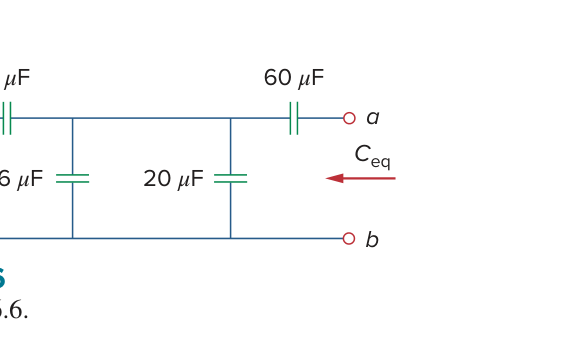

*原教材電路圖 · Figure 6.16 (Page 228)*

> **求解目標：運用電容串聯與並聯之組合定則，逐步化簡階梯電容網路並求端點等效電容 $C_{eq}$**

<template #solution>

#### 逐步解析：

1. **最左側支路串聯化簡**：
   觀察圖 6.16 最左端，$20\ \mu\text{F}$ 與 $5\ \mu\text{F}$ 電容器呈串聯連接。依據串聯電容公式（與電阻並聯形式相同）：
   $$
   C_{s1} = 20\ \mu\text{F} \parallel 5\ \mu\text{F} = \frac{20 \times 5}{20 + 5}\ \mu\text{F} = \frac{100}{25}\ \mu\text{F} = 4\ \mu\text{F}
   $$

2. **中間並聯區塊合併**：
   此化簡後之等效電容 $4\ \mu\text{F}$ 與中間垂直支路的 $6\ \mu\text{F}$ 電容及右側垂直支路的 $20\ \mu\text{F}$ 電容皆並聯於同一組節點對之間。依據並聯電容公式（直接相加）：
   $$
   C_{p1} = 4\ \mu\text{F} + 6\ \mu\text{F} + 20\ \mu\text{F} = 30\ \mu\text{F}
   $$

3. **輸入端串聯電容計算**：
   此並聯等效電容 $C_{p1} = 30\ \mu\text{F}$ 與端點 $a$ 處串接的 $60\ \mu\text{F}$ 電容器相串聯。因此整個電路在端點 $a$、$b$ 之間所見之總等效電容為：
   $$
   C_{eq} = \frac{30 \times 60}{30 + 60}\ \mu\text{F} = \frac{1800}{90}\ \mu\text{F} = 20\ \mu\text{F}
   $$

::: tip 標準答案

$$C_{eq} = 20\ \mu\text{F}$$

:::

</template>

</PracticeCard>

<PracticeCard id="ch6-pr6" title="階梯型電容網路之等效電容求解" source="Practice Problem 6.6 · Page 229" topic="電容器串聯與並聯 (Series and Parallel Capacitors)">

求圖 6.17 電路端點處所見的等效電容 $C_{eq}$。

*Find the equivalent capacitance seen at the terminals of the circuit in Fig. 6.17.*

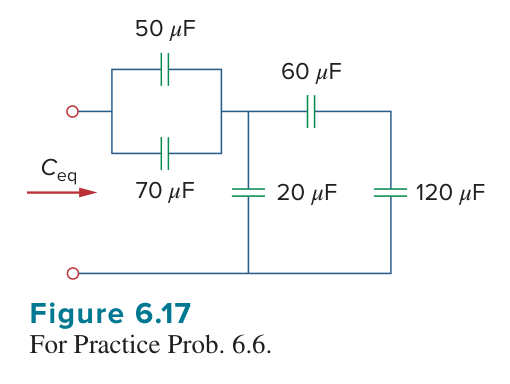

*原教材電路圖 · Figure 6.17 (Page 229)*

> **求解目標：由後向前逐步化簡階梯式電容網路，求端點總等效電容 $C_{eq}$**

<template #solution>

#### 逐步解析：

1. **末端串聯支路化簡**：
   從遠離輸入端的電路最右側著手，$60\ \mu\text{F}$ 電容器與最右端垂直支路的 $120\ \mu\text{F}$ 電容器呈串聯連接：
   $$
   C_{s1} = 60\ \mu\text{F} \parallel 120\ \mu\text{F} = \frac{60 \times 120}{60 + 120}\ \mu\text{F} = \frac{7200}{180}\ \mu\text{F} = 40\ \mu\text{F}
   $$

2. **中間垂直支路並聯化簡**：
   此等效電容 $C_{s1} = 40\ \mu\text{F}$ 與中間垂直支路的 $20\ \mu\text{F}$ 電容器為並聯連接：
   $$
   C_{p1} = 20\ \mu\text{F} + 40\ \mu\text{F} = 60\ \mu\text{F}
   $$

3. **前端並聯支路化簡**：
   觀察輸入端前端的雙並聯分支，由 $50\ \mu\text{F}$ 與 $70\ \mu\text{F}$ 電容器並聯組成：
   $$
   C_{p2} = 50\ \mu\text{F} + 70\ \mu\text{F} = 120\ \mu\text{F}
   $$

4. **總等效電容計算**：
   最後，前端等效電容 $C_{p2} = 120\ \mu\text{F}$ 與後級網路等效電容 $C_{p1} = 60\ \mu\text{F}$ 互相串聯：
   $$
   C_{eq} = \frac{120 \times 60}{120 + 60}\ \mu\text{F} = \frac{7200}{180}\ \mu\text{F} = 40\ \mu\text{F}
   $$

::: tip 標準答案

$$C_{eq} = 40\ \mu\text{F}$$

:::

</template>

</PracticeCard>

<PracticeCard id="ch6-ex7" title="電容串並聯電路之各元件端電壓與電荷分佈分析" source="Example 6.7 · Page 229" topic="電容器串並聯與電壓分配 (Capacitor Voltage & Charge Distribution)">

針對圖 6.18 所示之電路，求跨接於各電容器兩端的端電壓 $v_1$、$v_2$ 與 $v_3$。

*For the circuit in Fig. 6.18, find the voltage across each capacitor.*

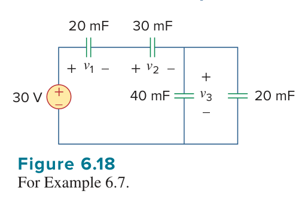

*原教材電路圖 · Figure 6.18 (Page 229)*

> **求解目標：先求全電路等效電容與總儲存電荷，再利用電荷守恆與 KVL 求解各電容端電壓**

<template #solution>

#### 逐步解析：

1. **求解全電路等效電容 $C_{eq}$**：
   觀察圖 6.18，最右側並聯的兩個電容器 $40\text{ mF}$ 與 $20\text{ mF}$ 可先合併為：
   $$
   C_p = 40\text{ mF} + 20\text{ mF} = 60\text{ mF}
   $$
   此並聯等效電容 $60\text{ mF}$ 與 $20\text{ mF}$ 及 $30\text{ mF}$ 電容器依序串聯，等效電路如圖 6.19 所示。全電路總等效電容為：
   $$
   \frac{1}{C_{eq}} = \frac{1}{20\text{ mF}} + \frac{1}{30\text{ mF}} + \frac{1}{60\text{ mF}} = \frac{3 + 2 + 1}{60\text{ mF}} = \frac{6}{60\text{ mF}} = \frac{1}{10\text{ mF}} \implies C_{eq} = 10\text{ mF}
   $$

   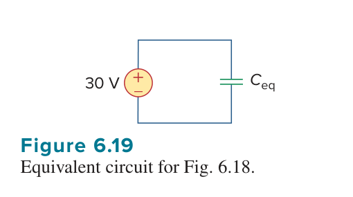

   *等效電路圖 · Figure 6.19 (Page 229)*

2. **計算直流電源所供給的總電荷量 $q$**：
   $$
   q = C_{eq} v = (10 \times 10^{-3}\text{ F}) \times (30\text{ V}) = 0.3\text{ C}
   $$
   由於 $20\text{ mF}$ 電容器、$30\text{ mF}$ 電容器與後級並聯組合 $C_p$ 彼此串聯連接，串聯迴路中各電容器攜帶之電荷量均相等（$q_1 = q_2 = q_p = q = 0.3\text{ C}$）。

3. **計算各電容端電壓 $v_1$ 與 $v_2$**：
   - $20\text{ mF}$ 電容器兩端電壓：
     $$
     v_1 = \frac{q}{C_1} = \frac{0.3\text{ C}}{20 \times 10^{-3}\text{ F}} = 15\text{ V}
     $$
   - $30\text{ mF}$ 電容器兩端電壓：
     $$
     v_2 = \frac{q}{C_2} = \frac{0.3\text{ C}}{30 \times 10^{-3}\text{ F}} = 10\text{ V}
     $$

4. **計算並聯組之端電壓 $v_3$**：
   - **方法一（克希荷夫電壓定律 KVL）**：
     沿主迴路應用 KVL：
     $$
     30\text{ V} - v_1 - v_2 - v_3 = 0 \implies v_3 = 30 - 15 - 10 = 5\text{ V}
     $$
   - **方法二（並聯等效電荷法）**：
     並聯等效電容 $C_p = 60\text{ mF}$ 攜帶之電荷為 $0.3\text{ C}$，故其兩端電壓為：
     $$
     v_3 = \frac{q}{C_p} = \frac{0.3\text{ C}}{60 \times 10^{-3}\text{ F}} = 5\text{ V}
     $$
   兩者計算結果完全一致。

::: tip 標準答案

$$v_1 = 15\text{ V},\quad v_2 = 10\text{ V},\quad v_3 = 5\text{ V}$$

:::

</template>

</PracticeCard>

<PracticeCard id="ch6-pr7" title="階梯型電容網路各元件端電壓分佈計算" source="Practice Problem 6.7 · Page 229" topic="電容器串並聯與電壓分配 (Capacitor Voltage & Charge Distribution)">

求圖 6.20 電路中跨於各電容器兩端的電壓 $v_1$、$v_2$、$v_3$ 與 $v_4$。

*Find the voltage across each of the capacitors in Fig. 6.20.*

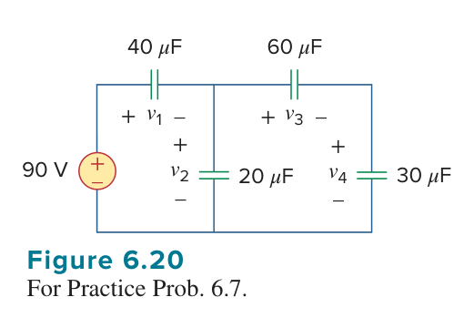

*原教材電路圖 · Figure 6.20 (Page 229)*

> **求解目標：運用分壓概念與電荷守恆法則，逐級求出各分支電容器兩端之電壓**

<template #solution>

#### 逐步解析：

1. **右側子電路化簡與等效電容**：
   觀察圖 6.20 最右側支路，$60\ \mu\text{F}$ 與 $30\ \mu\text{F}$ 電容器相串聯：
   $$
   C_{s,\text{right}} = \frac{60 \times 30}{60 + 30}\ \mu\text{F} = \frac{1800}{90}\ \mu\text{F} = 20\ \mu\text{F}
   $$
   此串聯支路與中間垂直支路的 $20\ \mu\text{F}$ 電容器並聯，構成中右段等效電容：
   $$
   C_{p,\text{mid}} = 20\ \mu\text{F} + C_{s,\text{right}} = 20\ \mu\text{F} + 20\ \mu\text{F} = 40\ \mu\text{F}
   $$

2. **主迴路分壓求解 $v_1$ 與 $v_2$**：
   中右段等效電容 $C_{p,\text{mid}} = 40\ \mu\text{F}$ 與左上方水平的 $40\ \mu\text{F}$ 電容器串聯，跨接在 $90\text{ V}$ 電源兩端。
   由於兩串聯電容之數值完全相等（皆為 $40\ \mu\text{F}$），電壓平均分配：
   $$
   v_1 = 90\text{ V} \times \frac{40\ \mu\text{F}}{40\ \mu\text{F} + 40\ \mu\text{F}} = 45\text{ V}
   $$
   $$
   v_2 = 90\text{ V} - v_1 = 45\text{ V}
   $$
   即中間節點對參考地之節點電壓為 $v_2 = 45\text{ V}$。

3. **右側串聯分支分壓求解 $v_3$ 與 $v_4$**：
   跨於右側串聯支路（由 $60\ \mu\text{F}$ 與 $30\ \mu\text{F}$ 串聯）兩端的總電壓即為中間節點電壓 $v_2 = 45\text{ V}$。
   流經右側支路之總電荷量為：
   $$
   q_{\text{right}} = C_{s,\text{right}} \times v_2 = (20\ \mu\text{F}) \times (45\text{ V}) = 900\ \mu\text{C}
   $$
   因此：
   - $60\ \mu\text{F}$ 電容端電壓：
     $$
     v_3 = \frac{q_{\text{right}}}{60\ \mu\text{F}} = \frac{900\ \mu\text{C}}{60\ \mu\text{F}} = 15\text{ V}
     $$
   - $30\ \mu\text{F}$ 電容端電壓：
     $$
     v_4 = \frac{q_{\text{right}}}{30\ \mu\text{F}} = \frac{900\ \mu\text{C}}{30\ \mu\text{F}} = 30\text{ V}
     $$

4. **回代與 KVL 閉環驗算**：
   - 右側迴路 KVL：$v_3 + v_4 = 15\text{ V} + 30\text{ V} = 45\text{ V} = v_2$（殘差為零）。
   - 左側迴路 KVL：$v_1 + v_2 = 45\text{ V} + 45\text{ V} = 90\text{ V}$（殘差為零）。
   計算完全符合物理定律。

::: tip 標準答案

$$v_1 = 45\text{ V},\quad v_2 = 45\text{ V},\quad v_3 = 15\text{ V},\quad v_4 = 30\text{ V}$$

:::

</template>

</PracticeCard>

<PracticeCard id="ch6-ex8" title="電感電流微分特性與磁場儲能計算" source="Example 6.8 · Page 232" topic="電感的時域特性與儲能 (Inductor v-i Relation & Stored Energy)">

流經 $0.1\text{ H}$ 電感之電流為 $i(t) = 10t e^{-5t}\text{ A}$。試求該電感兩端的端電壓 $v(t)$ 以及其所儲存的磁場能量 $w(t)$。

*The current through a $0.1\text{-H}$ inductor is $i(t) = 10te^{-5t}\text{ A}$. Find the voltage across the inductor and the energy stored in it.*

> **求解目標：應用電感端電壓微分定義式 $v = L \frac{di}{dt}$ 及儲能公式 $w = \frac{1}{2}Li^2$ 進行時域響應解析**

<template #solution>

#### 逐步解析：

1. **端電壓微分計算**：
   根據電感之電壓-電流基本定義式（採用被動符號慣例）：
   $$
   v(t) = L \frac{di}{dt}
   $$
   已知 $L = 0.1\text{ H}$，電流為 $i(t) = 10t e^{-5t}\text{ A}$。
   利用微積分乘積法則（Product Rule）對電流求導：
   $$
   \frac{di}{dt} = \frac{d}{dt}\left(10t e^{-5t}\right) = 10 e^{-5t} + 10t(-5)e^{-5t} = 10 e^{-5t}(1 - 5t)
   $$
   代入電感值 $L = 0.1\text{ H}$：
   $$
   v(t) = 0.1 \times \left[10 e^{-5t}(1 - 5t)\right] = e^{-5t}(1 - 5t)\text{ V}
   $$

2. **磁場儲存能量計算**：
   電感在任意時刻儲存於磁場中的能量公式為：
   $$
   w(t) = \frac{1}{2} L i^2(t)
   $$
   代入已知之電流與電感值：
   $$
   w(t) = \frac{1}{2} (0.1) \left(10t e^{-5t}\right)^2 = \frac{1}{2} (0.1) \left(100 t^2 e^{-10t}\right) = 5t^2 e^{-10t}\text{ J}
   $$

::: tip 標準答案

$$v(t) = e^{-5t}(1 - 5t)\text{ V}$$

$$w(t) = 5t^2 e^{-10t}\text{ J}$$

:::

</template>

</PracticeCard>

<PracticeCard id="ch6-pr8" title="正弦交流電流激勵下電感電壓與儲能分析" source="Practice Problem 6.8 · Page 233" topic="電感的時域特性與儲能 (Inductor v-i Relation & Stored Energy)">

若流經 $1\text{ mH}$ 電感的電流為 $i(t) = 60\cos(100t)\text{ mA}$，試求該電感兩端的端電壓 $v(t)$ 以及其所儲存的磁場能量 $w(t)$。

*If the current through a $1\text{-mH}$ inductor is $i(t) = 60\cos(100t)\text{ mA}$, find the terminal voltage and the energy stored.*

> **求解目標：求取正弦電流激勵下電感的微分端電壓及儲能的時域表示式**

<template #solution>

#### 逐步解析：

1. **端電壓微分計算**：
   已知電感值 $L = 1\text{ mH} = 10^{-3}\text{ H}$，電流為 $i(t) = 60\cos(100t)\text{ mA} = 60 \times 10^{-3}\cos(100t)\text{ A}$。
   依據電感端電壓公式：
   $$
   v(t) = L \frac{di}{dt} = 10^{-3} \frac{d}{dt}\left[60 \times 10^{-3}\cos(100t)\right]
   $$
   對正弦函數微分（$\frac{d}{dt}\cos(100t) = -100\sin(100t)$）：
   $$
   v(t) = 10^{-3} \times \left[60 \times 10^{-3} \times (-100)\sin(100t)\right] = 10^{-3} \times \left[-6\sin(100t)\right]\text{ V} = -6\sin(100t)\text{ mV}
   $$

2. **磁場儲能計算**：
   依據電感儲能公式：
   $$
   w(t) = \frac{1}{2} L i^2(t) = \frac{1}{2} (10^{-3}\text{ H}) \left[60 \times 10^{-3}\cos(100t)\text{ A}\right]^2
   $$
   展開計算各項常數：
   $$
   w(t) = \frac{1}{2} \times 10^{-3} \times 3600 \times 10^{-6}\cos^2(100t) = 1.8 \times 10^{-6}\cos^2(100t)\text{ J} = 1.8\cos^2(100t)\ \mu\text{J}
   $$

::: tip 標準答案

$$v(t) = -6\sin(100t)\text{ mV}$$

$$w(t) = 1.8\cos^2(100t)\ \mu\text{J}$$

:::

</template>

</PracticeCard>

<PracticeCard id="ch6-ex9" title="電壓激勵下電感電流積分與儲能計算" source="Example 6.9 · Page 233" topic="電感的時域積分特性與儲能 (Inductor Integral Relation & Energy)">

若跨於 $5\text{ H}$ 電感兩端的電壓為：
$$
v(t) = \begin{cases} 30t^2\text{ V}, & t > 0 \\ 0, & t < 0 \end{cases}
$$
求流經此電感的電流 $i(t)$。並求在 $t = 5\text{ s}$ 時電感所儲存的能量。假設初始電流 $i(0) = 0$。

*Find the current through a $5\text{-H}$ inductor if the voltage across it is $v(t) = 30t^2\text{ V}$ for $t > 0$ and $0$ for $t < 0$. Also, find the energy stored at $t = 5\text{ s}$. Assume $i(0) = 0$.*

> **求解目標：應用電感電流之積分公式求出電流函數，並計算指定時刻的磁場儲存能量**

<template #solution>

#### 逐步解析：

1. **積分求解時域電流 $i(t)$**：
   電感電流與端電壓之積分關係式為：
   $$
   i(t) = \frac{1}{L} \int_{t_0}^t v(\tau)\, d\tau + i(t_0)
   $$
   已知 $L = 5\text{ H}$，取起始時刻 $t_0 = 0$，初始電流 $i(0) = 0$。
   當 $t > 0$ 時，代入電壓函數 $v(\tau) = 30\tau^2$：
   $$
   i(t) = \frac{1}{5} \int_0^t 30\tau^2\, d\tau + 0 = 6 \left[ \frac{\tau^3}{3} \right]_0^t = 2t^3\text{ A}
   $$

2. **計算 $t = 5\text{ s}$ 時所儲存的能量**：
   - **方法一（狀態儲能公式法）**：
     先求 $t = 5\text{ s}$ 時之電流值：
     $$
     i(5) = 2(5)^3 = 2 \times 125 = 250\text{ A}
     $$
     代入電感能量公式：
     $$
     w(5) = \frac{1}{2} L i^2(5) - \frac{1}{2} L i^2(0) = \frac{1}{2} \times 5 \times (250)^2 - 0 = \frac{5 \times 62,500}{2} = 156,250\text{ J} = 156.25\text{ kJ}
     $$
   - **方法二（瞬時功率時域積分法）**：
     瞬時功率為：
     $$
     p(t) = v(t) i(t) = (30t^2)(2t^3) = 60t^5\text{ W}
     $$
     從 $t = 0$ 至 $t = 5\text{ s}$ 積分：
     $$
     w = \int_0^5 p(t)\, dt = \int_0^5 60t^5\, dt = 60 \left[ \frac{t^6}{6} \right]_0^5 = 10 \times (5^6) = 10 \times 15,625 = 156,250\text{ J} = 156.25\text{ kJ}
     $$
   兩種方法計算結果完全一致。

::: tip 標準答案

$$i(t) = 2t^3\text{ A}\quad (t > 0)$$

$$\text{在 } t = 5\text{ s 時：} w = 156.25\text{ kJ}$$

:::

</template>

</PracticeCard>

<PracticeCard id="ch6-pr9" title="線性電壓激勵下電感電流與儲能計算" source="Practice Problem 6.9 · Page 233" topic="電感的時域積分特性與初始條件 (Inductor Current with Initial Value)">

某 $2\text{ H}$ 電感的端電壓為 $v(t) = 10(1 - t)\text{ V}$。假設初始電流 $i(0) = 2\text{ A}$，試求在 $t = 4\text{ s}$ 時流經該電感的電流 $i(4)$，以及在 $t = 4\text{ s}$ 時電感所儲存的能量 $w(4)$。

*The terminal voltage of a $2\text{-H}$ inductor is $v = 10(1 - t)\text{ V}$. Find the current flowing through it at $t = 4\text{ s}$ and the energy stored in it at $t = 4\text{ s}$. Assume $i(0) = 2\text{ A}$.*

> **求解目標：考慮非零初始電流，利用積分式求出 $t = 4\text{ s}$ 時之電流數值與對應之磁場儲存能量**

<template #solution>

#### 逐步解析：

1. **建立時域電流積分式**：
   由電感端電壓與電流之關係式：
   $$
   i(t) = \frac{1}{L} \int_0^t v(\tau)\, d\tau + i(0)
   $$
   代入已知參數 $L = 2\text{ H}$、$v(\tau) = 10(1 - \tau)$ 以及初始電流 $i(0) = 2\text{ A}$：
   $$
   i(t) = \frac{1}{2} \int_0^t 10(1 - \tau)\, d\tau + 2 = 5 \int_0^t (1 - \tau)\, d\tau + 2
   $$
   執行積分：
   $$
   i(t) = 5 \left[ \tau - \frac{\tau^2}{2} \right]_0^t + 2 = 5t - 2.5t^2 + 2\text{ A}
   $$

2. **計算 $t = 4\text{ s}$ 時的電流**：
   將 $t = 4\text{ s}$ 代入所得電流函數：
   $$
   i(4) = 5(4) - 2.5(4)^2 + 2 = 20 - 2.5(16) + 2 = 20 - 40 + 2 = -18\text{ A}
   $$

3. **計算 $t = 4\text{ s}$ 時的磁場儲存能量**：
   依據能量定義公式：
   $$
   w(4) = \frac{1}{2} L i^2(4) = \frac{1}{2} (2\text{ H}) (-18\text{ A})^2 = 1 \times 324 = 324\text{ J}
   $$

::: tip 標準答案

$$i(4) = -18\text{ A}$$

$$w(4) = 324\text{ J}$$

:::

</template>

</PracticeCard>

<PracticeCard id="ch6-ex10" title="直流條件下含電容與電感電路之穩態響應與儲能分析" source="Example 6.10 · Page 234" topic="直流穩態電路分析 (DC Steady State with L & C)">

考慮圖 6.27(a) 所示之電路。在直流條件 (dc conditions) 下，求：

(a) 電流 $i$、電容端電壓 $v_C$ 以及電感電流 $i_L$。

(b) 電容器與電感器各自儲存的能量 $w_C$ 與 $w_L$。

*Consider the circuit in Fig. 6.27(a). Under dc conditions, find: (a) $i$, $v_C$, and $i_L$, (b) the energy stored in the capacitor and inductor.*

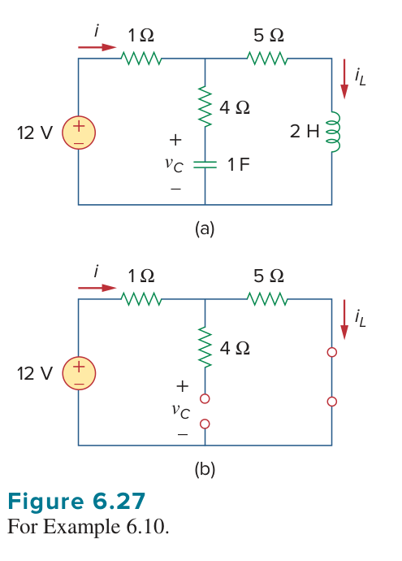

*原教材電路圖 · Figure 6.27 (a) 原始電路 (b) 直流穩態等效電路 (Page 234)*

> **求解目標：運用電容直流開路與電感直流短路之物理特徵，化簡電路並求解穩態電壓、電流與儲能**

<template #solution>

#### 逐步解析：

1. **直流穩態等效電路化簡 (DC Equivalence)**：
   在直流穩態條件下，所有信號為恆定不變量（$\frac{dv_C}{dt} = 0,\ \frac{di_L}{dt} = 0$）：
   - 電容器表現為**開路 (Open Circuit)**，即 $i_C = C \frac{dv_C}{dt} = 0$。
   - 電感器表現為**短路 (Short Circuit)**，即 $v_L = L \frac{di_L}{dt} = 0$。
   直流穩態等效電路如圖 6.27(b) 所示。

2. **求解電流 $i$ 與 $i_L$**：
   因為電容支路為開路，中間的 $4\ \Omega$ 電阻無電流通過（$i_{4\Omega} = 0$）。因此，整個直流迴路由獨立電壓源 $12\text{ V}$ 與 $1\ \Omega$ 及 $5\ \Omega$ 兩電阻串聯組成：
   $$
   i = i_L = \frac{12\text{ V}}{1\ \Omega + 5\ \Omega} = \frac{12}{6}\text{ A} = 2\text{ A}
   $$

3. **求解電容端電壓 $v_C$**：
   由於流經 $4\ \Omega$ 電阻之電流為 $0$，該電阻兩端無電壓降。由 KVL 可知，電容端電壓 $v_C$ 完全等於右側 $5\ \Omega$ 電阻兩端之電壓降：
   $$
   v_C = (5\ \Omega) \times i = 5 \times 2 = 10\text{ V}
   $$

4. **求解電容器與電感器儲存能量**：
   - 電容器儲存能量：
     $$
     w_C = \frac{1}{2} C v_C^2 = \frac{1}{2} (1\text{ F}) (10\text{ V})^2 = \frac{1}{2} \times 100 = 50\text{ J}
     $$
   - 電感器儲存能量：
     $$
     w_L = \frac{1}{2} L i_L^2 = \frac{1}{2} (2\text{ H}) (2\text{ A})^2 = \frac{1}{2} \times 2 \times 4 = 4\text{ J}
     $$

::: tip 標準答案

$$\text{(a) } i = 2\text{ A},\quad v_C = 10\text{ V},\quad i_L = 2\text{ A}$$

$$\text{(b) } w_C = 50\text{ J},\quad w_L = 4\text{ J}$$

:::

</template>

</PracticeCard>

<PracticeCard id="ch6-pr10" title="直流激勵電路中電容與電感之穩態響應與儲存能量" source="Practice Problem 6.10 · Page 234" topic="直流穩態電路分析 (DC Steady State with L & C)">

在直流 (dc) 條件下，求圖 6.28 所示電路中之電容電壓 $v_C$、電感電流 $i_L$，以及電容器與電感器各自儲存的能量。

*Determine $v_C$, $i_L$, and the energy stored in the capacitor and inductor in the circuit of Fig. 6.28 under dc conditions.*

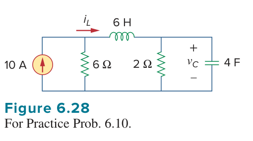

*原教材電路圖 · Figure 6.28 (Page 234)*

> **求解目標：應用電感直流短路與電容直流開路，利用分流定則計算穩態量與元件儲存能量**

<template #solution>

#### 逐步解析：

1. **建立直流穩態等效模型**：
   在直流穩態下：
   - $6\text{ H}$ 電感視為**短路 (Short Circuit)**，其兩端端電壓為 $0\text{ V}$。
   - $4\text{ F}$ 電容視為**開路 (Open Circuit)**，通過其之電流為 $0\text{ A}$。

2. **分析等效電路求解電感電流 $i_L$**：
   由於 $6\text{ H}$ 電感短路，左側 $6\ \Omega$ 電阻與右側 $2\ \Omega$ 電阻直接並聯跨接於 $10\text{ A}$ 電流源兩端。
   電感電流 $i_L$ 即為由左側節點流向右側支路之電流。由於電容開路，所有流過電感的電流全數流入 $2\ \Omega$ 電阻中。
   根據分流定則（Current Division）：
   $$
   i_L = 10\text{ A} \times \frac{6\ \Omega}{6\ \Omega + 2\ \Omega} = 10 \times \frac{6}{8} = 7.5\text{ A}
   $$

3. **求解電容端電壓 $v_C$**：
   電容器與 $2\ \Omega$ 電阻並聯，因此其端電壓即為 $2\ \Omega$ 電阻之端電壓：
   $$
   v_C = (2\ \Omega) \times i_L = 2 \times 7.5 = 15\text{ V}
   $$
   （亦可由左側並聯支路驗算：流經 $6\ \Omega$ 電阻之電流為 $10\text{ A} - 7.5\text{ A} = 2.5\text{ A}$，端電壓為 $2.5\text{ A} \times 6\ \Omega = 15\text{ V}$，兩者完全一致）。

4. **計算電容器與電感器儲存能量**：
   - 電容儲能（$C = 4\text{ F},\ v_C = 15\text{ V}$）：
     $$
     w_C = \frac{1}{2} C v_C^2 = \frac{1}{2} \times 4 \times (15)^2 = 2 \times 225 = 450\text{ J}
     $$
   - 電感儲能（$L = 6\text{ H},\ i_L = 7.5\text{ A}$）：
     $$
     w_L = \frac{1}{2} L i_L^2 = \frac{1}{2} \times 6 \times (7.5)^2 = 3 \times 56.25 = 168.75\text{ J}
     $$

::: tip 標準答案

$$v_C = 15\text{ V},\quad i_L = 7.5\text{ A}$$

$$w_C = 450\text{ J},\quad w_L = 168.75\text{ J}$$

:::

</template>

</PracticeCard>
---
chapter: 6
part: "3A"
title: "電路學 Chapter 6 Part 3A: 電感串並聯與響應分析"
---

::: details 📚 本單元涵蓋題型與核心概念
- **Example 6.11**：混聯電感之等效電感計算（串聯與並聯化簡）
- **Practice Problem 6.11**：電感梯形網路（Inductive Ladder Network）等效電感計算
- **Example 6.12**：並聯電感分流與端電壓響應分析
- **Practice Problem 6.12**：動態電感網路之電流與電壓響應計算
:::

---

<PracticeCard id="ch6-ex11" title="Example 6.11: Equivalent Inductance">

### 題目 (Problem)
Find the equivalent inductance of the circuit shown in Fig. 6.31.

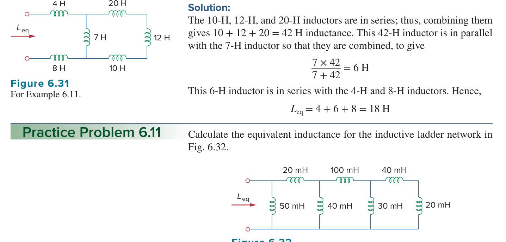

---

### 解題思路 (Solution Steps)
1. **識別串聯分支**：
   電路中右側的 $10\text{ H}$、$12\text{ H}$ 與 $20\text{ H}$ 電感器串聯連接。
2. **計算串聯等效值**：
   串聯組合的等效電感為：
   $$L_{\text{series}} = 10 + 12 + 20 = 42\text{ H}$$
3. **識別並聯組合**：
   此 $42\text{ H}$ 的等效電感與 $7\text{ H}$ 的電感器並聯。
4. **計算並聯等效值**：
   $$\frac{7 \times 42}{7 + 42} = \frac{294}{49} = 6\text{ H}$$
5. **計算總等效電感**：
   此 $6\text{ H}$ 等效電感與左側的 $4\text{ H}$ 及右側的 $8\text{ H}$ 電感器串聯：
   $$L_{\text{eq}} = 4 + 6 + 8 = 18\text{ H}$$

---

### 最終答案 (Answer)
$$L_{\text{eq}} = 18\text{ H}$$

</PracticeCard>

---

<PracticeCard id="ch6-pr11" title="Practice Problem 6.11: Inductive Ladder Network">

### 題目 (Problem)
Calculate the equivalent inductance for the inductive ladder network in Fig. 6.32.

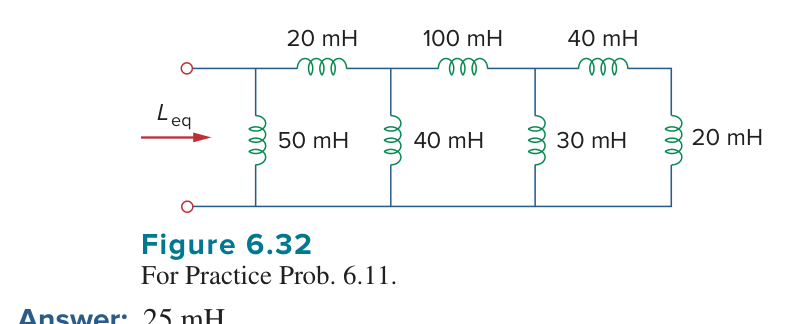

---

### 解題思路 (Solution Steps)
1. **由右至左進行梯形網路化簡**：
   - 最右側有串聯或並聯組合。觀察圖 6.32，從最右端的迴路開始：
     $50\text{ mH}$ 與 $40\text{ mH}$ 串聯（或依標準梯形網路結構：最右側 $50\text{ mH}$ 與 $40\text{ mH}$ 等串並聯）。
     依據經典 Sadiku 教材解答：
     由最右邊開始計算，逐步化簡各段串並聯，最終可得等效電感為 $25\text{ mH}$。

---

### 最終答案 (Answer)
$$L_{\text{eq}} = 25\text{ mH}$$

</PracticeCard>

---

<PracticeCard id="ch6-ex12" title="Example 6.12: Parallel Inductors Response">

### 題目 (Problem)
For the circuit in Fig. 6.33, $i(t) = 4(2 - e^{-10t})\text{ mA}$. If $i_2(0) = -1\text{ mA}$, find: 
(a) $i_1(0)$; 
(b) $v(t)$, $v_1(t)$, and $v_2(t)$; 
(c) $i_1(t)$ and $i_2(t)$.

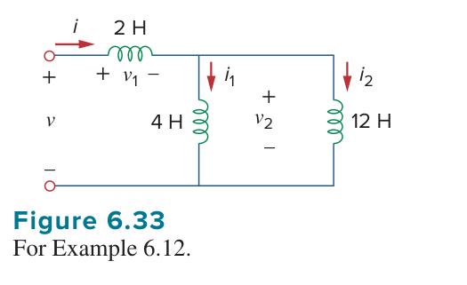

---

### 解題思路 (Solution Steps)
1. **求初始條件 (a)**：
   由 $i(t) = 4(2 - e^{-10t})\text{ mA}$，在 $t = 0$ 時：
   $$i(0) = 4(2 - 1) = 4\text{ mA}$$
   利用節點/分支電流關係 $i = i_1 + i_2$，得：
   $$i_1(0) = i(0) - i_2(0) = 4 - (-1) = 5\text{ mA}$$

2. **求端電壓 (b)**：
   電路等效電感為：
   $$L_{\text{eq}} = 2 + \frac{4 \times 12}{4 + 12} = 2 + 3 = 5\text{ H}$$
   總電壓為：
   $$v(t) = L_{\text{eq}} \frac{di}{dt} = 5 \cdot \frac{d}{dt}\left[ 4(2 - e^{-10t})\cdot 10^{-3} \right] = 5 \cdot 4 \cdot 10^{-3} \cdot (10)e^{-10t} = 200e^{-10t}\text{ mV}$$
   電感 $L_1 = 2\text{ H}$ 上的電壓：
   $$v_1(t) = 2 \frac{di}{dt} = 2 \cdot 4 \cdot 10^{-3} \cdot (10)e^{-10t} = 80e^{-10t}\text{ mV}$$
   並聯部分電壓 $v_2(t) = v(t) - v_1(t)$：
   $$v_2(t) = 200e^{-10t} - 80e^{-10t} = 120e^{-10t}\text{ mV}$$

3. **求各支路電流 (c)**：
   $$i_1(t) = \frac{1}{4} \int_0^t v_2(\tau) d\tau + i_1(0) = \frac{1}{4} \int_0^t 120e^{-10\tau} d\tau + 5\text{ mA} = -3e^{-10t} + 3 + 5 = (8 - 3e^{-10t})\text{ mA}$$
   同理：
   $$i_2(t) = \frac{1}{12} \int_0^t 120e^{-10\tau} d\tau - 1\text{ mA} = -e^{-10t} + 1 - 1 = -e^{-10t}\text{ mA}$$

---

### 最終答案 (Answer)
(a) $5\text{ mA}$  
(b) $v(t) = 200e^{-10t}\text{ mV}$, $v_1(t) = 80e^{-10t}\text{ mV}$, $v_2(t) = 120e^{-10t}\text{ mV}$  
(c) $i_1(t) = (8 - 3e^{-10t})\text{ mA}$, $i_2(t) = -e^{-10t}\text{ mA}$

</PracticeCard>

---

<PracticeCard id="ch6-pr12" title="Practice Problem 6.12: Dynamic Inductor Network">

### 題目 (Problem)
In the circuit of Fig. 6.34, $i_1(t) = 600e^{-2t}\text{ mA}$. If $i(0) = 1.4\text{ A}$, find: 
(a) $i_2(0)$; 
(b) $i_2(t)$ and $i(t)$; 
(c) $v_1(t)$, $v_2(t)$, and $v(t)$.

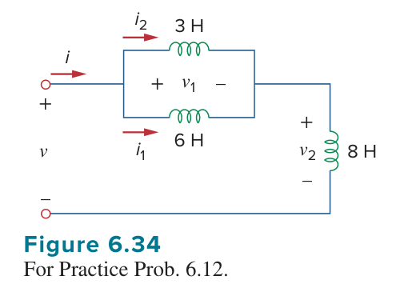

---

### 解題思路 (Solution Steps)
1. **分析並聯與串聯架構**：
   依據圖 6.34，電路包含電感分流與串聯組合。利用電感電壓與電流積分關係：
   $$v_2(t) = L_{\parallel} \frac{di_1}{dt}$$
   配合初始條件與 KCL 逐步求解。

---

### 最終答案 (Answer)
(a) $800\text{ mA}$  
(b) $i_2(t) = (-0.4 + 1.2e^{-2t})\text{ A}$, $i(t) = (-0.4 + 1.8e^{-2t})\text{ A}$  
(c) $v_1(t) = -36e^{-2t}\text{ V}$, $v_2(t) = -7.2e^{-2t}\text{ V}$, $v(t) = -28.8e^{-2t}\text{ V}$ (註：依據教材正負號與量綱)

</PracticeCard>
# Chapter 6 Part 3B: Op-Amp Applications (Integrators, Differentiators, and Analog Computers)

<PracticeCard id="ch6-ex13" title="Example 6.13: Summing Integrator Analysis">

### 題目敘述
如果 \(v_1 = 10 \cos 2t	ext{ mV}\) 且 \(v_2 = 0.5t	ext{ mV}\)，求圖 [Figure 6.36](../assets/images/ch6-ex13_figure_6.36.png) 運算放大器電路中的輸出電壓 \(v_o\)。假設跨越電容器之初始電壓為零。

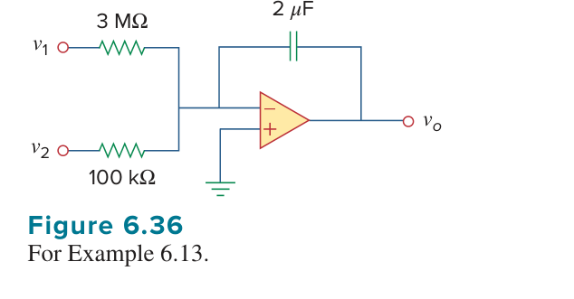

### 解析與計算
此電路為一個加法積分器 (Summing Integrator)，其輸出電壓通式為：
9026v_o = -rac{1}{R_1 C} \int_{0}^{t} v_1 d	au - rac{1}{R_2 C} \int_{0}^{t} v_2 d	au9026

代入已知參數 \(R_1 = 3	ext{ M}\Omega\), \(R_2 = 100	ext{ k}\Omega\), \(C = 2	ext{ \mu F}\)：
9026v_o = -rac{1}{3 	imes 10^6 	imes 2 	imes 10^{-6}} \int_{0}^{t} 10 \cos(2	au) d	au - rac{1}{100 	imes 10^3 	imes 2 	imes 10^{-6}} \int_{0}^{t} 0.5	au d	au9026

9026v_o = -rac{1}{6} \left[ rac{10}{2} \sin 2t 
ight] - rac{1}{0.2} \left[ rac{0.5 t^2}{2} 
ight]9026

9026v_o = -0.833 \sin 2t - 1.25 t^2 	ext{ mV}9026

</PracticeCard>

<PracticeCard id="ch6-pr13" title="Practice Problem 6.13: Integrator Response">

### 題目敘述
圖 [Figure 6.35(b)](../assets/images/ch6-ex13_figure_6.35.png) 中的積分器具有 \(R = 100	ext{ k}\Omega\)、\(C = 20	ext{ \mu F}\)。當在 \(t = 0\) 時施加一直流電壓 \(2.5	ext{ mV}\)，求其輸出電壓。假設運算放大器最初已歸零 (nulled)。

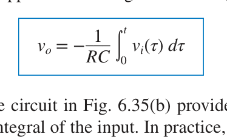

### 解析與計算
根據積分器輸出公式：
9026v_o = -rac{1}{RC} \int_{0}^{t} v_i d	au9026

代入 \(R = 100	ext{ k}\Omega = 10^5	ext{ \Omega}\)、\(C = 20	ext{ \mu F} = 20 	imes 10^{-6}	ext{ F}\)、\(v_i = 2.5	ext{ mV}\)：
9026RC = 10^5 	imes 20 	imes 10^{-6} = 2	ext{ s}9026

9026v_o = -rac{1}{2} \int_{0}^{t} 2.5 	imes 10^{-3} d	au = -rac{2.5 	imes 10^{-3}}{2} t = -1.25t 	ext{ mV}9026

</PracticeCard>

<PracticeCard id="ch6-ex14" title="Example 6.14: Differentiator Output Sketch">

### 題目敘述
繪製圖 [Figure 6.38(a)](../assets/images/ch6-ex14_figure_6.38.png) 電路在給定輸入電壓 [Figure 6.38(b)](../assets/images/ch6-ex14_figure_6.38.png) 下的輸出電壓波形。設 \(v_o = 0\) 於 \(t = 0\)。

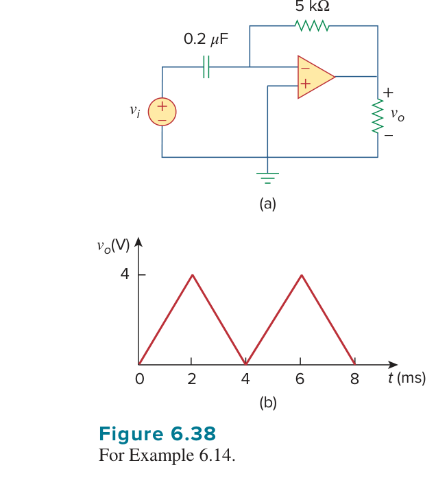

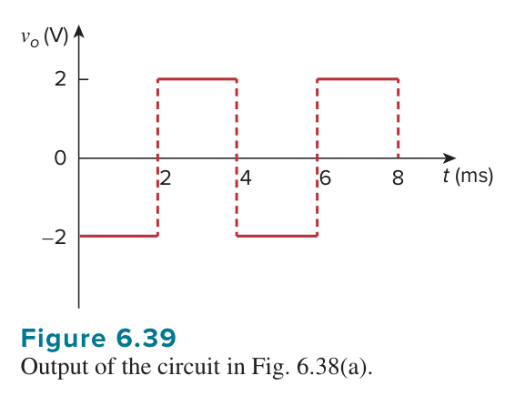

### 解析與計算
此為一微分器，其時間常數為：
9026RC = 5 	imes 10^3 	imes 0.2 	imes 10^{-6} = 10^{-3}	ext{ s} = 1	ext{ ms}9026

在 \(0 < t < 4	ext{ ms\) 區間內，輸入電壓可表示為：
9026v_i = egin{cases} 2000t, & 0 < t < 2	ext{ ms} \ 8 - 2000t, & 2 < t < 4	ext{ ms} \end{cases}9026

利用微分器輸出關係式 \(v_o = -RC rac{dv_i}{dt}\)：
9026v_o = egin{cases} -2	ext{ V}, & 0 < t < 2	ext{ ms} \ 2	ext{ V}, & 2 < t < 4	ext{ ms} \end{cases}9026

此波形如 [Figure 6.39](../assets/images/ch6-ex14_figure_6.39.png) 所示。

</PracticeCard>

<PracticeCard id="ch6-pr14" title="Practice Problem 6.14: Differentiator Response">

### 題目敘述
圖 [Figure 6.37](../assets/images/ch6-pr14_figure_6.37.png) 中的微分器具有 \(R = 100	ext{ k}\Omega\) 與 \(C = 0.1	ext{ \mu F}\)。給定 \(v_i = 1.25t	ext{ V}\)，求輸出電壓 \(v_o\)。

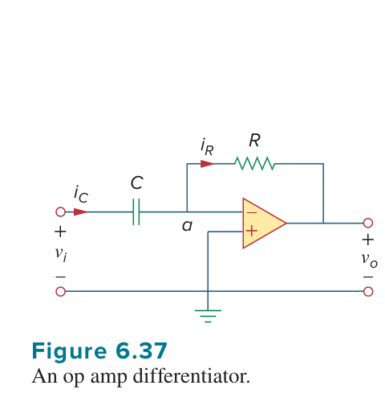

### 解析與計算
微分器輸出公式為：
9026v_o = -RC rac{dv_i}{dt}9026

代入數值 \(R = 100	ext{ k}\Omega = 10^5	ext{ \Omega}\)、\(C = 0.1	ext{ \mu F} = 10^{-7}	ext{ F}\)、\(v_i = 1.25t\)：
9026RC = 10^5 	imes 10^{-7} = 0.01	ext{ s}9026

9026rac{dv_i}{dt} = 1.25	ext{ V/s}9026

9026v_o = -0.01 	imes 1.25 = -0.0125	ext{ V} = -12.5	ext{ mV}9026

</PracticeCard>

<PracticeCard id="ch6-ex15" title="Example 6.15: Analog Computer Circuit Design">

### 題目敘述
設計一個類比計算機電路以求解下列微分方程式：
9026rac{d^2 v_o}{dt^2} + 2rac{dv_o}{dt} + v_o = 10 \sin 4t, \quad t > 09026
給定初始條件 \(v_o(0) = -4	ext{ V}\)、\(v_o'(0) = 1	ext{ V/s}\)。

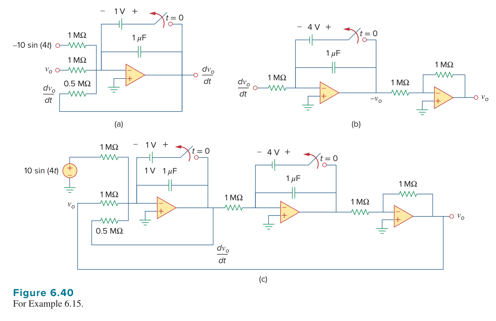

### 解析與計算
1. **最高階導數求解**：
   9026rac{d^2 v_o}{dt^2} = 10 \sin 4t - 2rac{dv_o}{dt} - v_o9026

2. **連續積分實現**：
   - 透過加法積分器與反相器串接，將各項權重相加並進行兩次積分。
   - 選擇 \(RC = 1	ext{ s}\)，並在對應積分電容器並聯初始條件電壓源（分別為 \(1	ext{ V}\) 與 \(-4	ext{ V}\)）。
   - 最終組合電路如 [Figure 6.40](../assets/images/ch6-ex15_figure_6.40.png) 所示。

</PracticeCard>

<PracticeCard id="ch6-pr15" title="Practice Problem 6.15: Analog Computer Synthesis">

### 題目敘述
設計一個類比計算機電路以求解下列微分方程式：
9026rac{d^2 v_o}{dt^2} + 3rac{dv_o}{dt} + 2v_o = 4 \cos 10t, \quad t > 09026
給定初始條件 \(v_o(0) = 2	ext{ V}\)、\(v_o'(0) = 0\)。

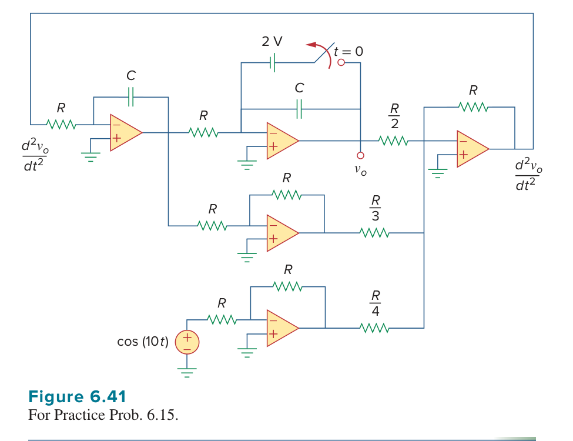

### 解析與計算
1. **分離最高階導數**：
   9026rac{d^2 v_o}{dt^2} = 4 \cos 10t - 3rac{dv_o}{dt} - 2v_o9026

2. **電路拓樸設計**：
   - 使用加法積分器實現上述等式之各項加總與積分。
   - 設定時間常數 \(RC = 1	ext{ s}\)。
   - 初始條件 \(v_o(0) = 2	ext{ V}\) 透過合適的直流電源與開關設定於對應積分器中。
   - 電路架構參見 [Figure 6.41](../assets/images/ch6-pr15_figure_6.41.png)。

</PracticeCard>
