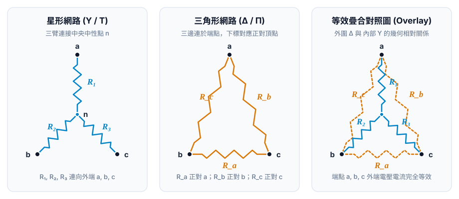
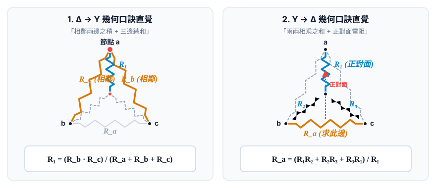
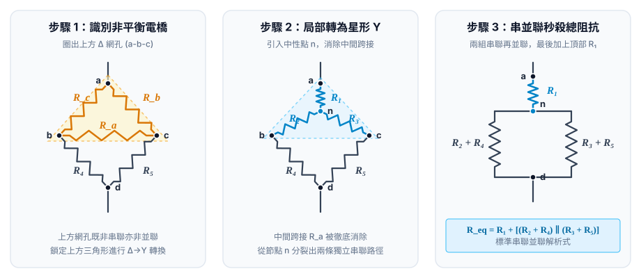

# 001: 星形 (Y) 與三角形 (Δ) 網路等效互換速查手冊 (Wye-Delta Reference)

> 彙整三端電阻網路外端等效、標準命名慣例、雙向轉換口訣與對稱平衡特例

## 一、 網路拓撲與標準命名慣例 (Topology & Conventions)

### 1. 星形網路 (Y / T Network)
- 三個外露端點標記為 $a, b, c$，中央連接中性點 $n$。
- 分支電阻下標對應連向的端點：$R_1$（接 $a$）、$R_2$（接 $b$）、$R_3$（接 $c$）。

### 2. 三角形網路 (Δ / Π Network)
- 三個外露端點標記為 $a, b, c$。
- 外圍電阻下標對應其**正對面的頂點**：
  - $R_a$ 連在 $b-c$ 端點之間（正對面為端點 $a$）。
  - $R_b$ 連在 $a-c$ 端點之間（正對面為端點 $b$）。
  - $R_c$ 連在 $a-b$ 端點之間（正對面為端點 $c$）。

---

## 二、 互換公式與極速解題口訣

### 1. $\Delta \to \text{Y}$ (三角形轉星形)
求星形內部分支電阻 $R_1, R_2, R_3$：

$$R_1 = \frac{R_b R_c}{R_a + R_b + R_c}$$
$$R_2 = \frac{R_a R_c}{R_a + R_b + R_c}$$
$$R_3 = \frac{R_a R_b}{R_a + R_b + R_c}$$

::: tip  $\Delta \to \text{Y}$ 口訣
**「相鄰兩邊之積 ÷ 三邊總和」**  
直覺定位：$R_1$ 接在節點 $a$，在 $\Delta$ 中夾住節點 $a$ 的相鄰兩邊就是 $R_b$ 與 $R_c$。
:::

### 2. $\text{Y} \to \Delta$ (星形轉三角形)
求外圍三角形電阻 $R_a, R_b, R_c$：

$$R_a = \frac{R_1 R_2 + R_2 R_3 + R_3 R_1}{R_1}$$
$$R_b = \frac{R_1 R_2 + R_2 R_3 + R_3 R_1}{R_2}$$
$$R_c = \frac{R_1 R_2 + R_2 R_3 + R_3 R_1}{R_3}$$

::: tip  $\text{Y} \to \Delta$ 口訣
**「兩兩相乘之和 ÷ 正對面電阻」**  
直覺定位：分子為輪換乘積總和 $\sum R_i R_j$；分母為正對面頂點連向中心之電阻。
:::

---

## 三、 對稱平衡特例與電導對偶性 (Shortcuts & Duality)

| 情境 / 視角 | 星形 (Y) 參數 | 三角形 (Δ) 參數 | 等效換算關係 |
| :--- | :--- | :--- | :--- |
| **平衡對稱電阻 (Symmetric)** | $R_1 = R_2 = R_3 = R_\text{Y}$ | $R_a = R_b = R_c = R_\Delta$ | $R_\Delta = 3 R_\text{Y} \iff R_\text{Y} = \frac{1}{3} R_\Delta$ *(口訣：三角形電阻是星形的 3 倍)* |
| **電導觀點對偶 (Conductance $G=1/R$)** | $G_1, G_2, G_3$ | $G_a, G_b, G_c$ | $G_a = \frac{G_2 G_3}{G_1 + G_2 + G_3}$ *(Y→Δ 電導公式形式與 Δ→Y 電阻完全相同！)* |

---

## 四、 經典電橋網路 (Bridge Circuit) 標準解題 3 步驟

1. **識別阻礙**：檢查電橋對角乘積是否平衡（$R_1 R_4 \stackrel{?}{=} R_2 R_3$）。若不平衡且中間有跨接檢流計/電阻，無法直接以串並聯解析。
2. **局部轉換**：將上方三角形網孔 $\Delta$ 換成等效星形 $\text{Y}$（或將下方 $\Delta$ 轉換）。
3. **串並聯秒殺**：轉換後，中性點向下分出兩條獨立支路，電路退化為標準**「兩組串聯再並聯，最後加上頂部電阻」**結構，直接求出總阻抗。

---

## 五、 相關學習資源

- [0001: 星形 (Y) 與等效三角形 (Δ) 網路互換原理與推導 (Lesson)](/circuits/chapter2/0001-wye-delta-transformation)
- [0001: 星形與三角形網路等效互換原理與幾何對偶 (Learning Record)](/circuits/learning-records/0001-wye-delta-transformation-principle)
- [0002: 開路測試在三端網路等效推導中的數學與物理合法性 (Learning Record)](/circuits/learning-records/0002-open-circuit-terminal-equivalence-validity)
