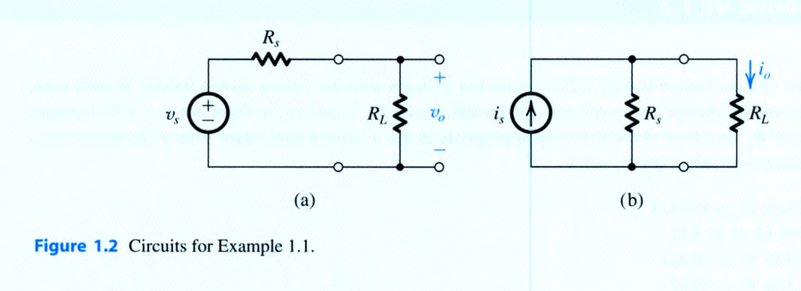
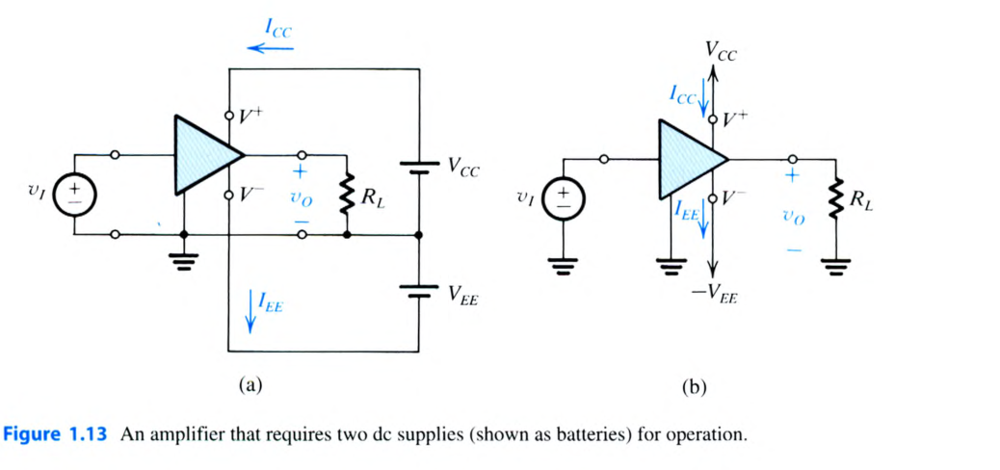
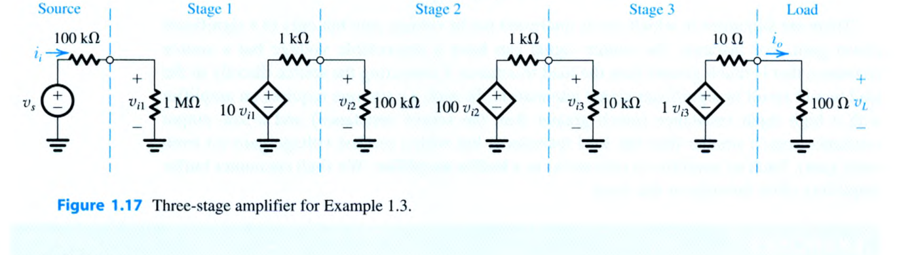
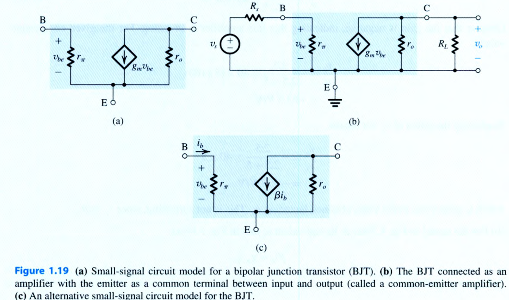
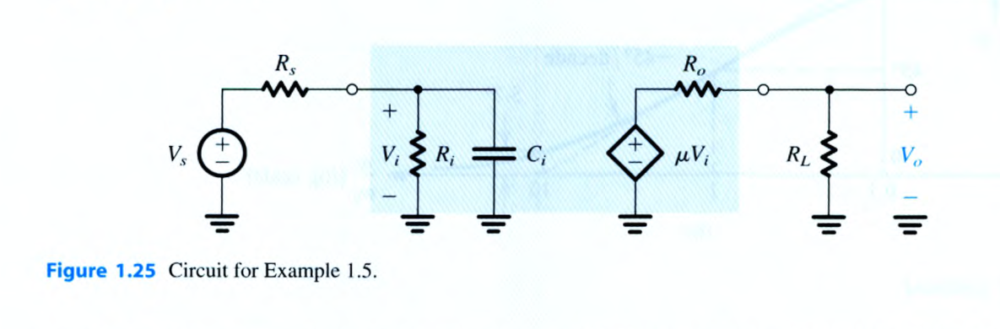
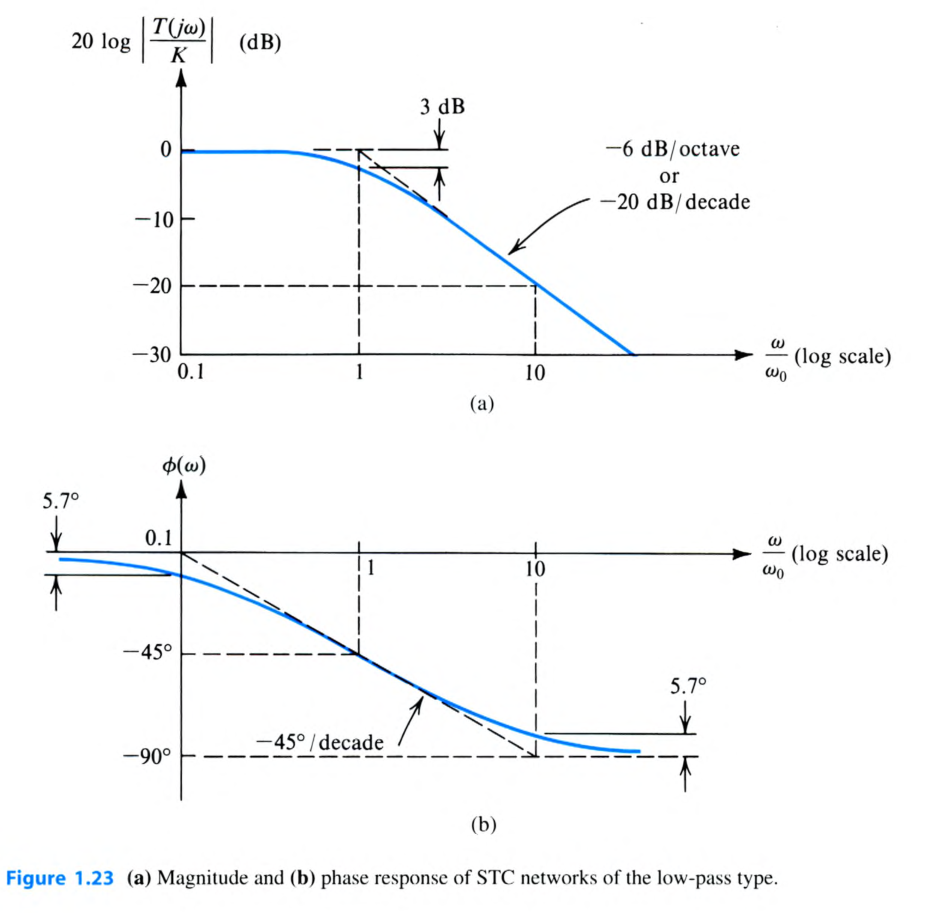

# 互動式範例與練習題庫：Chapter 1 訊號與放大器基礎 (Signals and Amplifiers)

> Sedra & Smith · Microelectronic Circuits (8th Edition) · Signals and Amplifiers 經典範例與精選練習詳細題解

::: details 核心微電子學觀念與電路模型速記
- **戴維寧與諾頓訊號源等效 (Thevenin & Norton Source Equivalents)**：
  - 開路電壓 $v_{oc} = v_s(t)$，短路電流 $i_{sc} = i_s(t) = \frac{v_s(t)}{R_s}$，等效內阻 $R_s = \frac{v_{oc}}{i_{sc}}$。
  - 負載電壓分壓：$v_L = v_s \left(\frac{R_L}{R_s + R_L}\right)$；負載電流分流：$i_L = i_s \left(\frac{R_s}{R_s + R_L}\right)$。
  - 理想電壓源要求內阻 $R_s \to 0$（即 $R_s \ll R_L$）；理想電流源要求內阻 $R_s \to \infty$（即 $R_s \gg R_L$）。
- **放大器功率守恆與效率 (Amplifier Power Balance & Efficiency)**：
  - 功率平衡方程式：$P_{dc} + P_I = P_L + P_{\text{dissipated}}$（通常輸入訊號功率 $P_I \ll P_{dc}$）。
  - 直流電源總功率：$P_{dc} = V_{CC} I_{CC} + V_{EE} I_{EE}$。
  - 功率轉換效率：$\eta = \frac{P_L}{P_{dc}} \times 100\%$。
  - 分貝 (dB) 定義：$A_v(\text{dB}) = 20\log_{10}|A_v|$、$A_i(\text{dB}) = 20\log_{10}|A_i|$、$A_p(\text{dB}) = 10\log_{10}(A_p) = \frac{1}{2}[A_v(\text{dB}) + A_i(\text{dB})]$。
- **四大受控源放大器模型 (Four Amplifier Topologies)**：
  - 電壓放大器 (Voltage Amp)：輸入 $v_i$、輸出 $A_{vo} v_i$、理想特性 $R_i = \infty, R_o = 0$。
  - 電流放大器 (Current Amp)：輸入 $i_i$、輸出 $A_{is} i_i$、理想特性 $R_i = 0, R_o = \infty$。
  - 轉導放大器 (Transconductance Amp)：輸入 $v_i$、輸出 $G_m v_i$、理想特性 $R_i = \infty, R_o = \infty$。
  - 轉阻放大器 (Transresistance Amp)：輸入 $i_i$、輸出 $R_m i_i$、理想特性 $R_i = 0, R_o = 0$。
- **多級級聯分析法 (Cascaded Amplifiers SOP)**：
  - 由後往前確定各級等效負載電阻，由前往後連乘各級有效增益：$G_v = \frac{v_L}{v_s} = \left(\frac{R_{i1}}{R_s + R_{i1}}\right) \cdot A_{v1} \cdot A_{v2} \cdots A_{vn}$。
- **單時間常數 (STC) 低通頻率響應 (Low-Pass STC Networks)**：
  - 轉移函數：$T(s) = \frac{K}{1 + s/\omega_0}$，其中時間常數 $\tau = \frac{1}{\omega_0} = C_{\text{in}} (R_s \parallel R_i)$。
  - 3-dB 截止頻率：$f_0 = \frac{\omega_0}{2\pi} = \frac{1}{2\pi \tau}$；高頻滾降率為 $-20\text{ dB/decade}$（$-6\text{ dB/octave}$）。
  - 頻率響應相角：$\phi(\omega) = -\tan^{-1}(\omega/\omega_0)$。
:::

<PracticeProgress :total="14" prefix="elec-ch1-" />

<PracticeCard id="elec-ch1-ex-1-1" title="訊號源等效電路與外接負載之分壓/分流效應" source="Example 1.1 · Textbook P36-P37" topic="訊號源模型">

訊號源的輸出電阻（內阻）$R_s$ 雖然不可避免，但會限制訊號源將完整訊號能量傳送至負載的能力。考慮如圖 1.2 所示訊號源外接負載電阻 $R_L$ 的情況：

1. 當訊號源以**戴維寧等效形式 (Thévenin form)** 表示時（圖 1.2a），試推導出跨於負載電阻 $R_L$ 上的端電壓 $v_o$ 之表示式，並指出 $R_s$ 與 $R_L$ 需滿足何種條件，方能使負載電壓 $v_o$ 逼近訊號源開路電壓 $v_s$？
2. 當訊號源以**諾頓等效形式 (Norton form)** 表示時（圖 1.2b），試推導出流經負載電阻 $R_L$ 的電流 $i_o$ 之表示式，並指出 $R_s$ 與 $R_L$ 需滿足何種條件，方能使負載電流 $i_o$ 逼近訊號源短路電流 $i_s$？

> **求解目標**：推導 $v_o(t)$ 與 $i_o(t)$ 公式，並確立理想電壓源與理想電流源之內阻極限準則。

<template #solution>

#### 逐步解析與物理推導：

1. **戴維寧等效訊號源之負載電壓推導（圖 1.2a）**：
   - 戴維寧模型由理想電壓源 $v_s(t)$ 與串聯內阻 $R_s$ 組成。
   - 當外接負載電阻 $R_L$ 時，由電阻串聯分壓定律 (Voltage-Divider Rule)：
     $$
     v_o = v_s \left( \frac{R_L}{R_s + R_L} \right) = \frac{v_s}{1 + \frac{R_s}{R_L}}
     $$
   - **負載效應分析**：當 $R_s \ll R_L$（即 $\frac{R_s}{R_L} \to 0$）時，分壓比趨近於 $1$，此時：
     $$
     v_o \approx v_s
     $$
   - **工程意涵**：對於電壓訊號源，理想輸出內阻為 $R_s = 0$。若內阻 $R_s$ 相對於負載 $R_L$ 不可忽略，則負載端電壓將產生明顯衰減（Attenuation）。

2. **諾頓等效訊號源之負載電流推導（圖 1.2b）**：
   - 諾頓模型由理想電流源 $i_s(t)$ 與並聯內阻 $R_s$ 組成。
   - 當外接負載電阻 $R_L$ 時，由電阻並聯分流定律 (Current-Divider Rule)：
     $$
     i_o = i_s \left( \frac{R_s}{R_s + R_L} \right) = \frac{i_s}{1 + \frac{R_L}{R_s}}
     $$
   - **負載效應分析**：當 $R_s \gg R_L$（即 $\frac{R_L}{R_s} \to 0$）時，分流比趨近於 $1$，此時：
     $$
     i_o \approx i_s
     $$
   - **工程意涵**：對於電流訊號源，理想輸出內阻為 $R_s = \infty$。若並聯內阻 $R_s$ 太小，多數訊號電流將被內部電阻分流，無法送達負載端。

::: tip 標準答案
1. 戴維寧訊號源：$v_o = v_s \left(\frac{R_L}{R_s + R_L}\right)$；欲使 $v_o \approx v_s$，拘束條件為 **$R_s \ll R_L$（理想 $R_s = 0$）**。
2. 諾頓訊號源：$i_o = i_s \left(\frac{R_s}{R_s + R_L}\right)$；欲使 $i_o \approx i_s$，拘束條件為 **$R_s \gg R_L$（理想 $R_s = \infty$）**。
:::

</template>
</PracticeCard>

<PracticeCard id="elec-ch1-prac-1-1" title="訊號源開路電壓、短路電流與等效轉換條件" source="Exercise 1.1 · Textbook P37-P38" topic="訊號源模型">

對於圖 1.1(a) 所示之戴維寧形式訊號源與圖 1.1(b) 所示之諾頓形式訊號源：

1. 試求兩種形式在輸出端開路時之開路端電壓 $v_{oc}$ 各為何？
2. 試求兩種形式在輸出端短路（wired together）時流經短路導線之電流 $i_{sc}$ 各為何？
3. 為了使兩種電路在外端完全等效，其參數 $v_s(t)$、$i_s(t)$ 與 $R_s$ 之間必須滿足何種代數關係？

> **求解目標**：外端等效性 (Terminal Equivalence) 驗證與雙向轉換拘束式。

<template #solution>

#### 逐步解析：

1. **開路電壓 $v_{oc}$（令負載 $R_L \to \infty$）**：
   - 戴維寧形式（圖 1.1a）：無迴路電流流過 $R_s$，故 $R_s$ 兩端無壓降：
     $$
     v_{oc} = v_s(t)
     $$
   - 諾頓形式（圖 1.1b）：電流源 $i_s(t)$ 全數流過並聯內阻 $R_s$：
     $$
     v_{oc} = R_s \cdot i_s(t)
     $$

2. **短路電流 $i_{sc}$（令端點電壓 $v = 0$）**：
   - 戴維寧形式（圖 1.1a）：端點短路時，全電壓 $v_s(t)$ 跨於串聯電阻 $R_s$ 兩端：
     $$
     i_{sc} = \frac{v_s(t)}{R_s}
     $$
   - 諾頓形式（圖 1.1b）：端點短路將並聯電阻 $R_s$ 短路，所有電流全由外接短路導線流出：
     $$
     i_{sc} = i_s(t)
     $$

3. **外端完全等效條件**：
   - 使兩者的開路電壓相等：$v_s(t) = R_s i_s(t)$
   - 使兩者的短路電流相等：$\frac{v_s(t)}{R_s} = i_s(t)$
   - 兩式等價，均得到電源轉換核心拘束式：
     $$
     v_s(t) = R_s \cdot i_s(t) \quad \Longleftrightarrow \quad i_s(t) = \frac{v_s(t)}{R_s}
     $$

::: tip 標準答案
1. 開路電壓：戴維寧 $v_{oc} = v_s(t)$；諾頓 $v_{oc} = R_s i_s(t)$。
2. 短路電流：戴維寧 $i_{sc} = \frac{v_s(t)}{R_s}$；諾頓 $i_{sc} = i_s(t)$。
3. 等效條件：**$v_s(t) = R_s \cdot i_s(t)$**（內阻 $R_s$ 維持相同數值）。
:::

</template>
</PracticeCard>

<PracticeCard id="elec-ch1-prac-1-2" title="實測開路電壓與短路電流求解訊號源內阻" source="Exercise 1.2 · Textbook P38" topic="訊號源模型">

某一感測訊號源經儀器量測，其開路端電壓為 $10\text{ mV}$，而短路輸出電流為 $10\ \mu\text{A}$。

試問該訊號源的輸出內阻 $R_s$ 為多少歐姆（$\Omega$）？

> **求解目標**：求訊號源內阻 $R_s$。

<template #solution>

#### 逐步解析：

1. **依據戴維寧/諾頓等效定義**：
   訊號源的外端戴維寧等效內阻 $R_s$ 定義為開路電壓與短路電流之比值：
   $$
   R_s = \frac{v_{oc}}{i_{sc}}
   $$

2. **代入量測數值進行計算**：
   $$
   R_s = \frac{10\text{ mV}}{10\ \mu\text{A}} = \frac{10 \times 10^{-3}\text{ V}}{10 \times 10^{-6}\text{ A}} = 1000\ \Omega = 1\text{ k}\Omega
   $$

::: tip 標準答案
$$R_s = 1\text{ k}\Omega$$
:::

</template>
</PracticeCard>

<PracticeCard id="elec-ch1-ex-1-2" title="音訊放大器之增益、功率平衡與直流轉換效率計算" source="Example 1.2 · Textbook P49-P50" topic="放大器功率與效率">

考慮一個動圈式麥克風訊號源，其產生峰值為 $400\text{ mV}$ 的弦波電壓訊號，並向放大器輸入端注入峰值為 $10\ \mu\text{A}$ 的弦波電流。

該放大器由雙電源 $\pm 1\text{ V}$（即 $V_{CC} = +1\text{ V}, V_{EE} = 1\text{ V}$）供電，在 $32\ \Omega$ 的揚聲器（喇叭）負載電阻上產生峰值為 $0.8\text{ V}$ 的弦波輸出電壓。已知放大器工作時分別自正、負兩組直流電源各汲取 $30\text{ mA}$ 的平均直流電流。

試計算：
1. 電壓增益 $A_v$（以 $\text{V/V}$ 及 $\text{dB}$ 表示）
2. 電流增益 $A_i$（以 $\text{A/A}$ 及 $\text{dB}$ 表示）
3. 功率增益 $A_p$（以 $\text{W/W}$ 及 $\text{dB}$ 表示）
4. 直流電源供應之總功率 $P_{dc}$
5. 放大器內部消耗散逸的功率 $P_{\text{dissipated}}$
6. 放大器的功率轉換效率 $\eta$

> **求解目標**：各項增益（線性與對數分貝值）、直流輸入功率、負載訊號功率與轉換效率 $\eta$。

<template #solution>

#### 逐步解析：

1. **電壓增益 $A_v$ 計算**：
   - 輸入電壓峰值 $\hat{v}_i = 0.4\text{ V}$，輸出電壓峰值 $\hat{v}_o = 0.8\text{ V}$：
     $$
     A_v = \frac{\hat{v}_o}{\hat{v}_i} = \frac{0.8\text{ V}}{0.4\text{ V}} = 2\text{ V/V}
     $$
   - 轉換為分貝值：
     $$
     A_v(\text{dB}) = 20\log_{10}(2) \approx 6.02\text{ dB} \approx 6\text{ dB}
     $$

2. **電流增益 $A_i$ 計算**：
   - 輸出負載電流峰值 $\hat{i}_o = \frac{\hat{v}_o}{R_L} = \frac{0.8\text{ V}}{32\ \Omega} = 0.025\text{ A} = 25\text{ mA}$。
   - 輸入訊號電流峰值 $\hat{i}_i = 10\ \mu\text{A} = 0.01\text{ mA}$。
   - 電流增益：
     $$
     A_i = \frac{\hat{i}_o}{\hat{i}_i} = \frac{25\text{ mA}}{0.01\text{ mA}} = 2500\text{ A/A}
     $$
   - 轉換為分貝值：
     $$
     A_i(\text{dB}) = 20\log_{10}(2500) = 20 \times 3.3979 \approx 67.96\text{ dB} \approx 68\text{ dB}
     $$

3. **功率增益 $A_p$ 計算**：
   - 負載平均訊號功率 $P_L$（弦波有效值計算）：
     $$
     P_L = \frac{1}{2}\frac{\hat{v}_o^2}{R_L} = \frac{1}{2} \cdot \frac{0.8^2}{32} = \frac{0.64}{64} = 0.01\text{ W} = 10\text{ mW}
     $$
   - 輸入平均訊號功率 $P_I$：
     $$
     P_I = \frac{1}{2}\hat{v}_i \hat{i}_i = \frac{1}{2} \times 0.4\text{ V} \times (10 \times 10^{-6}\text{ A}) = 2 \times 10^{-6}\text{ W} = 2\ \mu\text{W} = 0.002\text{ mW}
     $$
   - 線性功率增益：
     $$
     A_p = \frac{P_L}{P_I} = \frac{10\text{ mW}}{0.002\text{ mW}} = 5000\text{ W/W} \quad (\text{亦即 } A_p = A_v \cdot A_i = 2 \times 2500 = 5000)
     $$
   - 轉換為分貝值：
     $$
     A_p(\text{dB}) = 10\log_{10}(5000) = 10 \times 3.699 \approx 37\text{ dB}
     $$
   - 驗算：$A_p(\text{dB}) = \frac{1}{2}[A_v(\text{dB}) + A_i(\text{dB})] = \frac{1}{2}(6 + 68) = 37\text{ dB}$，完全吻合。

4. **直流電源供應總功率 $P_{dc}$**：
   - 由正電源與負電源共同提供：
     $$
     P_{dc} = V_{CC} I_{CC} + V_{EE} I_{EE} = (1\text{ V} \times 30\text{ mA}) + (1\text{ V} \times 30\text{ mA}) = 30\text{ mW} + 30\text{ mW} = 60\text{ mW}
     $$

5. **放大器內部散逸功率 $P_{\text{dissipated}}$**：
   - 根據功率平衡守恆定律 $P_{dc} + P_I = P_L + P_{\text{dissipated}}$：
     $$
     P_{\text{dissipated}} = P_{dc} + P_I - P_L = 60\text{ mW} + 0.002\text{ mW} - 10\text{ mW} = 50.002\text{ mW} \approx 50\text{ mW}
     $$

6. **功率轉換效率 $\eta$**：
   $$
   \eta = \frac{P_L}{P_{dc}} \times 100\% = \frac{10\text{ mW}}{60\text{ mW}} \times 100\% \approx 16.67\% \approx 16.7\%
   $$

::: tip 標準答案
1. **電壓增益**：$A_v = 2\text{ V/V} = 6\text{ dB}$
2. **電流增益**：$A_i = 2500\text{ A/A} = 68\text{ dB}$
3. **功率增益**：$A_p = 5000\text{ W/W} = 37\text{ dB}$
4. **直流功率**：$P_{dc} = 60\text{ mW}$
5. **散逸功率**：$P_{\text{dissipated}} \approx 50\text{ mW}$
6. **轉換效率**：$\eta = 16.7\%$
:::

</template>
</PracticeCard>

<PracticeCard id="elec-ch1-prac-1-10" title="放大器電壓增益、電流增益與功率增益之分貝換算" source="Exercise 1.10 · Textbook P52" topic="放大器功率與效率">

某放大器的電壓增益為 $100\text{ V/V}$，電流增益為 $1000\text{ A/A}$。

試分別以分貝（$\text{dB}$）表示其：
1. 電壓增益 $A_v(\text{dB})$
2. 電流增益 $A_i(\text{dB})$
3. 功率增益 $A_p(\text{dB})$

> **求解目標**：電壓、電流與功率之分貝標準公式轉換。

<template #solution>

#### 逐步解析：

1. **電壓增益分貝值**：
   $$
   A_v(\text{dB}) = 20\log_{10}(|A_v|) = 20\log_{10}(100) = 20 \times 2 = 40\text{ dB}
   $$

2. **電流增益分貝值**：
   $$
   A_i(\text{dB}) = 20\log_{10}(|A_i|) = 20\log_{10}(1000) = 20 \times 3 = 60\text{ dB}
   $$

3. **功率增益分貝值**：
   - 線性功率增益 $A_p = A_v \cdot A_i = 100 \times 1000 = 10^5\text{ W/W}$。
   - 依據功率分貝定義（注意係數為 $10$）：
     $$
     A_p(\text{dB}) = 10\log_{10}(A_p) = 10\log_{10}(10^5) = 10 \times 5 = 50\text{ dB}
     $$
   - 亦可利用算術平均公式快速驗算：
     $$
     A_p(\text{dB}) = \frac{A_v(\text{dB}) + A_i(\text{dB})}{2} = \frac{40 + 60}{2} = 50\text{ dB}
     $$

::: tip 標準答案
1. $A_v(\text{dB}) = 40\text{ dB}$
2. $A_i(\text{dB}) = 60\text{ dB}$
3. $A_p(\text{dB}) = 50\text{ dB}$
:::

</template>
</PracticeCard>

<PracticeCard id="elec-ch1-prac-1-11" title="單電源供電放大器輸出弦波功率與效率計算" source="Exercise 1.11 · Textbook P52" topic="放大器功率與效率">

某放大器由單一 $+15\text{ V}$ 直流電源供電，在 $1\text{ k}\Omega$ 的負載電阻上提供峰對峰值為 $12\text{ V}_{p-p}$ 的弦波輸出訊號。已知放大器工作時自 $+15\text{ V}$ 電源汲取 $8\text{ mA}$ 的平均直流電流。

試計算：
1. 傳送至負載電阻的平均訊號功率 $P_L$
2. 該放大器的直流功率轉換效率 $\eta$

> **求解目標**：峰對峰弦波訊號功率換算與單電源功率轉換效率。

<template #solution>

#### 逐步解析：

1. **負載訊號功率 $P_L$ 計算**：
   - 輸出電壓峰對峰值 $V_{p-p} = 12\text{ V}$，則輸出電壓振幅（峰值）為 $\hat{V}_o = \frac{12}{2} = 6\text{ V}$。
   - 弦波平均功率公式：
     $$
     P_L = \frac{1}{2}\frac{\hat{V}_o^2}{R_L} = \frac{1}{2} \cdot \frac{6^2}{1000\ \Omega} = \frac{36}{2000} = 0.018\text{ W} = 18\text{ mW}
     $$
   - *（註：若以有效值表示：$V_{rms} = \frac{6}{\sqrt{2}}\text{ V}$，$P_L = \frac{V_{rms}^2}{R_L} = \frac{18}{1000} = 18\text{ mW}$）*

2. **直流電源輸入功率 $P_{dc}$**：
   $$
   P_{dc} = V_{CC} \cdot I_{CC} = 15\text{ V} \times 8\text{ mA} = 120\text{ mW}
   $$

3. **功率轉換效率 $\eta$**：
   $$
   \eta = \frac{P_L}{P_{dc}} \times 100\% = \frac{18\text{ mW}}{120\text{ mW}} \times 100\% = 15\%
   $$

::: tip 標準答案
1. 直流電源輸入功率：$P_{dc} = 120\text{ mW}$（負載訊號功率 $P_L = 18\text{ mW}$）
2. 功率轉換效率：**$\eta = 15\%$**
:::

</template>
</PracticeCard>

<PracticeCard id="elec-ch1-ex-1-3" title="三級級聯放大器分析與級間負載效應" source="Example 1.3 · Textbook P55-P57" topic="級聯放大器分析">

圖 1.17 描繪了一個由三級子電路串接而成的級聯放大器（Cascaded Amplifier）。該系統由內阻 $R_s = 100\text{ k}\Omega$ 的訊號源 $v_s$ 驅動，輸出端連接 $R_L = 100\ \Omega$ 的負載電阻。三級電路規格分別如下：
- **第一級 (Stage 1)**：高輸入電阻 $R_{i1} = 1\text{ M}\Omega$，開路電壓增益 $A_{vo1} = 10\text{ V/V}$，輸出電阻 $R_{o1} = 1\text{ k}\Omega$。
- **第二級 (Stage 2)**：中等輸入電阻 $R_{i2} = 100\text{ k}\Omega$，高開路電壓增益 $A_{vo2} = 100\text{ V/V}$，輸出電阻 $R_{o2} = 1\text{ k}\Omega$。
- **第三級 (Stage 3 / Buffer)**：輸入電阻 $R_{i3} = 10\text{ k}\Omega$，單位開路電壓增益 $A_{vo3} = 1\text{ V/V}$，低輸出電阻 $R_{o3} = 10\ \Omega$。

試分析並計算：
1. 輸入端訊號傳遞比 $\frac{v_{i1}}{v_s}$
2. 考慮後級負載效應後，各級的實際電壓增益 $A_{v1} = \frac{v_{i2}}{v_{i1}}$、$A_{v2} = \frac{v_{i3}}{v_{i2}}$、$A_{v3} = \frac{v_L}{v_{i3}}$
3. 放大器本體總電壓增益 $A_v = \frac{v_L}{v_{i1}}$ 與系統整體電壓增益 $G_v = \frac{v_L}{v_s}$（以 $\text{V/V}$ 及 $\text{dB}$ 表示）
4. 整體電流增益 $A_i = \frac{i_o}{i_i}$ 與功率增益 $A_p = \frac{P_L}{P_I}$（以線性值及 $\text{dB}$ 表示）

> **求解目標**：級間分壓衰減、多級級聯乘積、整體增益 $G_v$、$A_i$ 與 $A_p$。

<template #solution>

#### 逐步解析：

1. **輸入端訊號源分壓（Source-to-Input Loading）**：
   - 訊號源內阻 $R_s = 100\text{ k}\Omega$ 與第一級輸入電阻 $R_{i1} = 1\text{ M}\Omega$ 分壓：
     $$
     \frac{v_{i1}}{v_s} = \frac{R_{i1}}{R_s + R_{i1}} = \frac{1000\text{ k}\Omega}{100\text{ k}\Omega + 1000\text{ k}\Omega} = \frac{1000}{1100} = \frac{10}{11} \approx 0.909\text{ V/V}
     $$

2. **各級實際帶載電壓增益（Interstage Loading Effects）**：
   - **第一級電壓增益 $A_{v1}$**：第一級輸出端接第二級輸入阻抗 $R_{i2} = 100\text{ k}\Omega$ 作為負載：
     $$
     A_{v1} = \frac{v_{i2}}{v_{i1}} = A_{vo1} \left( \frac{R_{i2}}{R_{o1} + R_{i2}} \right) = 10 \times \left( \frac{100\text{ k}\Omega}{1\text{ k}\Omega + 100\text{ k}\Omega} \right) = 10 \times \frac{100}{101} \approx 9.901\text{ V/V} \approx 9.9\text{ V/V}
     $$
   - **第二級電壓增益 $A_{v2}$**：第二級輸出端接第三級輸入阻抗 $R_{i3} = 10\text{ k}\Omega$ 作為負載：
     $$
     A_{v2} = \frac{v_{i3}}{v_{i2}} = A_{vo2} \left( \frac{R_{i3}}{R_{o2} + R_{i3}} \right) = 100 \times \left( \frac{10\text{ k}\Omega}{1\text{ k}\Omega + 10\text{ k}\Omega} \right) = 100 \times \frac{10}{11} \approx 90.91\text{ V/V} \approx 90.9\text{ V/V}
     $$
   - **第三級電壓增益 $A_{v3}$**：第三級輸出端接系統負載電阻 $R_L = 100\ \Omega$：
     $$
     A_{v3} = \frac{v_L}{v_{i3}} = A_{vo3} \left( \frac{R_L}{R_{o3} + R_L} \right) = 1 \times \left( \frac{100\ \Omega}{10\ \Omega + 100\ \Omega} \right) = \frac{100}{110} \approx 0.909\text{ V/V}
     $$

3. **總電壓增益與整體電壓增益 $G_v$**：
   - 放大器內部總增益：
     $$
     A_v = \frac{v_L}{v_{i1}} = A_{v1} \cdot A_{v2} \cdot A_{v3} = 9.901 \times 90.91 \times 0.9091 \approx 818.2\text{ V/V} \approx 818\text{ V/V}
     $$
     $$
     A_v(\text{dB}) = 20\log_{10}(818) \approx 58.26\text{ dB} \approx 58.3\text{ dB}
     $$
   - 包含訊號源分壓的整體電壓增益 (Overall Voltage Gain)：
     $$
     G_v = \frac{v_L}{v_s} = \left(\frac{v_{i1}}{v_s}\right) \cdot A_v = 0.9091 \times 818.2 \approx 743.8\text{ V/V} \approx 743.6\text{ V/V}
     $$
     $$
     G_v(\text{dB}) = 20\log_{10}(743.6) \approx 57.43\text{ dB} \approx 57.4\text{ dB}
     $$

4. **電流增益 $A_i$ 與功率增益 $A_p$**：
   - 輸入電流 $i_i = \frac{v_{i1}}{R_{i1}} = \frac{v_{i1}}{1\text{ M}\Omega}$，輸出電流 $i_o = \frac{v_L}{R_L} = \frac{v_L}{100\ \Omega}$。
   - 電流增益：
     $$
     A_i = \frac{i_o}{i_i} = \frac{v_L / 100\ \Omega}{v_{i1} / 1\text{ M}\Omega} = \left(\frac{v_L}{v_{i1}}\right) \times \left(\frac{1\text{ M}\Omega}{100\ \Omega}\right) = A_v \times 10^4 = 818 \times 10^4 = 8.18 \times 10^6\text{ A/A}
     $$
     $$
     A_i(\text{dB}) = 20\log_{10}(8.18 \times 10^6) = 20(6.9128) \approx 138.26\text{ dB} \approx 138.3\text{ dB}
     $$
   - 功率增益：
     $$
     A_p = \frac{P_L}{P_I} = A_v \cdot A_i = 818 \times (8.18 \times 10^6) \approx 6.69 \times 10^9\text{ W/W} = 66.9 \times 10^8\text{ W/W}
     $$
     $$
     A_p(\text{dB}) = 10\log_{10}(6.69 \times 10^9) \approx 98.25\text{ dB} \approx 98.3\text{ dB}
     $$

::: tip 標準答案
1. **輸入分壓比**：$\frac{v_{i1}}{v_s} = 0.909\text{ V/V}$
2. **各級實際增益**：$A_{v1} = 9.9\text{ V/V}$、$A_{v2} = 90.9\text{ V/V}$、$A_{v3} = 0.909\text{ V/V}$
3. **電壓增益**：$A_v = 818\text{ V/V}\ (58.3\text{ dB})$；整體增益 $G_v = 743.6\text{ V/V}\ (57.4\text{ dB})$
4. **電流與功率增益**：$A_i = 8.18 \times 10^6\text{ A/A}\ (138.3\text{ dB})$；$A_p = 66.9 \times 10^8\text{ W/W}\ (98.3\text{ dB})$
:::

</template>
</PracticeCard>

<PracticeCard id="elec-ch1-prac-1-15" title="級聯放大器若移除緩衝級之增益劇烈劣化分析" source="Exercise 1.15 · Textbook P57" topic="級聯放大器分析">

在 Example 1.3 的三級級聯放大器中，若將第三級（緩衝級 Stage 3）完全移除，直接將負載電阻 $R_L = 100\ \Omega$ 連接至第二級放大器的輸出端。

1. 試計算此時系統的整體電壓增益 $G_v = \frac{v_L}{v_s}$ 為多少 $\text{V/V}$？
2. 增益相較於原三級電路（$743.6\text{ V/V}$）衰減了幾倍？這說明了緩衝級具有何種關鍵工程價值？

> **求解目標**：重負載（小阻抗 $R_L$）直接掛載於高輸出阻抗放大級時之嚴重負載效應。

<template #solution>

#### 逐步解析：

1. **重新計算第二級之實際負載與電壓增益**：
   - 輸入端分壓不變：$\frac{v_{i1}}{v_s} = 0.909\text{ V/V}$。
   - 第一級負載仍為 $R_{i2} = 100\text{ k}\Omega$，故 $A_{v1} = 9.9\text{ V/V}$ 不變。
   - **第二級輸出端改直接驅動 $R_L = 100\ \Omega$**：
     $$
     A_{v2}' = \frac{v_L}{v_{i2}} = A_{vo2} \left( \frac{R_L}{R_{o2} + R_L} \right) = 100 \times \left( \frac{100\ \Omega}{1000\ \Omega + 100\ \Omega} \right) = 100 \times \frac{100}{1100} = \frac{100}{11} \approx 9.091\text{ V/V}
     $$

2. **計算整體電壓增益 $G_v'$**：
   $$
   G_v' = \left(\frac{v_{i1}}{v_s}\right) \cdot A_{v1} \cdot A_{v2}' = \left(\frac{10}{11}\right) \times \left(\frac{100}{101} \times 10\right) \times \left(\frac{100}{11}\right) \approx 0.9091 \times 9.901 \times 9.091 \approx 81.82\text{ V/V} \approx 81.8\text{ V/V}
   $$

3. **增益衰減倍數與緩衝級功能探討**：
   $$
   \frac{G_{v,\text{original}}}{G_v'} = \frac{743.6\text{ V/V}}{81.8\text{ V/V}} \approx 9.09 \approx 9 \text{ 倍}
   $$
   - **工程意涵**：第三級雖然開路電壓增益僅為 $A_{vo3} = 1\text{ V/V}$（看似沒有放大電壓），但它擁有 $10\ \Omega$ 的超低輸出電阻與 $10\text{ k}\Omega$ 的較高輸入電阻，能充當**阻抗變換緩衝器 (Impedance Buffer)**，防止微小的負載電阻 $100\ \Omega$ 直接拉垮第二級高達 $1\text{ k}\Omega$ 的輸出電阻。

::: tip 標準答案
1. 整體電壓增益：**$G_v' = 81.8\text{ V/V}$**
2. 衰減幅度：增益劇降約 **$9$ 倍**（a decrease by a factor of 9）。
:::

</template>
</PracticeCard>

<PracticeCard id="elec-ch1-prac-1-16" title="級聯放大器在具體輸入訊號下之各級節點電壓分佈" source="Exercise 1.16 · Textbook P57" topic="級聯放大器分析">

針對 Example 1.3 所示的三級級聯放大電路，設輸入訊號源為 $v_s = 1\text{ mV}$。

試依序計算放大器電路中各內部節點與輸出端的電壓值：
1. 第一級輸入端電壓 $v_{i1}$
2. 第二級輸入端電壓 $v_{i2}$
3. 第三級輸入端電壓 $v_{i3}$
4. 負載端輸出電壓 $v_L$

> **求解目標**：多級放大器之訊號逐級推進與動態範圍評估。

<template #solution>

#### 逐步解析：

由 Example 1.3 已推導出之各級轉移比例：
- $\frac{v_{i1}}{v_s} = \frac{10}{11} \approx 0.9091\text{ V/V}$
- $A_{v1} = \frac{v_{i2}}{v_{i1}} = \frac{1000}{101} \approx 9.901\text{ V/V}$
- $A_{v2} = \frac{v_{i3}}{v_{i2}} = \frac{1000}{11} \approx 90.91\text{ V/V}$
- $A_{v3} = \frac{v_L}{v_{i3}} = \frac{10}{11} \approx 0.9091\text{ V/V}$

給定 $v_s = 1\text{ mV}$，依序代入：

1. **第一級輸入電壓 $v_{i1}$**：
   $$
   v_{i1} = 0.9091 \times 1\text{ mV} \approx 0.91\text{ mV} \quad (0.909\text{ mV})
   $$

2. **第二級輸入電壓 $v_{i2}$**：
   $$
   v_{i2} = A_{v1} \cdot v_{i1} = 9.901 \times 0.9091\text{ mV} \approx 9.00\text{ mV} = 9\text{ mV}
   $$

3. **第三級輸入電壓 $v_{i3}$**：
   $$
   v_{i3} = A_{v2} \cdot v_{i2} = 90.91 \times 9.00\text{ mV} \approx 818.2\text{ mV} \approx 818\text{ mV}
   $$

4. **負載電壓 $v_L$**：
   $$
   v_L = A_{v3} \cdot v_{i3} = 0.9091 \times 818.2\text{ mV} \approx 743.8\text{ mV} \approx 744\text{ mV}
   $$

::: tip 標準答案
- $v_{i1} = 0.91\text{ mV}$
- $v_{i2} = 9\text{ mV}$
- $v_{i3} = 818\text{ mV}$
- $v_L = 744\text{ mV}$
:::

</template>
</PracticeCard>

<PracticeCard id="elec-ch1-ex-1-4" title="雙極性接面電晶體 (BJT) 小訊號模型與共射極電壓增益" source="Example 1.4 · Textbook P60-P61" topic="電晶體小訊號模型">

雙極性接面電晶體 (BJT) 在直流偏壓建立後，針對微小交流訊號可由圖 1.19(a) 所示的線性混合 $\pi$ (hybrid-$\pi$) 轉導模型等效。三個端點分別為基極 (Base, B)、射極 (Emitter, E) 與集極 (Collector, C)。核心為由基射極電壓 $v_{be}$ 控制的轉導受控電流源 $g_m v_{be}$、輸入電阻 $r_\pi$ 以及輸出電阻 $r_o$。

1. 當以射極作為輸入與輸出的共同參考端（圖 1.19b，稱為**共射極放大器 Common-Emitter Circuit**）時：
   - 試推導電壓增益 $\frac{v_o}{v_s}$ 的代數表示式。
   - 代入參數 $R_s = 5\text{ k}\Omega, r_\pi = 2.5\text{ k}\Omega, g_m = 40\text{ mA/V}, r_o = 100\text{ k}\Omega, R_L = 5\text{ k}\Omega$，計算電壓增益數值。
   - 若忽略電晶體內部輸出電阻 $r_o$（令 $r_o \to \infty$），計算此時的簡化電壓增益並比較其差異。
2. 圖 1.19(c) 為另一種改用**受控電流源** $\beta i_b$ 的等效電流放大器模型。為使圖 1.19(c) 與圖 1.19(a) 模型完全等效，短路電流增益 $\beta$ 的代數表示式為何？其數值為何？

> **求解目標**：共射極增益公式、Early 效應阻抗 $r_o$ 之影響評估、$\beta = g_m r_\pi$ 參數關聯。

<template #solution>

#### 逐步解析：

1. **共射極電壓增益推導（圖 1.19b）**：
   - **輸入迴路**：由訊號源分壓定理，基射極小訊號電壓 $v_{be}$ 為：
     $$
     v_{be} = v_s \left( \frac{r_\pi}{r_\pi + R_s} \right)
     $$
   - **輸出迴路**：集極節點處，受控電流源 $g_m v_{be}$ 向下流入接地端，故流過並聯負載電阻 $(R_L \parallel r_o)$ 的電流方向由下往上，產生負的輸出電壓：
     $$
     v_o = - (g_m v_{be}) \cdot (R_L \parallel r_o)
     $$
   - **聯立求解電壓增益 $\frac{v_o}{v_s}$**：
     $$
     \frac{v_o}{v_s} = - \left( \frac{r_\pi}{r_\pi + R_s} \right) g_m (R_L \parallel r_o)
     $$
   - *負號表示輸出訊號與輸入訊號反相（Inverting Amplifier），相位差為 $180^\circ$。*

2. **精確增益數值計算**：
   - 並聯等效電阻：$R_L \parallel r_o = 5\text{ k}\Omega \parallel 100\text{ k}\Omega = \frac{5 \times 100}{5 + 100} = \frac{500}{105} \approx 4.762\text{ k}\Omega$。
   - 代入公式：
     $$
     \frac{v_o}{v_s} = - \left( \frac{2.5\text{ k}\Omega}{2.5\text{ k}\Omega + 5\text{ k}\Omega} \right) \times (40\text{ mA/V}) \times 4.762\text{ k}\Omega = - \left(\frac{1}{3}\right) \times 40 \times 4.762 = -63.49\text{ V/V} \approx -63.5\text{ V/V}
     $$

3. **忽略 $r_o$ 時的簡化增益計算**：
   - 令 $r_o = \infty$，則 $R_L \parallel r_o = R_L = 5\text{ k}\Omega$：
     $$
     \left(\frac{v_o}{v_s}\right)_{\text{approx}} = - \left( \frac{2.5}{2.5 + 5} \right) \times 40 \times 5 = - \frac{1}{3} \times 200 = -66.67\text{ V/V} \approx -66.7\text{ V/V}
     $$
   - **誤差分析**：由於 $r_o = 100\text{ k}\Omega \gg R_L = 5\text{ k}\Omega$（高出 20 倍），忽略 $r_o$ 產生的相對誤差僅約 $5\%$，在工程手算中極為實用。

4. **電流放大器模型等效轉換（圖 1.19c）**：
   - 在圖 1.19(a) 中，受控源電流為 $g_m v_{be}$；在圖 1.19(c) 中，受控源電流為 $\beta i_b$。
   - 又基極輸入電流為 $i_b = \frac{v_{be}}{r_\pi}$，即 $v_{be} = i_b r_\pi$。
   - 兩模型電流源完全等價：
     $$
     \beta i_b = g_m v_{be} = g_m (i_b r_\pi) \implies \beta = g_m r_\pi
     $$
   - 代入給定數值：
     $$
     \beta = (40\text{ mA/V}) \times (2.5\text{ k}\Omega) = 40 \times 10^{-3} \times 2.5 \times 10^3 = 100\text{ A/A}
     $$

::: tip 標準答案
1. 共射極增益公式：$\frac{v_o}{v_s} = -\frac{r_\pi}{r_\pi + R_s} g_m (R_L \parallel r_o)$；
   精確值為 **$-63.5\text{ V/V}$**；忽略 $r_o$ 時為 **$-66.7\text{ V/V}$**。
2. 電流增益參數：**$\beta = g_m r_\pi = 100\text{ A/A}$**。
:::

</template>
</PracticeCard>

<PracticeCard id="elec-ch1-prac-1-18" title="電流放大器模型之整體電流增益與負載效應推導" source="Exercise 1.18 · Textbook P61" topic="四大放大器模型">

考慮具有輸入電阻 $R_i$、短路電流增益 $A_{is}$ 以及輸出電阻 $R_o$ 的電流放大器模型。設輸入端由具有內阻 $R_s$ 的諾頓訊號電流源 $i_s$ 驅動，輸出端連接負載電阻 $R_L$。

試證明該系統的整體電流增益（Overall Current Gain）$\frac{i_L}{i_s}$ 為：
$$
\frac{i_L}{i_s} = A_{is} \left( \frac{R_s}{R_s + R_i} \right) \left( \frac{R_o}{R_o + R_L} \right)
$$

> **求解目標**：電流放大器之輸入分流衰減與輸出分流負載效應之雙重衰減公式推導。

<template #solution>

#### 逐步解析：

1. **輸入端電流分流關係（Input Current Divider）**：
   - 訊號源並聯內阻 $R_s$ 與放大器輸入電阻 $R_i$ 並聯，流入放大器輸入端的實際電流 $i_i$ 為：
     $$
     i_i = i_s \left( \frac{R_s}{R_s + R_i} \right)
     $$

2. **內部受控電流源產生**：
   - 放大器內部受控源產生短路電流 $i_{sc} = A_{is} i_i$。

3. **輸出端電流分流關係（Output Current Divider）**：
   - 受控源電流 $A_{is} i_i$ 由放大器內部輸出電阻 $R_o$ 與外接負載電阻 $R_L$ 並聯分流，流經 $R_L$ 的負載電流 $i_L$ 為：
     $$
     i_L = (A_{is} i_i) \left( \frac{R_o}{R_o + R_L} \right)
     $$

4. **聯立消去中間變數 $i_i$**：
   $$
   i_L = A_{is} \cdot \left[ i_s \left( \frac{R_s}{R_s + R_i} \right) \right] \cdot \left( \frac{R_o}{R_o + R_L} \right)
   $$
   $$
   \frac{i_L}{i_s} = A_{is} \left( \frac{R_s}{R_s + R_i} \right) \left( \frac{R_o}{R_o + R_L} \right) \quad \blacksquare
   $$

::: tip 標準答案
$$\frac{i_L}{i_s} = A_{is} \left( \frac{R_s}{R_s + R_i} \right) \left( \frac{R_o}{R_o + R_L} \right)$$
*(理想條件：$R_i \to 0$ 且 $R_o \to \infty$，此時整體增益達最大值 $A_{is}$)*
:::

</template>
</PracticeCard>

<PracticeCard id="elec-ch1-prac-1-19" title="轉導放大器模型之整體電壓增益推導" source="Exercise 1.19 · Textbook P61" topic="四大放大器模型">

考慮具有輸入電阻 $R_i$、短路轉導 $G_m$ 以及輸出電阻 $R_o$ 的轉導放大器（Transconductance Amplifier）模型。設輸入端由具有內阻 $R_s$ 的戴維寧電壓源 $v_s$ 驅動，輸出端連接負載電阻 $R_L$。

試證明該系統的整體電壓增益 $\frac{v_L}{v_s}$ 為：
$$
\frac{v_L}{v_s} = G_m \left( \frac{R_i}{R_s + R_i} \right) (R_o \parallel R_L)
$$

> **求解目標**：轉導受控源電壓轉換與輸出並聯等效負載推導。

<template #solution>

#### 逐步解析：

1. **輸入端電壓分壓關係**：
   - 放大器輸入端電壓 $v_i$ 為：
     $$
     v_i = v_s \left( \frac{R_i}{R_s + R_i} \right)
     $$

2. **輸出端受控電流注入負載**：
   - 內部轉導源產生電流 $i_o = G_m v_i$。
   - 該電流流經由輸出電阻 $R_o$ 與外接負載電阻 $R_L$ 所構成的並聯網路 $(R_o \parallel R_L)$，建立端電壓 $v_L$：
     $$
     v_L = (G_m v_i) \cdot (R_o \parallel R_L)
     $$

3. **聯立求解整體電壓增益**：
   $$
   v_L = G_m \cdot \left[ v_s \left( \frac{R_i}{R_s + R_i} \right) \right] \cdot (R_o \parallel R_L)
   $$
   $$
   \frac{v_L}{v_s} = G_m \left( \frac{R_i}{R_s + R_i} \right) (R_o \parallel R_L) \quad \blacksquare
   $$

::: tip 標準答案
$$\frac{v_L}{v_s} = G_m \left( \frac{R_i}{R_s + R_i} \right) (R_o \parallel R_L)$$
*(理想條件：$R_i \to \infty$ 且 $R_o \to \infty$，此時 $v_L/v_s = G_m R_L$)*
:::

</template>
</PracticeCard>

<PracticeCard id="elec-ch1-ex-1-5" title="具輸入電容之放大器頻率響應、3-dB 截止頻率與暫態弦波輸出" source="Example 1.5 · Textbook P68-P71" topic="STC 頻率響應分析">

圖 1.25 描繪了一個含有輸入寄生/等效電容 $C_i$ 的電壓放大器模型。放大器內部具有輸入電阻 $R_i$、開路增益係數 $\mu$ 以及輸出電阻 $R_o$。放大器由內阻為 $R_s$ 的電壓源 $V_s$ 供電，輸出端接負載電阻 $R_L$。

1. **理論推導**：
   - 試推導放大器電壓轉移函數 $\frac{V_o(s)}{V_s(s)}$，證明其屬於單時間常數 (STC) 低通網路形式。
   - 從轉移函數中求取直流增益 $K$ 以及 3-dB 截止頻率 $\omega_0$ 的代數表示式。
2. **數值計算**：
   - 給定電路參數：$R_s = 20\text{ k}\Omega, R_i = 100\text{ k}\Omega, C_i = 60\text{ pF}, \mu = 144\text{ V/V}, R_o = 200\ \Omega, R_L = 1\text{ k}\Omega$。
   - 試求直流增益 $K$（以 $\text{V/V}$ 及 $\text{dB}$ 表示）、3-dB 截止頻率 $\omega_0$（$\text{rad/s}$ 與 $\text{Hz}$），以及增益降為 $0\text{ dB}$ 時的單位增益頻率 (Unity-Gain Frequency)。
3. **穩態弦波時域響應 $v_o(t)$**：
   - 當輸入訊號為 $v_s(t) = 0.1 \sin(\omega t)\text{ V}$ 時，試分別計算在下列四種不同角頻率下的輸出電壓時域響應 $v_o(t)$：
     - (i) $\omega = 10^2\text{ rad/s}$
     - (ii) $\omega = 10^5\text{ rad/s}$
     - (iii) $\omega = 10^6\text{ rad/s}$
     - (iv) $\omega = 10^8\text{ rad/s}$

> **求解目標**：STC 低通網路轉移函數標準式、時間常數 $\tau = C_i (R_s \parallel R_i)$、波德圖振幅與相位計算。

<template #solution>

#### 逐步解析：

1. **轉移函數 $\frac{V_o(s)}{V_s(s)}$ 代數推導**：
   - **輸入端導納分析**：輸入端阻抗為 $R_i$ 與 $C_i$ 並聯：$Y_i = \frac{1}{Z_i} = \frac{1}{R_i} + sC_i$。
   - 輸入分壓：
     $$
     \frac{V_i}{V_s} = \frac{Z_i}{R_s + Z_i} = \frac{1}{1 + R_s Y_i} = \frac{1}{1 + R_s\left(\frac{1}{R_i} + sC_i\right)} = \frac{1}{1 + \frac{R_s}{R_i} + sC_i R_s}
     $$
   - 提出公因式 $\left(1 + \frac{R_s}{R_i}\right) = \frac{R_s + R_i}{R_i}$：
     $$
     \frac{V_i}{V_s} = \left( \frac{R_i}{R_s + R_i} \right) \cdot \frac{1}{1 + s C_i \left(\frac{R_s R_i}{R_s + R_i}\right)} = \left( \frac{R_i}{R_s + R_i} \right) \cdot \frac{1}{1 + s C_i (R_s \parallel R_i)}
     $$
   - **輸出端分壓**：
     $$
     \frac{V_o}{V_i} = \mu \left( \frac{R_L}{R_o + R_L} \right)
     $$
   - **整體轉移函數**：
     $$
     T(s) = \frac{V_o(s)}{V_s(s)} = \left[ \mu \left(\frac{R_i}{R_s + R_i}\right) \left(\frac{R_L}{R_o + R_L}\right) \right] \cdot \frac{1}{1 + \frac{s}{\omega_0}} = \frac{K}{1 + \frac{s}{\omega_0}}
     $$
   - 此式完全符合標準單時間常數 (STC) 低通轉移函數：
     - **直流增益**：$K = \mu \left( \frac{R_i}{R_s + R_i} \right) \left( \frac{R_L}{R_o + R_L} \right)$
     - **時間常數**：$\tau = C_i (R_s \parallel R_i)$
     - **3-dB 截止頻率**：$\omega_0 = \frac{1}{\tau} = \frac{1}{C_i (R_s \parallel R_i)}$

2. **參數代入與數值計算**：
   - **直流增益 $K$**：
     $$
     K = 144 \times \left( \frac{100\text{ k}\Omega}{20\text{ k}\Omega + 100\text{ k}\Omega} \right) \times \left( \frac{1\text{ k}\Omega}{200\ \Omega + 1000\ \Omega} \right) = 144 \times \left(\frac{5}{6}\right) \times \left(\frac{1000}{1200}\right) = 144 \times \frac{5}{6} \times \frac{5}{6} = 100\text{ V/V}
     $$
     $$
     K(\text{dB}) = 20\log_{10}(100) = 40\text{ dB}
     $$
   - **等效電阻與 3-dB 頻率 $\omega_0$**：
     $$
     R_{\text{eq}} = R_s \parallel R_i = 20\text{ k}\Omega \parallel 100\text{ k}\Omega = \frac{20 \times 100}{120}\text{ k}\Omega = \frac{50}{3}\text{ k}\Omega \approx 16.67\text{ k}\Omega
     $$
     $$
     \tau = C_i R_{\text{eq}} = (60 \times 10^{-12}\text{ F}) \times \left(\frac{50}{3} \times 10^3\ \Omega\right) = 10^{-6}\text{ s} = 1\ \mu\text{s}
     $$
     $$
     \omega_0 = \frac{1}{\tau} = \frac{1}{10^{-6}} = 10^6\text{ rad/s} \implies f_0 = \frac{\omega_0}{2\pi} \approx 159.2\text{ kHz}
     $$
   - **單位增益頻率 (Unity-Gain Frequency, $\omega_t$)**：
     - 在高頻段（$\omega \gg \omega_0$），增益以 $-20\text{ dB/decade}$ 滾降：$|T(j\omega)| \approx \frac{K}{\omega/\omega_0} = \frac{K\omega_0}{\omega}$。
     - 令 $|T(j\omega_t)| = 1$（即 $0\text{ dB}$）：
       $$
       \omega_t = K \cdot \omega_0 = 100 \times 10^6\text{ rad/s} = 10^8\text{ rad/s}
       $$
       $$
       f_t = \frac{10^8}{2\pi} \approx 15.92\text{ MHz}
     $$

3. **各頻率下之穩態時域響應 $v_o(t)$**：
   - 頻率響應函數：$T(j\omega) = \frac{100}{1 + j(\omega / 10^6)}$
   - 振幅：$|T(j\omega)| = \frac{100}{\sqrt{1 + (\omega/10^6)^2}}$；相位：$\phi(\omega) = -\tan^{-1}\left(\frac{\omega}{10^6}\right)$。
   - 輸出時域式：$v_o(t) = 0.1 \cdot |T(j\omega)| \sin(\omega t + \phi(\omega))$。

   - **(i) $\omega = 10^2\text{ rad/s}$（遠低於截止頻率，$\frac{\omega}{\omega_0} = 10^{-4}$）**：
     - $|T| \approx 100$，$\phi \approx -\tan^{-1}(10^{-4}) \approx 0^\circ$。
     - $$v_o(t) = 0.1 \times 100 \sin(10^2 t) = 10 \sin(10^2 t)\text{ V}$$

   - **(ii) $\omega = 10^5\text{ rad/s}$（$\frac{\omega}{\omega_0} = 0.1$）**：
     - $|T| = \frac{100}{\sqrt{1 + 0.01}} = \frac{100}{1.00499} \approx 99.5\text{ V/V}$。
     - $\phi = -\tan^{-1}(0.1) \approx -5.71^\circ \approx -5.7^\circ$。
     - $$v_o(t) = 0.1 \times 99.5 \sin(10^5 t - 5.7^\circ) = 9.95 \sin(10^5 t - 5.7^\circ)\text{ V}$$

   - **(iii) $\omega = 10^6\text{ rad/s}$（正好等於 3-dB 截止頻率，$\frac{\omega}{\omega_0} = 1$）**：
     - $|T| = \frac{100}{\sqrt{1 + 1}} = \frac{100}{\sqrt{2}} \approx 70.71\text{ V/V} \quad (40\text{ dB} - 3\text{ dB} = 37\text{ dB})$。
     - $\phi = -\tan^{-1}(1) = -45^\circ$。
     - $$v_o(t) = 0.1 \times 70.71 \sin(10^6 t - 45^\circ) = 7.07 \sin(10^6 t - 45^\circ)\text{ V}$$

   - **(iv) $\omega = 10^8\text{ rad/s}$（單位增益頻率，$\frac{\omega}{\omega_0} = 100$）**：
     - $|T| = \frac{100}{\sqrt{1 + 10000}} \approx \frac{100}{100} = 1.0\text{ V/V} \quad (0\text{ dB})$。
     - $\phi = -\tan^{-1}(100) \approx -89.43^\circ \approx -89.4^\circ$。
     - $$v_o(t) = 0.1 \times 1.0 \sin(10^8 t - 89.4^\circ) = 0.1 \sin(10^8 t - 89.4^\circ)\text{ V}$$

::: tip 標準答案
1. **轉移函數**：$T(s) = \frac{K}{1 + s/\omega_0}$，其中 $K = \mu \left(\frac{R_i}{R_s + R_i}\right)\left(\frac{R_L}{R_o + R_L}\right)$，$\omega_0 = \frac{1}{C_i(R_s \parallel R_i)}$。
2. **數值解**：$K = 100\text{ V/V}\ (40\text{ dB})$；$\omega_0 = 10^6\text{ rad/s}\ (159.2\text{ kHz})$；單位增益頻率 $\omega_t = 10^8\text{ rad/s}\ (15.92\text{ MHz})$。
3. **時域響應**：
   - (i) $v_o(t) = 10\sin(10^2 t)\text{ V}$
   - (ii) $v_o(t) = 9.95\sin(10^5 t - 5.7^\circ)\text{ V}$
   - (iii) $v_o(t) = 7.07\sin(10^6 t - 45^\circ)\text{ V}$
   - (iv) $v_o(t) = 0.1\sin(10^8 t - 89.4^\circ)\text{ V}$
:::

</template>
</PracticeCard>

<PracticeCard id="elec-ch1-prac-1-22" title="單時間常數 (STC) 低通放大器之跨頻率增益分貝計算" source="Exercise 1.22 · Textbook P73" topic="STC 頻率響應分析">

某電壓放大器的頻率響應為單時間常數 (STC) 低通型態，其直流增益為 $60\text{ dB}$，3-dB 截止頻率為 $f_0 = 1000\text{ Hz}$。

試計算該放大器在下列四個頻率下的電壓增益（以分貝 $\text{dB}$ 表示）：
1. $f = 10\text{ Hz}$
2. $f = 10\text{ kHz}$
3. $f = 100\text{ kHz}$
4. $f = 1\text{ MHz}$

> **求解目標**：波德圖漸近線高頻滾降法則（$-20\text{ dB/decade}$）之快速估算與精確驗證。

<template #solution>

#### 逐步解析：

STC 低通放大器的電壓增益大小為：
$$
|T(jf)| = \frac{K_0}{\sqrt{1 + (f / f_0)^2}}
$$
以分貝表示為：
$$
|T(jf)|_{\text{dB}} = 20\log_{10}(K_0) - 10\log_{10}\left[ 1 + \left(\frac{f}{f_0}\right)^2 \right] = 60\text{ dB} - 10\log_{10}\left[ 1 + \left(\frac{f}{1000}\right)^2 \right]
$$

1. **$f = 10\text{ Hz}$（$\frac{f}{f_0} = 0.01 \ll 1$）**：
   - 頻率遠低於 3-dB 頻率，處於低頻平坦通帶（Passband）：
     $$
     |T|_{\text{dB}} \approx 60\text{ dB} - 10\log_{10}(1 + 0.0001) \approx 60\text{ dB}
     $$

2. **$f = 10\text{ kHz}$（$\frac{f}{f_0} = 10$）**：
   - 頻率位於截止頻率上方 1 個十倍頻（1 decade）：
     $$
     |T|_{\text{dB}} \approx 60\text{ dB} - 20\log_{10}(10) = 60 - 20 = 40\text{ dB}
     $$
   - *(精確值：$60 - 10\log_{10}(101) = 60 - 20.04 = 39.96\text{ dB} \approx 40\text{ dB}$)*

3. **$f = 100\text{ kHz}$（$\frac{f}{f_0} = 100$）**：
   - 頻率位於截止頻率上方 2 個十倍頻（2 decades）：
     $$
     |T|_{\text{dB}} \approx 60\text{ dB} - 20\log_{10}(100) = 60 - 40 = 20\text{ dB}
     $$

4. **$f = 1\text{ MHz} = 1000\text{ kHz}$（$\frac{f}{f_0} = 1000$）**：
   - 頻率位於截止頻率上方 3 個十倍頻（3 decades）：
     $$
     |T|_{\text{dB}} \approx 60\text{ dB} - 20\log_{10}(1000) = 60 - 60 = 0\text{ dB}
     $$
   - 此即該放大器的單位增益頻率（$f_t = 1\text{ MHz}$）。

::: tip 標準答案
1. $f = 10\text{ Hz}$：**$60\text{ dB}$**
2. $f = 10\text{ kHz}$：**$40\text{ dB}$**
3. $f = 100\text{ kHz}$：**$20\text{ dB}$**
4. $f = 1\text{ MHz}$：**$0\text{ dB}$**
:::

</template>
</PracticeCard>
