# 互動式範例與練習題庫：Chapter 2 運算放大器 (Operational Amplifiers)

> Sedra & Smith · Microelectronic Circuits (8th Edition) · Operational Amplifiers 經典範例與精選練習詳細題解

::: details 核心微電子學觀念與運算放大器電路模型速記
- **理想運算放大器特性 (Ideal Op-Amp Characteristics)**：
  - 開路差模增益 $A \to \infty$，輸入阻抗 $R_{in} \to \infty$（輸入端電流 $i_- = i_+ = 0$），輸出阻抗 $R_o \to 0$。
  - 共模增益 $A_{cm} = 0$，共模拒斥比 $\text{CMRR} \to \infty$。
  - 負回授 (Negative Feedback) 下具備**虛擬短路 (Virtual Short Circuit)**：$v_+ \approx v_-$；若 $v_+ = 0$，則負端為**虛擬接地 (Virtual Ground)**。
- **反相與同相放大器組態 (Inverting & Noninverting Configurations)**：
  - 反相閉迴路增益：$G = \frac{v_O}{v_I} = -\frac{R_2}{R_1}$，輸入電阻 $R_{in} = R_1$。
  - 同相閉迴路增益：$G = \frac{v_O}{v_I} = 1 + \frac{R_2}{R_1}$，輸入電阻 $R_{in} \to \infty$。
  - 單位增益隨耦器 (Buffer / Voltage Follower)：$R_1 \to \infty, R_2 = 0 \implies G = 1, R_{in} \to \infty, R_o \to 0$。
  - 有限開路增益修正：$G_{\text{inv}} = -\frac{R_2/R_1}{1 + \frac{1 + R_2/R_1}{A}}$，同相為 $G_{\text{noninv}} = \frac{1 + R_2/R_1}{1 + \frac{1 + R_2/R_1}{A}}$。
- **T 型回授網路 (T-Network Inverting Amplifier)**：
  - 閉迴路增益：$G = -\frac{R_2}{R_1}\left(1 + \frac{R_4}{R_2} + \frac{R_4}{R_3}\right)$。
  - 原理：利用 $R_3$ 與 $R_2$ 的分流效應產生 $(1 + R_2/R_3)$ 倍的電流倍增，在不需使用巨大電阻（如 $100\text{ M}\Omega$）下實現高增益與高輸入阻抗。
- **差動與儀表放大器 (Difference & Instrumentation Amplifiers)**：
  - 標準差動放大器：若 $\frac{R_4}{R_3} = \frac{R_2}{R_1}$，則 $v_O = \frac{R_2}{R_1}(v_{I2} - v_{I1})$，差模輸入電阻 $R_{id} = 2R_1$。
  - 三運算放大器儀表放大器：$A_d = \left(1 + \frac{2R_2}{2R_1}\right) \left(\frac{R_4}{R_3}\right)$。第一級僅放大差模訊號，共模訊號增益為 $1$，大幅提升整體 CMRR，且輸入阻抗極高。
- **積分器與主動濾波器 (Integrators & Active Filters)**：
  - 理想米勒積分器：$v_O(t) = -\frac{1}{RC}\int_0^t v_I(\tau)d\tau + V_C$，$T(s) = -\frac{1}{sRC}$，積分頻率 $\omega_{int} = \frac{1}{RC}$。
  - 實用米勒積分器（並聯 $R_F$）：$T(s) = -\frac{R_F/R}{1 + s C R_F}$，直流增益為 $-R_F/R$，避免直流偏置造成輸出飽和。
- **直流非理想性 (DC Imperfections)**：
  - 輸入補償電壓 $V_{OS}$：等效於同相端串聯電壓源，輸出直流偏移 $V_{O,dc} = V_{OS}\left(1 + \frac{R_2}{R_1}\right)$。
  - 輸入偏壓電流 $I_B = \frac{I_{B1} + I_{B2}}{2}$：輸出偏移 $V_O = I_B R_2$。在同相端串聯補償電阻 $R_3 = R_1 \parallel R_2$ 可將偏移降至 $I_{OS} R_2$（其中 $I_{OS} = |I_{B1} - I_{B2}|$）。
- **頻率響應與增益頻寬積 (GBW & Slew Rate)**：
  - 內部補償 Op Amp 開路增益：$A(s) \approx \frac{A_0}{1 + s/\omega_b} \approx \frac{\omega_t}{s}$，單位增益頻寬 $f_t = A_0 f_b$。
  - 閉迴路 3-dB 頻寬：同相為 $f_{3\text{dB}} = \frac{f_t}{1 + R_2/R_1} = \frac{f_t}{G}$；反相為 $f_{3\text{dB}} = \frac{f_t}{1 + R_2/R_1} = \frac{f_t}{1 + |G|}$。
  - 壓擺率 (Slew Rate)：$\text{SR} = \left.\frac{dv_O}{dt}\right|_{\max}$，全功率頻寬 $f_M = \frac{\text{SR}}{2\pi V_{omax}}$。
:::

<PracticeProgress :total="20" prefix="elec-ch2-" />

<PracticeCard id="elec-ch2-prac-2-1" title="運算放大器端點引腳數與多組封裝 (Single/Quad Op-Amp Pinout)" source="Exercise 2.1 · Textbook P60" topic="理想運算放大器基礎">

試由運算放大器之訊號端點與電源端點定義，回答下列問題：

1. 一個獨立的單一運算放大器（Single Op Amp）IC 封裝，最少需要幾個外部接腳端點（Terminals）？
2. 一個將 4 組運算放大器整合於同一封裝內的四組運算放大器（Quad-Op-Amp）IC 晶片，最少需要幾個外部接腳端點？

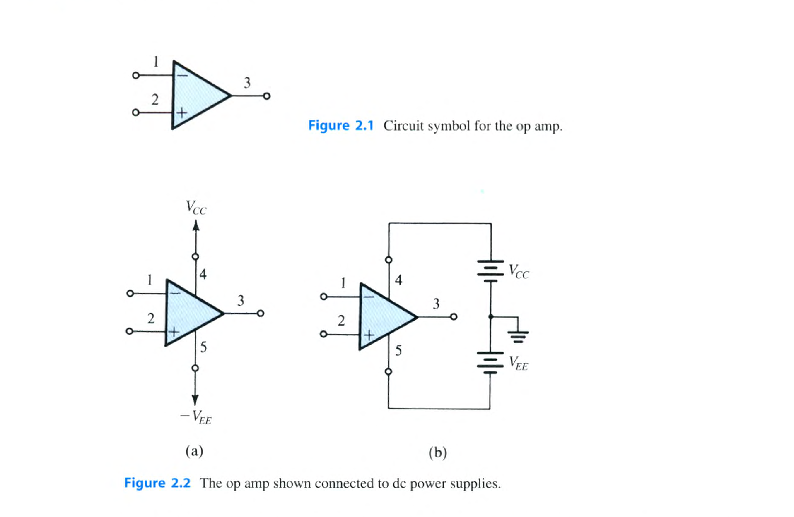

> **求解目標**：釐清訊號端點（Inverting, Noninverting, Output）與直流電源端點（$V_{CC}, -V_{EE}$）之封裝共享配置。

<template #solution>

#### 逐步解析：

1. **單一運算放大器 (Single Op Amp) 之最少端點數**：
   - 訊號端點（3 個）：反相輸入端 (Inverting Input, 1)、同相輸入端 (Noninverting Input, 2)、輸出端 (Output, 3)。
   - 直流電源端點（2 個）：正電源供應端 ($V_{CC}$, 4)、負電源供應端 ($-V_{EE}$, 5)。
   - 總端點數：
     $$
     N_{\text{single}} = 3 + 2 = 5 \text{ 支端點}
     $$

2. **四組運算放大器 (Quad Op Amp) 之最少端點數**：
   - 每組運算放大器皆具備獨立的訊號輸入與輸出端點：
     $$
     N_{\text{signals}} = 4 \times 3 = 12 \text{ 支端點}
     $$
   - 所有 4 組運算放大器在晶片內部**共用同一組正電源與負電源供應接腳**：
     $$
     N_{\text{power}} = 2 \text{ 支端點 ($V_{CC}$ 與 $-V_{EE}$)}
     $$
   - 總端點數：
     $$
     N_{\text{quad}} = 12 + 2 = 14 \text{ 支端點}
     $$
   - *註：常見標準 IC 封裝（如 LM324 / TL084）皆為標準 14-pin DIP/SOIC 封裝。*

::: tip 標準答案
1. 單一運算放大器最少需 **$5$ 支引腳**。
2. 四組運算放大器封裝最少需 **$14$ 支引腳**。
:::

</template>
</PracticeCard>

<PracticeCard id="elec-ch2-ex-2-1" title="有限開路增益對反相放大器增益誤差與虛擬接地之影響" source="Example 2.1 · Textbook P68" topic="反相放大器組態">

考慮如圖 2.5 所示之標準反相放大器組態，外接電阻 $R_1 = 1\text{ k}\Omega$，$R_2 = 100\text{ k}\Omega$，其理想閉迴路增益為 $-\frac{R_2}{R_1} = -100\text{ V/V}$：

1. 分別計算當運算放大器之有限開路差模增益為 $A = 10^3, 10^4, 10^5$ 時的實際閉迴路增益 $G$、相對於理想增益之百分比誤差 $\epsilon$（定義為 $\epsilon = \frac{|G| - (R_2/R_1)}{R_2/R_1} \times 100\%$），以及當輸入訊號 $v_I = 0.1\text{ V}$ 時反相輸入端實際出現的電壓 $v_1$。
2. 若運算放大器之開路增益 $A$ 因溫度或製程變異由 $100,000$ 下降至 $50,000$（即開路增益大幅驟降 $50\%$），求閉迴路增益 $|G|$ 之百分比變化量。

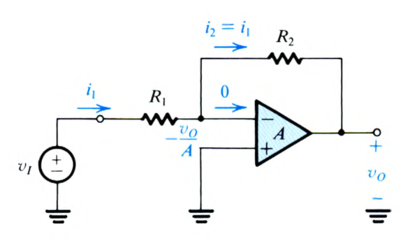
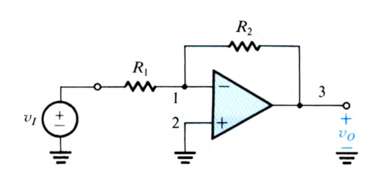

> **求解目標**：推導有限增益下閉迴路增益精確式 $G = -\frac{R_2/R_1}{1 + \frac{1 + R_2/R_1}{A}}$，並定量分析負回授對開路參數變異的強大抑制能力。

<template #solution>

#### 逐步解析與物理推導：

1. **有限增益下之精確閉迴路增益與反相節點電壓推導**：
   - 依據 KCL 與受控源定義（圖 2.7），輸出電壓 $v_O = -A v_1 \implies v_1 = -\frac{v_O}{A}$。
   - 節點 $v_1$ 之 KCL：
     $$
     \frac{v_I - v_1}{R_1} = \frac{v_1 - v_O}{R_2} \implies \frac{v_I + v_O/A}{R_1} = \frac{-v_O/A - v_O}{R_2}
     $$
   - 移項整理得閉迴路增益精確式：
     $$
     G = \frac{v_O}{v_I} = -\frac{R_2/R_1}{1 + \frac{1 + R_2/R_1}{A}}
     $$
   - 帶入 $R_1 = 1\text{ k}\Omega, R_2 = 100\text{ k}\Omega \implies \frac{R_2}{R_1} = 100$，$1 + \frac{R_2}{R_1} = 101$。
   - 當 $v_I = 0.1\text{ V}$ 時，$v_1 = -\frac{v_O}{A} = -\frac{G v_I}{A} = \frac{|G| v_I}{A}$（因 $G < 0$）。

   - **各 $A$ 值逐項計算**：
     - 當 $A = 10^3 = 1000$ 時：
       $$
       |G| = \frac{100}{1 + \frac{101}{1000}} = \frac{100}{1.101} = 90.8265 \approx 90.83\text{ V/V}
       $$
       $$
       \epsilon = \frac{90.83 - 100}{100} \times 100\% = -9.17\%
       $$
       $$
       v_1 = -\frac{v_O}{A} = -\frac{(-9.083\text{ V})}{1000} = +9.08\text{ mV} \quad (\text{或與 $v_I$ 同相})
       $$
     - 當 $A = 10^4 = 10000$ 時：
       $$
       |G| = \frac{100}{1 + \frac{101}{10000}} = \frac{100}{1.0101} = 99.0001 \approx 99.00\text{ V/V}
       $$
       $$
       \epsilon = \frac{99.00 - 100}{100} \times 100\% = -1.00\%
       $$
       $$
       v_1 = -\frac{-9.90\text{ V}}{10000} = +0.99\text{ mV}
       $$
     - 當 $A = 10^5 = 100000$ 時：
       $$
       |G| = \frac{100}{1 + \frac{101}{100000}} = \frac{100}{1.00101} = 99.899 \approx 99.90\text{ V/V}
       $$
       $$
       \epsilon = \frac{99.90 - 100}{100} \times 100\% = -0.10\%
       $$
       $$
       v_1 = -\frac{-9.99\text{ V}}{100000} = +0.10\text{ mV}
       $$

2. **開路增益變動 $50\%$ 時之靈敏度分析**：
   - 當 $A = 50,000$ 時：
     $$
     |G|_{A=50000} = \frac{100}{1 + \frac{101}{50000}} = \frac{100}{1.00202} = 99.7984 \approx 99.80\text{ V/V}
     $$
   - 閉迴路增益之百分比變化率：
     $$
     \Delta |G|\% = \frac{99.80 - 99.90}{99.90} \times 100\% \approx -0.10\%
     $$
   - **微電子學深刻結論**：開路增益高達 $50\%$ 的劇烈劣化，在強負回授作用下，閉迴路增益僅微幅變動 $0.1\%$（靈敏度降低了 $A/(1+R_2/R_1) \approx 500$ 倍）。

::: tip 標準答案
1. 計算數據對帳表：
   - $A = 10^3$：$|G| = \mathbf{90.83\text{ V/V}}$，$\epsilon = \mathbf{-9.17\%}$，$v_1 = \mathbf{9.08\text{ mV}}$
   - $A = 10^4$：$|G| = \mathbf{99.00\text{ V/V}}$，$\epsilon = \mathbf{-1.00\%}$，$v_1 = \mathbf{0.99\text{ mV}}$
   - $A = 10^5$：$|G| = \mathbf{99.90\text{ V/V}}$，$\epsilon = \mathbf{-0.10\%}$，$v_1 = \mathbf{0.10\text{ mV}}$
2. 當 $A$ 由 $100,000$ 驟降至 $50,000$（$-50\%$）時，$|G|$ 僅由 $99.90$ 變為 $99.80$，變動率僅為 **$-0.10\%$**。
:::

</template>
</PracticeCard>

<PracticeCard id="elec-ch2-ex-2-2" title="高輸入阻抗與大增益反相放大器之 T 型回授網路設計" source="Example 2.2 · Textbook P69-P70" topic="T 型回授網路">

在傳統反相放大器中，欲同時達成高輸入電阻（如 $R_{in} = 1\text{ M}\Omega$）與大電壓增益（如 $G = -100\text{ V/V}$），需要高達 $100\text{ M}\Omega$ 的回授電阻，此在 IC 與 PCB 實作中極不切實際。圖 2.8 提出了具備 T 型電阻網路（$R_2, R_3, R_4$）的回授架構：

1. 假設運算放大器為理想，試推導圖 2.8 電路之閉迴路電壓增益 $\frac{v_O}{v_I}$ 表示式。
2. 若要求輸入電阻 $R_{in} = 1\text{ M}\Omega$、電壓增益 $G = -100\text{ V/V}$，且規定所有電阻值不得超過 $1\text{ M}\Omega$，試設計各電阻 $R_1, R_2, R_3, R_4$ 之數值。
3. 試闡明 T 型網路在不使用極大電阻下仍能實現大增益的「電流倍增 (Current-Multiplication)」物理機制。

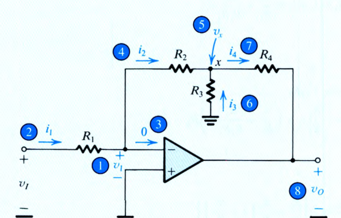

> **求解目標**：節點電流分析法建立 $G = -\frac{R_2}{R_1}\left(1 + \frac{R_4}{R_2} + \frac{R_4}{R_3}\right)$，並完成參數拘束設計。

<template #solution>

#### 逐步解析：

1. **增益表示式推導（依序建立節點電流與電壓）**：
   - **步驟 1**：運算放大器具虛擬接地，反相輸入端電壓 $v_1 = 0\text{ V}$，輸入電阻 $R_{in} = \frac{v_I}{i_1} = R_1$。
     $$
     i_1 = \frac{v_I - 0}{R_1} = \frac{v_I}{R_1}
     $$
   - **步驟 2**：理想運算放大器輸入端不抽電流，故 $i_2 = i_1 = \frac{v_I}{R_1}$。
   - **步驟 3**：中間節點 $x$ 之電壓 $v_x$：
     $$
     v_x = v_1 - i_2 R_2 = 0 - \left(\frac{v_I}{R_1}\right) R_2 = -\frac{R_2}{R_1} v_I
     $$
   - **步驟 4**：流經接地電阻 $R_3$ 之電流 $i_3$（方向由接地流向節點 $x$）：
     $$
     i_3 = \frac{0 - v_x}{R_3} = -\frac{v_x}{R_3} = \left(\frac{R_2}{R_1 R_3}\right) v_I
     $$
   - **步驟 5**：節點 $x$ 之 KCL 決定流經 $R_4$ 之電流 $i_4$：
     $$
     i_4 = i_2 + i_3 = \frac{v_I}{R_1} + \left(\frac{R_2}{R_1 R_3}\right) v_I = \frac{v_I}{R_1}\left(1 + \frac{R_2}{R_3}\right)
     $$
   - **步驟 6**：輸出端電壓 $v_O$：
     $$
     v_O = v_x - i_4 R_4 = -\left(\frac{R_2}{R_1}\right) v_I - \frac{v_I}{R_1}\left(1 + \frac{R_2}{R_3}\right) R_4
     $$
   - 提取公因式得閉迴路增益：
     $$
     G = \frac{v_O}{v_I} = -\frac{R_2}{R_1} \left( 1 + \frac{R_4}{R_2} + \frac{R_4}{R_3} \right)
     $$

2. **電路參數設計**：
   - 依題意 $R_{in} = R_1 = 1\text{ M}\Omega$。
   - 電阻上限為 $1\text{ M}\Omega$，欲最大化第一項增益因數，選定 $R_2 = 1\text{ M}\Omega \implies \frac{R_2}{R_1} = 1$。
   - 故需使括號內因數為 $100$：
     $$
     1 + \frac{R_4}{R_2} + \frac{R_4}{R_3} = 100 \implies \frac{R_4}{R_2} + \frac{R_4}{R_3} = 99
     $$
   - 取最大允許值 $R_4 = 1\text{ M}\Omega$，則 $\frac{R_4}{R_2} = 1$，代入得：
     $$
     1 + \frac{1\text{ M}\Omega}{R_3} = 99 \implies \frac{1\text{ M}\Omega}{R_3} = 98 \implies R_3 = \frac{1000\text{ k}\Omega}{98} \approx 10.204\text{ k}\Omega
     $$
   - **對照傳統電路**：若用單一電阻 $R_2$ 需高達 $100\text{ M}\Omega$；本設計僅需三個 $1\text{ M}\Omega$ 與一個 $10.2\text{ k}\Omega$ 實用電阻。

3. **電流倍增物理機制**：
   - 因反相端虛擬接地，$R_2$ 與 $R_3$ 在交流小訊號上相當於並聯於節點 $x$ 與接地之間。
   - 當 $R_3 \ll R_2$（在此例中 $R_2/R_3 \approx 98$），電流 $i_3$ 被強制為 $i_2$ 的 $98$ 倍。
   - 節點 $x$ 將兩者匯聚為 $i_4 = (1 + 98) i_2 = 99 i_1$，這股放大了 $99$ 倍的大電流流經 $R_4$，在 $R_4$ 上產生極大的電壓降，進而達成 $-100\text{ V/V}$ 之高電壓增益。

::: tip 標準答案
1. 閉迴路增益公式：$G = \mathbf{-\frac{R_2}{R_1}\left(1 + \frac{R_4}{R_2} + \frac{R_4}{R_3}\right)}$
2. 設計元件值：$R_1 = \mathbf{1\text{ M}\Omega}$，$R_2 = \mathbf{1\text{ M}\Omega}$，$R_4 = \mathbf{1\text{ M}\Omega}$，$R_3 = \mathbf{10.2\text{ k}\Omega}$。
3. 電流倍增因數為 $(1 + R_2/R_3) = \mathbf{99}$ 倍。
:::

</template>
</PracticeCard>

<PracticeCard id="elec-ch2-prac-2-9" title="多訊號源重疊定理 (Superposition) 於運算放大器電路之分析" source="Exercise 2.9 · Textbook P77" topic="重疊定理與加法電路">

考慮如圖 E2.9 所示之具雙輸入訊號源 $v_1$ 與 $v_2$ 的運算放大器電路。假設運算放大器為理想，試運用**重疊定理 (Superposition Principle)** 求出輸出電壓 $v_O$ 關於輸入訊號 $v_1$ 與 $v_2$ 的線性組合表示式。

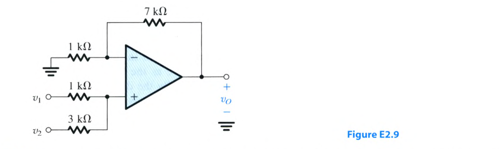

> **求解目標**：分別令單一訊號作用求分項響應，推導 $v_O = 6 v_1 + 2 v_2$。

<template #solution>

#### 逐步解析：

1. **同相端節點電壓 $v_+$ 分析**：
   - 觀察同相輸入端（$+$ 端），外接由訊號源 $v_1$（串聯 $1\text{ k}\Omega$）與 $v_2$（串聯 $3\text{ k}\Omega$）組成的電阻分壓網路。
   - 由於理想運算放大器同相端不抽電流（$i_+ = 0$），同相端電壓 $v_+$ 可直接由分壓重疊求得：
     $$
     v_+ = v_1 \left( \frac{3\text{ k}\Omega}{1\text{ k}\Omega + 3\text{ k}\Omega} \right) + v_2 \left( \frac{1\text{ k}\Omega}{1\text{ k}\Omega + 3\text{ k}\Omega} \right) = \frac{3}{4} v_1 + \frac{1}{4} v_2
     $$

2. **反相端負回授放大架構與輸出關係**：
   - 反相端（$-$ 端）透過 $1\text{ k}\Omega$ 接地，並透過 $7\text{ k}\Omega$ 接至輸出端 $v_O$。
   - 此架構為標準同相放大器組態，其同相增益為：
     $$
     A_v = 1 + \frac{R_f}{R_1} = 1 + \frac{7\text{ k}\Omega}{1\text{ k}\Omega} = 8\text{ V/V}
     $$

3. **總輸出電壓計算**：
   - 輸出端電壓 $v_O$ 即為同相端輸入電壓經同相放大後的結果：
     $$
     v_O = A_v \cdot v_+ = 8 \left( \frac{3}{4} v_1 + \frac{1}{4} v_2 \right) = 6 v_1 + 2 v_2
     $$

::: tip 標準答案
輸出電壓表示式為：
$$
v_O = \mathbf{6 v_1 + 2 v_2}
$$
:::

</template>
</PracticeCard>

<PracticeCard id="elec-ch2-prac-2-15" title="差動放大器之差模增益、差模輸入阻抗與 CMRR 計算" source="Exercise 2.15 · Textbook P83" topic="差動放大器">

考慮如圖 2.16 所示之經典單運算放大器差動放大器電路，其電阻值為 $R_1 = R_3 = 2\text{ k}\Omega$，$R_2 = R_4 = 200\text{ k}\Omega$：

1. 計算該電路之差模電壓增益 $A_d = \frac{v_O}{v_{I2} - v_{I1}}$。
2. 計算差模輸入電阻 $R_{id}$ 以及電路輸出電阻 $R_o$。
3. 若電阻製造容差為 $\pm 1\%$（即 $\epsilon = 0.01$），試估算最壞情況下之共模增益 $A_{cm}$ 以及共模拒斥比 $\text{CMRR}$（以 dB 表示）。

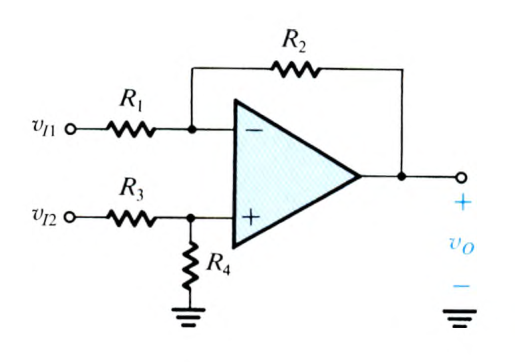

> **求解目標**：差動放大器核心公式 $A_d = R_2/R_1$、$R_{id} = 2R_1$、容差下 $A_{cm} \approx \frac{R_2}{R_1}(4\epsilon)$ 與 CMRR 評估。

<template #solution>

#### 逐步解析：

1. **差模增益 $A_d$ 計算**：
   - 由於電阻滿足平衡匹配條件 $\frac{R_2}{R_1} = \frac{R_4}{R_3} = \frac{200\text{ k}\Omega}{2\text{ k}\Omega} = 100$：
     $$
     A_d = \frac{R_2}{R_1} = 100\text{ V/V} = 20\log_{10}(100) = 40\text{ dB}
     $$

2. **輸入阻抗與輸出阻抗**：
   - 差模輸入訊號 $v_{Id} = v_{I2} - v_{I1}$ 作用時，兩輸入端間的等效電阻為：
     $$
     R_{id} = R_1 + R_3 = 2 R_1 = 2 \times 2\text{ k}\Omega = 4\text{ k}\Omega
     $$
   - 由於輸出直接由理想運算放大器輸出端引出，輸出電阻 $R_o = 0\ \Omega$。

3. **電阻容差對 CMRR 之劣化評估**：
   - 當四顆電阻具有最壞情況容差 $\pm \epsilon = \pm 1\% = \pm 0.01$ 時，共模增益上限為：
     $$
     |A_{cm}| \approx \frac{R_2}{R_1} \cdot (4\epsilon) = 100 \times 4(0.01) = 4\text{ V/V} \times 0.01 = 0.04\text{ V/V}
     $$
   - 共模拒斥比 $\text{CMRR}$：
     $$
     \text{CMRR} = \frac{A_d}{|A_{cm}|} = \frac{100}{0.04} = 2500
     $$
   - 轉換為分貝 (dB)：
     $$
     \text{CMRR}(\text{dB}) = 20\log_{10}(2500) \approx 67.96\text{ dB} \approx 68\text{ dB}
     $$

::: tip 標準答案
1. 差模增益 $A_d = \mathbf{100\text{ V/V}}$（$40\text{ dB}$）。
2. 差模輸入電阻 $R_{id} = \mathbf{4\text{ k}\Omega}$，輸出電阻 $R_o = \mathbf{0\ \Omega}$。
3. 最壞情況共模增益 $|A_{cm}| = \mathbf{0.04\text{ V/V}}$，$\text{CMRR} = \mathbf{2500}$（即 $\mathbf{68\text{ dB}}$）。
:::

</template>
</PracticeCard>

<PracticeCard id="elec-ch2-ex-2-3" title="三運算放大器儀表放大器 (Instrumentation Amplifier) 之連續可調增益設計" source="Example 2.3 · Textbook P85-P86" topic="儀表放大器">

儀表放大器廣泛應用於生醫感測與微弱差動量測。圖 2.20(b) 所示為經典的三運算放大器儀表放大器電路，其差模增益由單一電阻 $2R_1$ 調控：

1. 試設計該電路，使其差模電壓增益 $A_d$ 可透過一個 $100\text{ k}\Omega$ 的可變電阻（電位計 Potentiometer，$R_v \in [0, 100\text{ k}\Omega]$）在 $2\text{ V/V}$ 至 $1000\text{ V/V}$ 的範圍內連續調變。
2. 決定第二級差動放大器之電阻值 $R_3, R_4$ 以及第一級電阻 $R_2$ 與可變調阻支路（固定電阻 $R_{1f}$ 串聯電位計 $R_v$）之精確數值。

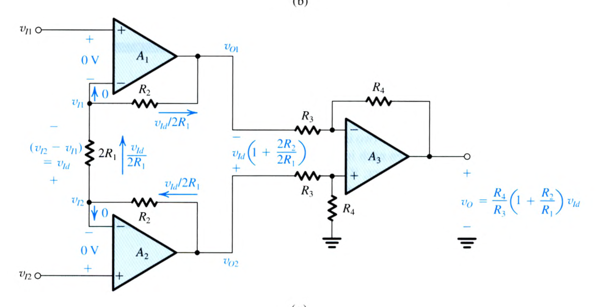
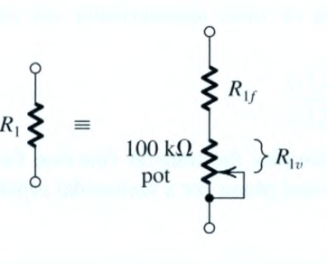

> **求解目標**：架構分級增益配置，推導 $A_d = \left(1 + \frac{2R_2}{R_{1f} + R_v}\right)\left(\frac{R_4}{R_3}\right)$ 並計算最佳阻值。

<template #solution>

#### 逐步解析：

1. **增益分配原則**：
   - 在儀表放大器設計中，通常將**所有可變增益集中於第一級**，第二級則配置為固定單位差模增益（$A_{d2} = 1$），專責執行高精度的差模相減並完全拒斥共模訊號。
   - 因此取第二級電阻全數相等：
     $$
     R_3 = R_4 = 10\text{ k}\Omega \implies A_{d2} = \frac{R_4}{R_3} = 1
     $$

2. **第一級可變增益支路參數推導**：
   - 第一級差模增益公式為：
     $$
     A_{d1} = 1 + \frac{2 R_2}{2 R_1} = 1 + \frac{2 R_2}{R_{1f} + R_v}
     $$
   - 當電位計調至最大阻值 $R_v = 100\text{ k}\Omega$ 時，增益達到最小值 $A_{d,\min} = 2$：
     $$
     1 + \frac{2 R_2}{R_{1f} + 100\text{ k}\Omega} = 2 \implies \frac{2 R_2}{R_{1f} + 100\text{ k}\Omega} = 1 \implies 2 R_2 = R_{1f} + 100\text{ k}\Omega
     $$
   - 當電位計調至最小阻值 $R_v = 0\ \Omega$ 時，增益達到最大值 $A_{d,\max} = 1000$：
     $$
     1 + \frac{2 R_2}{R_{1f} + 0} = 1000 \implies \frac{2 R_2}{R_{1f}} = 999 \implies 2 R_2 = 999 R_{1f}
     $$
   - 聯立解 $R_{1f}$ 與 $R_2$：
     $$
     999 R_{1f} = R_{1f} + 100\text{ k}\Omega \implies 998 R_{1f} = 100\text{ k}\Omega
     $$
     $$
     R_{1f} = \frac{100\text{ k}\Omega}{998} \approx 100.2\ \Omega \approx 100\ \Omega
     $$
     $$
     2 R_2 = 999(100.2\ \Omega) = 100.1\text{ k}\Omega \implies R_2 = 50.05\text{ k}\Omega \approx 50\text{ k}\Omega
     $$

::: tip 標準答案
1. 第二級電阻：$R_3 = R_4 = \mathbf{10\text{ k}\Omega}$（增益為 $1$）。
2. 第一級對稱電阻：$R_2 = \mathbf{50\text{ k}\Omega}$。
3. 調阻支路：固定電阻 $R_{1f} = \mathbf{100.2\ \Omega}$（實務常取標稱值 $100\ \Omega$）串聯 $100\text{ k}\Omega$ 電位計 $R_v$。
:::

</template>
</PracticeCard>

<PracticeCard id="elec-ch2-ex-2-4" title="一階主動低通濾波器 (STC 積分器) 之轉移函數、波德圖與參數設計" source="Example 2.4 · Textbook P89-P90" topic="主動濾波器與積分器">

考慮如圖 2.23 所示之運算放大器電路，其回授網路為電阻 $R_2$ 與電容 $C_2$ 並聯：

1. 導出轉移函數 $T(s) = \frac{V_o(s)}{V_i(s)}$，並證明其具備單時間常數 (STC) 低通濾波特性，求出直流增益 $K$ 與 3-dB 截止頻率 $\omega_0$。
2. 進行元件參數設計：要求輸入電阻 $R_{in} = 1\text{ k}\Omega$、直流增益為 $40\text{ dB}$、3-dB 截止頻率為 $f_0 = 1\text{ kHz}$。
3. 在此設計下，求轉移函數增益降至單位增益 ($0\text{ dB}$, 增益為 $1$) 時的頻率 $f_{0\text{dB}}$，並計算該頻率下的輸出相角 $\phi$。

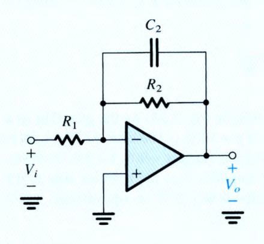

> **求解目標**：建立 $T(s) = -\frac{R_2/R_1}{1 + s C_2 R_2}$，並完成濾波器參數設計與頻寬相位計算。

<template #solution>

#### 逐步解析：

1. **轉移函數推導**：
   - 輸入阻抗 $Z_1(s) = R_1$，回授導納 $Y_2(s) = \frac{1}{R_2} + s C_2$。
   - 閉迴路轉移函數：
     $$
     T(s) = -\frac{Z_2(s)}{Z_1(s)} = -\frac{1}{Z_1(s) Y_2(s)} = -\frac{1}{R_1 \left(\frac{1}{R_2} + s C_2\right)} = -\frac{R_2/R_1}{1 + s C_2 R_2}
     $$
   - 此形式完全符合標準一階低通 STC 轉移函數 $T(s) = \frac{K}{1 + s/\omega_0}$：
     - 直流增益（$s = 0$）：$K = -\frac{R_2}{R_1}$
     - 3-dB 轉折角頻率：$\omega_0 = \frac{1}{C_2 R_2} \implies f_0 = \frac{1}{2\pi C_2 R_2}$

2. **電路參數設計**：
   - 輸入電阻 $R_{in} = R_1 = 1\text{ k}\Omega$。
   - 直流增益 $40\text{ dB} = 100\text{ V/V} \implies \frac{R_2}{R_1} = 100 \implies R_2 = 100 R_1 = 100\text{ k}\Omega$。
   - 3-dB 截止頻率 $f_0 = 1\text{ kHz}$：
     $$
     C_2 = \frac{1}{2\pi f_0 R_2} = \frac{1}{2\pi \times (10^3\text{ Hz}) \times (100 \times 10^3\ \Omega)} = \frac{1}{2\pi \times 10^8} \approx 1.5915\text{ nF} \approx 1.59\text{ nF}
     $$

3. **單位增益頻率與相角計算**：
   - 在高於截止頻率處（$f \gg f_0$），增益以 $-20\text{ dB/decade}$ 滾降。
   - 直流增益為 $40\text{ dB}$，需經 $2\text{ decades}$ 滾降至 $0\text{ dB}$：
     $$
     f_{0\text{dB}} = 100 \times f_0 = 100 \times 1\text{ kHz} = 100\text{ kHz}
     $$
   - 在 $f = 100\text{ kHz} \gg f_0$ 處，STC 低通網路相角貢獻為 $-\tan^{-1}(100) \approx -90^\circ$。
   - 加上反相放大器負號帶來的固定 $-180^\circ$ 相位反轉：
     $$
     \phi_{\text{total}} = -180^\circ - 90^\circ = -270^\circ \equiv +90^\circ
     $$

::: tip 標準答案
1. 轉移函數：$T(s) = \mathbf{-\frac{R_2/R_1}{1 + s C_2 R_2}}$，直流增益 $K = \mathbf{-R_2/R_1}$，$\omega_0 = \mathbf{1/(C_2 R_2)}$。
2. 元件數值：$R_1 = \mathbf{1\text{ k}\Omega}$，$R_2 = \mathbf{100\text{ k}\Omega}$，$C_2 = \mathbf{1.59\text{ nF}}$。
3. 單位增益頻率 $f_{0\text{dB}} = \mathbf{100\text{ kHz}}$，總相角 $\phi = \mathbf{-270^\circ \text{ (或 } +90^\circ\text{)}}$。
:::

</template>
</PracticeCard>

<PracticeCard id="elec-ch2-ex-2-5" title="光電探測器轉阻積分放大電路設計與積分頻率計算" source="Example 2.5 · Textbook P92" topic="光電信號放大">

在微弱光強度量測中，光電探測器（Photodetector）常以電流源並聯內阻的模型表示。如圖 2.25 所示，探測器產生頻率 $10\text{ kHz}$、峰值振幅 $10\ \mu\text{A}$ 之正弦電流訊號 $i_s(t)$，內阻為 $R_s = 5\text{ k}\Omega$。該訊號送入米勒積分器進行放大與積分：

1. 試求積分電容 $C$ 之數值，使得輸出電壓 $v_o(t)$ 的正弦振幅峰值恰為 $200\text{ mV}$。
2. 計算此積分器之特徵積分角頻率 $\omega_{int}$ 與頻率 $f_{int}$。

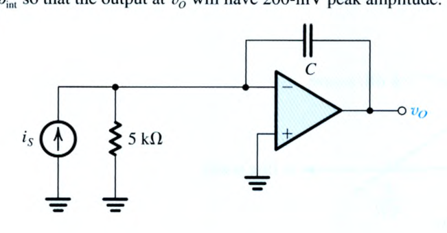
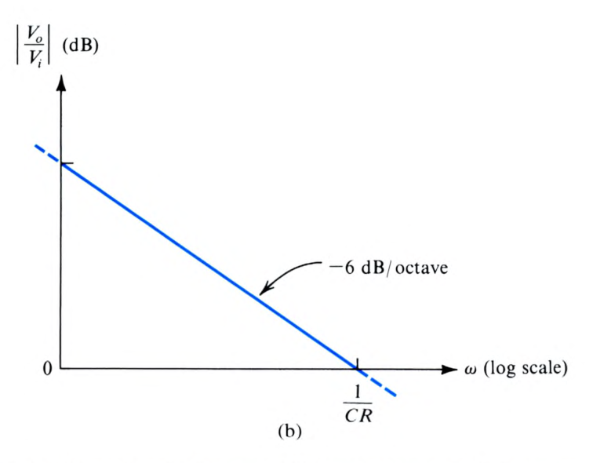

> **求解目標**：諾頓/戴維寧等效轉換，利用積分器頻率響應 $|V_o / V_s| = \frac{1}{\omega C R}$ 求解 $C$ 與 $\omega_{int}$。

<template #solution>

#### 逐步解析：

1. **訊號源戴維寧等效轉換**：
   - 諾頓電流源 $i_s(t)$ 與並聯內阻 $R_s = 5\text{ k}\Omega$ 可等效為戴維寧電壓源 $v_s(t)$ 串聯內阻 $R = 5\text{ k}\Omega$：
     $$
     \hat{V}_s = \hat{I}_s \times R_s = (10\ \mu\text{A}) \times (5\text{ k}\Omega) = 50\text{ mV}
     $$
   - 電路轉化為標準米勒積分器，輸入為振幅 $50\text{ mV}$、頻率 $f = 10\text{ kHz}$ 之電壓源，串聯輸入電阻 $R = 5\text{ k}\Omega$。

2. **積分電容 $C$ 計算**：
   - 理想米勒積分器在正弦角頻率 $\omega = 2\pi f$ 下之增益大小為：
     $$
     \left| \frac{V_o}{V_s} \right| = \frac{1}{\omega C R}
     $$
   - 帶入目標輸出振幅 $\hat{V}_o = 200\text{ mV}$ 與輸入振幅 $\hat{V}_s = 50\text{ mV}$：
     $$
     \frac{200\text{ mV}}{50\text{ mV}} = 4 = \frac{1}{2\pi \times (10\text{ kHz}) \times C \times (5\text{ k}\Omega)}
     $$
     $$
     C = \frac{1}{4 \times 2\pi \times (10^4\text{ Hz}) \times (5 \times 10^3\ \Omega)} = \frac{1}{4 \times \pi \times 10^8} = \frac{10^{-8}}{4\pi}\text{ F} \approx 0.7958\text{ nF} \approx 0.8\text{ nF}
     $$

3. **積分頻率 $\omega_{int}$ 與 $f_{int}$ 計算**：
   - 積分器單位增益頻率（即 $\omega_{int} = \frac{1}{CR}$）：
     $$
     \omega_{int} = \frac{1}{(0.8 \times 10^{-9}\text{ F}) \times (5 \times 10^3\ \Omega)} = \frac{1}{4 \times 10^{-6}} = 2.5 \times 10^5\text{ rad/s} = 2\pi \times 39.79\text{ kHz} \approx 2\pi \times 40\text{ krad/s}
     $$
     $$
     f_{int} = \frac{\omega_{int}}{2\pi} \approx 40\text{ kHz}
     $$

::: tip 標準答案
1. 積分電容值 $C = \mathbf{0.8\text{ nF}}$（精確值 $0.796\text{ nF}$）。
2. 積分特徵頻率 $\omega_{int} = \mathbf{2.5 \times 10^5\text{ rad/s}}$（$2\pi \times 40\text{ krad/s}$），$f_{int} = \mathbf{40\text{ kHz}}$。
:::

</template>
</PracticeCard>

<PracticeCard id="elec-ch2-ex-2-6" title="米勒積分器之脈衝暫態響應與並聯回授電阻 RF 之穩態與飽和分析" source="Example 2.6 · Textbook P93-P94" topic="米勒積分器暫態響應">

如圖 2.27(a) 所示，將振幅 $1\text{ V}$、寬度 $1\text{ ms}$ 之單一矩形電壓脈衝輸入至米勒積分器，已知 $R = 10\text{ k}\Omega$，$C = 10\text{ nF}$，運算放大器之輸出飽和電壓為 $\pm 13\text{ V}$：

1. 計算理想積分器在 $0 \le t \le 1\text{ ms}$ 及 $t > 1\text{ ms}$ 的輸出電壓波形 $v_o(t)$，並求出脈衝結束時（$t = 1\text{ ms}$）的輸出值。
2. 若在積分電容 $C$ 兩端並聯一個大電阻 $R_F = 1\text{ M}\Omega$ 以抑制直流發散，求此時輸出響應波形之修正情形，並計算 $t = 1\text{ ms}$ 時的輸出電壓。

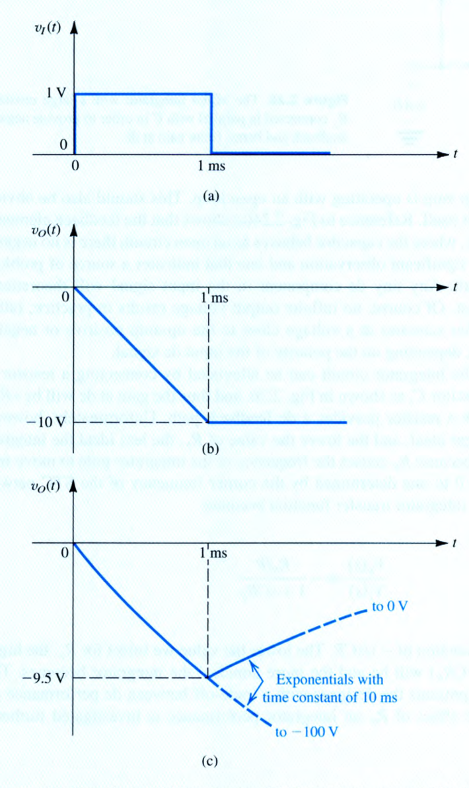

> **求解目標**：建立理想線性斜波 $v_o(t) = -\frac{1}{RC}\int v_I dt$ 與含 $R_F$ 之指數暫態 $v_o(t) = -V\frac{R_F}{R}(1 - e^{-t/R_F C})$ 對比分析。

<template #solution>

#### 逐步解析：

1. **理想米勒積分器暫態響應**：
   - 積分時間常數：
     $$
     \tau = R C = (10 \times 10^3\ \Omega) \times (10 \times 10^{-9}\text{ F}) = 10^{-4}\text{ s} = 0.1\text{ ms}
     $$
   - 在脈衝期間（$0 \le t \le 1\text{ ms}$），$v_I(t) = 1\text{ V}$，起始條件 $v_o(0) = 0$：
     $$
     v_o(t) = -\frac{1}{RC} \int_0^t (1\text{ V}) dt' = -\frac{t}{0.1\text{ ms}} = -10 t\text{ (以 ms 為單位)}
     $$
   - 在 $t = 1\text{ ms}$ 脈衝結束瞬間：
     $$
     v_o(1\text{ ms}) = -10\text{ V}
     $$
   - 此值小於運算放大器負飽和極限 $-13\text{ V}$，電路全程維持線性工作。
   - 當 $t > 1\text{ ms}$ 時，輸入 $v_I(t) = 0$，電容電荷無洩放路徑，輸出恆定維持於 $-10\text{ V}$ 記憶狀態（圖 2.27b）。

2. **並聯 $R_F = 1\text{ M}\Omega$ 之響應分析**：
   - 並聯 $R_F$ 後轉為 STC 一階低通電路，直流增益為 $-\frac{R_F}{R} = -\frac{1\text{ M}\Omega}{10\text{ k}\Omega} = -100\text{ V/V}$。
   - 新時間常數：
     $$
     \tau_F = R_F C = (10^6\ \Omega) \times (10^{-8}\text{ F}) = 10\text{ ms}
     $$
   - 在脈衝期間（$0 \le t \le 1\text{ ms}$），響應呈現指數上升軌跡：
     $$
     v_o(t) = -100 \times (1\text{ V}) \left(1 - e^{-t / 10\text{ ms}}\right)
     $$
   - 在 $t = 1\text{ ms}$ 時：
     $$
     v_o(1\text{ ms}) = -100 \left(1 - e^{-0.1}\right) = -100(1 - 0.904837) = -9.516\text{ V} \approx -9.52\text{ V}
     $$
   - 當 $t > 1\text{ ms}$ 時，輸入為零，電容透過 $R_F$ 放電：
     $$
     v_o(t) = -9.52 e^{-(t - 1\text{ ms}) / 10\text{ ms}}\text{ V}
     $$
   - 輸出最終將指數衰減回 $0\text{ V}$（圖 2.27c）。

::: tip 標準答案
1. 理想積分器：$0 \le t \le 1\text{ ms}$ 為線性斜坡 $v_o(t) = \mathbf{-10 t\text{ (V/ms)}}$；$t = 1\text{ ms}$ 時 $v_o = \mathbf{-10\text{ V}}$；$t > 1\text{ ms}$ 恆定維持 **$-10\text{ V}$**。
2. 並聯 $R_F$ 後：$t = 1\text{ ms}$ 時輸出為 **$-9.52\text{ V}$**；$t > 1\text{ ms}$ 以時間常數 $10\text{ ms}$ 指數衰減歸零。
:::

</template>
</PracticeCard>

<PracticeCard id="elec-ch2-prac-2-18" title="對稱方波輸入米勒積分器之三角波輸出時間常數設計" source="Exercise 2.18 · Textbook P97" topic="米勒積分器應用">

將一個峰對峰值為 $5\text{ V}$（即 $\pm 2.5\text{ V}$）、平均值為 $0\text{ V}$、週期為 $T = 2\ \mu\text{s}$ 的對稱方波電壓輸入至理想米勒積分器。試設計積分器之時間常數 $CR$，使輸出端產生峰對峰值恰為 $5\text{ V}$ 的對稱三角波。

> **求解目標**：利用三角波峰對峰變化量 $\Delta v_O = \frac{1}{CR} V_p \frac{T}{2}$ 求解 $CR$。

<template #solution>

#### 逐步解析：

1. **方波輸入波形參數**：
   - 週期 $T = 2\ \mu\text{s}$，半週期 $\frac{T}{2} = 1\ \mu\text{s}$。
   - 在前半週期 $0 < t < 1\ \mu\text{s}$，輸入電壓 $v_I(t) = +2.5\text{ V}$。
   - 在後半週期 $1\ \mu\text{s} < t < 2\ \mu\text{s}$，輸入電壓 $v_I(t) = -2.5\text{ V}$。

2. **輸出電壓變化量與時間常數推導**：
   - 在前半週期內，輸出電壓向下線性斜降，總電壓變化量為：
     $$
     \Delta v_O = \left| -\frac{1}{CR} \int_0^{T/2} v_I(t) dt \right| = \frac{1}{CR} \times V_p \times \frac{T}{2}
     $$
   - 依題意輸出三角波之峰對峰值 $\Delta v_O = 5\text{ V}$：
     $$
     5\text{ V} = \frac{1}{CR} \times (2.5\text{ V}) \times (1\ \mu\text{s})
     $$
     $$
     CR = \frac{2.5\text{ V} \times 1\ \mu\text{s}}{5\text{ V}} = 0.5\ \mu\text{s} = 5 \times 10^{-7}\text{ s}
     $$

::: tip 標準答案
時間常數設計值為：
$$
CR = \mathbf{0.5\ \mu\text{s}}
$$
:::

</template>
</PracticeCard>

<PracticeCard id="elec-ch2-prac-2-21" title="輸入補償電壓 (Input Offset Voltage) 對電壓轉移特性曲線之平移效應" source="Exercise 2.21 · Textbook P98" topic="直流非理想性 (DC Imperfections)">

利用圖 2.29 所示之輸入補償電壓等效電路模型，考慮開路直流增益 $A_0 = 10^4\text{ V/V}$、輸出飽和電壓為 $\pm 10\text{ V}$ 且具有輸入補償電壓 $V_{OS} = +5\text{ mV}$ 的運算放大器：

1. 繪製輸出電壓 $v_O$ 對外加差模輸入電壓 $v_{Id} = v_2 - v_1$ 之轉移特性曲線。
2. 計算電路處於線性放大區（未飽和）時的差模輸入電壓範圍，並指出 $V_{OS}$ 對轉移曲線造成的幾何平移效果。

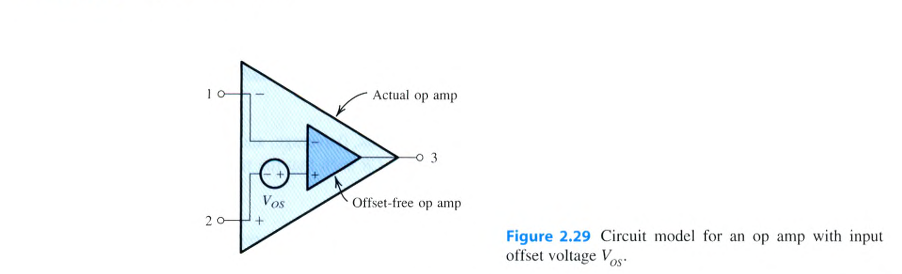
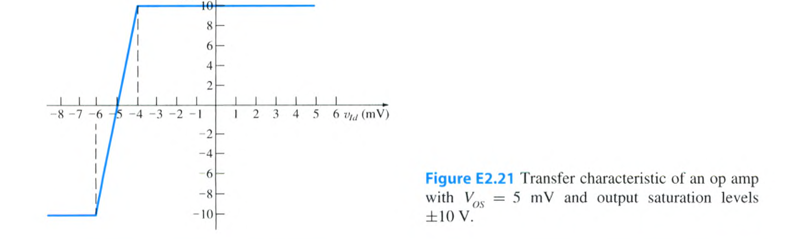

> **求解目標**：建立線性區不等式 $-L_- \le A_0(v_{Id} + V_{OS}) \le L_+$，確立轉移曲線向左平移 $V_{OS}$ 之物理本質。

<template #solution>

#### 逐步解析：

1. **等效輸入電壓與線性放大條件**：
   - 依據圖 2.29 模型，實際無補償運算放大器內部感測到的差模電壓為 $v_{Id,\text{internal}} = v_{Id} + V_{OS}$。
   - 輸出電壓表示式：
     $$
     v_O = A_0 (v_{Id} + V_{OS}) = 10^4 (v_{Id} + 5\text{ mV})
     $$
   - 運算放大器維持在線性工作區（$-10\text{ V} \le v_O \le +10\text{ V}$）的條件為：
     $$
     -10\text{ V} \le 10^4 (v_{Id} + 5\text{ mV}) \le +10\text{ V}
     $$
     $$
     -1\text{ mV} \le v_{Id} + 5\text{ mV} \le +1\text{ mV}
     $$
     $$
     -6\text{ mV} \le v_{Id} \le -4\text{ mV}
     $$

2. **轉移特性曲線分析（圖 E2.21）**：
   - 當 $v_{Id} \le -6\text{ mV}$ 時，輸出負向飽和於 $v_O = -10\text{ V}$。
   - 當 $-6\text{ mV} < v_{Id} < -4\text{ mV}$ 時，輸出以斜率 $A_0 = 10^4\text{ V/V}$ 線性上升。
   - 當 $v_{Id} = -5\text{ mV}$ 時，輸出恰好穿過零點（$v_O = 0\text{ V}$）。
   - 當 $v_{Id} \ge -4\text{ mV}$ 時，輸出正向飽和於 $v_O = +10\text{ V}$。
   - **幾何物理意義**：輸入補償電壓 $V_{OS} = 5\text{ mV}$ 使整條電壓轉移特性曲線**水平向左平移了 $5\text{ mV}$**。

::: tip 標準答案
1. 線性放大區範圍：$\mathbf{-6\text{ mV} \le v_{Id} \le -4\text{ mV}}$。
2. 轉移曲線零輸出點由原點平移至 $v_{Id} = \mathbf{-5\text{ mV}}$，整條特性曲線**向左平移 $V_{OS} = 5\text{ mV}$**。
:::

</template>
</PracticeCard>

<PracticeCard id="elec-ch2-prac-2-22" title="輸入補償電壓 Vos 在大增益反相放大器之輸出直流偏移與最大動態範圍" source="Exercise 2.22 · Textbook P100" topic="直流非理想性 (DC Imperfections)">

考慮一個以標稱增益 $1000\text{ V/V}$ 設計之反相放大器（$R_1 = 1\text{ k}\Omega, R_2 = 1\text{ M}\Omega$），運算放大器具備輸入補償電壓 $V_{OS} = 3\text{ mV}$，輸出飽和電壓為 $\pm 10\text{ V}$：

1. 若電路為直接直流耦合，計算輸出端因 $V_{OS}$ 產生的直流偏移電壓 $V_{O,dc}$，並求出放大器在輸出不發生截波失真（Clipping）下所允許輸入之最大正弦波峰值電壓 $\hat{v}_i$。
2. 若在輸入端串聯交連電容進行交流耦合（AC Coupling），求此時允許輸入之最大正弦波峰值電壓 $\hat{v}_i$。

> **求解目標**：比較直流耦合偏移放大 $V_{O,dc} = V_{OS}(1 + R_2/R_1)$ 與交流耦合 $V_{O,dc} = V_{OS}$ 對動態餘裕（Headroom）之影響。

<template #solution>

#### 逐步解析：

1. **直流耦合放大器之輸出直流偏移與動態範圍**：
   - 在輸入端接地（$v_I = 0$）時，輸入補償電壓 $V_{OS}$ 受到同相放大增益作用：
     $$
     V_{O,dc} = V_{OS} \left(1 + \frac{R_2}{R_1}\right) = (3\text{ mV}) \times \left(1 + \frac{1000\text{ k}\Omega}{1\text{ k}\Omega}\right) = 3\text{ mV} \times 1001 = 3.003\text{ V} \approx 3\text{ V}
     $$
   - 此高達 $+3\text{ V}$ 的直流偏移嚴重壓縮了正負擺幅空間。因正飽和電壓為 $+10\text{ V}$，正向可用擺幅餘裕僅剩：
     $$
     V_{o,\text{swing}} = 10\text{ V} - 3\text{ V} = 7\text{ V}
     $$
   - 故輸入端允許的最大對稱正弦波峰值為：
     $$
     \hat{v}_i = \frac{V_{o,\text{swing}}}{1000} = \frac{7\text{ V}}{1000} = 7\text{ mV}
     $$

2. **交流耦合（電容隔離）之改善效果**：
   - 當輸入端串聯交連電容 $C_1$ 時，對直流訊號而言電容開路，直流增益降為 $1 + \frac{R_2}{\infty} = 1$。
   - 輸出端直流偏移降為：
     $$
     V_{O,dc} = V_{OS} \times 1 = 3\text{ mV} \approx 0.003\text{ V} \approx 0\text{ V}
     $$
   - 輸出端動態餘裕幾乎完全恢復至全幅 $10\text{ V}$，此時允許輸入之最大正弦波峰值為：
     $$
     \hat{v}_i = \frac{10\text{ V}}{1000} = 10\text{ mV}
     $$

::: tip 標準答案
1. 直流耦合：輸出直流偏移 $V_{O,dc} \approx \mathbf{3\text{ V}}$，最大允許輸入正弦波峰值 $\hat{v}_i = \mathbf{7\text{ mV}}$。
2. 交流耦合：輸出直流偏移 $V_{O,dc} = \mathbf{3\text{ mV}}$，最大允許輸入正弦波峰值 $\hat{v}_i = \mathbf{10\text{ mV}}$。
:::

</template>
</PracticeCard>

<PracticeCard id="elec-ch2-prac-2-24" title="輸入偏壓電流 (IB) 與輸入補償電流 (IOS) 之輸出直流偏移與補償電阻設計" source="Exercise 2.24 · Textbook P104" topic="直流非理想性 (DC Imperfections)">

考慮一個反相放大器電路，電阻為 $R_1 = 10\text{ k}\Omega$，$R_2 = 1\text{ M}\Omega$。運算放大器之輸入偏壓電流為 $I_B = 100\text{ nA}$，輸入補償電流為 $I_{OS} = 10\text{ nA}$：

1. 若同相輸入端直接接地，求輸出端由輸入偏壓電流產生的直流偏移電壓 $V_O$。
2. 為了消除輸入偏壓電流的影響，應在同相端串聯多大阻值的補償電阻 $R_3$？
3. 加入最佳補償電阻 $R_3$ 後，求輸出端新的直流偏移電壓 $V_O$。

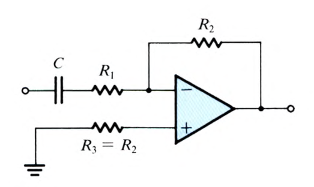

> **求解目標**：建立 $V_O = I_B R_2$ 與補償條件 $R_3 = R_1 \parallel R_2 \implies V_O = I_{OS} R_2$。

<template #solution>

#### 逐步解析：

1. **未加補償電阻時之輸出直流偏移**：
   - 當同相端直接接地時，流經 $R_1$ 的電流為零（兩端皆為零電位），流入反相端的偏壓電流 $I_{B1} \approx I_B$ 必須全數由輸出端經 $R_2$ 提供：
     $$
     V_O = I_{B1} R_2 \approx I_B R_2 = (100 \times 10^{-9}\text{ A}) \times (10^6\ \Omega) = 0.1\text{ V} = 100\text{ mV}
     $$

2. **同相端補償電阻 $R_3$ 計算**：
   - 欲使兩輸入端偏壓電流在兩端產生相同的共模壓降從而相互抵消，$R_3$ 必須等於反相端所見的直流等效電阻：
     $$
     R_3 = R_1 \parallel R_2 = \frac{10\text{ k}\Omega \times 1000\text{ k}\Omega}{10\text{ k}\Omega + 1000\text{ k}\Omega} = \frac{10000}{1010}\text{ k}\Omega \approx 9.901\text{ k}\Omega \approx 9.9\text{ k}\Omega \quad (\text{工程常取 } 10\text{ k}\Omega)
     $$

3. **加入補償電阻後之剩餘直流偏移**：
   - 加入 $R_3$ 後，對稱的偏壓電流 $I_B$ 效應完全抵消，剩餘偏移僅由兩端不匹配的補償電流 $I_{OS} = |I_{B1} - I_{B2}|$ 決定：
     $$
     V_O = I_{OS} R_2 = (10 \times 10^{-9}\text{ A}) \times (10^6\ \Omega) = 0.01\text{ V} = 10\text{ mV}
     $$
   - 輸出直流偏移成功縮小為原本的十分之一。

::: tip 標準答案
1. 未補償輸出偏移 $V_O = \mathbf{0.1\text{ V}}$（$100\text{ mV}$）。
2. 最佳補償電阻 $R_3 = \mathbf{9.9\text{ k}\Omega}$（約 $10\text{ k}\Omega$）。
3. 補償後剩餘偏移 $V_O = \mathbf{0.01\text{ V}}$（$10\text{ mV}$）。
:::

</template>
</PracticeCard>

<PracticeCard id="elec-ch2-prac-2-25" title="米勒積分器受輸入補償電壓 Vos 影響之輸出電壓線性漂移與飽和時間" source="Exercise 2.25 · Textbook P105" topic="積分器直流漂移與飽和">

考慮一個米勒積分器，時間常數為 $\tau = CR = 1\text{ ms}$，輸入電阻為 $R = 10\text{ k}\Omega$（積分電容 $C = 0.1\ \mu\text{F}$）。運算放大器具備輸入補償電壓 $V_{OS} = 2\text{ mV}$，輸出飽和電壓為 $\pm 12\text{ V}$：

1. 假設電源開啟時電容初始電壓為零且輸入端接地（$v_I = 0$），試求輸出電壓隨時間漂移之速率，並計算運算放大器達到輸出電壓飽和（$12\text{ V}$）所需的時間 $t_{sat}$。
2. 若在電容兩端並聯回授電阻 $R_F = 1\text{ M}\Omega$，求輸出端最終穩態之直流偏移電壓。

> **求解目標**：建立積分器漂移方程式 $v_O(t) = V_{OS} + \frac{V_{OS}}{CR} t$，求 $t_{sat}$ 與並聯 $R_F$ 之穩態電壓。

<template #solution>

#### 逐步解析：

1. **未加並聯電阻時之線性漂移與飽和時間**：
   - 輸入補償電壓 $V_{OS} = 2\text{ mV}$ 跨於電阻 $R$ 兩端，產生一恆定直流充電電流 $I_{dc} = \frac{V_{OS}}{R}$ 流入電容 $C$。
   - 輸出電壓隨時間呈線性積分漂移：
     $$
     v_O(t) = V_{OS} + \frac{1}{C}\int_0^t \frac{V_{OS}}{R} dt' = V_{OS} + \left(\frac{V_{OS}}{CR}\right) t \approx \left(\frac{V_{OS}}{\tau}\right) t
     $$
   - 輸出漂移速率：
     $$
     \text{Drift Rate} = \frac{V_{OS}}{\tau} = \frac{2\text{ mV}}{1\text{ ms}} = 2\text{ V/s}
     $$
   - 達到飽和電壓 $V_{sat} = 12\text{ V}$ 所需的時間：
     $$
     t_{sat} = \frac{12\text{ V} - 0.002\text{ V}}{2\text{ V/s}} \approx \frac{12\text{ V}}{2\text{ V/s}} = 6\text{ s}
     $$
   - *結論：僅需 6 秒電路即徹底飽和癱瘓，凸顯純積分器對直流偏移之極端敏感性。*

2. **並聯 $R_F = 1\text{ M}\Omega$ 之穩態抑制效果**：
   - 並聯 $R_F$ 後，直流信號下電容視為開路，電路退化為同相直流放大組態：
     $$
     V_{O,dc} = V_{OS} \left(1 + \frac{R_F}{R}\right) = (2\text{ mV}) \times \left(1 + \frac{1000\text{ k}\Omega}{10\text{ k}\Omega}\right) = 2\text{ mV} \times 101 = 202\text{ mV} = 0.202\text{ V}
     $$
   - 輸出電壓穩定在 $0.202\text{ V}$，遠低於 $\pm 12\text{ V}$ 飽和門檻，成功消除飽和問題。

::: tip 標準答案
1. 漂移速率為 $\mathbf{2\text{ V/s}}$，飽和時間 $t_{sat} = \mathbf{6\text{ s}}$。
2. 並聯 $R_F = 1\text{ M}\Omega$ 後穩態直流偏移為 $\mathbf{202\text{ mV}}$（$0.202\text{ V}$）。
:::

</template>
</PracticeCard>

<PracticeCard id="elec-ch2-ex-2-7" title="有限增益頻寬積 (GBW) 對同相與反相閉迴路放大器 3-dB 頻寬之影響與取捨" source="Example 2.7 · Textbook P109-P110" topic="頻率響應與 GBW">

考慮一個單位增益頻寬為 $f_t = 1\text{ MHz}$ 的內部補償運算放大器：

1. 依據閉迴路增益頻寬關係式，分別計算標稱增益為 $+1000, +100, +10, +1, -1, -10, -100, -1000$ 時閉迴路放大器之 3-dB 截止頻率 $f_{3\text{dB}}$。
2. 比較並繪製標稱增益為 $+10\text{ V/V}$ 與 $-10\text{ V/V}$ 兩放大器之波德振幅響應圖，並說明反相與同相組態在頻寬上的本質差異。

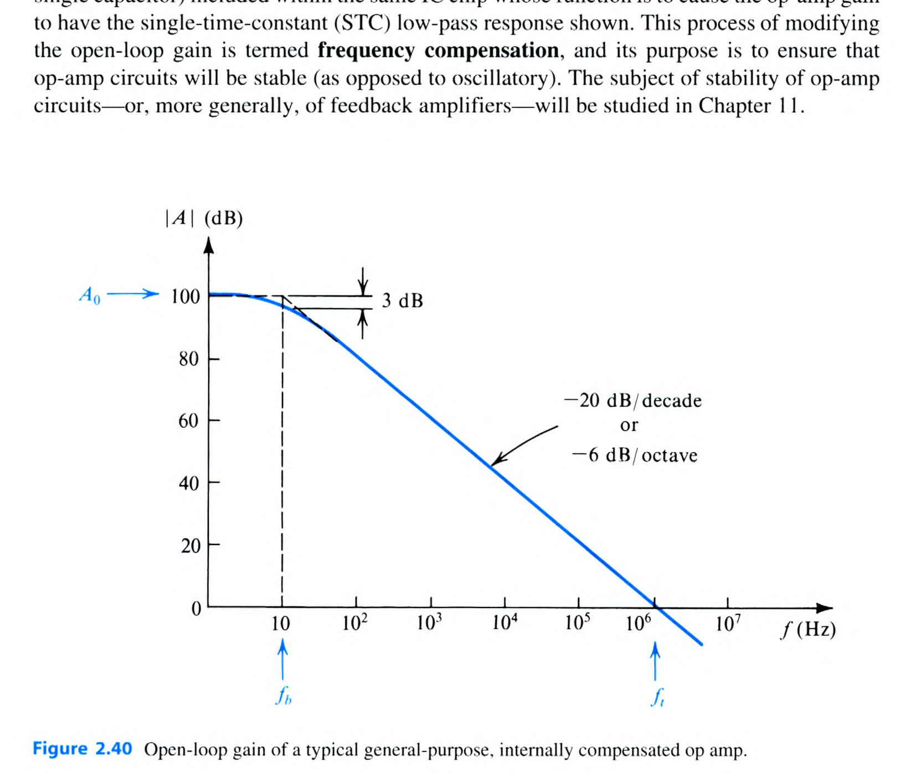
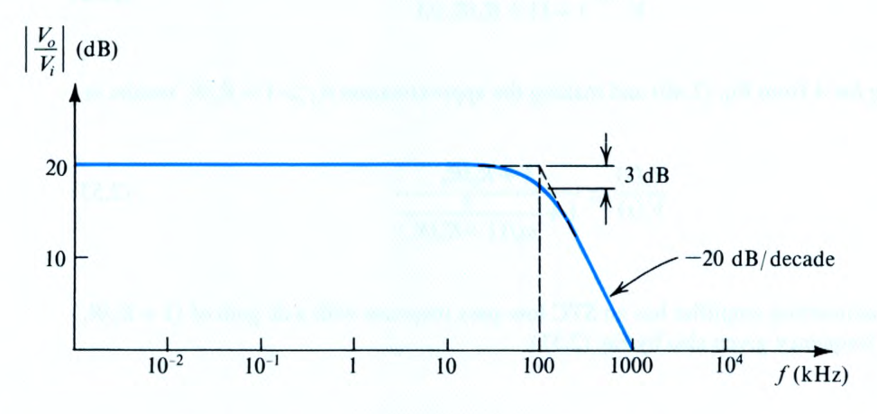
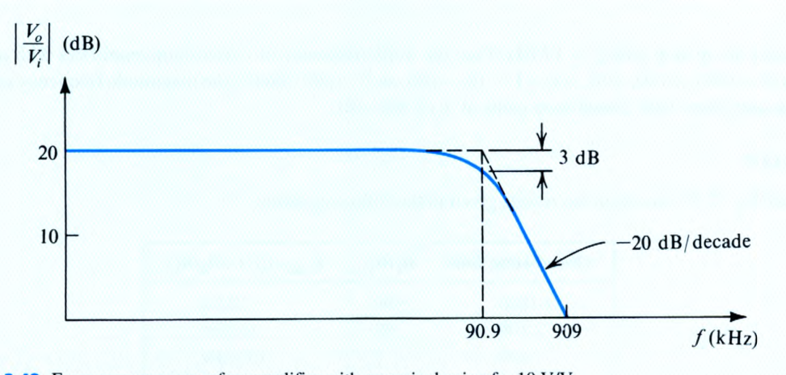

> **求解目標**：建立同相 $f_{3\text{dB}} = \frac{f_t}{1 + R_2/R_1} = \frac{f_t}{|G|}$ 與反相 $f_{3\text{dB}} = \frac{f_t}{1 + |G|}$ 之對帳表。

<template #solution>

#### 逐步解析：

1. **閉迴路 3-dB 頻寬通用公式**：
   - 運算放大器開路增益模型為 $A(s) \approx \frac{\omega_t}{s}$。
   - 無論反相或同相組態，迴路增益之回授因數均為 $\beta = \frac{R_1}{R_1 + R_2} = \frac{1}{1 + R_2/R_1}$。
   - 閉迴路極點與 3-dB 頻寬一律由下式給定：
     $$
     f_{3\text{dB}} = \frac{f_t}{1 + R_2/R_1}
     $$
   - **同相放大器（Nominal Gain $G = 1 + R_2/R_1$）**：
     $$
     f_{3\text{dB}} = \frac{f_t}{G} \implies G \times f_{3\text{dB}} = f_t = 1\text{ MHz} \quad (\text{增益頻寬積為定值})
     $$
   - **反相放大器（Nominal Gain $G = -R_2/R_1$）**：
     $$
     f_{3\text{dB}} = \frac{f_t}{1 + R_2/R_1} = \frac{f_t}{1 + |G|}
     $$

2. **各增益數值計算對帳表**：

   | 標稱閉迴路增益 | 電阻比 $R_2/R_1$ | 閉迴路直流增益 $G_{\text{dB}}$ | 3-dB 截止頻率 $f_{3\text{dB}} = \frac{f_t}{1 + R_2/R_1}$ |
   | :--- | :--- | :--- | :--- |
   | **$+1000\text{ V/V}$** | $999$ | $60\text{ dB}$ | $\frac{1\text{ MHz}}{1000} = \mathbf{1\text{ kHz}}$ |
   | **$+100\text{ V/V}$** | $99$ | $40\text{ dB}$ | $\frac{1\text{ MHz}}{100} = \mathbf{10\text{ kHz}}$ |
   | **$+10\text{ V/V}$** | $9$ | $20\text{ dB}$ | $\frac{1\text{ MHz}}{10} = \mathbf{100\text{ kHz}}$ |
   | **$+1\text{ V/V}$** | $0$ | $0\text{ dB}$ | $\frac{1\text{ MHz}}{1} = \mathbf{1\text{ MHz}}$ |
   | **$-1\text{ V/V}$** | $1$ | $0\text{ dB}$ | $\frac{1\text{ MHz}}{1 + 1} = \mathbf{500\text{ kHz}}$ |
   | **$-10\text{ V/V}$** | $10$ | $20\text{ dB}$ | $\frac{1\text{ MHz}}{1 + 10} = \mathbf{90.9\text{ kHz}}$ |
   | **$-100\text{ V/V}$** | $100$ | $40\text{ dB}$ | $\frac{1\text{ MHz}}{1 + 100} = \mathbf{9.9\text{ kHz}}$ |
   | **$-1000\text{ V/V}$** | $1000$ | $60\text{ dB}$ | $\frac{1\text{ MHz}}{1 + 1000} \approx \mathbf{0.999\text{ kHz}} \approx \mathbf{1\text{ kHz}}$ |

3. **同相 $+10$ 與反相 $-10$ 之頻寬對比**：
   - 兩者低頻增益振幅皆為 $20\text{ dB}$（$10\text{ V/V}$）。
   - 同相 $+10\text{ V/V}$ 放大器之 3-dB 頻寬為 $100\text{ kHz}$（圖 2.41）。
   - 反相 $-10\text{ V/V}$ 放大器之 3-dB 頻寬為 $\frac{1\text{ MHz}}{11} = 90.9\text{ kHz}$（圖 2.42）。
   - 原因在於反相放大器的輸入電阻 $R_1$ 同時參與了負載回授分壓，使雜訊增益（Noise Gain $= 1 + R_2/R_1 = 11$）大於訊號增益（$10$），從而使頻寬微幅縮小。

::: tip 標準答案
各組態 3-dB 頻寬：
- $+1000\text{ V/V} \implies \mathbf{1\text{ kHz}}$；$+100\text{ V/V} \implies \mathbf{10\text{ kHz}}$；$+10\text{ V/V} \implies \mathbf{100\text{ kHz}}$；$+1\text{ V/V} \implies \mathbf{1\text{ MHz}}$
- $-1\text{ V/V} \implies \mathbf{500\text{ kHz}}$；$-10\text{ V/V} \implies \mathbf{90.9\text{ kHz}}$；$-100\text{ V/V} \implies \mathbf{9.9\text{ kHz}}$；$-1000\text{ V/V} \implies \mathbf{1\text{ kHz}}$
:::

</template>
</PracticeCard>

<PracticeCard id="elec-ch2-prac-2-27" title="內部補償運算放大器之低頻極點、單位增益頻寬與任意頻率增益估算" source="Exercise 2.27 · Textbook P111" topic="頻率響應與 GBW">

某顆內部補償運算放大器的開路直流電壓增益為 $A_0 = 10^6\text{ V/V}$（即 $120\text{ dB}$），且在頻率 $f = 10\text{ kHz}$ 處量測得其開路增益為 $40\text{ dB}$：

1. 估算該運算放大器的 3-dB 轉折頻率 $f_b$。
2. 估算該運算放大器的單位增益頻率 $f_t$ 與增益頻寬積 $GBW$。
3. 預測該運算放大器在頻率 $f = 1\text{ kHz}$ 處的開路電壓增益（以 dB 表示）。

> **求解目標**：運用滾降定則 $|A(f)| \cdot f = f_t = A_0 f_b$ 求解未知頻率參數。

<template #solution>

#### 逐步解析：

1. **單位增益頻率 $f_t$ 計算**：
   - 運算放大器在轉折頻率以上以 $-20\text{ dB/decade}$ 速率均勻滾降，滿足增益頻寬乘積守恆：
     $$
     |A(f)| \times f = f_t
     $$
   - 已知在 $f = 10\text{ kHz}$ 處，增益為 $40\text{ dB} = 100\text{ V/V}$：
     $$
     f_t = (100\text{ V/V}) \times (10\text{ kHz}) = 1000\text{ kHz} = 1\text{ MHz}
     $$
   - 增益頻寬積 $GBW = f_t = 1\text{ MHz}$。

2. **3-dB 轉折頻率 $f_b$ 計算**：
   - 直流開路增益 $A_0 = 10^6\text{ V/V}$，由 $f_t = A_0 f_b$ 得：
     $$
     f_b = \frac{f_t}{A_0} = \frac{10^6\text{ Hz}}{10^6} = 1\text{ Hz}
     $$

3. **$f = 1\text{ kHz}$ 處之開路增益預測**：
   - 因 $f = 1\text{ kHz} \gg f_b = 1\text{ Hz}$，增益完全處於 $-20\text{ dB/decade}$ 滾降區：
     $$
     |A(1\text{ kHz})| = \frac{f_t}{1\text{ kHz}} = \frac{1\text{ MHz}}{1\text{ kHz}} = 1000\text{ V/V}
     $$
   - 換算為分貝：
     $$
     |A(1\text{ kHz})|_{\text{dB}} = 20\log_{10}(1000) = 60\text{ dB}
     $$

::: tip 標準答案
1. 3-dB 轉折頻率 $f_b = \mathbf{1\text{ Hz}}$。
2. 單位增益頻率 $f_t = \mathbf{1\text{ MHz}}$，$GBW = \mathbf{1\text{ MHz}}$。
3. $1\text{ kHz}$ 處開路增益為 **$60\text{ dB}$**（$1000\text{ V/V}$）。
:::

</template>
</PracticeCard>

<PracticeCard id="elec-ch2-ex-2-8" title="大訊號輸出電壓飽和與輸出電流極限之電阻負載分析" source="Example 2.8 · Textbook P112-P113" topic="大訊號非線性失真">

考慮如圖 2.43(a) 所示之同相放大器電路，標稱增益設計為 $1 + \frac{R_2}{R_1} = 1 + \frac{9\text{ k}\Omega}{1\text{ k}\Omega} = 10\text{ V/V}$。電路輸入低頻正弦波電壓（峰值為 $V_p$），輸出端接負載電阻 $R_L$。運算放大器規格為：輸出飽和電壓 $V_{sat} = \pm 13\text{ V}$，最大輸出電流極限為 $I_{omax} = \pm 20\text{ mA}$：

1. 若 $V_p = 1\text{ V}$ 且 $R_L = 1\text{ k}\Omega$，求輸出訊號波形及峰值，並檢查輸出電流是否超限。
2. 若 $V_p = 1.5\text{ V}$ 且 $R_L = 1\text{ k}\Omega$，求輸出訊號波形及截波電壓準位。
3. 當 $R_L = 1\text{ k}\Omega$ 時，求維持輸出為無失真正弦波所允許之最大輸入峰值 $V_p$。
4. 當 $V_p = 1\text{ V}$ 時，求維持輸出為 $10\text{ V}$ 峰值無失真正弦波所允許之最小負載電阻 $R_{L\min}$。

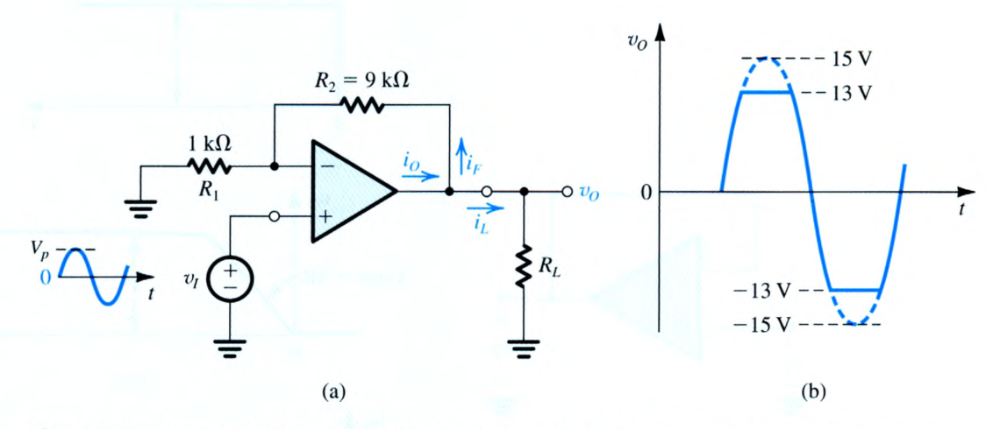

> **求解目標**：綜合檢核輸出電壓飽和條件與輸出總電流 $i_O = i_L + i_F \le I_{omax}$ 拘束式。

<template #solution>

#### 逐步解析：

1. **狀況 (a)：$V_p = 1\text{ V}, R_L = 1\text{ k}\Omega$**：
   - 標稱輸出峰值：$\hat{V}_o = 10 \times 1\text{ V} = 10\text{ V}$。
   - 電壓檢核：$\hat{V}_o = 10\text{ V} < 13\text{ V}$，未發生電壓飽和。
   - 電流檢核（在正峰值 $v_O = +10\text{ V}$ 時）：
     - 負載電流：$i_L = \frac{10\text{ V}}{R_L} = \frac{10\text{ V}}{1\text{ k}\Omega} = 10\text{ mA}$
     - 回授網路電流：$i_F = \frac{10\text{ V}}{R_1 + R_2} = \frac{10\text{ V}}{1\text{ k}\Omega + 9\text{ k}\Omega} = 1\text{ mA}$
     - 運算放大器總輸出電流：$i_O = i_L + i_F = 10\text{ mA} + 1\text{ mA} = 11\text{ mA} < 20\text{ mA}$
   - 結論：輸出為峰值 $10\text{ V}$ 的完美無失真正弦波。

2. **狀況 (b)：$V_p = 1.5\text{ V}, R_L = 1\text{ k}\Omega$**：
   - 理論線性輸出峰值應為 $10 \times 1.5\text{ V} = 15\text{ V}$。
   - 但因運算放大器輸出電壓飽和於 $\pm 13\text{ V}$，輸出正負峰值將在 $\pm 13\text{ V}$ 處被截波削平（圖 2.43b）。
   - 飽和時輸出電流：$i_O = \frac{13\text{ V}}{1\text{ k}\Omega} + \frac{13\text{ V}}{10\text{ k}\Omega} = 13\text{ mA} + 1.3\text{ mA} = 14.3\text{ mA} < 20\text{ mA}$，未觸發電流限制。

3. **狀況 (c)：$R_L = 1\text{ k}\Omega$ 下之最大無失真 $V_p$**：
   - 輸出電壓受限於飽和電壓 $\hat{V}_o = 13\text{ V}$：
     $$
     V_{p\max} = \frac{13\text{ V}}{10\text{ V/V}} = 1.3\text{ V}
     $$

4. **狀況 (d)：$V_p = 1\text{ V}$ 下之最小容許負載 $R_{L\min}$**：
   - 此時輸出峰值為 $10\text{ V}$，回授網路抽載 $i_F = \frac{10\text{ V}}{10\text{ k}\Omega} = 1\text{ mA}$。
   - 運算放大器最多可提供 $20\text{ mA}$，扣除 $i_F$ 後剩餘可供負載之最大電流為：
     $$
     i_{L\max} = I_{omax} - i_F = 20\text{ mA} - 1\text{ mA} = 19\text{ mA}
     $$
   - 最小容許負載電阻：
     $$
     R_{L\min} = \frac{\hat{V}_o}{i_{L\max}} = \frac{10\text{ V}}{19\text{ mA}} = \frac{10\text{ V}}{0.019\text{ A}} \approx 526.3\ \Omega \approx 526\ \Omega
     $$

::: tip 標準答案
1. 輸出為 **$10\text{ V}$ 峰值正弦波**，輸出電流峰值為 $11\text{ mA}$（未失真）。
2. 輸出為峰值在 **$\pm 13\text{ V}$ 被截波削平**的失真波形。
3. 最大輸入電壓 $V_{p\max} = \mathbf{1.3\text{ V}}$。
4. 最小負載電阻 $R_{L\min} = \mathbf{526\ \Omega}$。
:::

</template>
</PracticeCard>

<PracticeCard id="elec-ch2-prac-2-29" title="單位增益隨耦器之壓擺率 (Slew Rate) 與小訊號指數上升之臨界階躍電壓" source="Exercise 2.29 · Textbook P115" topic="壓擺率 (Slew Rate) 與全功率頻寬">

考慮接成單位增益隨耦器（Unity-Gain Follower）組態的運算放大器，已知其壓擺率為 $\text{SR} = 1\text{ V}/\mu\text{s}$，單位增益頻寬為 $f_t = 1\text{ MHz}$（即 $\omega_t = 2\pi \times 10^6\text{ rad/s}$）：

1. 求輸出波形仍能維持由線性一階 STC 響應 $v_o(t) = V(1 - e^{-\omega_t t})$ 所描述的最大輸入階躍電壓 $V_{\max}$（即未觸發壓擺率限制之臨界電壓）。
2. 在此臨界階躍電壓下，計算輸出波形的 $10\%$ 至 $90\%$ 上升時間（Rise Time, $t_r$）。
3. 若輸入一個 10 倍大的階躍電壓（$V = 1.6\text{ V}$），求此時輸出波形的 $10\%$ 至 $90\%$ 上升時間 $t_r$。

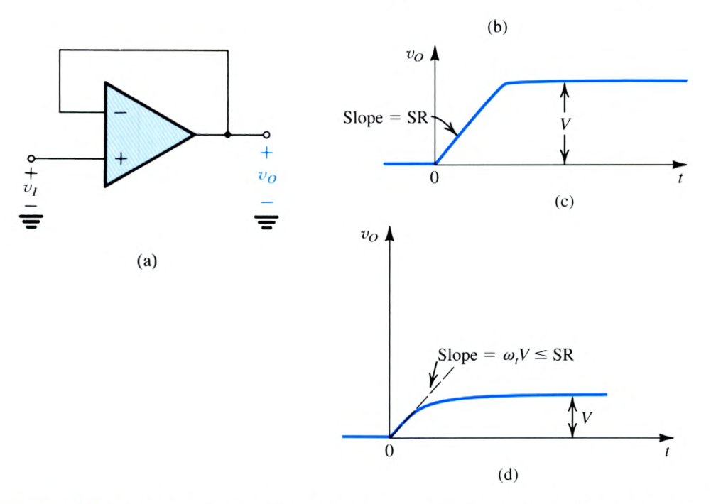

> **求解目標**：建立線性上升起始斜率 $\left.\frac{dv_o}{dt}\right|_{0^+} = \omega_t V \le \text{SR}$ 與大信號壓擺時間 $t_r = \frac{0.8V}{\text{SR}}$。

<template #solution>

#### 逐步解析：

1. **臨界階躍電壓 $V_{\max}$ 推導**：
   - 線性 STC 指數上升函數為 $v_o(t) = V(1 - e^{-\omega_t t})$。
   - 對時間微分求變化率：
     $$
     \frac{dv_o}{dt} = \omega_t V e^{-\omega_t t}
     $$
   - 最大斜率發生於起始瞬間 $t = 0^+$：
     $$
     \left.\frac{dv_o}{dt}\right|_{\max} = \omega_t V
     $$
   - 欲使輸出不發生 Slew-Rate 限制，最大斜率不得超過 $\text{SR}$：
     $$
     \omega_t V \le \text{SR} \implies V \le \frac{\text{SR}}{\omega_t}
     $$
   - 帶入數值（$\text{SR} = 1\text{ V}/\mu\text{s} = 10^6\text{ V/s}$，$\omega_t = 2\pi \times 10^6\text{ rad/s}$）：
     $$
     V_{\max} = \frac{10^6\text{ V/s}}{2\pi \times 10^6\text{ rad/s}} = \frac{1}{2\pi}\text{ V} \approx 0.15915\text{ V} \approx 0.16\text{ V}
     $$

2. **小訊號線性上升時間 $t_r$**：
   - 依據一階低通 STC 網路標準特性（時間常數 $\tau = \frac{1}{\omega_t}$）：
     $$
     t_r = 2.2 \tau = \frac{2.2}{\omega_t} = \frac{2.2}{2\pi \times 10^6\text{ rad/s}} \approx 0.3501\ \mu\text{s} \approx 0.35\ \mu\text{s}
     $$

3. **大訊號 Slew-Rate 限制下之上升時間**：
   - 當輸入階躍為 $V = 1.6\text{ V} \gg 0.16\text{ V}$ 時，運算放大器內部輸入級完全飽和，輸出以固定最大速率 $\text{SR} = 1\text{ V}/\mu\text{s}$ 線性爬升。
   - 輸出從 $10\%$ 電壓（$0.1 \times 1.6\text{ V} = 0.16\text{ V}$）上升至 $90\%$ 電壓（$0.9 \times 1.6\text{ V} = 1.44\text{ V}$）：
     $$
     \Delta V = 1.44\text{ V} - 0.16\text{ V} = 1.28\text{ V}
     $$
   - 所需之上升時間為：
     $$
     t_r = \frac{\Delta V}{\text{SR}} = \frac{1.28\text{ V}}{1\text{ V}/\mu\text{s}} = 1.28\ \mu\text{s}
     $$

::: tip 標準答案
1. 最大線性階躍電壓 $V_{\max} = \mathbf{0.16\text{ V}}$（精確值 $\frac{1}{2\pi}\text{ V}$）。
2. 線性上升時間 $t_r = \mathbf{0.35\ \mu\text{s}}$。
3. 大訊號壓擺上升時間 $t_r = \mathbf{1.28\ \mu\text{s}}$。
:::

</template>
</PracticeCard>

<PracticeCard id="elec-ch2-ex-2-9" title="弦波訊號下之壓擺率限制與全功率頻寬 (Full-Power Bandwidth fM) 公式推導" source="Example 2.9 · Textbook P116" topic="壓擺率 (Slew Rate) 與全功率頻寬">

考慮使用壓擺率為 $\text{SR}$、最大額定輸出擺幅為 $V_{omax}$ 的運算放大器建構單位增益隨耦器。輸入端施加全幅正弦波電壓 $v_I(t) = V_{omax}\sin(\omega t)$：

1. 試推導運算放大器在全擺幅輸出下不致因壓擺率限制而產生波形失真的最高工作頻率——**全功率頻寬 (Full-Power Bandwidth, $f_M$)** 之表示式。
2. 若操作頻率 $\omega$ 高於全功率頻寬（$\omega > \omega_M$），試導出輸出端所能維持無失真輸出的最大正弦波振幅 $V_o$。

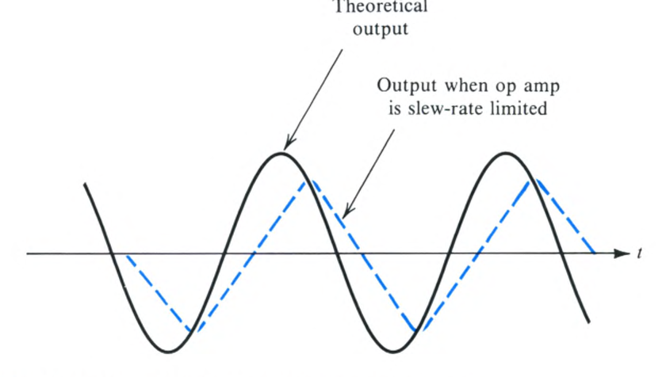

> **求解目標**：微分求正弦斜率 $\left.\frac{dv_O}{dt}\right|_{\max} = \omega V_{omax} \le \text{SR}$，建立 $f_M = \frac{\text{SR}}{2\pi V_{omax}}$ 與 $V_o = V_{omax}\left(\frac{f_M}{f}\right)$。

<template #solution>

#### 逐步解析：

1. **全功率頻寬 $f_M$ 推導**：
   - 單位增益隨耦器輸出理想為全幅正弦波 $v_o(t) = V_{omax}\sin(\omega t)$。
   - 其電壓對時間之變化率為：
     $$
     \frac{dv_o}{dt} = \omega V_{omax} \cos(\omega t)
     $$
   - 最大斜率發生於正弦波穿過零點瞬間（$\cos(\omega t) = \pm 1$）：
     $$
     \left.\frac{dv_o}{dt}\right|_{\max} = \omega V_{omax}
     $$
   - 欲避免波形失真（由正弦轉變為三角波/削頂），最大斜率不得超過壓擺率 $\text{SR}$：
     $$
     \omega V_{omax} \le \text{SR} \implies \omega_M = \frac{\text{SR}}{V_{omax}}
     $$
   - 轉換為頻率 $f_M = \frac{\omega_M}{2\pi}$：
     $$
     f_M = \frac{\text{SR}}{2\pi V_{omax}}
     $$
   - 此 $f_M$ 即為晶片型錄所標註之全功率頻寬 (Full-Power Bandwidth)。

2. **高頻操作下之最大無失真振幅降額公式**：
   - 當訊號頻率 $\omega > \omega_M$（即 $f > f_M$）時，若欲維持輸出正弦波不失真，必須降低輸出訊號振幅 $V_o$：
     $$
     \omega V_o \le \text{SR} \implies V_o \le \frac{\text{SR}}{\omega} = \frac{\text{SR}}{2\pi f}
     $$
   - 將 $\text{SR} = \omega_M V_{omax}$ 代入得降額比例式：
     $$
     V_o = V_{omax} \left(\frac{\omega_M}{\omega}\right) = V_{omax} \left(\frac{f_M}{f}\right)
     $$

::: tip 標準答案
1. 全功率頻寬公式：$f_M = \mathbf{\frac{\text{SR}}{2\pi V_{omax}}}$
2. 高頻最大無失真振幅：$V_o = \mathbf{V_{omax}\left(\frac{f_M}{f}\right)}$
:::

</template>
</PracticeCard>

<PracticeCard id="elec-ch2-prac-2-30" title="全功率頻寬 fM 計算與高頻超限下之最大無失真輸出電壓" source="Exercise 2.30 · Textbook P116" topic="壓擺率 (Slew Rate) 與全功率頻寬">

某運算放大器具備額定輸出電壓擺幅 $V_{omax} = \pm 5\text{ V}$ 以及壓擺率 $\text{SR} = 10\text{ V}/\mu\text{s}$：

1. 計算該運算放大器的全功率頻寬 $f_M$。
2. 將此運算放大器接成單位增益隨耦器，並輸入頻率為 $f = 5 f_M$ 的高頻正弦訊號，求輸出端在不產生壓擺率失真（SR Distortion）的前提下所允許的最大正弦波峰值振幅。

> **求解目標**：代入 $f_M = \frac{\text{SR}}{2\pi V_{omax}}$ 求解 $f_M$，並依反比定則求 $f = 5f_M$ 時的降額輸出。

<template #solution>

#### 逐步解析：

1. **全功率頻寬 $f_M$ 計算**：
   - 額定輸出峰值 $V_{omax} = 5\text{ V}$，壓擺率 $\text{SR} = 10\text{ V}/\mu\text{s} = 10 \times 10^6\text{ V/s}$：
     $$
     f_M = \frac{\text{SR}}{2\pi V_{omax}} = \frac{10 \times 10^6\text{ V/s}}{2\pi \times (5\text{ V})} = \frac{10^7}{10\pi}\text{ Hz} = \frac{10^6}{\pi}\text{ Hz} \approx 318309.88\text{ Hz} \approx 318.3\text{ kHz} \approx 318\text{ kHz}
     $$

2. **高頻 $f = 5 f_M$ 下之最大容許振幅**：
   - 當輸入頻率提高至 $5 f_M$（約 $1.59\text{ MHz}$）時，依據振幅降額公式：
     $$
     \hat{V}_o = V_{omax} \left(\frac{f_M}{f}\right) = 5\text{ V} \times \left(\frac{f_M}{5 f_M}\right) = \frac{5\text{ V}}{5} = 1\text{ V (peak)}
     $$
   - 輸出端峰對峰值最大僅能支援 $2\text{ V}_{p-p}$（即峰值 $1\text{ V}$），若輸入超過 $1\text{ V}$ 輸出將嚴重三角波化失真。

::: tip 標準答案
1. 全功率頻寬 $f_M = \mathbf{318\text{ kHz}}$（精確值 $318.3\text{ kHz}$）。
2. 在 $f = 5f_M$ 下最大無失真輸出振幅為 **$1\text{ V (peak)}$**。
:::

</template>
</PracticeCard>
