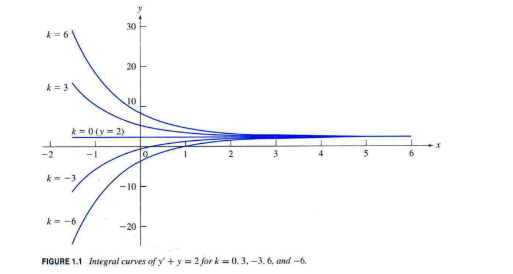

# Lesson 0002: 常微分方程解的本質與分類（通解、特解、奇異解與存在唯一性）

> 深入剖析常微分方程（ODE）解的數學本質：從顯式與隱式解、通解與積分曲線族、初值特解，到 Picard 存在唯一性定理與奇異解的包絡線幾何結構。

---

## 🎯 本單元目標

讀完本單元並完成觀念演練後，你將能夠：

1. **嚴謹檢驗解的有效性**：精確區分**顯式解（Explicit Solution）**與**隱式解（Implicit Solution）**，並運用隱函數微積分驗證二元方程式是否為 ODE 的解。
2. **掌握通解與積分曲線族**：理解 $n$ 階 ODE 通解中所含 $n$ 個任意獨立常數的本質，並能將代數通解直觀對應至幾何**積分曲線族（Family of Integral Curves）**。
3. **由初值條件確定特解**：熟練設定並求解**初值問題（IVP）**，從無限曲線族中鎖定通過特定坐標點的唯一特解。
4. **精準應用存在唯一性定理**：掌握 **Picard–Lindelöf 定理**之兩大檢驗條件（連續性與對 $y$ 偏導連續性），並能診斷導致解「非唯一（多解）」的分叉奇異點。
5. **破解奇異解與包絡線**：深刻理解何謂無法從通解退化得到的**奇異解（Singular Solution）**，並運用包絡線（Envelope）概念與 Clairaut 方程進行解析推導。

---

## 一、 微分方程解的基本定義 (Definition of a Solution)

### 1. 嚴格數學定義

給定一個 $n$ 階常微分方程式（ODE）：

$$F\left(x, y, y', y'', \dots, y^{(n)}\right) = 0$$

若在實數開區間 $I \subseteq \mathbb{R}$ 上定義了一個函數 $y = \phi(x)$，且滿足以下兩大條件：
1. **可微性**：$\phi(x)$ 在區間 $I$ 上的每一點皆具有至少 $n$ 階連續導數。
2. **恆等成立**：將 $y = \phi(x)$ 及其各階導數代入原方程式中，對區間 $I$ 內的所有 $x$ 均使等式恆成立：
   $$F\left(x, \phi(x), \phi'(x), \dots, \phi^{(n)}(x)\right) \equiv 0, \quad \forall x \in I$$

則稱函數 $\phi(x)$ 為該微分方程式在區間 $I$ 上的一個**解（Solution）**。

::: tip 💡 解與區間密不可分
在高等工程數學中，「解」必須伴隨其有效的**定義區間（Interval of Validity）**。例如 $y = \frac{1}{x}$ 是 $x y' + y = 0$ 的解，但它的有效區間必須是 $(-\infty, 0)$ 或 $(0, \infty)$，不可跨越不連續點 $x = 0$。
:::

---

## 二、 顯式解 vs 隱式解 (Explicit vs. Implicit Solution)

常微分方程的解在表示形式上可分為兩大類：

```
                ┌── 顯式解 (Explicit) ： y = φ(x)
微分方程的解 ──┤
                └── 隱式解 (Implicit) ： G(x, y) = 0 或 G(x, y) = C
```

### 1. 顯式解 (Explicit Solution)

因變數 $y$ 可**單獨獨立地寫在等號左側**，直接由自變數 $x$ 的基本初等函數表示：

$$y = \phi(x)$$

* **課本例題**：考慮一階線性微分方程
  $$y'(x) + y(x) = 0$$
  其解可明確寫成：
  $$y(x) = k e^{-x}$$
  此即為顯式解。

---

### 2. 隱式解 (Implicit Solution)

自變數 $x$ 與因變數 $y$ 共同存在於一個二元等式中，形式為：

$$G(x, y) = 0 \quad \text{或} \quad G(x, y) = C$$

在該關係式中，若將 $y$ 視為 $x$ 的隱函數，利用**隱函數微分法（Implicit Differentiation）**求出 $\frac{dy}{dx}$ 並代回原 ODE，等式恆成立，則稱該二元關係式為隱式解。

::: info 📖 課本原始例題推導
給定一階微分方程：
$$y' = -\frac{2xy^3 + 2}{3x^2 y^2 + 8e^{4y}}$$
其對應的隱式解為：
$$x^2 y^3 + 2x + 2e^{4y} = k$$
**檢驗步驟（隱函數微分）**：
兩邊對自變數 $x$ 求導（注意 $y$ 是 $x$ 的函數，連鎖律產生 $y'$）：
$$\begin{aligned}
\frac{d}{dx}\left[ x^2 y^3 + 2x + 2e^{4y} \right] &= \frac{d}{dx}[k] \\
\left( 2x y^3 + x^2 \cdot 3y^2 y' \right) + 2 + 2 \cdot 4e^{4y} y' &= 0 \\
(2xy^3 + 2) + \left(3x^2 y^2 + 8e^{4y}\right) y' &= 0
\end{aligned}$$
移項整理得：
$$y' \left(3x^2 y^2 + 8e^{4y}\right) = -(2xy^3 + 2) \implies y' = -\frac{2xy^3 + 2}{3x^2 y^2 + 8e^{4y}}$$
兩者完全吻合！由於此式包含 $y^3$ 與 $e^{4y}$，代數上**無法將 $y$ 顯式分離**為 $y = \phi(x)$，因此隱式解是工程與物理中最實用且自然的表達形式。
:::

---

## 三、 通解與積分曲線族 (General Solution & Family of Integral Curves)

### 1. 通解 (General Solution) 的定義

對於一個 $n$ 階常微分方程，若其解表達式中含有 $n$ 個**本質上彼此獨立的任意常數**（Arbitrary Constants）$C_1, C_2, \dots, C_n$（或記為 $k$），則稱此解為該微分方程式的**通解（General Solution）**。

- **階數與常數對應定律**：
  - 一階 ODE $\implies$ 通解恰好含有 **1 個**任意常數 $C$。
  - 二階 ODE $\implies$ 通解恰好含有 **2 個**獨立任意常數 $C_1, C_2$。
  - $n$ 階 ODE $\implies$ 通解含有 **$n$ 個**獨立任意常數 $C_1, C_2, \dots, C_n$。

::: warning ⚠️ 什麼叫「本質上獨立」？
若解寫為 $y = A e^x + B e^x$，表面上有兩個常數 $A$ 與 $B$，但實際上可合併為 $(A + B) e^x = C e^x$，實質上只有一個獨立常數，不能算作二階通解！
:::

---

### 2. 幾何意義：積分曲線族 (Family of Integral Curves)

在幾何平面（$xy$-平面）上：
- 任意常數 $k$ 的每一個不同取值，都唯一對應著平面上的一條幾何曲線。
- 一階 ODE 的通解在幾何上代表覆蓋平面某個區域的**一整族連續曲線**，稱為**積分曲線族（Integral Curves）**。
- 微分方程 $y' = f(x, y)$ 的幾何意義即為：**積分曲線在點 $(x, y)$ 處的切線斜率恰好等於 $f(x, y)$**。

#### 課本實例剖析：$y' + y = 2$ 的積分曲線族

該方程式的通解為：

$$y(x) = 2 + k e^{-x}$$

如下圖所示，當參數 $k$ 取不同的常數值時，對應平面上不同軌跡的積分曲線：



* **漸近行為分析**：
  - 當 $k = 0$ 時：得到水平直線 $y(x) = 2$。這是一條**平衡解（Equilibrium Solution）**或稱穩態解。
  - 當 $k > 0$（例如 $k = 3, 6$）：曲線從上方以負指數遞減，當 $x \to \infty$ 時，$e^{-x} \to 0$，所有曲線皆平滑漸近於直線 $y = 2$。
  - 當 $k < 0$（例如 $k = -3, -6$）：曲線從下方向上凹陷增長，當 $x \to \infty$ 時，同樣收斂漸近於直線 $y = 2$。

---

## 四、 特解與初值問題 (Particular Solution & Initial Value Problem)

### 1. 特解 (Particular Solution) 的定義

從微分方程的通解出發，當給定特定的輔助條件（如初值條件或邊界條件），使得通解中的**任意常數被確定為具體數值**，所獲得的解稱為該方程式的**特解（Particular Solution）**。

- 特解中**不包含任何任意常數**。

---

### 2. 初值問題 (Initial Value Problem, IVP)

一階微分方程的**初值問題（IVP）**由微分方程與一個初始條件共同組成：

$$\begin{cases}
F(x, y, y') = 0 \\
y(x_0) = y_0
\end{cases}$$

- **幾何意義**：在通解所構成的整族無限多條積分曲線中，**精確挑選出「通過給定坐標點 $(x_0, y_0)$」的那一條唯一定向曲線**！

---

### 3. 課本原始例題解析

::: tip 📝 課本初值特解範例
**題目**：求解初值問題
$$y'(x) + y(x) = 2, \quad y(1) = -5$$

**【Step 1】求通解**
由一階線性微分方程求解法（或觀察分離變數），已知該方程通解為：
$$y(x) = 2 + k e^{-x}$$

**【Step 2】代入初值條件確定常數 $k$**
將初始條件 $x = 1, y = -5$ 代入通解：
$$\begin{aligned}
-5 &= 2 + k e^{-1} \\
-7 &= k e^{-1} \\
k &= -7 e
\end{aligned}$$

**【Step 3】寫出特解並化簡**
將 $k = -7e$ 代回通解：
$$y(x) = 2 + (-7e) e^{-x} = 2 - 7 e^{-(x - 1)}$$

**【Step 4】回代檢驗（閉環驗算）**
1. 檢驗初值：$y(1) = 2 - 7 e^0 = 2 - 7 = -5$（符合）。
2. 檢驗微分方程：
   $$y'(x) = \frac{d}{dx}\left[2 - 7 e^{-(x-1)}\right] = 7 e^{-(x-1)}$$
   $$y'(x) + y(x) = 7 e^{-(x-1)} + \left[2 - 7 e^{-(x-1)}\right] = 2 \quad (\text{恆等成立！})$$
殘差為 0，特解完全正確。
:::

---

## 五、 唯一解與存在唯一性定理 (Unique Solution & Picard–Lindelöf)

當我們面對工程實際問題的初值問題時，最核心的兩個本質問題是：
1. **解是否存在？（Existence）**
2. **若存在，解是否唯一？（Uniqueness）**

### 1. Picard–Lindelöf 存在唯一性定理

考慮標準顯式一階初值問題：

$$\begin{cases}
\dfrac{dy}{dx} = f(x, y) \\
y(x_0) = y_0
\end{cases}$$

設 $R$ 是 $xy$-平面上包含點 $(x_0, y_0)$ 的一個閉矩形區域：
$$R = \{(x, y) \mid a \le x \le b, \, c \le y \le d\}, \quad (x_0, y_0) \in R$$

| 條件要求 | 數學表達式 | 保證的結論 |
| :--- | :--- | :--- |
| **條件一：存在性條件 (Existence)** | $f(x, y)$ 在區域 $R$ 內**連續** | 在包含 $x_0$ 的某個區間 $I = [x_0 - h, x_0 + h]$ 內，**至少存在一個解** $y(x)$。 |
| **條件二：唯一性條件 (Uniqueness)** | 偏導數 $\dfrac{\partial f}{\partial y}$ 在區域 $R$ 內亦**連續** | 在區間 $I$ 內，通過點 $(x_0, y_0)$ 的解**存在且唯一（Unique Solution）**。 |

::: info 幾何意涵：積分曲線不相交
若存在唯一性定理的條件成立，則在該區域 $R$ 內：
- **通過任意點 $(x_0, y_0)$ 恰有一條積分曲線穿過**。
- 平面上的兩條不同積分曲線**絕對不會相交，也不會分叉**！
:::

---

### 2. 破壞唯一性的經典反例：多解與分叉現象

如果 $\frac{\partial f}{\partial y}$ 不連續，會發生什麼事？

::: warning ⚠️ 經典破局範例：$y' = 3 y^{2/3}$ 在 $(0, 0)$
考慮初值問題：
$$\begin{cases}
\dfrac{dy}{dx} = 3 y^{2/3} \\
y(0) = 0
\end{cases}$$

**【檢驗定理條件】**：
- $f(x, y) = 3 y^{2/3}$ 在全平面均連續 $\implies$ **解必然存在**！
- 計算偏導數：
  $$\frac{\partial f}{\partial y} = \frac{\partial}{\partial y}(3 y^{2/3}) = 3 \cdot \frac{2}{3} y^{-1/3} = \frac{2}{y^{1/3}}$$
  注意！當 $y = 0$ 時，分母為零，$\frac{\partial f}{\partial y}$ **發散至無窮大（不連續）**！
  初值點恰好是 $(x_0, y_0) = (0, 0)$，落在不連續線上，因此**無法保證解的唯一性**。

**【實際求解：發現解的多樣性】**：
1. **解 1（奇異/平凡解）**：
   直接觀察：$y(x) \equiv 0$。代入得 $y'(x) = 0$，右式 $3(0)^{2/3} = 0$，且 $y(0) = 0$，這是一個完全合法的解！
2. **解 2（分離變數通解的分支）**：
   當 $y \neq 0$ 時分離變數：
   $$\frac{dy}{y^{2/3}} = 3 dx \implies \int y^{-2/3}\,dy = \int 3\,dx \implies 3 y^{1/3} = 3x + C \implies y = (x + C')^3$$
   代入初值 $y(0) = 0 \implies C' = 0 \implies y(x) = x^3$。
   檢驗：$y'(x) = 3x^2$；右式 $3(x^3)^{2/3} = 3x^2$，且 $y(0) = 0$，也是完全合法的解！

甚至，我們可以構造無限多個「拼接解」：
$$y(x) = \begin{cases}
0, & x < c \\
(x - c)^3, & x \ge c \quad (c > 0)
\end{cases}$$
這些函數在 $x = 0$ 處均為 $0$，且在全實數線上皆具一階可微性並滿足微分方程！
**結論**：因為偏導數在 $y=0$ 處失效，導致通過 $(0, 0)$ 點產生了**無窮多個解**！
:::

---

## 六、 奇異解與包絡線 (Singular Solution & Envelope)

### 1. 奇異解 (Singular Solution) 的定義

常微分方程中存在一種特殊的解：
- 它**滿足原微分方程式**。
- 但是它**無法透過通解中任意常數 $C$ 的任何實數取值（包括令 $C \to \pm\infty$ 極限）而獲得**。

這種解被稱為該微分方程的**奇異解（Singular Solution）**。

---

### 2. 幾何本質：通解曲線族的包絡線 (Envelope)

在微分幾何與微積分中，一族曲線 $F(x, y, C) = 0$ 的**包絡線（Envelope）**定義為：一條平滑曲線，在它的每一點上，都與該曲線族中的某條特定曲線「相切」。

```
     y ▲
       │           / (C=2)      / (C=1)     / (C=0)
       │          /            /           /
       │         /   切點     /           /
包絡線 ┼───────●────────────●───────────●─────── (奇異解 y = g(x))
(切線族)│      /            /           /
       │     /            /           /
       └───────────────────────────────────► x
```

- **為什麼包絡線必然是微分方程的解？**
  因為在相切點處，包絡線與通解曲線**共享同一個坐標 $(x, y)$**，且**擁有完全相同的切線斜率（即相同的 $y'$）**。
  因此，通解曲線所滿足的微分方程關係式 $F(x, y, y') = 0$，在切點處對包絡線也自動恆等成立！
- **為什麼包絡線是奇異解？**
  因為包絡線是一條獨立於任何單一常數 $C$ 曲線之外的整體軌跡，無法被任何單一 $C$ 曲線完全涵蓋。

---

### 3. 經典實例：Clairaut 方程式 (克萊羅方程)

克萊羅方程具有標準形式：

$$y = x y' + g(y')$$

以 $g(y') = (y')^2$ 為例：

$$y = x y' + (y')^2$$

**【求解過程】**：
兩邊對自變數 $x$ 求導：
$$\begin{aligned}
y' &= \frac{d}{dx}[x y'] + \frac{d}{dx}[(y')^2] \\
y' &= y' + x y'' + 2 y' y'' \\
0 &= y'' (x + 2y')
\end{aligned}$$

此因式分解產生兩個分支：

#### 分支 A：$y'' = 0$（通解分支）
$$y'' = 0 \implies y' = C \quad (\text{常數})$$
代回原方程，獲得通解：
$$y = C x + C^2$$
幾何上，這是一族**斜率為 $C$、截距為 $C^2$ 的切線直線族**。

#### 分支 B：$x + 2y' = 0$（奇異解分支）
$$y' = -\frac{x}{2}$$
將 $y'$ 代回原微分方程消去 $y'$：
$$y = x \left(-\frac{x}{2}\right) + \left(-\frac{x}{2}\right)^2 = -\frac{x^2}{2} + \frac{x^2}{4} = -\frac{x^2}{4}$$

**【奇異解檢驗】**：
1. **是否滿足 ODE？**
   將 $y = -\frac{x^2}{4}$ 代入：$y' = -\frac{x}{2}$。
   $$x y' + (y')^2 = x\left(-\frac{x}{2}\right) + \left(-\frac{x}{2}\right)^2 = -\frac{x^2}{4} = y \quad (\text{完全滿足！})$$
2. **是否能由通解得到？**
   通解為直線族 $y = C x + C^2$（一次多項式），無論 $C$ 選取任何數字，都永遠是一條直線，**絕對不可能退化成開口朝下的拋物線 $y = -\frac{x^2}{4}$**！
3. **幾何關係**：拋物線 $y = -\frac{x^2}{4}$ 正是直線族 $y = C x + C^2$ 的**包絡線**。

---

## 七、 微分方程各類解之全方位對比 (Comparison Matrix)

為了避免在解題與觀念考題中混淆各術語，以下梳理全科目統一標準定義：

| 解的名稱 (Name) | 數學形式 (Form) | 任意常數數量 | 幾何意義 (Geometry) | 與通解的關係 |
| :--- | :--- | :--- | :--- | :--- |
| **通解 (General Solution)** | $y = \phi(x, C)$ 或 $G(x, y, C) = 0$ | 等於 ODE 階數 $n$ 個 | 覆蓋全域的**積分曲線族** | 包含系統所有常規解 |
| **特解 (Particular Solution)** | $y = \phi(x)$ 或 $G(x, y) = 0$ | $0$ 個（已固定數值） | 通過特定初值點 $(x_0, y_0)$ 的**單一曲線** | 通解指定特定常數 $C = C_0$ 所得 |
| **奇異解 (Singular Solution)** | $y = \psi(x)$ | $0$ 個 | 通解積分曲線族的**包絡線 (Envelope)** | **無法**由通解取任何常數值得到 |
| **唯一解 (Unique Solution)** | $y = \phi(x)$ | $0$ 個 | 滿足 Picard 條件時，初值問題在局部有且僅有的解 | 唯一存在的特解 |
| **顯式解 (Explicit Solution)** | $y = \phi(x)$ | 視通/特解而定 | $y$ 軸座標可明確由 $x$ 函數描繪 | 表達形式區分（因變數獨立在左側） |
| **隱式解 (Implicit Solution)** | $G(x, y) = 0$ | 視通/特解而定 | 由隱等高線/等位線定義的幾何軌跡 | 表達形式區分（二元不可分關係式） |

---

## 八、 實戰觀念檢核題 (Self-Assessment & Concept Check)

### 📌 題型一：隱式解的精確微分驗證

::: details 題目 1：驗證隱式曲線是否為一階 ODE 之解
**問題**：
試證明關係式 $x^2 + y^2 - C y = 0$（其中 $C$ 為任意非零常數）是微分方程式 $(x^2 - y^2)\,dx + 2xy\,dy = 0$ 的隱式解。

**【詳細推導與解答】**：
**法一：隱函數微分消去常數 $C$**
對隱式解 $x^2 + y^2 - Cy = 0$ 兩端對 $x$ 微分：
$$\begin{aligned}
\frac{d}{dx}\left[x^2 + y^2 - C y\right] &= 0 \\
2x + 2y \frac{dy}{dx} - C \frac{dy}{dx} &= 0 \implies 2x + (2y - C) y' = 0
\end{aligned}$$
從原隱式關係可解出常數 $C$：
$$C = \frac{x^2 + y^2}{y}$$
代入微分後之式子消去 $C$：
$$\begin{aligned}
2x + \left(2y - \frac{x^2 + y^2}{y}\right) y' &= 0 \\
2x + \left(\frac{2y^2 - x^2 - y^2}{y}\right) y' &= 0 \\
2x + \left(\frac{y^2 - x^2}{y}\right) \frac{dy}{dx} &= 0
\end{aligned}$$
同乘以 $y\,dx$：
$$2xy\,dx + (y^2 - x^2)\,dy = 0 \iff (x^2 - y^2)\,dy - 2xy\,dx = 0$$
變換微元次序整理：
$$(x^2 - y^2)\,dx + 2xy\,dy = 0 \quad (\text{證畢！})$$
:::

---

### 📌 題型二：初值問題的存在唯一性判定

::: details 題目 2：Picard 條件檢驗
**問題**：
考慮初值問題：
$$\frac{dy}{dx} = \frac{y}{x - 2}, \quad y(x_0) = y_0$$
試問在平面上哪些初始點 $(x_0, y_0)$ 處，Picard–Lindelöf 定理**無法保證**存在唯一解？

**【詳細推導與解答】**：
1. 觀察函數：
   $$f(x, y) = \frac{y}{x - 2}$$
2. 計算偏導數：
   $$\frac{\partial f}{\partial y} = \frac{\partial}{\partial y}\left(\frac{y}{x - 2}\right) = \frac{1}{x - 2}$$
3. 連續性分析：
   - 只要 $x \neq 2$，$f(x, y)$ 與 $\frac{\partial f}{\partial y}$ 在全平面均連續。
   - 當 $x = 2$ 時，分母為零，兩者皆不連續且無定義。
4. **結論**：
   在所有位於垂直線 **$x_0 = 2$** 上的點（即 $(2, y_0)$），Picard 定理條件失效，無法保證解的存在性與唯一性；而在任意 $x_0 \neq 2$ 的點，定理保證存在且唯一的特解。
:::

---

### 📌 題型三：奇異解的識別

::: details 題目 3：判斷解的屬性
**問題**：
一階非線性常微分方程 $(y')^2 - 4y = 0$ 的通解為 $y(x) = (x + C)^2$（其中 $x \ge -C$）。
試問函數 $y(x) \equiv 0$ 是否為該方程的解？若是，它是特解還是奇異解？為什麼？

**【詳細推導與解答】**：
1. **驗證是否為解**：
   將 $y(x) \equiv 0$ 代入原方程：
   $$y' = 0 \implies (y')^2 - 4y = 0^2 - 4(0) = 0$$
   恆等式成立，故 $y(x) \equiv 0$ 確實是該方程式的解！
2. **判別解的類別**：
   - 通解為 $y(x) = (x + C)^2$。
   - 若 $y(x) \equiv 0$ 是特解，必須存在某個常數 $C = C_0$，使得 $(x + C_0)^2 = 0$ 對**區間內的所有 $x$ 恆成立**。
   - 然而，$(x + C_0)^2$ 是拋物線，僅在單一點 $x = -C_0$ 處為 0，在其他 $x$ 處皆為正數，絕不可能恆等於 0！
3. **結論**：
   $y(x) \equiv 0$ 無法由通解透過任何常數 $C$ 的指定而產生，因此它是一個**奇異解（Singular Solution）**，幾何上它正是一整族拋物線 $(x + C)^2$ 在頂點處的**包絡線（下界極限）**！
:::
