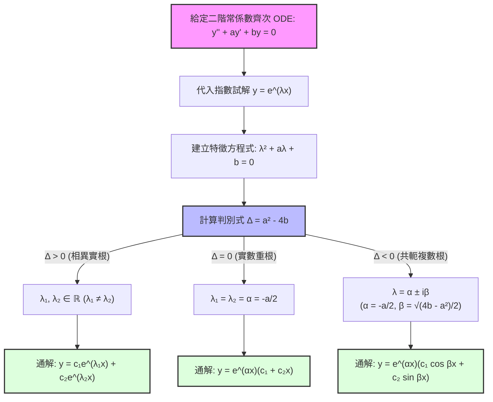

# 0003: 二階常係數齊次線性 ODE 與特徵方程式 (Homogeneous Constant Coefficients)

> **Context Pointer**: 本文為工程數學第二章「二階常微分方程式」核心講義，對應 `docs/engineering-math/second-order/0003-homogeneous-constant-coefficients.md`。

---

## 🎯 單元學習目標

1. 掌握二階常係數齊次線性常微分方程式（ODE）的標準形式與指數試解假設（Exponential Ansatz）。
2. 理解並推導特徵方程式（Characteristic Equation）及其三種根的判定條件。
3. 深入分析判別式的三大分支情況（相異實根、共軛複數根、實數重根），並利用 **Wronskian 行列式** 嚴格驗證線性獨立性。
4. 完整演練課本經典範例，熟悉帶有初值條件（IVP）的求解流程。
5. 建立工程物理直觀：連結 RLC 串聯電路與質量-彈簧-阻尼系統之三種阻尼狀態（過阻尼、欠阻尼、臨界阻尼）。

---

## 1. 標準形式與特徵方程式 (Characteristic Equation)

### 標準方程式
形如以下的二階常係數齊次線性 ODE：
$$y'' + ay' + by = 0$$
其中 $a, b$ 為常數（Constants）。若其右側為 0，則稱為**齊次（Homogeneous）**；若係數為常數，則稱為**常係數（Constant Coefficients）**。

### 指數試解假設 (Exponential Ansatz)
由於指數函數 $e^{\lambda x}$ 微分後仍維持指數形式（僅係數不同），我們假設其解的形式為：
$$y = e^{\lambda x}$$
將其一階與二階導數代入原標準式：
$$y' = \lambda e^{\lambda x}, \quad y'' = \lambda^2 e^{\lambda x}$$
得到：
$$\lambda^2 e^{\lambda x} + a \lambda e^{\lambda x} + b e^{\lambda x} = 0$$
提出公因式 $e^{\lambda x}$（由於 $e^{\lambda x} \neq 0$ 對所有實數 $x$ 成立）：
$$(\lambda^2 + a\lambda + b)e^{\lambda x} = 0 \implies \lambda^2 + a\lambda + b = 0$$

### 特徵方程式
上述代數方程式即為該 ODE 的**特徵方程式 (Characteristic Equation)**：
$$\lambda^2 + a\lambda + b = 0$$
利用一元二次方程式根公式，其兩根 $\lambda_1, \lambda_2$ 為：
$$\lambda_{1, 2} = \frac{-a \pm \sqrt{a^2 - 4b}}{2}$$
依據判別式 $\Delta = a^2 - 4b$ 的正負，特徵根會產生三種截然不同的數學與物理行為。

---

## 2. 判別式三大分支情況（嚴謹推導與 Wronskian 驗證）

為了確保所求得的兩個解 $y_1(x)$ 與 $y_2(x)$ 構成了通解（General Solution），必須滿足**線性獨立（Linear Independence）**，其判定工具為 **Wronskian 行列式**：
$$W(y_1, y_2) = \begin{vmatrix} y_1 & y_2 \\ y_1' & y_2' \end{vmatrix} = y_1 y_2' - y_2 y_1' \neq 0$$

---

### Case 1: 相異實根 ($\Delta = a^2 - 4b > 0$)

- **特徵根**：$\lambda_1 \neq \lambda_2 \in \mathbb{R}$
- **基本解**：
  $$y_1 = e^{\lambda_1 x}, \quad y_2 = e^{\lambda_2 x}$$
- **Wronskian 驗證**：
  $$W = \begin{vmatrix} e^{\lambda_1 x} & e^{\lambda_2 x} \\ \lambda_1 e^{\lambda_1 x} & \lambda_2 e^{\lambda_2 x} \end{vmatrix} = \lambda_2 e^{(\lambda_1 + \lambda_2)x} - \lambda_1 e^{(\lambda_1 + \lambda_2)x} = (\lambda_2 - \lambda_1)e^{(\lambda_1 + \lambda_2)x}$$
  因為 $\lambda_1 \neq \lambda_2$ 且對所有 $x$ 有 $e^{(\lambda_1 + \lambda_2)x} \neq 0$，故 $W \neq 0$，兩解線性獨立。
- **通解公式**：
  $$y(x) = c_1 e^{\lambda_1 x} + c_2 e^{\lambda_2 x}$$

---

### Case 2: 共軛複數根 ($\Delta < 0$)

- **特徵根**：$\lambda_{1, 2} = \alpha \pm i\beta$，其中：
  $$\alpha = -\frac{a}{2}, \quad \beta = \frac{\sqrt{4b - a^2}}{2}$$
- **複數指數解**：
  $$y_1^* = e^{(\alpha + i\beta)x} = e^{\alpha x}(\cos\beta x + i\sin\beta x)$$
  $$y_2^* = e^{(\alpha - i\beta)x} = e^{\alpha x}(\cos\beta x - i\sin\beta x)$$
- **歐拉公式 (Euler's Formula)** 展開應用：
  $$e^{i\beta x} = \cos\beta x + i\sin\beta x$$
  利用齊次線性 ODE 的線性疊加原理（Linear Superposition Principle），取其線性組合之實部與虛部，即可得到一組實數基底解：
  $$y_1 = \frac{y_1^* + y_2^*}{2} = e^{\alpha x}\cos(\beta x)$$
  $$y_2 = \frac{y_1^* - y_2^*}{2i} = e^{\alpha x}\sin(\beta x)$$
- **Wronskian 驗證**：
  $$W(e^{\alpha x}\cos\beta x, e^{\alpha x}\sin\beta x) = \beta e^{2\alpha x} \neq 0 \quad (\text{當 } \beta \neq 0)$$
- **通解公式**：
  $$y(x) = e^{\alpha x}(c_1 \cos\beta x + c_2 \sin\beta x)$$

---

### Case 3: 實數重根 ($\Delta = 0$)

- **特徵根**：$\lambda_1 = \lambda_2 = \alpha = -\frac{a}{2}$
- **基本解困境**：此時只能得到一個獨立解 $y_1 = e^{\alpha x}$。根據**降階法 (Reduction of Order)**，假設第二個解為 $y_2 = u(x)e^{\alpha x}$，代入原方程式可推得 $u(x) = x$。
- **基本解**：
  $$y_1 = e^{\alpha x}, \quad y_2 = x e^{\alpha x}$$
- **Wronskian 驗證**：
  $$W(e^{\alpha x}, x e^{\alpha x}) = \begin{vmatrix} e^{\alpha x} & x e^{\alpha x} \\ \alpha e^{\alpha x} & (1 + \alpha x)e^{\alpha x} \end{vmatrix} = e^{2\alpha x} \neq 0$$
- **通解公式**：
  $$y(x) = e^{\alpha x}(c_1 + c_2 x)$$

---

## 3. 課本經典範例完整演練（逐題逐步手算與驗算）

### 範例 1 (Case 1: 相異實根)
**題目**：求解二階 ODE：$y'' + 3y' + 2y = 0$

1. **寫出特徵方程式**：
   $$\lambda^2 + 3\lambda + 2 = 0$$
2. **因式分解求根**：
   $$(\lambda + 1)(\lambda + 2) = 0 \implies \lambda_1 = -1, \lambda_2 = -2$$
3. **判定類別**：$\Delta = 3^2 - 4(1)(2) = 1 > 0$（相異實根）。
4. **寫出通解**：
   $$y(x) = c_1 e^{-x} + c_2 e^{-2x}$$

---

### 範例 2 (Case 2: 共軛複數根)
**題目**：求解二階 ODE：$y'' + y' + 2y = 0$

1. **寫出特徵方程式**：
   $$\lambda^2 + \lambda + 2 = 0$$
2. **公式解求根**：
   $$\lambda_{1, 2} = \frac{-1 \pm \sqrt{1^2 - 4(1)(2)}}{2} = \frac{-1 \pm \sqrt{-7}}{2} = -\frac{1}{2} \pm i\frac{\sqrt{7}}{2}$$
3. **對應參數**：$\alpha = -\frac{1}{2}$，$\beta = \frac{\sqrt{7}}{2}$。
4. **寫出通解**：
   $$y(x) = e^{-x/2}\left(c_1 \cos\left(\frac{\sqrt{7}}{2}x\right) + c_2 \sin\left(\frac{\sqrt{7}}{2}x\right)\right)$$

---

### 範例 3 (Case 3: 實數重根)
**題目**：求解二階 ODE：$y'' + 2y' + y = 0$

1. **寫出特徵方程式**：
   $$\lambda^2 + 2\lambda + 1 = 0$$
2. **因式分解求根**：
   $$(\lambda + 1)^2 = 0 \implies \lambda_1 = \lambda_2 = -1$$
3. **判定類別**：$\Delta = 2^2 - 4(1)(1) = 0$（實數重根）。
4. **寫出通解**：
   $$y(x) = e^{-x}(c_1 + c_2 x)$$

---

## 4. 工程物理直觀：RLC 串聯電路與質量-彈簧-阻尼系統

二階常係數齊次線性 ODE 在工程物理中具有極其深刻的物理對應：

```
      R (電阻) / c (阻尼)
       /\/\/\---[ L / m ]---+
      |                     |
   [ V(t) ]                 |
      |                     |
      +----------||---------+
                 C (電容) / k (彈簧常數)
```

### 1. 質量-彈簧-阻尼系統 (Mass-Spring-Damper System)
運動方程式：
$$m \frac{d^2x}{dt^2} + c \frac{dx}{dt} + k x = 0 \implies x'' + \frac{c}{m}x' + \frac{k}{m}x = 0$$
其中 $m$ 為質量，$c$ 為阻尼係數，$k$ 為彈簧常數。

### 2. RLC 串聯電路 (Series RLC Circuit)
迴路方程式（以電荷 $q(t)$ 為例）：
$$L \frac{d^2q}{dt^2} + R \frac{dq}{dt} + \frac{1}{C}q = 0 \implies q'' + \frac{R}{L}q' + \frac{1}{LC}q = 0$$
其中 $L$ 為電感，$R$ 為電阻，$C$ 為電容。

### 三種阻尼狀態對應表：

| 阻尼狀態 | 數學判別式 | 特徵根性質 | 物理行為與響應特徵 |
| :--- | :--- | :--- | :--- |
| **過阻尼 (Overdamped)** | $\Delta = a^2 - 4b > 0$ | 兩個相異負實根 ($\lambda_1 < \lambda_2 < 0$) | 系統阻尼極大，無震盪，緩慢回歸平衡。 |
| **臨界阻尼 (Critically Damped)** | $\Delta = a^2 - 4b = 0$ | 負實重根 ($\lambda_1 = \lambda_2 < 0$) | 系統以**最快速度**回歸平衡且絕對不發生超調震盪（工程設計最佳解）。 |
| **欠阻尼 (Underdamped)** | $\Delta = a^2 - 4b < 0$ | 共軛複數根 ($\alpha \pm i\beta, \alpha < 0$) | 系統呈現**指數衰減的弦波震盪**（Decaying Oscillation）。 |

---

## 5. 解題 SOP 決策流程圖與速查表


