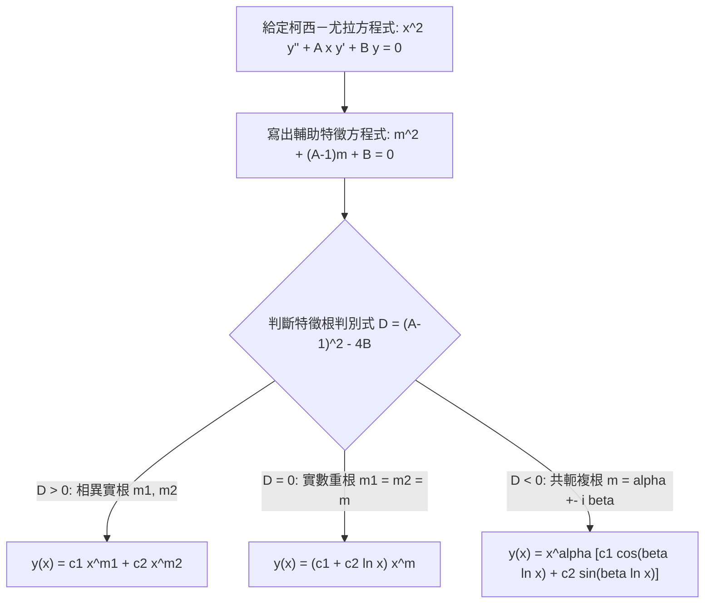

# 0008: 柯西－尤拉方程式 (Euler-Cauchy Equations)
> **Context Pointer**: 本文為工程數學第二章「二階常微分方程式」變係數核心解法講義，對應 `docs/engineering-math/second-order/0008-euler-cauchy-equations.md`。

---

## 🎯 單元學習目標
1. 掌握**柯西－尤拉方程式 (Euler-Cauchy Equations)** 的標準定義與等維度（Equidimensional）特徵。
2. 理解透過座標變換（$x = e^t$）將變係數二階 ODE 嚴謹推導轉化為常係數線性 ODE 的第一原理。
3. 熟悉輔助特徵根的三大解結構（相異實根、重根、共軛複根）及其對應的自變數 $x$ 形式。
4. 透過經典範例（重根、共軛複根與初值問題 IVP）進行完整手算演練與驗算。
5. 對照直接冪次代換假設（$y = x^m$）與座標變換法的等價性。

---

## 1. 柯西－尤拉方程式定義與特徵

### 標準二階形式
形如以下的二階變係數常微分方程式，稱為 **柯西－尤拉方程式 (Euler-Cauchy Equation)**：

$$x^2 y'' + A x y' + B y = 0 \quad (x > 0)$$

其中 $A$ 與 $B$ 為常數。

> **💡 數學直觀與命名由來**：
> 觀察各項的次數與導數階數：$x^2$ 對應 $y''$（二階），$x^1$ 對應 $y'$（一階），$x^0$ 對應 $y$（零階）。每一項中自變數 $x$ 的冪次剛好等於導數的階數，因此這種方程式又被稱為**等維方程式 (Equidimensional Equation)**。

### 奇異點警示
在點 $x = 0$ 處，領導係數 $x^2 = 0$，因此 $x = 0$ 是該微分方程式的**正規奇異點 (Regular Singular Point)**。在實際求解時，我們通常針對開區間 $x > 0$ 或 $x < 0$ 進行討論（本講義主要以 $x > 0$ 為主）。

---

## 2. 座標變換推導：轉化為常係數 ODE 的第一原理

為了求解這個變係數方程式，我們透過適當的座標變換，將其化為我們熟悉的**常係數線性 ODE**。

### 步驟一：變數代換
令：
$$x = e^t \iff t = \ln x \quad (\text{假設 } x > 0)$$
並定義新的函數：
$$Y(t) \equiv y(x)$$

### 步驟二：利用連鎖律轉換一階導數
根據連鎖律：
$$y'(x) = \frac{dy}{dx} = \frac{dY}{dt} \cdot \frac{dt}{dx}$$

由於 $t = \ln x$，其導數為：
$$\frac{dt}{dx} = \frac{1}{x}$$

因此：
$$y'(x) = \frac{1}{x} \frac{dY}{dt} \implies x y' = \frac{dY}{dt}$$

### 步驟三：利用連鎖律轉換二階導數
接著求二階導數 $y''(x)$：
$$y''(x) = \frac{d}{dx} \left( y'(x) \right) = \frac{d}{dx} \left( \frac{1}{x} \frac{dY}{dt} \right)$$

利用乘積法則與連鎖律：
$$y''(x) = \left( -\frac{1}{x^2} \right) \frac{dY}{dt} + \frac{1}{x} \frac{d}{dx}\left( \frac{dY}{dt} \right) = -\frac{1}{x^2} \frac{dY}{dt} + \frac{1}{x} \left( \frac{d^2 Y}{dt^2} \cdot \frac{dt}{dx} \right)$$

代入 $\frac{dt}{dx} = \frac{1}{x}$：
$$y''(x) = -\frac{1}{x^2} \frac{dY}{dt} + \frac{1}{x^2} \frac{d^2 Y}{dt^2} = \frac{1}{x^2} \left( \frac{d^2 Y}{dt^2} - \frac{dY}{dt} \right)$$

兩邊同乘以 $x^2$：
$$x^2 y'' = \frac{d^2 Y}{dt^2} - \frac{dY}{dt}$$

### 步驟四：代回原方程式
將 $x y' = \frac{dY}{dt}$ 與 $x^2 y'' = \frac{d^2 Y}{dt^2} - \frac{dY}{dt}$ 代入原方程式 $x^2 y'' + A x y' + B y = 0$：

$$\left( \frac{d^2 Y}{dt^2} - \frac{dY}{dt} \right) + A \frac{dY}{dt} + B Y = 0$$

整理可得：
$$\frac{d^2 Y}{dt^2} + (A - 1) \frac{dY}{dt} + B Y = 0$$

> **🎯 核心結論**：
> 透過 $x = e^t$ 變換，原本困難的變係數方程式成功轉化為以 $t$ 為自變數之**常係數線性二階 ODE**！
> 其對應的輔助特徵方程式為：
> $$m^2 + (A - 1)m + B = 0$$

---

## 3. 輔助特徵根的三大解結構（代回 $x$）

依據特徵方程式 $m^2 + (A - 1)m + B = 0$ 的根 $m_1, m_2$ 之性質，通解 $y(x)$ 可分為以下三種情況：

### 情況一：相異實根 ($m_1 \neq m_2$)
在 $t$ 域中的通解為：
$$Y(t) = c_1 e^{m_1 t} + c_2 e^{m_2 t}$$
由於 $e^t = x$，代回 $x$ 可得通解：
$$y(x) = c_1 x^{m_1} + c_2 x^{m_2}$$

### 情況二：實數重根 ($m_1 = m_2 = m$)
在 $t$ 域中的通解為：
$$Y(t) = (c_1 + c_2 t) e^{m t}$$
代回 $t = \ln x$ 與 $e^{m t} = x^m$ 可得通解：
$$y(x) = (c_1 + c_2 \ln x) x^m$$

### 情況三：共軛複數根 ($m = \alpha \pm i\beta$)
在 $t$ 域中的通解為：
$$Y(t) = e^{\alpha t} (c_1 \cos \beta t + c_2 \sin \beta t)$$
由於 $e^{\alpha t} = x^\alpha$ 且 $t = \ln x$，代回可得通解：
$$y(x) = x^\alpha \left[ c_1 \cos(\beta \ln x) + c_2 \sin(\beta \ln x) \right]$$

---

## 4. 課本範例完整手算演練

### 範例 1：重根情況
求解方程式：
$$x^2 y'' - 5x y' + 9y = 0 \quad (x > 0)$$

**解析**：
1. 識別係數：$A = -5$，$B = 9$。
2. 建立特徵方程式 $m^2 + (A - 1)m + B = 0$：
   $$m^2 + (-5 - 1)m + 9 = 0 \implies m^2 - 6m + 9 = 0$$
3. 解特徵根：
   $$(m - 3)^2 = 0 \implies m_1 = m_2 = 3 \quad (\text{重根})$$
4. 寫出通解：
   $$y(x) = (c_1 + c_2 \ln x) x^3$$

---

### 範例 2：共軛複根情況
求解方程式：
$$x^2 y'' + 3x y' + 10y = 0 \quad (x > 0)$$

**解析**：
1. 識別係數：$A = 3$，$B = 10$。
2. 建立特徵方程式：
   $$m^2 + (3 - 1)m + 10 = 0 \implies m^2 + 2m + 10 = 0$$
3. 解特徵根（使用公式解）：
   $$m = \frac{-2 \pm \sqrt{4 - 40}}{2} = \frac{-2 \pm \sqrt{-36}}{2} = -1 \pm 3i$$
   即 $\alpha = -1, \beta = 3$。
4. 寫出通解：
   $$y(x) = x^{-1} \left[ c_1 \cos(3 \ln x) + c_2 \sin(3 \ln x) \right]$$

---

### 範例 3：初值問題 (IVP)
求解初值問題：
$$x^2 y'' - 5x y' + 10y = 0, \quad y(1) = 4, \quad y'(1) = -6 \quad (x > 0)$$

**解析**：
1. 建立特徵方程式：
   $$m^2 + (-5 - 1)m + 10 = 0 \implies m^2 - 6m + 10 = 0$$
2. 解特徵根：
   $$m = \frac{6 \pm \sqrt{36 - 40}}{2} = 3 \pm i \quad (\alpha = 3, \beta = 1)$$
3. 寫出含未知常數的通解：
   $$y(x) = x^3 \left[ c_1 \cos(\ln x) + c_2 \sin(\ln x) \right]$$
4. 代入初值條件 $y(1) = 4$：
   $$y(1) = 1^3 \left[ c_1 \cos(0) + c_2 \sin(0) \right] = c_1(1) + 0 = 4 \implies c_1 = 4$$
   此時通解為：
   $$y(x) = x^3 \left[ 4 \cos(\ln x) + c_2 \sin(\ln x) \right]$$
5. 對 $y(x)$ 求導以代入第二個初值 $y'(1) = -6$：
   $$\begin{aligned}
   y'(x) &= 3x^2 \left[ 4 \cos(\ln x) + c_2 \sin(\ln x) \right] + x^3 \left[ -4 \sin(\ln x) \cdot \frac{1}{x} + c_2 \cos(\ln x) \cdot \frac{1}{x} \right] \\
   &= 3x^2 \left[ 4 \cos(\ln x) + c_2 \sin(\ln x) \right] + x^2 \left[ -4 \sin(\ln x) + c_2 \cos(\ln x) \right]
   \end{aligned}$$
6. 代入 $x = 1, y'(1) = -6$：
   $$y'(1) = 3(1) \left[ 4 \cos(0) + c_2 \sin(0) \right] + 1 \left[ -4 \sin(0) + c_2 \cos(0) \right] = 3(4) + c_2 = 12 + c_2 = -6$$
   解得：
   $$c_2 = -18$$
7. 寫出唯一特解：
   $$y(x) = x^3 \left[ 4 \cos(\ln x) - 18 \sin(\ln x) \right]$$

---

## 5. 解題 SOP 與直接冪次代換假設（$y = x^m$）之對照

在實際考試與工程計算中，我們通常不需要每次都重新推導座標變換公式，而可以直接採用**直接代換法**。

### 直接冪次代換法 (Direct Substitution Method)
1. **假設解的形式**：直接令 $y = x^m$。
2. **計算各階導數**：
   $$y' = m x^{m-1}, \quad y'' = m(m-1) x^{m-2}$$
3. **代入原方程式** $x^2 y'' + A x y' + B y = 0$：
   $$x^2 \left[ m(m-1) x^{m-2} \right] + A x \left[ m x^{m-1} \right] + B \left[ x^m \right] = 0$$
4. **化簡與提取公因式 $x^m$**：
   $$m(m-1) x^m + A m x^m + B x^m = 0 \implies \left[ m^2 + (A - 1)m + B \right] x^m = 0$$
5. **得到輔助方程式**：
   因 $x > 0$，故得 $m^2 + (A - 1)m + B = 0$，與透過 $x = e^t$ 推導出的結果**完全一致**！

### 快速解題 SOP 流程圖

